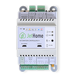
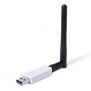
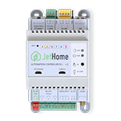

# Supported Adapters

All officially supported adapters are listed on this page. Note that before an adapter can be used with Zigbee2MQTT it has to be flashed with a coordinator firmware (some adapters come preflashed).

::: tip TIP
Want to migrate to a different adapter? Read [this](../faq/README.md#how-do-i-migrate-from-one-adapter-to-another)
:::

## Recommended
The adapters below are recommended because they use powerful chips, can handle large networks and are well-supported.

### Based on Texas Instruments CC2652/CC1352 chip
_(in order of first appearance)_

* USB connected (easiest)
  * <details>
    <summary>Electrolama zig-a-zig-ah! (zzh!)</summary>
      
    USB connected adapter with external antenna based on CC2652R chip  
    * [Coordinator firmware](https://github.com/Koenkk/Z-Stack-firmware/raw/Z-Stack_3.x.0_coordinator_20230507/coordinator/Z-Stack_3.x.0/bin/CC2652R_coordinator_20230507.zip)  
    * [Router firmware](https://github.com/Koenkk/Z-Stack-firmware/raw/Z-Stack_3.x.0_router_20221102/router/Z-Stack_3.x.0/bin/CC2652R_router_20221102.zip)  
    * [Flashing instructions](https://electrolama.com/radio-docs/#step-3-flash-the-firmware-on-your-stick) or see "Flashing CC1352/CC2652/CC2538 based adapters" below
    * [Buy](https://shop.electrolama.com/collections/usb-rf-sticks/products/zzh-multiprotocol-rf-stick)
  
    
    </details>  

  * <details>
    <summary>Slaesh's CC2652RB stick</summary>
  
    USB connected adapter with external antenna based on CC2652RB chip  
    * [Coordinator firmware](https://github.com/Koenkk/Z-Stack-firmware/raw/Z-Stack_3.x.0_coordinator_20230507/coordinator/Z-Stack_3.x.0/bin/CC2652RB_coordinator_20230507.zip)  
    * [Router firmware](https://github.com/Koenkk/Z-Stack-firmware/raw/Z-Stack_3.x.0_router_20221102/router/Z-Stack_3.x.0/bin/CC2652RB_router_20221102.zip)  
    * [Flashing instructions](https://slae.sh/projects/cc2652/#flashing) or see "Flashing CC1352/CC2652/CC2538 based adapters" below
    * [Buy](https://slae.sh/projects/cc2652/)
  
    
    </details>

  * <details>
    <summary>Tube's CC2652P2 USB Coordinator</summary>
  
    Open source hardware CC2652P based USB connected adapter with external antenna and USB extension cable  
    * [Coordinator firmware](https://github.com/Koenkk/Z-Stack-firmware/raw/Z-Stack_3.x.0_coordinator_20230507/coordinator/Z-Stack_3.x.0/bin/CC1352P2_CC2652P_launchpad_coordinator_20230507.zip)  
    * [Router firmware](https://github.com/Koenkk/Z-Stack-firmware/raw/Z-Stack_3.x.0_router_20221102/router/Z-Stack_3.x.0/bin/CC1352P2_CC2652P_launchpad_router_20221102.zip)  
    * [Flashing instructions](https://github.com/tube0013/tube_gateways) or see "Flashing CC1352/CC2652/CC2538 based adapters" below
    * [Buy](https://www.tubeszb.com/)
  
    
    </details>
  
  * <details>
    <summary>Egony Stick V4</summary>
  
    Powerful CC2652P Zigbee USB dongle and Raspberry Pi GPIO module. Available in Ebyte (left picture) and RFSTAR (right picture) version.  
    * Coordinator firmware: [Ebyte](https://github.com/Koenkk/Z-Stack-firmware/raw/Z-Stack_3.x.0_coordinator_20230507/coordinator/Z-Stack_3.x.0/bin/CC1352P2_CC2652P_other_coordinator_20230507.zip) [RFSTAR](https://github.com/Koenkk/Z-Stack-firmware/raw/Z-Stack_3.x.0_coordinator_20230507/coordinator/Z-Stack_3.x.0/bin/CC1352P2_CC2652P_launchpad_coordinator_20230507.zip)  
    * Router firmware: [Ebyte](https://github.com/Koenkk/Z-Stack-firmware/raw/Z-Stack_3.x.0_router_20221102/router/Z-Stack_3.x.0/bin/CC1352P2_CC2652P_other_router_20221102.zip) [RFSTAR](https://github.com/Koenkk/Z-Stack-firmware/raw/Z-Stack_3.x.0_router_20221102/router/Z-Stack_3.x.0/bin/CC1352P2_CC2652P_launchpad_router_20221102.zip)  
    * [Flashing instructions](https://github.com/egony/cc2652p_E72-2G4M20S1E/wiki/Flashing-EN) or see "Flashing CC1352/CC2652/CC2538 based adapters" below
    * Description: [Ebyte](https://github.com/egony/cc2652p_E72-2G4M20S1E/wiki/Home-EN) [RFSTAR](https://github.com/egony/cc2652p_cc1352p_RF-STAR/wiki/Home-EN)  
    * [Contact](http://t.me/Egony)
  
     
    </details>

  * <details>
    <summary>ZigStar Stick v4</summary>
  
    Powerful Open source dongle with external antenna based on CC2652P  
    * [Coordinator firmware](https://github.com/Koenkk/Z-Stack-firmware/raw/Z-Stack_3.x.0_coordinator_20230507/coordinator/Z-Stack_3.x.0/bin/CC1352P2_CC2652P_launchpad_coordinator_20230507.zip)  
    * [Router firmware](https://github.com/Koenkk/Z-Stack-firmware/raw/Z-Stack_3.x.0_router_20221102/router/Z-Stack_3.x.0/bin/CC1352P2_CC2652P_launchpad_router_20221102.zip)  
    * [Description](https://zig-star.com/projects/zigbee-stick-v4/)  
    * [Flashing instructions](https://zig-star.com/radio-docs/flash-cc-bsl/) or see "Flashing CC1352/CC2652/CC2538 based adapters" below
    * [Buy](https://zig-star.com)
  
    
    </details>

  * <details>
    <summary>CircuitSetup's CC2652P2 USB Coordinator</summary>
  
    CC2652P based USB connected adapter pre-programmed with Z-Stack  
    * [Coordinator firmware](https://github.com/Koenkk/Z-Stack-firmware/raw/Z-Stack_3.x.0_coordinator_20230507/coordinator/Z-Stack_3.x.0/bin/CC1352P2_CC2652P_launchpad_coordinator_20230507.zip)  
    * [Router firmware](https://github.com/Koenkk/Z-Stack-firmware/raw/Z-Stack_3.x.0_router_20221102/router/Z-Stack_3.x.0/bin/CC1352P2_CC2652P_launchpad_router_20221102.zip)  
    * [Flashing instructions](https://circuitsetup.us/product/usb-zigbee-stick-z-stack-coordinator/) or see "Flashing CC1352/CC2652/CC2538 based adapters" below
    * [Buy](https://circuitsetup.us/product/usb-zigbee-stick-z-stack-coordinator/)
  
    
    </details>

  * <details>
    <summary>SMLIGHT CC2652P Zigbee USB Adapter SLZB-02</summary>
  
    CC2652P factory-made Zigbee USB coordinator with external 6dB antenna and worldwide delivery  
    * [Coordinator firmware](https://github.com/Koenkk/Z-Stack-firmware/raw/Z-Stack_3.x.0_coordinator_20230507/coordinator/Z-Stack_3.x.0/bin/CC1352P2_CC2652P_other_coordinator_20230507.zip)  
    * [Router firmware](https://github.com/Koenkk/Z-Stack-firmware/raw/Z-Stack_3.x.0_router_20221102/router/Z-Stack_3.x.0/bin/CC1352P2_CC2652P_other_router_20221102.zip)  
    * [Description](https://smartlight.me/smart-home-devices/zigbee-devices/zigbee-coordinator-v4-cc2652p)  
    * [Flashing instructions](https://smartlight.me/flashing_slzb-02) or see "Flashing CC1352/CC2652/CC2538 based adapters" below
    * Buy: [Official store](https://smartlight.me/smart-home-devices/zigbee-devices/zigbee-coordinator-v4-cc2652p), [Tindie](https://www.tindie.com/products/smartlightme/zigbee-cc2652p-coordinator-dongle-stick-adapter/)
  
    
    </details>

  * <details>
    <summary>SONOFF Zigbee 3.0 USB Dongle Plus ZBDongle-P</summary>
  
    CC2652P based USB connected adapter pre-programmed and with enclosure.

    Note before buying that ITead slightly confusingly now sells both the Dongle Plus "ZBDongle-P" (based on CC2652P), and the Dongle Plus V2 "ZBDongle-E" (based on EFR32MG21).
    This section is about the "ZBDongle-P", for "ZBDongle-E" see below.

    * [Coordinator firmware](https://github.com/Koenkk/Z-Stack-firmware/raw/Z-Stack_3.x.0_coordinator_20230507/coordinator/Z-Stack_3.x.0/bin/CC1352P2_CC2652P_launchpad_coordinator_20230507.zip)  
    * [Router firmware](https://github.com/Koenkk/Z-Stack-firmware/raw/Z-Stack_3.x.0_router_20221102/router/Z-Stack_3.x.0/bin/CC1352P2_CC2652P_launchpad_router_20221102.zip)  
    * [Flashing instructions](https://sonoff.tech/wp-content/uploads/2021/09/Zigbee-3.0-USB-dongle-plus-firmware-flashing-1-1.docx) ([PDF version](https://github.com/Koenkk/zigbee2mqtt.io/raw/master/docs/guide/adapters/flashing/zigbee-3.0-usb-dongle-plus-firmware_flashing-1-1.pdf) and [required python script](https://github.com/Koenkk/zigbee2mqtt.io/raw/master/docs/guide/adapters/flashing/zigbee-3.0-usb-dongle-plus-uartLog.zip)) or see "Flashing CC1352/CC2652/CC2538 based adapters" below  
    * [Buy](https://itead.cc/product/sonoff-zigbee-3-0-usb-dongle-plus/)
  
    
    </details>

  * <details>
    <summary>Vision CC2652 dongle</summary>
  
    Adapter or small development board based on CC2652R (VS201) or CC2652P (VS202)  
    Coordinator firmware: [VS201](https://github.com/Koenkk/Z-Stack-firmware/raw/Z-Stack_3.x.0_coordinator_20230507/coordinator/Z-Stack_3.x.0/bin/CC2652R_coordinator_20230507.zip) [VS202](https://github.com/Koenkk/Z-Stack-firmware/raw/Z-Stack_3.x.0_coordinator_20230507/coordinator/Z-Stack_3.x.0/bin/CC1352P2_CC2652P_launchpad_coordinator_20230507.zip)  
    Router firmware: [VS201](https://github.com/Koenkk/Z-Stack-firmware/raw/Z-Stack_3.x.0_router_20221102/router/Z-Stack_3.x.0/bin/CC2652R_router_20221102.zip) [VS202](https://github.com/Koenkk/Z-Stack-firmware/raw/Z-Stack_3.x.0_router_20221102/router/Z-Stack_3.x.0/bin/CC1352P2_CC2652P_launchpad_router_20221102.zip)  
    * [Flashing instructions](https://www.aliexpress.com/item/1005002823262979.html?spm=a2g0o.productlist.0.0.1a1640b82yeViq&algo_pvid=e01b1872-ca85-4814-971f-ce9b058855b8&algo_exp_id=e01b1872-ca85-4814-971f-ce9b058855b8-0&pdp_ext_f=%7B%22sku_id%22%3A%2212000022351543786%22%7D) or see "Flashing CC1352/CC2652/CC2538 based adapters" below
    * Buy: [VS201](https://www.aliexpress.com/item/1005002809329614.html) [VS202](https://www.aliexpress.com/item/1005003393047763.html)
  
    
    </details>

  * <details>
    <summary>JetHome JetStick Z2/ZB6UX CC2652P1</summary>

    Powerful CC2652P1 factory-made Zigbee USB dongle with external antenna.
    * [Documentation](https://docs.jethome.ru/en/zigbee/sticks/jetstick_z2.html)
    * [Flash instructions](https://docs.jethome.ru/en/zigbee/howto/cc_2538_bsl.html#zigbee-howto-2538-bsl)
    * [Firmware](https://docs.jethome.ru/en/zigbee/software/ti_cc2652p.html#zigbee-software-ti-cc2652p)
    * Buy: [JetStick Z2](https://jethome.ru/z2/)

    
    </details>

* Hybrid (network + USB)
  * <details>
    <summary>Gio-dot Z-Bee Duo with CC2652P</summary>
  
    4 in 1 zigbee adapter: USB Stick, WiFi, LAN, PI Zero Hat, with external antenna and 3D printed case. 
    * [Description](https://gio-dot.github.io/Z-Bee-Duo/)  
    * [Coordinator firmware](https://github.com/Koenkk/Z-Stack-firmware/blob/master/coordinator/Z-Stack_3.x.0/bin/CC1352P2_CC2652P_other_coordinator_20230507.zip)  
    * [Router firmware](https://github.com/Koenkk/Z-Stack-firmware/blob/master/router/Z-Stack_3.x.0/bin/CC1352P2_CC2652P_other_router_20221102.zip)  
    * [Flashing instructions](https://gio-dot.github.io/Z-Bee-Duo/Firmware-upgrade) or see "Flashing CC1352/CC2652/CC2538 based adapters" below
    * [Buy](https://www.tindie.com/products/gio_dot/z-bee-duo-modular-cc2652p-zigbee-30-adapter/)
  
    
    </details>

  * <details>
    <summary>ZigStar LAN Coordinator</summary>
  
    Powerful Open source LAN Coordinator with external antenna on CC2652P  
    * [Coordinator firmware](https://github.com/Koenkk/Z-Stack-firmware/raw/Z-Stack_3.x.0_coordinator_20230507/coordinator/Z-Stack_3.x.0/bin/CC1352P2_CC2652P_launchpad_coordinator_20230507.zip)  
    * [Router firmware](https://github.com/Koenkk/Z-Stack-firmware/raw/Z-Stack_3.x.0_router_20221102/router/Z-Stack_3.x.0/bin/CC1352P2_CC2652P_launchpad_router_20221102.zip)  
    * [Description](https://zig-star.com/projects/zigbee-gw-lan/)  
    * [Flashing instructions](https://zig-star.com/radio-docs/flash-cc-bsl/) or see "Flashing CC1352/CC2652/CC2538 based adapters" below
    * [Buy](https://zig-star.com) [Tindie](https://www.tindie.com/products/zigstar/zigstar-lan-gateway/)
  
    
    </details>
	
  * <details>
    <summary>ZigStar PoE Coordinator</summary>
  
    Open source PoE af Coordinator with external antenna on CC2652P  
    * [Coordinator firmware](https://github.com/Koenkk/Z-Stack-firmware/raw/Z-Stack_3.x.0_coordinator_20230507/coordinator/Z-Stack_3.x.0/bin/CC1352P2_CC2652P_launchpad_coordinator_20230507.zip)  
    * [Router firmware](https://github.com/Koenkk/Z-Stack-firmware/raw/Z-Stack_3.x.0_router_20221102/router/Z-Stack_3.x.0/bin/CC1352P2_CC2652P_launchpad_router_20221102.zip)  
    * [Description](https://zig-star.com/projects/zigstar-olizig/)  
    * [Flashing instructions](https://zig-star.com/radio-docs/zigstar-multi-tool/) or see "Flashing CC1352/CC2652/CC2538 based adapters" below
    * [Buy](https://zig-star.com) [Tindie](https://www.tindie.com/products/zigstar/zigstar-olizig-poe/) 
  
    
    </details>
    
  * <details>
    <summary>SMLIGHT SLZB-06 Zigbee Ethernet USB POE WiFi LAN adapter</summary>
  
    Powerful, tiny modern design, developed for Zigbee2MQTT, PoE supported, pre-flashed and ready to use Zigbee adapter. Supports Zigbee 3.0, Ethernet, LAN, USB and WiFi connections. Rich packing that includes SLZB-06 adapter, +5dB antenna, screws, adhesive tapes, screwdriver, microUSB-typeC adapter, screw-fix-helper and QR-manual. Distant update, modern UI open-source firmware. Optoelectronic isolation for Ethernet, LEDs and physical button for interacting with user. Fits home and business use.
    * [Coordinator firmware (CC2652P)](https://github.com/Koenkk/Z-Stack-firmware/raw/Z-Stack_3.x.0_coordinator_20230507/coordinator/Z-Stack_3.x.0/bin/CC1352P2_CC2652P_other_coordinator_20230507.zip)  
    * [ESP32 firmware](https://github.com/smlight-dev/slzb-06-firmware/)  
    * [Manual](https://smlight.tech/manual/slzb-06/)
    * [Product site](https://smlight.tech/product/slzb-06/)
    * Buy: [Official store](https://smartlight.me/smart-home-devices/zigbee-devices/smlight-slzb-06en), [Aliexpress](https://www.aliexpress.com/item/1005004942648430.html), [Amazon US](https://www.amazon.com/SMLIGHT-SLZB-06-Ethernet-Zigbee2MQTT-Assistant/dp/B0BL6DQSB3), [Tindie](https://www.tindie.com/products/smartlightme/smlight-slzb-06-zigbee-ethernet-poe-usb-wifi-adapt/)

    
    </details>

  * <details>
    <summary>ZigStar UZG-01 - Universal ZigBee Gateway</summary>
  
    Open source PoE af Coordinator with external antenna on CC2652P
    * [ESP32 Firmware](https://github.com/mercenaruss/uzg-firmware) Repository with latest firmware
    * [Coordinator firmware](https://github.com/Koenkk/Z-Stack-firmware/raw/Z-Stack_3.x.0_coordinator_20230507/coordinator/Z-Stack_3.x.0/bin/)  
    * [Router firmware](https://github.com/Koenkk/Z-Stack-firmware/raw/Z-Stack_3.x.0_router_20221102/router/Z-Stack_3.x.0/bin/)  
    * [Official site](https://uzg.zig-star.com) with documentation
    * [Flashing instructions](https://uzg.zig-star.com/flashing-and-updating/) or see [Flashing CC1352/CC2652/CC2538 based adapters](#flashing-cc1352-cc2652-cc2538-based-adapters)
    * Buy: [Official Store](https://uzg.zig-star.com),[Tindie](https://www.tindie.com/stores/zigstar/),[Elecrow](https://www.elecrow.com/zigstar-uzg-01-universal-zigbee-gateway.html)

    |           ZigStar UZG-01              |                  Dimensions           | 
    | :-----------------------------------: | :-----------------------------------: | 
    |  |  |

    </details>


* Network
  * <details>
    <summary>Tube's Zigbee Gateways (CC2652P2 variant)</summary>
  
    Open source hardware CC2652P and ESP32 based Zigbee to Ethernet Coordinator (left picture), POE variant is also available (right picture)  
    * [Coordinator firmware](https://github.com/Koenkk/Z-Stack-firmware/raw/Z-Stack_3.x.0_coordinator_20230507/coordinator/Z-Stack_3.x.0/bin/CC1352P2_CC2652P_launchpad_coordinator_20230507.zip)  
    * [Router firmware](https://github.com/Koenkk/Z-Stack-firmware/raw/Z-Stack_3.x.0_router_20221102/router/Z-Stack_3.x.0/bin/CC1352P2_CC2652P_launchpad_router_20221102.zip)  
    * [Flashing instructions](https://github.com/tube0013/tube_gateways) or see "Flashing CC1352/CC2652/CC2538 based adapters" below
    * [Buy](https://www.tubeszb.com/)
  
     
    </details>

  * <details>
    <summary>cyijun OpenZ3Gateway</summary>
  
    An open source Zstack3 gateway powered by ESP8266 and CC2652P modules. One costs less than 60 CNY in China.  
    * [Coordinator firmware](https://github.com/Koenkk/Z-Stack-firmware/raw/Z-Stack_3.x.0_coordinator_20230507/coordinator/Z-Stack_3.x.0/bin/CC1352P2_CC2652P_launchpad_coordinator_20230507.zip)  
    * [Router firmware](https://github.com/Koenkk/Z-Stack-firmware/raw/Z-Stack_3.x.0_router_20221102/router/Z-Stack_3.x.0/bin/CC1352P2_CC2652P_launchpad_router_20221102.zip)
    * Flashing instructions; see "Flashing CC1352/CC2652/CC2538 based adapters" below
    * [Description](https://github.com/cyijun/OpenZ3Gateway)  
    * [Tindie](https://www.tindie.com/products/cyijun/openz3gateway/)  
  
    
    </details>
  * <details>
    <summary>XGG 52PZ2MGateway</summary>
  
    An open source Zstack3 gateway powered by ESP8266 and CC2652P modules. One costs less than 60 CNY in China.  
    * [Coordinator firmware](https://github.com/Koenkk/Z-Stack-firmware/raw/Z-Stack_3.x.0_coordinator_20230507/coordinator/Z-Stack_3.x.0/bin/CC1352P2_CC2652P_launchpad_coordinator_20230507.zip)  
    * [Router firmware](https://github.com/Koenkk/Z-Stack-firmware/raw/Z-Stack_3.x.0_router_20221102/router/Z-Stack_3.x.0/bin/CC1352P2_CC2652P_launchpad_router_20221102.zip)  
    * Flashing instructions; see "Flashing CC1352/CC2652/CC2538 based adapters" below
    * [Description](https://shop68536829.taobao.com/)  
    * [Buy](https://shop68536829.taobao.com/)  
  
    
    </details>
  * <details>
    <summary>SMLIGHT Zigbee LAN Adapter CC2652P Model SLZB-05</summary>
  
    Pre-flashed ready-to-use Zigbee LAN CC2652P Adapter, factory made, metal case, 6dB antenna, worldwide delivery, Zigbee firmware can be manually updated via USB in 5 easy steps, customer/tech support, fast order processing.  
    * [Coordinator firmware](https://github.com/Koenkk/Z-Stack-firmware/raw/Z-Stack_3.x.0_coordinator_20230507/coordinator/Z-Stack_3.x.0/bin/CC1352P2_CC2652P_other_coordinator_20230507.zip)  
    * [Router firmware](https://github.com/Koenkk/Z-Stack-firmware/raw/Z-Stack_3.x.0_router_20221102/router/Z-Stack_3.x.0/bin/CC1352P2_CC2652P_other_router_20221102.zip)  
    * [Description](https://smartlight.me/smart-home-devices/zigbee-devices/smlight-zigbee-lan-adapter-slzb-05en)  
    * Flashing instructions; see "Flashing CC1352/CC2652/CC2538 based adapters" below
    * Buy: [eBay](https://www.ebay.com/itm/165178757770) [Official store](https://smartlight.me/smart-home-devices/zigbee-devices/smlight-zigbee-lan-adapter-slzb-05en) [Telegram](https://t.me/smartlightme)

    
    </details>
  * <details>
    <summary>cod.m ZigBee CC2652P2 TCP Coordinator</summary>

    CC2652P2 ZigBee Ethernet Coordinator, ethernet part based on [USR-K6](https://www.pusr.com/products/low-cost-ttl-to-ethernet-modules-usr-k6.html) module. POE possible with external splitter. Comes complete with 3d printed case and antenna.
    * [Coordinator firmware](https://github.com/Koenkk/Z-Stack-firmware/raw/Z-Stack_3.x.0_coordinator_20230507/coordinator/Z-Stack_3.x.0/bin/CC1352P2_CC2652P_launchpad_coordinator_20230507.zip)
    * [Router firmware](https://github.com/Koenkk/Z-Stack-firmware/raw/Z-Stack_3.x.0_router_20221102/router/Z-Stack_3.x.0/bin/CC1352P2_CC2652P_launchpad_router_20221102.zip)
    * [Flashing instructions](https://github.com/codm/cc2652p2-tcp-zigbee#update)
    * [Buy](https://shop.codm.de/automation/zigbee/40/zigbee-cc2652p2-tcp-ethernet-coordinator)

     
    </details>
* Raspberry Pi hat
  * <details>
    <summary>cod.m Zigbee CC2652P RPi Module</summary>
  
    Raspberry Pi GPIO module with CC2652P and integrated power amplifier (+20dBm)  
    * [Coordinator firmware](https://github.com/Koenkk/Z-Stack-firmware/raw/Z-Stack_3.x.0_coordinator_20230507/coordinator/Z-Stack_3.x.0/bin/CC1352P2_CC2652P_launchpad_coordinator_20230507.zip)  
    * [Router firmware](https://github.com/Koenkk/Z-Stack-firmware/raw/Z-Stack_3.x.0_router_20221102/router/Z-Stack_3.x.0/bin/CC1352P2_CC2652P_launchpad_router_20221102.zip)  
    * [Flashing instructions](https://github.com/codm/cc2652-raspberry-pi-module#firmware) or see "Flashing CC1352/CC2652/CC2538 based adapters" below
    * [Buy](https://shop.codm.de/automation/zigbee/33/zigbee-cc2652p2-raspberry-pi-module)
  
    
    </details>
  * <details>
    <summary>ZigStar ZigiHAT PoE </summary>
  
    Powerful Open source Pi HAT based on CC2652P with PoE,RTC onboard
    * [Coordinator firmware](https://github.com/Koenkk/Z-Stack-firmware/raw/Z-Stack_3.x.0_coordinator_20230507/coordinator/Z-Stack_3.x.0/bin/CC1352P2_CC2652P_launchpad_coordinator_20230507.zip)  
    * [Router firmware](https://github.com/Koenkk/Z-Stack-firmware/raw/Z-Stack_3.x.0_router_20221102/router/Z-Stack_3.x.0/bin/CC1352P2_CC2652P_launchpad_router_20221102.zip)  
    * [Description](https://zig-star.com/projects/zigbee-zigihat/)  
    * [Flashing instructions](https://zig-star.com/projects/zigbee-zigihat/#flashing) or see "Flashing CC1352/CC2652/CC2538 based adapters" below  
    * [Buy](https://zig-star.com)
  
    
    </details>

* Development board
  * <details>
    <summary>Texas Instruments LAUNCHXL-CC1352P-2</summary>
  
    USB connected development kit, based on CC1352P chip  
    These devices have two serial devices built in. Make sure you put the right serial device in the [configuration](../configuration/) or use auto detect (completely remove the `serial` section from `configuration.yaml`) if you only have one Texas Instruments CC device connected to your system.  
    An external antenna can be connected which could increase range: [requires resoldering a tiny capacitor (moving C14 to C24)](http://e2e.ti.com/support/wireless-connectivity/zigbee-and-thread/f/158/t/880219?LAUNCHXL-CC26X2R1-Antenna-CC26X2R1)  
  
    * [Coordinator firmware](https://github.com/Koenkk/Z-Stack-firmware/raw/Z-Stack_3.x.0_coordinator_20230507/coordinator/Z-Stack_3.x.0/bin/CC1352P2_CC2652P_launchpad_coordinator_20230507.zip)  
    * [Router firmware](https://github.com/Koenkk/Z-Stack-firmware/raw/Z-Stack_3.x.0_router_20221102/router/Z-Stack_3.x.0/bin/CC1352P2_CC2652P_launchpad_router_20221102.zip)  
    * [Flashing instructions](./flashing/flashing_via_uniflash.md) or see "Flashing CC1352/CC2652/CC2538 based adapters" below
    * [Buy](http://www.ti.com/tool/LAUNCHXL-CC1352P)
  
    
    </details>

  * <details>
    <summary>Texas Instruments LAUNCHXL-CC26X2R1</summary>
  
    USB connected development kit, based on CC2652R chip  
    These devices have two serial devices built in. Make sure you put the right serial device in the [configuration](../configuration/) or use auto detect (completely remove the `serial` section from `configuration.yaml`) if you only have one Texas Instruments CC device connected to your system.  
    An external antenna can be connected which could increase range: [requires resoldering a tiny capacitor](https://github.com/Koenkk/zigbee2mqtt/issues/2162#issuecomment-570286663)  
  
    * [Coordinator firmware](https://github.com/Koenkk/Z-Stack-firmware/raw/Z-Stack_3.x.0_coordinator_20230507/coordinator/Z-Stack_3.x.0/bin/CC2652R_coordinator_20230507.zip)  
    * [Router firmware](https://github.com/Koenkk/Z-Stack-firmware/raw/Z-Stack_3.x.0_router_20221102/router/Z-Stack_3.x.0/bin/CC2652R_router_20221102.zip)  
    * [Flashing instructions](./flashing/flashing_via_uniflash.md) or see "Flashing CC1352/CC2652/CC2538 based adapters" below
    * [Buy](http://www.ti.com/tool/LAUNCHXL-CC26X2R1)
  
    
    </details>

  * <details>
    <summary>Texas Instruments LP-CC2652R7</summary>
  
    USB connected development kit, based on CC2652R7 chip  
    These devices have two serial devices built in. Make sure you put the right serial device in the [configuration](../configuration/) or use auto detect (completely remove the `serial` section from `configuration.yaml`) if you only have one Texas Instruments CC device connected to your system.
  
    * [Coordinator firmware](https://github.com/Koenkk/Z-Stack-firmware/raw/Z-Stack_3.x.0_coordinator_20230507/coordinator/Z-Stack_3.x.0/bin/CC2652R7_coordinator_20230507.zip)  
    * [Flashing instructions](./flashing/flashing_via_uniflash.md) or see "Flashing CC1352/CC2652/CC2538 based adapters" below
    * [Buy](http://www.ti.com/tool/LP-CC2652R7)
  
    
    </details>

  * <details>
    <summary>Texas Instruments LP-CC1352P7</summary>
  
    USB connected development kit, based on CC1352P7 chip  
    These devices have two serial devices built in. Make sure you put the right serial device in the [configuration](../configuration/) or use auto detect (completely remove the `serial` section from `configuration.yaml`) if you only have one Texas Instruments CC device connected to your system.
  
    * [Coordinator firmware](https://github.com/Koenkk/Z-Stack-firmware/raw/Z-Stack_3.x.0_coordinator_20230507/coordinator/Z-Stack_3.x.0/bin/CC1352P7_coordinator_20230507.zip)  
    * [Flashing instructions](./flashing/flashing_via_uniflash.md) or see "Flashing CC1352/CC2652/CC2538 based adapters" below
    * [Buy](https://www.ti.com/tool/LP-CC1352P7)
  
    
    </details>
* Hub
  * <details>
    <summary>JetHome JetHub D1+</summary>

    Controller with ZigBee module onboard with external antenna.

    JetHub D1+ is DIN-rail home automation controller with Ubuntu/Debian OS and a lot of peripherals.

    Based on TI CC2652P1.

    * [Documentation](https://docs.jethome.ru/en/controllers/linux/din_rail/d1p.html)
    * [Buy](https://jethome.ru/d1p/)

    
    </details>

### Other
  * <details>
    <summary>ConBee / ConBee II / ConBee III / RaspBee / RaspBee II</summary>
    
    <br />
    
    USB connected adapters (ConBee / ConBee II / ConBee III) and Raspberry Pi GPIO modules (RaspBee and RaspBee II).
    If Zigbee2MQTT fails to start, try adding the following to your `configuration.yaml`
    ```yaml
    serial:
      adapter: deconz
    ```
    Add the correct baudrate to the `configuration.yaml` into the serial section.
    * For ConBee2: specifying the baudrate is not necessary
    * For RaspBee2 it is 38400
    * For ConBee3 it is 115200
    
    <br />

    **Note:** The support for Conbee 3 is not yet in the main branch (as of 2023/11/23). If you have a Conbee 3 stick, please use the dev-branch.

    <br />
    
    **Warning:** Conbee 2 firmware versions newer than 0x26580700 will result in an unstable network with devices dropping randomly, see [Issue 9554](https://github.com/Koenkk/zigbee2mqtt/issues/9554)
    * [Coordinator firmware](https://deconz.dresden-elektronik.de/deconz-firmware/)
    * [Flashing](https://github.com/dresden-elektronik/deconz-rest-plugin/wiki/Update-deCONZ-manually)
    * [Buy](https://phoscon.de/conbee2#buy) (ConBee II)
    * [Buy](https://phoscon.de/conbee3#buy) (ConBee III)
    * [Buy](https://phoscon.de/raspbee2#buy) (RaspBee II)
  
    
    </details>


## Not recommended
The adapters below are well-supported but use outdated chips.

* USB connected
  * <details>
    <summary>Texas Instruments CC2531</summary>
  
    USB connected Zigbee adapter with PCB antenna  
    **Warning 1:** requires additional hardware to flash (CC debugger + download cable)  
    **Warning 2:** might not be powerful enough to handle networks of 20+ devices  
    **Warning 3:** this adapter has bad range  
    * [Coordinator firmware](https://github.com/Koenkk/Z-Stack-firmware/tree/master/coordinator/Z-Stack_Home_1.2/bin)  
    * [Router firmware](https://github.com/Koenkk/Z-Stack-firmware/tree/master/router/Z-Stack_Home_1.2/bin)  
    * [Flashing instructions](./flashing/flashing_the_cc2531.md)  
    * [Buy](https://www.aliexpress.com/wholesale?catId=0&initiative_id=SB_20191108075039&SearchText=cc2531)
  
    
    </details>

  * <details>
    <summary>Vision CC2538+CC2592 Dongle(VS203)</summary>
  
    Adapter or small development board based on CC2538 and CC2592 chip  
    * [Coordinator firmware](https://github.com/Koenkk/Z-Stack-firmware/tree/master/coordinator/Z-Stack_3.0.x/bin)  
    * [Flashing instructions](https://www.aliexpress.com/item/1005002809329614.html?spm=a2g0o.store_pc_allProduct.8148356.2.4d7f1012TTc3uX)  
    * [Buy](https://www.aliexpress.com/item/1005002809329614.html?spm=a2g0o.store_pc_allProduct.8148356.2.4d7f1012TTc3uX)
  
    
    </details>


* Serial connected

  * <details>
    <summary>Texas Instruments CC2530</summary>
  
    Serial connected adapter with external antenna optionally with CC2591 or CC2592 RF frontend  
    **Warning 1:** requires additional hardware to flash (CC debugger + download cable)  
    **Warning 2:** might not be powerful enough to handle networks of 20+ devices  
    * [Coordinator firmware](https://github.com/Koenkk/Z-Stack-firmware/tree/master/coordinator/Z-Stack_Home_1.2/bin)  
    * [Router firmware](https://github.com/Koenkk/Z-Stack-firmware/tree/master/router/Z-Stack_Home_1.2/bin)  
    * [Flashing instructions](../../advanced/zigbee/05_create_a_cc2530_router.md#2-flashing-the-cc2530)  
    * [Connecting](./flashing/connecting_cc2530.md)  
    * Buy: [AliExpress](http://www.aliexpress.com/wholesale?catId=0&initiative_id=SB_20181213104041&SearchText=cc2530) [GBAN](http://www.gban.cn/en/product_show.asp?id=43) [Tindie](https://www.tindie.com/products/GiovanniCas/cc2530-cc2592-zigbee-dongle/)
  
    
    </details>
  * <details>
    <summary>Texas Instruments CC2538</summary>
  
    Serial connected adapter with CC2592 RF Amplifier  
    * [Coordinator firmware](https://github.com/Koenkk/Z-Stack-firmware/tree/master/coordinator/Z-Stack_3.0.x/bin)  
    * [Flashing](./flashing/flashing_the_cc2538.md)  
    * Buy: [AliExpress](https://www.aliexpress.com/wholesale?catId=0&initiative_id=SB_20191108075039&SearchText=cc2538)
  
    
    </details>

* Raspberry Pi

  * <details>
    <summary>Texas Instruments CC2538 HAT</summary>
  
    Raspberry pinout compatible HAT with CC2538 and optional external antenna  
    * [Coordinator firmware](https://github.com/Koenkk/Z-Stack-firmware/tree/master/coordinator/Z-Stack_3.0.x/bin)  
    * [Flashing](./flashing/flashing_the_cc2538.md)  
    * [Buy](https://www.tindie.com/products/GiovanniCas/zigbee-hat-with-cc2538-for-raspberry/)
  
    
    </details>
  
* Network

  * <details>
    <summary>XGG gateway</summary>
  
    An open source zigbee gateway powered by ESP8266 and CC2538+CC2592PA (XGG 38PZ2MGateway) or CC2530 (XGG 30Z2MGateway)  
    Coordinator firmware: [XGG 38PZ2MGateway](https://github.com/Koenkk/Z-Stack-firmware/tree/master/coordinator/Z-Stack_3.0.x/bin) [XGG 30Z2MGateway](https://github.com/Koenkk/Z-Stack-firmware/tree/master/coordinator/Z-Stack_Home_1.2/bin)  
    * [Contact](https://shop68536829.taobao.com/)
  
    
    </details>


## Experimental
The adapters below are experimental, don't use these if you want a stable setup.

### Based on Silicon Labs EFR32MG2x/MGM21x and EFR32MG1x/MGM1x series

Initial development started on experimental (beta stage) support for Silicon Labs based Zigbee adapters. This includes all EM35X, EFR32MG12, EFR32MG13, EFR32MG21, EFR32MG24 SoCs/Modules families with Silabs EmberZNet NCP 6.7.8 firmware or later via EZSP version 8 (EmberZNet Serial Protocol) interface. 

* USB connected
  * <details>
    <summary>ITead Sonoff Zigbee 3.0 USB Dongle Plus V2 model "ZBDongle-E"</summary>
  
    USB connected adapter with external antenna.

    Note before buying that ITead slightly confusingly now sells both the "ZBDongle-E" (based on EFR32MG21) and "ZBDongle-P" (based on CC2652P).
    This section is about the "ZBDongle-E", for "ZBDongle-P" see above.

    If Zigbee2MQTT fails to start, try adding the following to your `configuration.yaml`
    ```yaml
    serial:
      adapter: ezsp
    ```
   
    * [Coordinator firmware](https://sonoff.tech/product-review/how-to-use-sonoff-dongle-plus-on-home-assistant-how-to-flash-firmware/)
    * [Flashing](https://sonoff.tech/wp-content/uploads/2022/08/SONOFF-Zigbee-3.0-USB-dongle-plus-firmware-flashing-.pdf)
    * [Buy](https://itead.cc/product/zigbee-3-0-usb-dongle/)
  
    
    </details>

  * <details>
    <summary>Home Assistant SkyConnect (by Nabu Casa)</summary>
  
    USB connected adapter with integrated antenna.

    This dongle/stick ships with standard Silicon Labs EmberZNet Zigbee NCP (Network Co-Processor, Zigbee only) firmware as opposed to the RCP (Radio Co-Processor, multi-protocol) firmware. It is recommended you remain on an NCP firmware which will allow it to work out-of-the-box like any other EZSP adapter.

    While the RCP firmware allows you to utilize the adapter with other protocols such as Thread, it requires offloading large parts of the application onto the host computer using an additional service, Zigbeed (Zigbee daemon) instead. This service is not currently included with Zigbee2MQTT/zigbee-herdsman and you will be required to install and maintain the dependency yourself. More discussion can be found [here](https://github.com/zigpy/zigpy/discussions/894).

    If Zigbee2MQTT fails to start, try adding the following to your `configuration.yaml`
    ```yaml
    serial:
      adapter: ezsp
    ```
   
    * [Coordinator firmware](https://github.com/NabuCasa/silabs-firmware)
    * [Flashing](https://skyconnect.home-assistant.io/)
    * [Buy](https://www.home-assistant.io/skyconnect)
  
    
    </details>

  * <details>
    <summary>Elelabs ELU013 and Popp ZB-STICK</summary>
  
    USB connected adapters (Elelabs ELU013 and Popp ZB-STICK 701554).

    If Zigbee2MQTT fails to start, try adding the following to your `configuration.yaml`
    ```yaml
    serial:
      adapter: ezsp
    ```
   
    * [Coordinator firmware](https://github.com/Elelabs/elelabs-zigbee-ezsp-utility)
    * [Flashing](https://github.com/Elelabs/elelabs-zigbee-ezsp-utility)
    * [Buy](https://elelabs.com/products/elelabs-usb-adapter.html) (Elelabs Zigbee USB Adapter Model ELU013 based on Silabs EFR32MG13P)
    * [Buy](https://popp.eu/zb-stick) (Popp ZB-STICK white-label rebranded version of Elelabs 701554 based on Silabs EFR32MG13P)
  
    
    </details>

  * <details>
    <summary>CoolKit ZB-GW04 USB dongle (a.k.a. easyiot stick)</summary>
  
    USB connected adapter (CoolKit ZB-GW04 USB dongle, also known as "easyiot stick") widly available online from China.

    USB dongle is originally a DIY design from [Modkam (Russian speaking Zigbee DIY community)](https://modkam.ru/2021/02/28/proshivka-stikov-efr32/) and it using pre-flashed ["SM-011 V1.0" (ZYZBP008) radio module from CoolKit-Technologies](https://github.com/CoolKit-Technologies/DevDocs/tree/master/Zigbee) (which has a Silabs EFR32MG21 Zigbee SoC chip on it). 

    Warning! Before buying understand that the "SM-011 V1.0" module/board used in this is missing electromagnetic interference shielding and have relatively low-quality circuit board antenna with less than optimal hardware tuning so it has been reported signal reception with these is very sensitive to all types of interference unless connect it via a very long USB extension cable that is properly shielded to get it away from any sources of EMF/EMI/RMI.

    Note that the same USB dongle is also sold pre-flashed with Zigbee Router firmware as a lower price and it is reported to act much better as a Zigbee Router than what it does as a Zigbee Coordinator.

    If Zigbee2MQTT fails to start, try adding the following to your `configuration.yaml`
    ```yaml
    serial:
      adapter: ezsp
    ```
  
    * [Coordinator firmware](https://github.com/xsp1989/zigbeeFirmware/tree/master/firmware/Zigbee3.0_Dongle-NoSigned/EZSP)
    * [Flashing](https://github.com/Elelabs/elelabs-zigbee-ezsp-utility)
    * [Buy](https://www.aliexpress.com/item/1005002791666029.html)
  
    
    </details>

  * <details>
    <summary>Z-Wave.Me Z-Station dual Zigbee & Z-Wave </summary>

    USB connected adapter with external antenna and USB extension cable.
    Supports Zigbee and Z-Wave.

    Z-Station is a Z-Wave and Zigbee USB adapter. A controller software compatible to the Silicon Labs Z-Wave Serial API (for example Z-Way) and Zigbee NCP is required to use the functions of the device.

    Based on Silabs EFR32MG21P and ZGM130S.

    If Zigbee2MQTT fails to start, try adding the following to your `configuration.yaml`
    ```yaml
    serial:
      adapter: ezsp
      baudrate: 115200
    ```

    * [Buy](https://z-wave.me/products/z-station/)

    
    </details>

  * <details>
    
    <summary>SMLIGHT SLZB-07 Zigbee USB adapter with +3dB antenna</summary>
  
    Zigbee USB adapter with +3dB external antenna and Thread/Matter-over-Thread ready.

    Zigbee USB adapter based on EFR32 and CP2102 Silicon Labs SoCs. External +3dB antenna secures a strong LQI signal all around your place. Pre-flashed, tested and and ready-to-use with both Zigbee2MQTT and ZHA Home Assistant. Supports Thread/Matter-over-Thread firmware architecture for the EmberZNet Zigbee protocol stack.

    Zigbee2MQTT settings in `configuration.yaml`
    ```yaml
    serial:
      adapter: ezsp
    ```
    * [Product page](https://smlight.tech/product/slzb-07/)
    * [Buy Store](https://smartlight.me/smart-home-devices/zigbee-devices/slzb-07-zigbee-usb-adapter-en), [Buy Aliexpress](https://www.aliexpress.com/item/1005006273914143.html)  
  
    
    </details>

  * <details>
    <summary>JetHome JetStick Z4</summary>

    Powerful EFR32MG21 based factory-made Zigbee USB dongle with external antenna.

    * [Documentation](https://docs.jethome.ru/en/zigbee/sticks/jetstick_z4.html)
    * [Flash instructions](https://docs.jethome.ru/en/zigbee/howto/silabs_flashing.html#zigbee-howto-silabs-flashing)
    * [Firmware](https://docs.jethome.ru/en/zigbee/software/silabs_efr32.html#zigbee-software-silabs-efr32-mg21)
    * [Buy JetStick Z4](https://jethome.ru/z4/)

    
    </details>

* Raspberry Pi

  * <details>
    <summary>Elelabs Zigbee Raspberry Pi Shield/Popp ZB-Shield</summary>
  
    Hat for Raspberry Pi (Elelabs ELR023 and Popp ZB-SHIELD 701561).

    If Zigbee2MQTT fails to start, try adding the following to your `configuration.yaml`
    ```yaml
    serial:
      adapter: ezsp
    ```
   
    * [Coordinator firmware](https://github.com/Elelabs/elelabs-zigbee-ezsp-utility)
    * [Flashing](https://github.com/Elelabs/elelabs-zigbee-ezsp-utility)
    * [Buy](https://elelabs.com/products/elelabs-zigbee-shield.html) (Elelabs Zigbee Raspberry Pi Shield Model ELR023 based on Silabs EFR32MG13P)
    * [Buy](https://popp.eu/zb-shield/) (Popp ZB-SHIELD 701561 is a white-label rebranded version of Elelabs ELR023 based on Silabs EFR32MG13P)
  
    
    </details>

* Hybrid (network + USB)

  * <details>
    <summary>TubesZB Zigbee EFR32 pro ethernet/USB serial coordinator</summary>
  
    TubesZB early models works only over (wired LAN) while his later models can be set to work either over Ethernet or USB (USB-to-Serial Bridge).

    If Zigbee2MQTT fails to start, try adding the following to your `configuration.yaml`
    ```yaml
    serial:
      adapter: ezsp
    ```
   
    * [Coordinator firmware](https://github.com/grobasoz/zigbee-firmware)
    * [Flashing](https://github.com/tube0013/tube_gateways)
    * [Buy](https://tubeszb.com/product/efr32-mgm21-ethernetusb-serial-coordinator/) (TubesZB Zigbee variants including Silabs EFR32 MGM12/MGM210P module based models)
  
    
    </details>

  * <details>
    <summary>SMLIGHT SLZB-06M EFR32MG21 Zigbee Ethernet USB POE WiFi LAN adapter</summary>

    Powerful, tiny modern design, developed for Zigbee2MQTT, PoE supported, pre-flashed, and ready-to-use Zigbee adapter. Supports Zigbee 3.0, Ethernet, LAN, USB, and WiFi connections. Rich packing that includes SLZB-06M adapter, +5dB antenna, screws, adhesive tapes, screwdriver, microUSB-typeC adapter, screw-fix-helper, and QR-manual. Distant update, modern UI open-source firmware. Optoelectronic isolation for Ethernet, LEDs, and physical buttons for interacting with the user. It fits home and business use.
    * [Product site](https://smlight.tech/product/slzb-06m/)
    * Buy: [Official store](https://smartlight.me/smart-home-devices/zigbee-devices/slzb-06m-zigbee-adapter)

    
    </details>

* mPCIe adapter
  * <details>
    <summary>Z-Wave.Me dual Zigbee & Z-Wave mPCIe adapter</summary>

    USB connected adapter with external antenna and mPCIe USB adapter.
    Supports Zigbee and Z-Wave.

    The Z-Wave.Me Z-Wave and Zigbee mPCIe adapter is a controller board for embedded application. It fits in the mPCIe slot with full- or half-size holder. A controller software compatible to the Silicon Labs Z-Wave Serial API (for example Z-Way) and Zigbee NCP is required to use the functions of the device.

    The Z-Wave and Zigbee mPCIe adapter supports Z-Wave and Zigbee / Thread / Bluetooth Low Energy (on your choice, selected by firmware update). Based on Silabs EFR32MG21P and ZGM130S.

    If Zigbee2MQTT fails to start, try adding the following to your `configuration.yaml`
    ```yaml
    serial:
      adapter: ezsp
      baudrate: 115200
    ```

    * [Buy](https://z-wave.me/products/mpcie/)

    
    </details>

* Hub
  * <details>
    <summary>Wiren Board 7</summary>

    Wiren Board 7 with Zigbee module with external antenna.

    The Z-Wave.Me Wiren Board 7 is a professional multiprotocol controller for home and commercial automation. It is a DIN-rail ready Debian-based computer with Z-Way software and a lot of other open-source software including MQTT broker, device configurators, port configurators. 

    Based on Silabs MGM210PA32JIA.

    * [Buy](https://z-wave.me/products/wirenboard-7/)

    
    </details>

  * <details>
    <summary> JetHome JetHub D1+</summary>

    Controller with ZigBee module onboard with external antenna.

    JetHub D1+ is DIN-rail home automation controller with Ubuntu/Debian OS and a lot of peripherals.

    Based on Silabs EFR32MG21.

    * [Documentation](https://docs.jethome.ru/en/controllers/linux/din_rail/d1p.html)
    * [Buy](https://jethome.ru/d1p/)

    
    </details>

### Based on ZiGate
  
Initial development started on experimental (alpha stage) support for various ZigGate adapters.  This includes all ZiGate compatible hardware adapters which are currently based on NXP Zigbee MCU chips like JN5168 and JN5169  with ZigGate 3.1d firmware or later.
  
<details>
  <summary>ZiGate adapter</summary>

  If Zigbee2MQTT fails to start, try adding the following to your `configuration.yaml`
  
  ```yaml
  serial:
    adapter: zigate
  ```
  
  * [Coordinator firmware](https://zigate.fr/tag/firmware/)  
  * [Discussion](https://github.com/Koenkk/zigbee-herdsman/issues/242)  
  * [Buy](https://zigate.fr/boutique/?orderby=date_desc)
  
  
  </details>


## Notes
Before buying an adapter, please read the notes below!

- Want to migrate to a different adapter? This may require repairing all your devices in some cases, see [FAQ](../faq/README.md#what-does-and-does-not-require-repairing-of-all-devices)
- Network adapters connected via WiFi might have reduced stability as the serial protocol does not have enough fault-tolerance to handle packet loss or latency delays that can normally occur over WiFi connections. If cannot use a locally connected USB or UART/GPIO adapter then the recommendation is to use remote adapter that connected via Ethernet (wired) to avoid issues.
- What are the differences between the various CC2652/CC1352 chips?
  - Chips ending with `P` have a power amplifier which support up-to 20dBm vs 5dBm on adapters ending with `R`/`RB`.
  - Chips starting with `CC1352` support the sub-1 GHz frequency (which is not relevant for Zigbee since it uses 2.4 GHz), `CC2652` only supports 2.4 GHz. So for Zigbee2MQTT purposes there is no difference between `CC1352` and `CC2652`.
  - Chips ending with `RB` don't require a crystal on the PCB, this only makes a difference for the manufacturing process.

### Coordinator backups
Note that only adapters based on a Texas Instruments chip (CC2530/CC2531/CC2538/CC2652/CC1352) support a coordinator backup (`coordinator_backup.json`).

### Flashing CC1352/CC2652/CC2538 based adapters
Adapters based on CC1352 or CC2652 chips can be flashed by putting them in the bootloader. See your adapter manual on how to do this. After you have done this one of the following tools can be used to flash it.
- UI tools
  - Texas Instruments [FLASH PROGRAMMER 2](https://www.ti.com/tool/FLASH-PROGRAMMER) (Windows only) (can't find your device? read below!)  
  - [ZigStar GW Multi tool](https://github.com/xyzroe/ZigStarGW-MT) (multi platform GUI tool)
- CLI tools (multi platform Python based command line tools)
  - [CC2538-BSL](https://github.com/JelmerT/cc2538-bsl) ([instructions](./flashing/flashing_via_cc2538-bsl.md))
  - [llama-bsl](https://github.com/electrolama/llama-bsl) (fork of cc2538-bsl with added features)
- Home Assistant addon
  - [TubesZB TI CC2652 FW Flasher](https://github.com/tube0013/tubeszb_addons)
  - [ZigStar TI CC2652 FW Flasher](https://github.com/mercenaruss/zigstar_addons) (fork of TubesZB with added features)

- Some Ethernet adapters support flashing Zigbee firmware over their own web-interface. In this case you do not need any external software and hardware. Just go to the webinterface and press "Update Zigbee firmware". Please refer to the manual of your particular Zigbee adapter for this functionality.


#### Flashing an existing adapter
The above flashing tools can be used to upgrade the firmware on an existing adapter without needing to repair devices. See the [FAQ](https://www.zigbee2mqtt.io/guide/faq/#what-does-and-does-not-require-repairing-of-all-devices) for information on what does and does not require repairing of devices.

### Flashing Silabs EFR32/EM358x/ETRX35x based adapters

Firmware updates to Zigbee EmberZNet (EZSP) adapter based on EFR32, EM358x, and ETRX35x chips from Silicon Labs can be flashed over USB/UART by putting them in bootloader (BSL) mode. If your adapters has an EM358x or ETRX35x chip it will have an older/legacy Ember Bootloader (EBL) and you will need to see your adapter manual on how to put your adapter into bootloader mode, also known as boot mode or firmware recovery mode. After you have done this one of the following tools/guides can be used to flash it. If your adapter has a EFR32xG1 or EFR32MG2x chip adapters then it will have the newer Gecko Bootloader (GBL) that has the ability to enter bootloader mode automatically (also known as Auto-BSL) without need to pressing holding physical BTL/reset button or short circuit any GPIO/soldering-pads.

- [Universal Silicon Labs Flasher (by Nabu Casa)](https://github.com/NabuCasa/universal-silabs-flasher) (multi platform Python based command line tool)
  - Manufacturers of SiLabs dongles can also offer [SL Web Tools](https://github.com/NabuCasa/sl-web-tools) (web browser flasher).
- [Elelabs Firmware Update Utility](https://github.com/Elelabs/elelabs-zigbee-ezsp-utility/) (multi platform Python based command line tool)
- [walthowd husbzb-firmware script](https://github.com/walthowd/husbzb-firmware) (community maintained multi platform bash script)
- [Manual Xmodem sending commands over a terminal console](https://sonoff.tech/wp-content/uploads/2022/08/SONOFF-Zigbee-3.0-USB-dongle-plus-firmware-flashing-.pdf) (note that any terminal application with "Xmodem(N)" send can be used)
- Silicon Labs [Simplicity Studio](https://www.silabs.com/developers/simplicity-studio) included "Flash Programmer" ([instructions](https://docs.silabs.com/simplicity-studio-5-users-guide/latest/ss-5-users-guide-building-and-flashing/flashing#flash-programmer)) (can't find your device? read below!)
- [Additional programming options for Silicon Labs MCU based devices](https://www.silabs.com/developers/mcu-programming-options) (info and links about other tools for developers or advanced users)

#### Is your OS unable to find your device?
If you're asking yourself "Why won't my dongle or adapter show up?" when you are using (for example) Flash Programmer 2, chances are that your OS can't communicate with your device over VCP (Virtual COM Port) serial port, causing your dongle not showing up as a flashable device. To fix this problem, be sure to install a USB-to-UART bridge/converter VCP driver for your operating system like the one at [Silicon Labs](https://www.silabs.com/developers/usb-to-uart-bridge-vcp-drivers), [FTDI Chip](https://ftdichip.com/drivers/vcp-drivers/), or [WCH (CH34x/CH91xx)](http://www.wch-ic.com/downloads/category/30.html).

### Router
Besides serving as a coordinator some adapters can also be used as a Zigbee router (check if there is a router firmware by clicking on your adapter). To factory reset/pair:
- Texas Instruments CC2531: press the S2 button for 5 seconds.
- Texas Instruments CC2530: power on/power off the device three times (power on, wait 2 seconds, power off, repeat this cycle three times).
- Adapters based on CC2652/CC1352: single press (one of the) buttons on the device
