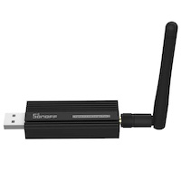
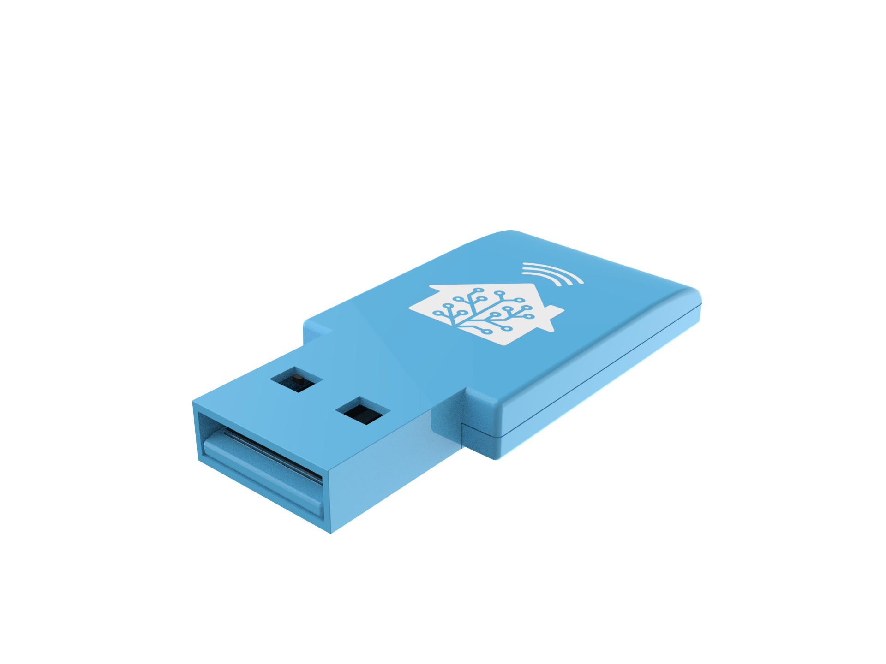
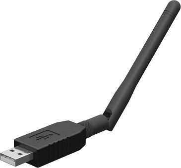
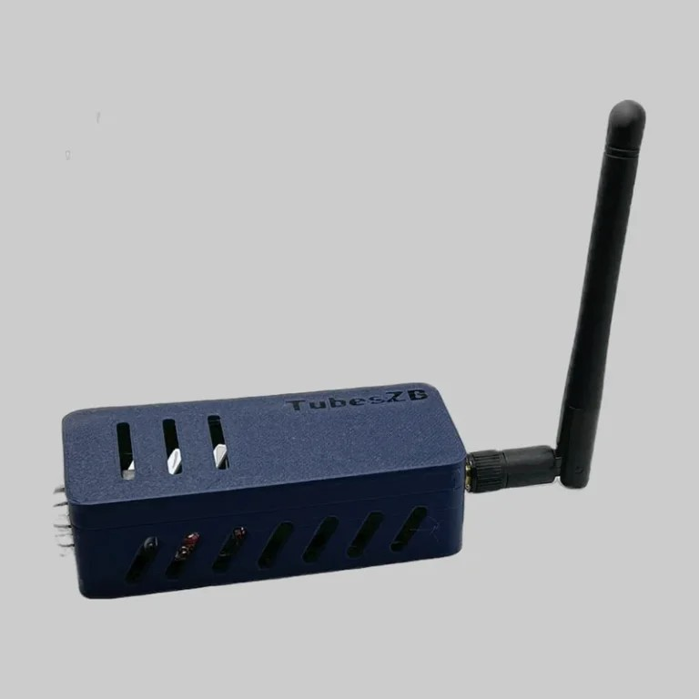
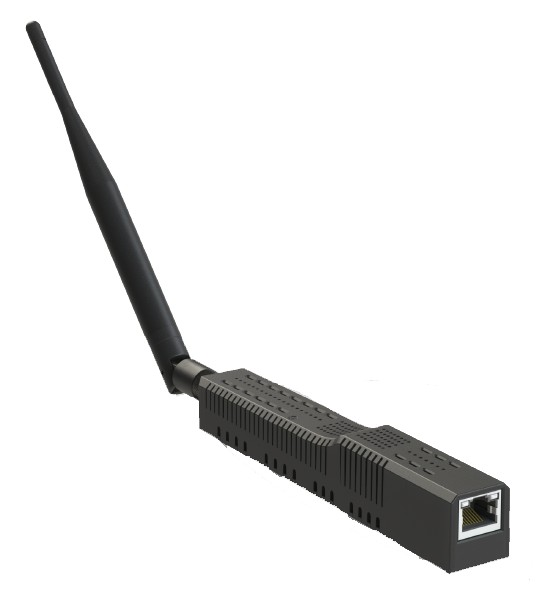

# EmberZNet adapters (Silicon Labs)

Currently supported firmware version: 7.4.x, 8.0.x

::: warning ATTENTION
Use of 8.0.0 and 8.0.1 is not recommended due to firmware issues that have been resolved in 8.0.2.
:::

Firmware release notes: [https://www.silabs.com/developers/zigbee-emberznet?tab=documentation](https://www.silabs.com/developers/zigbee-emberznet?tab=documentation)

_Multiprotocol is not currently supported due to the various issues associated with it. The recommended alternative to establish multiple networks is to use one adapter per protocol._

### Configuration

```yaml
serial:
    adapter: ember
```

Other supported settings are: `adapter_concurrent` and `transmit_power` ([docs](../configuration/adapter-settings.md)).

::: tip TIP
If you are experiencing issues with your adapter and it has hardware flow control support (check list below), try to flash a [firmware with hardware flow control disabled](https://github.com/darkxst/silabs-firmware-builder/tree/ember-nohw/firmware_builds/) and use the following setting instead:

```yaml
serial:
    rtscts: false
```

:::

::: tip TIP
The use of `adapter: ezsp` is now deprecated. See [https://github.com/Koenkk/zigbee2mqtt/discussions/21462](https://github.com/Koenkk/zigbee2mqtt/discussions/21462)
:::

### Firmware flashing

-   Firmware repositories:
    -   Multi-devices by [@darkxst](https://github.com/darkxst/): [https://github.com/darkxst/silabs-firmware-builder/](https://github.com/darkxst/silabs-firmware-builder/)
    -   [@NabuCasa](https://github.com/NabuCasa) / Home Assistant devices: [https://github.com/NabuCasa/silabs-firmware-builder/releases](https://github.com/NabuCasa/silabs-firmware-builder/releases)
    -   [@TubesZB](https://github.com/tube0013) devices: [https://github.com/tube0013/tube_gateways/](https://github.com/tube0013/tube_gateways/)
    -   _**Experimental**_ multi-devices by [@Nerivec](https://github.com/Nerivec/): [https://github.com/Nerivec/silabs-firmware-builder/releases](https://github.com/Nerivec/silabs-firmware-builder/releases)
-   Web-based
    -   Multi-devices by [@darkxst](https://github.com/darkxst/): [Silabs Firmware Flasher](https://darkxst.github.io/silabs-firmware-builder/)
    -   For SkyConnect by [@NabuCasa](https://github.com/NabuCasa): [SkyConnect Flasher](https://skyconnect.home-assistant.io/firmware-update/)
    -   SMLight: [Flasher](https://smlight.tech/flasher/)
-   Command-line based:
    -   Multi-devices by [@NabuCasa](https://github.com/NabuCasa): [Universal Silicon Labs Flasher](https://github.com/NabuCasa/universal-silabs-flasher) (also available via [Home Assistant add-on](https://github.com/home-assistant/addons/tree/master/silabs_flasher))
    -   Multi-devices by [@Nerivec](https://github.com/Nerivec/): [Ember ZLI](https://github.com/Nerivec/ember-zli)
-   Other:
    -   Standalone J-Link Flash Tool (also included in [Simplicity Studio](https://www.silabs.com/developers/simplicity-studio)): [Simplicity Commander](https://www.silabs.com/developers/simplicity-studio/simplicity-commander)
-   Some Ethernet adapters support flashing Zigbee firmware over their own web-interface. In this case you do not need any external software and hardware. Just go to the webinterface and press "Update Zigbee firmware". Please refer to the manual of your particular Zigbee adapter for this functionality.

## Recommended

### USB

::: details Sonoff ZBDongle-E (V2 model, EFR32MG21)

With external antenna. Only supports software flow control (make sure not to set `rtscts: true`).

**This section is about the "ZBDongle-E", for "ZBDongle-P" see [zStack](./zstack.md).**

-   [Product Page](https://sonoff.tech/product/gateway-and-sensors/sonoff-zigbee-3-0-usb-dongle-plus-e/)
-   [Coordinator firmware](https://sonoff.tech/product-review/how-to-use-sonoff-dongle-plus-on-home-assistant-how-to-flash-firmware/)
-   [Flashing](https://sonoff.tech/wp-content/uploads/2022/08/SONOFF-Zigbee-3.0-USB-dongle-plus-firmware-flashing-.pdf)
-   [Buy](https://itead.cc/product/zigbee-3-0-usb-dongle/)


:::

::: details Nabu Casa Home Assistant SkyConnect (EFR32MG21)

With integrated antenna and hardware flow control support.

```yaml
serial:
    rtscts: true
```

-   [Product page](https://www.home-assistant.io/skyconnect)
-   [Coordinator firmware](https://github.com/NabuCasa/silabs-firmware)
-   [Flashing](https://skyconnect.home-assistant.io/)
-   [Buy](https://www.home-assistant.io/skyconnect)


:::

::: details SMLIGHT SLZB-07 (EFR32MG21)

With external antenna and hardware flow control support.

```yaml
serial:
    rtscts: true
```

-   [Product page](https://smlight.tech/product/slzb-07/)
-   Buy: [Official Store - Worldwide](https://smartlight.me/smart-home-devices/zigbee-devices/slzb-07-zigbee-usb-adapter-en), [Aliexpress - Worldwide](https://www.aliexpress.com/item/1005006273914143.html).  
    Local fast delivery: [Australia](https://shop.dialedin.com.au/products/smlight-slzb-07-usb-zigbee-adapter), [Austria, Belgium, Germany, Netherlands](https://www.hobbyelectronica.nl/product/slzb-07-zigbee-coordinator-usb/), [France](https://www.domadoo.fr/fr/interface-domotique/7044-smlight-dongle-usb-zigbee-efr32mg21-cp2102n-soc-antenne-3db-zigbee2mqtt-et-zha.html), [Poland](https://pcblab.io/szukaj?controller=search&s=slzb), [US Amazon](https://www.amazon.com/LOAMLIN-SMLIGHT-SLZB-07-Zigbee-Coordinator/dp/B0CNVBCCR3)



:::

### Network (TCP)

::: details TubeZB EFR32 MGM24 POE (MGM240PB32VNN)

With external antenna.

-   [Product page](https://tubeszb.com/product/efr32-mgm24-poe-coordinator/)
-   [Buy](https://tubeszb.com/product/efr32-mgm24-poe-coordinator/)



:::

### Hybrid (USB + Network)

::: details SMLIGHT SLZB-06M (EFR32MG21)

With external antenna.

**For optimal performance, ensure your firmware is at least version 20240510 (requires Core firmware version 2.2.0 or higher).
Not suitable for WiFi or other high latency connections.**

-   [Product page](https://smlight.tech/product/slzb-06m/)
-   Buy: [Official Store - Worldwide](https://smartlight.me/smart-home-devices/zigbee-devices/slzb-06m-zigbee-adapter), [Aliexpress - Worldwide](https://www.aliexpress.com/item/1005004942648430.html), [Tindie - Worldwide](https://www.tindie.com/products/smartlightme/smlight-slzb-06-zigbee-ethernet-poe-usb-wifi-adapt/).  
    Local fast delivery: [AU](https://shop.dialedin.com.au/products/smlight-slzb-06m-efr32mg21-lan-zigbee-adapter), [AT](https://www.hobbyelectronica.nl/product/slzb-06m-zigbee-ethernet-poe-usb-adapter/), [BE](https://www.hobbyelectronica.nl/product/slzb-06m-zigbee-ethernet-poe-usb-adapter/), [CH](https://shop.swiss-domotique.ch/en/gateways-antennas/2390-smlight-slzb-06m-adaptateur-zigbee-ethernet-poe-usb-wifi.html), [EE](https://improveit.lt/produktas/smlight-slzb-06m-zigbee-ethernet-poe-usb-lan-wifi-adapteris-zha-integracijai/), [FR](https://www.domadoo.fr/fr/box-domotique/7043-smlight-adaptateur-usb-ethernet-poe-zigbee-30-efr32mg21-zigbee2mqtt-et-zha.html), [DE](https://www.hobbyelectronica.nl/product/slzb-06m-zigbee-ethernet-poe-usb-adapter/), [LT](https://improveit.lt/produktas/smlight-slzb-06m-zigbee-ethernet-poe-usb-lan-wifi-adapteris-zha-integracijai/), [LV](https://improveit.lt/produktas/smlight-slzb-06m-zigbee-ethernet-poe-usb-lan-wifi-adapteris-zha-integracijai/), [PL](https://pcblab.io/slzb-06m-adapter-zigbee-efr32mg21-ethernet-poe-usb-lan-wifi.html), [TH](https://shopee.co.th/Zigbee-SLZB-06-LAN-POE-USB-WIFI-Hybrid-Coordinator-CC2652P-SMARTLIGHT-SLZB-06-HASS-Zigbee2mqtt-ZHA-CC2652-CC2531-i.25068823.21062349644), [US official](https://cloudfree.shop/product/smlight-zigbee-ethernet-adapter/), [US Amazon](https://www.amazon.com/SMLIGHT-SLZB-06-Ethernet-Zigbee2MQTT-Assistant/dp/B0BL6DQSB3).


:::

::: details SMLIGHT SLZB-06mg24 (EFR32MG24)

With external antenna.

-   [Product page](https://smlight.tech/product/slzb-06mg24/)
-   [Recommended firmware] UPCOMING
-   [Buy] UPCOMING



:::

### Hub

::: details Nabu Casa Home Assistant Yellow (MGM210P)

With integrated antenna and hardware flow control support.

```yaml
serial:
    rtscts: true
```

-   [Product page](https://www.home-assistant.io/yellow)
-   [Coordinator firmware](https://github.com/NabuCasa/silabs-firmware)
-   [Flashing](https://skyconnect.home-assistant.io/)
-   [Buy](https://www.home-assistant.io/yellow)


:::

### Custom

## Not recommended

::: details All Series 0/1 based-devices

Older hardware.

See [Silicon Labs announcement](https://www.silabs.com/documents/public/release-notes/emberznet-release-notes-7.4.3.0.pdf).

:::

::: details Easyiot ZB-GW04 (v1.1, v1.2)

Low-resources hardware.

:::

## Logging specific to this stack

### `info` level

The start and stop sequences describe the steps taken to get Zigbee2MQTT running with `ember` in more details. This should help to locate potential start and stop problems.

Stack/Network status changes (up/down, channel change, open/close from Permit Join, etc).

_Network/Route error_: The error indicates that there was a problem sending/receiving messages from the target node (see below for more details). A few of these over time is expected (or on Zigbee2MQTT start), too many, too often, is indicative of a problem in your network.

### `warning` level

_Node descriptor reports device is only compliant to revision_: Device identified as having an older Zigbee revision. These can be the source of problems, especially if `pre-21`.

_[EzspConfigId] Failed to SET_: Usually when the coordinator has lower memory than others. In-firmware value will be used instead.

_An ID conflict was detected_: Two devices cannot have the same ID on the same network. The involved devices are kicked off the network then should rejoin (may need to re-pair them if not).

_NOT READY - Signaling NCP_: `ember` driver is temporarily overloaded. The coordinator is made aware and processing is deferred for a short period.

### `error` level

_NCP EZSP protocol version of XX does not match Host version 13_: `ember` currently requires a firmware with EZSP v13 (EmberZNet firmware 7.4.x). You will need to upgrade your adapter's firmware. [Check the first two posts here](https://github.com/Koenkk/zigbee2mqtt/discussions/21462).

_[BACKUP] Current backup file is from an unsupported EZSP version_: `ember` currently only supports EZSP v12 and above backups (can be identified by opening the `coordinator_backup.json` file). The file has been renamed automatically. A new one will be created by `ember` upon successful start.

Failed delivery of a message. The target device could not be reached. There can be several causes for this, the rest of the logs should help identify which.

Failed request. Message should be self-explanatory, and give a `status` indicating the reason of the failure.

NCP Fatal Error. The coordinator failed (the reason should be given in the message). Zigbee2MQTT will attempt to reset it and resume communication. If unsuccessful, Zigbee2MQTT will be stopped completely and the system's watchdog (if any) will attempt to restart it.

## Tools

### Ember ZLI

[https://github.com/Nerivec/ember-zli/](https://github.com/Nerivec/ember-zli/)

NodeJS command line tool that allows firmware flashing, interacting with the adapter's stack, sniffing, etc. using [zigbee-herdsman](https://github.com/Koenkk/zigbee-herdsman/). Check out the [Wiki](https://github.com/Nerivec/ember-zli/wiki) for more details.

### Bellows CLI

[https://github.com/zigpy/bellows](https://github.com/zigpy/bellows)

Python command line tool that allows interacting with the adapter's stack.

### Zigbee2MQTT Ember Helper

[https://nerivec.github.io/z2m-ember-helper/](https://nerivec.github.io/z2m-ember-helper/)

Analyze log files in your browser and get an automated review of your network.

## [EXPERT] Customizing stack configuration

::: warning ATTENTION
This feature modifies the behavior of your adapter, and the network. Using improper values for your network can completely break it. Only modify any of these values if you are absolutely sure your network will benefit from it. Most networks will be just fine with the defaults.
:::

::: warning ATTENTION
Do not open a new issue in Zigbee2MQTT before confirming the problem is present with the default configuration.
:::

You can modify the EmberZNet default stack configuration by creating a file `stack_config.json` in the same folder as your `coordinator_backup.json`. This configuration can only be done manually.

Format, available and default values are as below:

```json
{
    "CONCENTRATOR_RAM_TYPE": "high",
    "CONCENTRATOR_MIN_TIME": 5,
    "CONCENTRATOR_MAX_TIME": 60,
    "CONCENTRATOR_ROUTE_ERROR_THRESHOLD": 3,
    "CONCENTRATOR_DELIVERY_FAILURE_THRESHOLD": 1,
    "CONCENTRATOR_MAX_HOPS": 0,
    "MAX_END_DEVICE_CHILDREN": 32,
    "TRANSIENT_DEVICE_TIMEOUT": 10000,
    "END_DEVICE_POLL_TIMEOUT": 8,
    "TRANSIENT_KEY_TIMEOUT_S": 300,
    "CCA_MODE": null
}
```

Any value that is omitted from the JSON file, invalid or out of range, will use the default instead.

Documentation on these values and their behavior can be found in [SiLabs UG100 - 2.3.1 PDF](https://www.silabs.com/documents/public/user-guides/ug100-ezsp-reference-guide.pdf) and [concentrator article](https://community.silabs.com/s/article/how-does-the-concentrator-plugin-work-x?language=en_US).

The driver further restricts values to the below:

-   CONCENTRATOR_RAM_TYPE: "high" or "low"
-   CONCENTRATOR_MIN_TIME: min 1, max 60
-   CONCENTRATOR_MAX_TIME: min 30, max 300
-   CONCENTRATOR_ROUTE_ERROR_THRESHOLD: min 1, max 100
-   CONCENTRATOR_DELIVERY_FAILURE_THRESHOLD: min 1, max 100
-   CONCENTRATOR_MAX_HOPS: min 0, max 30
-   MAX_END_DEVICE_CHILDREN: min 6, max 64
-   TRANSIENT_DEVICE_TIMEOUT: min 0, max 65535
-   END_DEVICE_POLL_TIMEOUT: min 0, max 14
-   TRANSIENT_KEY_TIMEOUT_S: min 0, max 65535
-   CCA_MODE: defaults to undefined (i.e. left to firmware default), possible values:
    -   "RSSI": RSSI-based CCA. CCA reports a busy medium upon detecting any energy above -75 (default).
    -   "SIGNAL": Signal Identifier-based CCA. CCA reports a busy medium only upon the detection of a signal compliant with this standard with the same modulation and spreading characteristics of the PHY that is currently in use.
    -   "SIGNAL_OR_RSSI": RSSI or signal identifier-based CCA. CCA reports a busy medium on either detecting any energy above -75 (default) or detection of a signal compliant with this standard with the same modulation and spreading characteristics of the PHY that is currently in use.
    -   "SIGNAL_AND_RSSI": RSSI and signal identifier-based CCA. CCA reports a busy medium only on detecting any energy above -75 (default) of a signal compliant with this standard with the same modulation and spreading characteristics of the PHY that is currently in use.
    -   "ALWAYS_TRANSMIT": ALOHA. Always transmit CCA=1. CCA always reports an idle medium.

**Note that some values are not only restricted by these ranges, but also by the memory available in your adapter. If any value (or combination) is too great for your adapter to handle, it will default to the firmware value(s) instead.**
