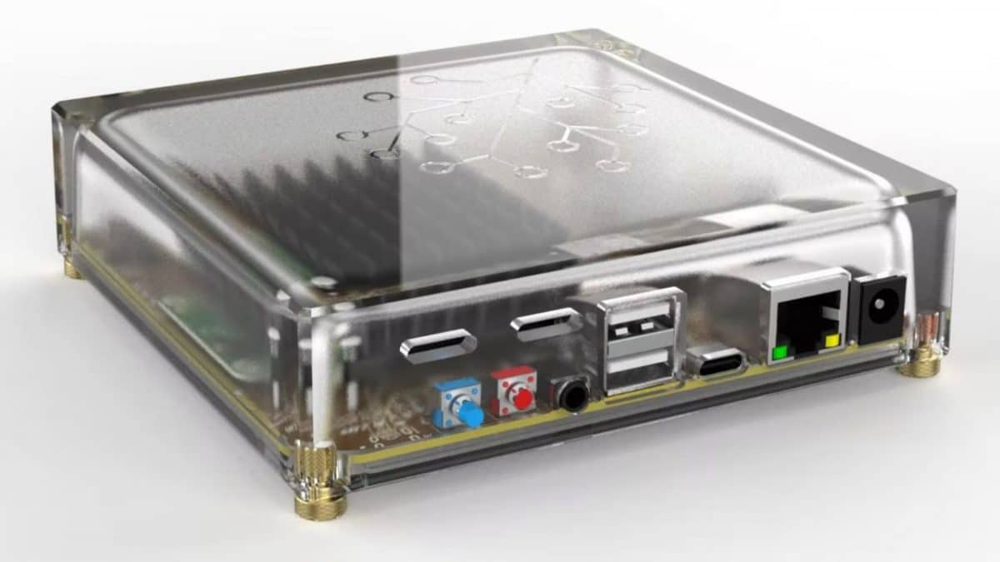

# EmberZNet adapters (Silicon Labs)

Currently supported firmware version: 7.4.0, 7.4.1

Firmware release notes: https://www.silabs.com/developers/zigbee-emberznet?tab=documentation

<em>Multiprotocol is not currently supported due to the various issues associated with it. The recommended alternative to establish multiple networks is to use one adapter per protocol.</em>

### Configuration

```yaml
serial:
  adapter: ember
```

[Other settings](../configuration/adapter-settings.md)

::: tip TIP
If you are experiencing issues with your adapter and it has hardware flow control support (check list below), try to flash a [firmware with hardware flow control disabled](https://github.com/darkxst/silabs-firmware-builder/tree/ember-nohw/firmware_builds/) and use the following setting instead:

```yaml
serial:
  rtscts: false
```
:::

::: tip TIP
The use of `adapter: ezsp` is now deprecated. See https://github.com/Koenkk/zigbee2mqtt/discussions/21462
:::

### Firmware flashing

- Web-based
  - Multi-devices by [@darkxst](https://github.com/darkxst/): [Silabs Firmware Flasher](https://darkxst.github.io/silabs-firmware-builder/)
  - Nabu Casa Home Assistant: https://skyconnect.home-assistant.io/firmware-update/
  - SMLight: https://smlight.tech/flasher/
- Command-line based:
  - Multi-devices by Nabu Casa: [Universal Silicon Labs Flasher](https://github.com/NabuCasa/universal-silabs-flasher) (also available via Home Assistant add-on)
- Other:
  - Silicon Labs [Simplicity Studio](https://www.silabs.com/developers/simplicity-studio) included "Flash Programmer" ([instructions](https://docs.silabs.com/simplicity-studio-5-users-guide/latest/))
- Some Ethernet adapters support flashing Zigbee firmware over their own web-interface. In this case you do not need any external software and hardware. Just go to the webinterface and press "Update Zigbee firmware". Please refer to the manual of your particular Zigbee adapter for this functionality.

## Recommended

### USB

<details>
<summary>Sonoff ZBDongle-E (V2 model, EFR32MG21)</summary>

With external antenna.

**This section is about the "ZBDongle-E", for "ZBDongle-P" see [zStack](./zstack.md).**

* [Product Page](https://sonoff.tech/product/gateway-and-sensors/sonoff-zigbee-3-0-usb-dongle-plus-e/)
* [Coordinator firmware](https://sonoff.tech/product-review/how-to-use-sonoff-dongle-plus-on-home-assistant-how-to-flash-firmware/)
* [Flashing](https://sonoff.tech/wp-content/uploads/2022/08/SONOFF-Zigbee-3.0-USB-dongle-plus-firmware-flashing-.pdf)
* [Buy](https://itead.cc/product/zigbee-3-0-usb-dongle/)


</details>

<details>
<summary>Nabu Casa Home Assistant SkyConnect (EFR32MG21)</summary>

With integrated antenna and hardware flow control support.

```yaml
serial:
  rtscts: true
```

* [Product page](https://www.home-assistant.io/skyconnect)
* [Coordinator firmware](https://github.com/NabuCasa/silabs-firmware)
* [Flashing](https://skyconnect.home-assistant.io/)
* [Buy](https://www.home-assistant.io/skyconnect)


</details>

<details>
<summary>SMLIGHT SLZB-07 (EFR32MG21)</summary>

With external antenna and hardware flow control support.

```yaml
serial:
  rtscts: true
```

* [Product page](https://smlight.tech/product/slzb-07/)
* Buy: [Official Store - Worldwide](https://smartlight.me/smart-home-devices/zigbee-devices/slzb-07-zigbee-usb-adapter-en), [Aliexpress - Worldwide](https://www.aliexpress.com/item/1005006273914143.html).  
Local fast delivery: [Australia](https://shop.dialedin.com.au/products/smlight-slzb-07-usb-zigbee-adapter), [Austria, Belgium, Germany, Netherlands](https://www.hobbyelectronica.nl/product/slzb-07-zigbee-coordinator-usb/), [France](https://www.domadoo.fr/fr/interface-domotique/7044-smlight-dongle-usb-zigbee-efr32mg21-cp2102n-soc-antenne-3db-zigbee2mqtt-et-zha.html), [Poland](https://pcblab.io/szukaj?controller=search&s=slzb), [US Amazon](https://www.amazon.com/LOAMLIN-SMLIGHT-SLZB-07-Zigbee-Coordinator/dp/B0CNVBCCR3)


</details>

### Network (TCP)


<details>
<summary>TubeZB EFR32 MGM24 POE (MGM240PB32VNN)</summary>

With external antenna.

* [Product page](https://tubeszb.com/product/efr32-mgm24-poe-coordinator/)
* [Buy](https://tubeszb.com/product/efr32-mgm24-poe-coordinator/)


</details>


### Hybrid (USB + Network)

<details>
<summary>SMLIGHT SLZB-06mg24 (EFR32MG24)</summary>

With external antenna.

* [Product page](https://smlight.tech/product/slzb-06mg24/)
* [Buy] UPCOMING


</details>


### Hub

<details>
<summary>Nabu Casa Home Assistant Yellow (MGM210P)</summary>

With integrated antenna and hardware flow control support.

```yaml
serial:
  rtscts: true
```

* [Product page](https://www.home-assistant.io/yellow)
* [Coordinator firmware](https://github.com/NabuCasa/silabs-firmware)
* [Flashing](https://skyconnect.home-assistant.io/)
* [Buy](https://www.home-assistant.io/yellow)


</details>

### Custom


## Not recommended

### Known issues

- SMLight SLZB-06M

### Old or low-resources hardware

- All EFR32 Series 1 based-devices (support dropped by Silicon Labs from EmberZNet 7.5)
- Easyiot ZB-GW04 (v1.2)
- Easyiot ZB-GW04 (v1.1)

## Logging specific to this stack

### `info` level

The start and stop sequences describe the steps taken to get Zigbee2MQTT running with `ember` in more details. This should help to locate potential start and stop problems.

Stack/Network status changes (up/down, channel change, open/close from Permit Join, etc).

### `warning` level

<em>Node descriptor reports device is only compliant to revision</em>: Device identified as having an older Zigbee revision. These can be the source of problems, especially if `pre-21`.

<em>[EzspConfigId] Failed to SET</em>: Usually when the coordinator has lower memory than others. In-firmware value will be used instead.

<em>An ID conflict was detected</em>: Two devices cannot have the same ID on the same network. The involved devices are kicked off the network then should rejoin (may need to re-pair them if not).

<em>Network/Route error</em>: These are accompanied by a status that describes in more details the source of the error. A few of these over time is expected (or on Zigbee2MQTT start), too many, too often, is indicative of a problem in your network.

<em>NOT READY - Signaling NCP</em>: `ember` driver is temporarily overloaded. The coordinator is made aware and processing is deferred for a short period.

### `error` level

Mismatching EZSP version on start. `ember` currently requires a firmware with EZSP v13 (EmberZNet firmware 7.4.x).

Mismatching backup version when restoring on start. `ember` currently only supports EZSP v12 and above backups (can be identified by opening the `coordinator_backup.json` file).

Failed delivery of a message. The target device could not be reached. There can be several causes for this, the rest of the logs should help identify which.

Failed request. Message should be self-explanatory, and give a `status` indicating the reason of the failure.

NCP Fatal Error. The coordinator failed (the reason should be given in the message). Zigbee2MQTT will attempt to reset it and resume communication. If unsuccessful, Zigbee2MQTT will be stopped completely and the system's watchdog (if any) will attempt to restart it.
