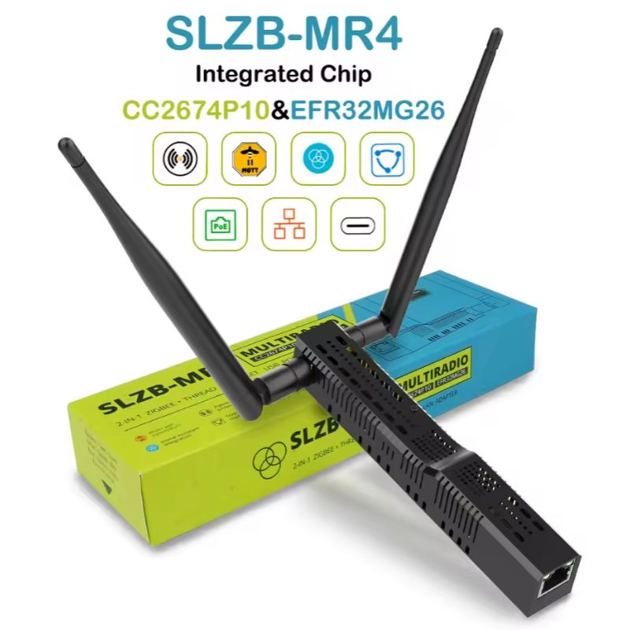

# EmberZNet adapters (Silicon Labs)

Currently supported firmware version: 7.4.x, 8.0.x, 8.1.x

Firmware release notes: [https://www.silabs.com/developers/zigbee-emberznet?tab=documentation](https://www.silabs.com/developers/zigbee-emberznet?tab=documentation)

_Multiprotocol firmware is not supported. The recommended alternative to establish multiple networks is to use one adapter per protocol._

### Configuration

```yaml
serial:
    adapter: ember
```

Other supported settings are: `adapter_concurrent` and `transmit_power` ([docs](../configuration/adapter-settings.md)).

::: tip TIP
The use of `adapter: ezsp` is now deprecated. See [https://github.com/Koenkk/zigbee2mqtt/discussions/21462](https://github.com/Koenkk/zigbee2mqtt/discussions/21462)
:::

### Firmware flashing

- Firmware repositories:
    - Multi-devices by [@darkxst](https://github.com/darkxst/): [https://github.com/darkxst/silabs-firmware-builder/releases](https://github.com/darkxst/silabs-firmware-builder/releases)
    - [@NabuCasa](https://github.com/NabuCasa) / Home Assistant devices: [https://github.com/NabuCasa/silabs-firmware-builder/releases](https://github.com/NabuCasa/silabs-firmware-builder/releases)
    - [@TubesZB](https://github.com/tube0013) devices: [https://github.com/tube0013/tube_gateways/](https://github.com/tube0013/tube_gateways/)
    - Multi-devices by [@Nerivec](https://github.com/Nerivec/): [https://github.com/Nerivec/silabs-firmware-builder/releases](https://github.com/Nerivec/silabs-firmware-builder/releases)
        - Router firmware also available
- Web-based
    - Multi-devices by [@darkxst](https://github.com/darkxst/): [Silabs Firmware Flasher](https://darkxst.github.io/silabs-firmware-builder/)
    - For ZBT-1/ZBT-2 by [@NabuCasa](https://github.com/NabuCasa): [ZBT Flasher](https://toolbox.openhomefoundation.org/)
    - SMLight: [Flasher](https://smlight.tech/flasher/)
    - For SONOFF Dongle: [SONOFF Dongle Flasher](https://dongle.sonoff.tech/sonoff-dongle-flasher/)
- Command-line based:
    - Multi-devices by [@NabuCasa](https://github.com/NabuCasa) using Python: [Universal Silicon Labs Flasher](https://github.com/NabuCasa/universal-silabs-flasher) (also available via [Home Assistant add-on](https://github.com/home-assistant/addons/tree/master/silabs_flasher))
    - Multi-devices by [@Nerivec](https://github.com/Nerivec/) using NodeJS: [Ember ZLI](https://github.com/Nerivec/ember-zli)
- Other:
    - Standalone J-Link Flash Tool (also included in [Simplicity Studio](https://www.silabs.com/developers/simplicity-studio)): [Simplicity Commander](https://www.silabs.com/developers/simplicity-studio/simplicity-commander)
- Some Ethernet adapters support flashing Zigbee firmware over their own web-interface. In this case you do not need any external software and hardware. Just go to the webinterface and press "Update Zigbee firmware". Please refer to the manual of your particular Zigbee adapter for this functionality.

## Hardware

Each category is ordered by chip, newer series first.

### USB

::: details Home Assistant Connect ZBT-2

Chip: [EFR32MG24A420F1536IM40](https://www.silabs.com/wireless/zigbee/efr32mg24-series-2-socs/device.EFR32MG24A420F1536IM40?tab=specs)

With external antenna and hardware flow control support. Make sure to set the baudrate to 460800.

```yaml
serial:
    baudrate: 460800
    rtscts: true
```

- [Product page](https://www.home-assistant.io/connect/zbt-2)
- [Coordinator firmware](https://github.com/NabuCasa/silabs-firmware-builder/releases)
- [Flashing](https://toolbox.openhomefoundation.org/home-assistant-connect-zbt-2)
- [Buy](https://www.home-assistant.io/connect/zbt-2)


:::

::: details SONOFF Dongle-PMG24

Chip: [efr32mg24a420f1536im48](https://www.silabs.com/wireless/zigbee/efr32mg24-series-2-socs/device.efr32mg24a420f1536im48?tab=specs)

With external antenna(+3 dBi). Only supports software flow control (make sure not to set `rtscts: true`).

- [Product Page](https://sonoff.tech/products/sonoff-zigbee-thread-usb-dongle-dongle-plus-mg24)
- [Flashing](https://dongle.sonoff.tech/sonoff-dongle-flasher/)
- [Hardware-specification](https://dongle.sonoff.tech/guide/dongle-pmg24/hardware-specification-dongle-pmg24/)
- [Buy](https://sonoff.tech/products/sonoff-zigbee-thread-usb-dongle-dongle-plus-mg24)


:::

::: details SMLIGHT SLZB-07mg24

Chip: [efr32mg24a020f1024im40](https://www.silabs.com/wireless/zigbee/efr32mg24-series-2-socs/device.efr32mg24a020f1024im40?tab=specs)

With external antenna and hardware flow control support.

```yaml
serial:
    rtscts: true
```

- [Product page](https://smlight.tech/product/slzb-07mg24/) (not available yet, so link doesn't work)


:::

::: details Aeotec Zi-Stick (ZGA008)

Chip: [efr32mg21a020f1024im32](https://www.silabs.com/wireless/zigbee/efr32mg21-series-2-socs/device.efr32mg21a020f1024im32?tab=specs)

With onboard antenna and hardware flow control support.

```yaml
serial:
    rtscts: true
```

- [Product page](https://aeotec.com/products/aeotec-z-stick-zigbee/)
- [Buy](https://store.aeotec.com/products/zi-stick-zigbee-zga008)


:::

::: details Sonoff ZBDongle-E (V2 model)

Chip: [efr32mg21a020f768im32](https://www.silabs.com/wireless/zigbee/efr32mg21-series-2-socs/device.efr32mg21a020f768im32?tab=specs)

With external antenna. Only supports software flow control (make sure not to set `rtscts: true`).

**This section is about the "ZBDongle-E", for "ZBDongle-P" see [zStack](./zstack.md).**

- [Product Page](https://sonoff.tech/product/gateway-and-sensors/sonoff-zigbee-3-0-usb-dongle-plus-e/)
- [Coordinator firmware](https://sonoff.tech/product-review/how-to-use-sonoff-dongle-plus-on-home-assistant-how-to-flash-firmware/)
- [Flashing](https://sonoff.tech/wp-content/uploads/2022/08/SONOFF-Zigbee-3.0-USB-dongle-plus-firmware-flashing-.pdf)
    - **Note**: The PDF links to an old firmware. See all [NCP_X.Y.Z](https://github.com/itead/Sonoff_Zigbee_Dongle_Firmware/tree/master/Dongle-E) versions and pick [7.4.4](https://github.com/itead/Sonoff_Zigbee_Dongle_Firmware/tree/master/Dongle-E/NCP_7.4.4) or newer.
- [Buy](https://itead.cc/product/zigbee-3-0-usb-dongle/)


:::

::: details SMLIGHT SLZB-07

Chip: [efr32mg21a020f768im32](https://www.silabs.com/wireless/zigbee/efr32mg21-series-2-socs/device.efr32mg21a020f768im32?tab=specs)

With external antenna and hardware flow control support.

```yaml
serial:
    rtscts: true
```

- [Product page](https://smlight.tech/product/slzb-07/)
- Buy: [Official Store - Worldwide](https://smartlight.me/smart-home-devices/zigbee-devices/slzb-07-zigbee-usb-adapter-en), [Aliexpress - Worldwide](https://www.aliexpress.com/item/1005006273914143.html).  
  Local fast delivery: [Australia](https://shop.dialedin.com.au/products/smlight-slzb-07-usb-zigbee-adapter), [Austria, Belgium, Germany, Netherlands](https://www.hobbyelectronica.nl/product/slzb-07-zigbee-coordinator-usb/), [France](https://www.domadoo.fr/fr/interface-domotique/7044-smlight-dongle-usb-zigbee-efr32mg21-cp2102n-soc-antenne-3db-zigbee2mqtt-et-zha.html), [Poland](https://pcblab.io/szukaj?controller=search&s=slzb), [US Amazon](https://www.amazon.com/LOAMLIN-SMLIGHT-SLZB-07-Zigbee-Coordinator/dp/B0CNVBCCR3)


:::

::: details Home Assistant Connect ZBT-1

Chip: [efr32mg21a020f512im32](https://www.silabs.com/wireless/zigbee/efr32mg21-series-2-socs/device.efr32mg21a020f512im32?tab=specs)

With onboard antenna and hardware flow control support.

```yaml
serial:
    rtscts: true
```

- [Product page](https://www.home-assistant.io/connectzbt1)
- [Coordinator firmware](https://github.com/NabuCasa/silabs-firmware-builder/releases)
- [Flashing](https://toolbox.openhomefoundation.org/home-assistant-connect-zbt-1)
- [Buy](https://www.home-assistant.io/connectzbt1)


:::

::: details Z-WAVE>ME Z-Station (EFR32MG21P)

With external antenna.

Requires Z-Station firmware 2024.04.22 or later.

```yaml
serial:
    rtscts: false
```

- [Product page](https://z-wave.me/products/z-station/)
- [Firmware](https://z-wave.me/support/tools-for-zigbee-openthread-ble/)
- Buy: [Official Store - Worldwide](https://smartsd.ch/z-station-usb-adaptor-for-z-wave-zigbee-thread-ble/)


:::

### Network (TCP)

::: details TubeZB EFR32 MGM24 POE

Chip: [mgm240pa32vnn](https://www.silabs.com/wireless/zigbee/efr32mg24-series-2-modules/device.mgm240pa32vnn?tab=specs)

With external antenna.

Note: can also be powered via USB (with a special case) and used with a simple Ethernet cable (do not use USB and POE at the same time!).

- [Product page](https://tubeszb.com/product/efr32-mgm24-poe-coordinator/)
- [Buy](https://tubeszb.com/product/efr32-mgm24-poe-coordinator/)


:::

### Hybrid (USB + Network)

::: details SMLIGHT SLZB-MR Series (MR1/MR2/MR3/MR4) MultiRadio Zigbee + Matter-over-Thread Ethernet USB POE Wi-Fi BLE LAN adapter

SLZB-MRx Series are the compact multi-radio smart home adapter featuring Silicon Labs **EFR32MG26**/EFR32MG24/EFR32MG21 and Texas Instruments CC2674P10/CC2652P7/CC2652P for MR4/MR3/MR2/MR1, respectivelly (two Zigbee/Thread radios), and and ESP32 chips, enabling simultaneous support for Zigbee 3.0 and Matter-over-Thread run on different SoCs, alongsie with Ethernet, Wi-Fi, or USB. Devices support PoE for flexible, remote deployment. Its multi-SoC architecture ensures high performance and full compatibility with platforms like Home Assistant and Zigbee2MQTT. Powered by SLZB-OS with OTA firmware updates, VPN, DDNS, Wireguard VPN, HA Integration, 20+ languages, IPv6, Ethernet-to-Wi-Fi bridge, and so on.

| Parameter                        |                                                                 **SLZB-MR4**                                                                  |                                                             **SLZB-MR3**                                                             |                                                                   **SLZB-MR2**                                                                    |                                                            **SLZB-MR1**                                                            |
| :------------------------------- | :-------------------------------------------------------------------------------------------------------------------------------------------: | :----------------------------------------------------------------------------------------------------------------------------------: | :-----------------------------------------------------------------------------------------------------------------------------------------------: | :--------------------------------------------------------------------------------------------------------------------------------: |
| **Zigbee/Thread Radio 1 SoC**    |                                                                   EFR32MG26                                                                   |                                                              EFR32MG24                                                               |                                                                     EFR32MG21                                                                     |                                                             EFR32MG21                                                              |
| **Zigbee/Thread Radio 2 SoC**    |                                                                   CC2674P10                                                                   |                                                              CC2674P10                                                               |                                                                      CC2652P                                                                      |                                                              CC2652P7                                                              |
| **Max Supported Zigbee Devices** |                                                                     ≈ 800                                                                     |                                                                ≈ 750                                                                 |                                                                       ≈ 400                                                                       |                                                               ≈ 500                                                                |
| **Product image**                |                                                           |                                                  |                                                               |                                                |
| **Web interface**                |                                                                                                                                               |                                               |                                                            |                                             |
| **Youtube review**               | [](https://www.youtube.com/watch?v=2fYrW38R0Jc) | [](https://www.youtube.com/watch?v=Oc0PkPVUseE) | [](https://www.youtube.com/watch?v=hQnM7l5iwsw) | [](https://www.youtube.com/watch?v=_ER3Hnij1l0) |
| **Product page**                 |                                                [SLZB-MR4](https://smlight.tech/global/slzbmr4)                                                |                                           [SLZB-MR3](https://smlight.tech/global/slzbmr3)                                            |                                                  [SLZB-MR2](https://smlight.tech/global/slzbmr2)                                                  |                                          [SLZB-MR1](https://smlight.tech/global/slzbmr2)                                           |

**SLZB-MR4 buy**: [Authorized Store - Worldwide](https://smartlight.me/smart-home-devices/zigbee-devices/slzb-mr3-multiradio-adapter), [Aliexpress-1 - Wordldwide](https://www.aliexpress.com/item/1005004942648430.html), [Aliexpress-2 - Worldwide](https://www.aliexpress.com/item/1005008814854495.html).  
Local fast delivery: [AU](https://shop.dialedin.com.au/products/slzb-mr3-zigbee-and-thread-adapter), [CH](https://www.swiss-domotique.ch/en/actuators-modules/smlight-usb-ethernet-poe-adapter-zigbee-and-thread-cc2674p10-efr32mg26), [FR](https://www.domadoo.fr/fr/produits-de-domotique/8369-smlight-adaptateur-usb-ethernet-poe-zigbee-et-thread-cc2674p10-efr32mg26-slzb-mr4.html), [PL](https://pcblab.io/adapter-slzbmr4-zigbee-thread-cc2674p10-efr32mg26-poe-usb-wifi-esp32-lan.html), [UK](https://zigbeesmart.com/de-de/products/smlight-slzb-mr4-dual-radio-zigbee-thread-ethernet-coordinator?_pos=6&_sid=04f161c3b&_ss=r)

**SLZB-MR3 buy**: [Authorized Store - Worldwide](https://smartlight.me/smart-home-devices/zigbee-devices/slzb-mr3-multiradio-adapter), [Aliexpress-1 - Worldwide](https://www.aliexpress.com/item/1005004942648430.html), [Aliexpress-2 - Worldwide](https://www.aliexpress.com/item/1005008814854495.html).  
 Local fast delivery: [AU](https://shop.dialedin.com.au/products/slzb-mr3-zigbee-and-thread-adapter), [CH](https://www.swiss-domotique.ch/en/actuators-modules/smlight-zigbee-poe-ethernet-usb-adapter), [CZ](https://www.homebrainz.shop/p/smlight-slzb-mr3), [DE](https://mediarath.de/en/products/smlight-slzb-mr3-zigbee-thread-multiradio-cc2652p10-efr32mg24-lan-poe-usb-wifi-adapter), [FR](https://www.domadoo.fr/fr/produits-de-domotique/8031-smlight-adaptateur-usb-ethernet-poe-zigbee-et-thread-cc2674p10-efr32mg24-slzb-mr3.html), [PL](https://pcblab.io/multi-adapter-slzb-mr3-zigbee-thread-matter-esp32-cc2674p10-mg24-poe-wifi.html), [UK](https://zigbeesmart.com/de-de/products/smlight-slzb-mr3-multiradio-coordinator)

**SLZB-MR2 buy**: [Authorized Store - Worldwide](https://smartlight.me/smart-home-devices/zigbee-devices/slzb-mr2-multiradio-adapter), [Aliexpress-1 - Worldwide](https://www.aliexpress.com/item/1005004942648430.html), [Aliexpress-2 - Worldwide](https://www.aliexpress.com/item/1005008814854495.html).  
Local fast delivery: [AU](https://shop.dialedin.com.au/products/slzb-mr2-zigbee-and-thread-adapter), [CZ](https://www.homebrainz.shop/p/smlight-slzb-mr2), [DE](https://mediarath.de/en/products/smlight-slzb-mr2-zigbee-thread-multiradio-cc2652p-efr32mg21-lan-poe-usb-wifi-adapter), [FR](https://www.domadoo.fr/fr/produits-de-domotique/8030-smlight-adaptateur-usb-ethernet-poe-zigbee-et-thread-cc2652p-efr32mg21-slzb-mr2.html), [PL](https://pcblab.io/adapter-slzb-mr2-zigbee-thread-matter-esp32-cc2652p-efr32mg21-poe-wifi-lan.html), [UK](https://zigbeesmart.com/de-de/products/zigbee-lan-poe-coordinator-smlight-slzb-mr2-multiradio?_pos=13&_sid=04f161c3b&_ss=r)

**SLZB-MR1 buy**: [Authorized Store - Worldwide](https://smartlight.me/smart-home-devices/zigbee-devices/slzb-mr1-multiradio-coordinator), [Aliexpress-1 - Worldwide](https://www.aliexpress.com/item/1005004942648430.html).  
 Local fast delivery: [AU](https://shop.dialedin.com.au/products/slzb-mr1-zigbee-and-thread-adapter), [AT](https://www.hobbyelectronica.nl/product/slzb-mr1-zigbee-ethernet-poe-usb-adapter/), [CZ](https://www.homebrainz.shop/de/p/smlight-slzb-mr1?srsltid=AfmBOorf9TiY1ZBQD7a7hUwDemKbCFsH_dv8ru9uDCT5yoq19AlyHy6z), [FR+EU](https://www.domadoo.fr/de/smart-home-produkte/7773-smlight-slzb-mr1-usb-ethernet-poe-zigbee-thread-matter-adapter.html), [BE](https://www.hobbyelectronica.nl/product/slzb-mr1-zigbee-ethernet-poe-usb-adapter/), [DE](https://mediarath.de/en/products/smlight-slzb-mr1-zigbee-thread-multiradio-cc2652p7-efr32mg21-lan-poe-usb-wifi-adapter), [NL](https://www.hobbyelectronica.nl/product/slzb-mr1-zigbee-ethernet-poe-usb-adapter/), [PL](https://pcblab.io/koordynator-slzb-mr1-multiradio-zigbee-thread.html), [SE](https://www.lohelectronics.se/hemautomation/zigbee/controllers-1473/smlight-slzb-mr1-zigbee-3-0-lan-gateway-med-poe-och-z2m), [CH](https://www.swiss-domotique.ch/en/gateways-antennas/2752-smlight-slzb-06-adaptateur-zigbee-ethernet-poe-usb-wifi-2.html), [FI](https://verkkokauppa.nurkantakaa.fi/tuote/smlight-slzb-mr1/), [UK](https://zigbeesmart.com/de-de/products/zigbee-lan-poe-coordinator-smlight-slzb-mr1-multiradio), [US](https://cloudfree.shop/product/smlight-slzb-mr1-zigbee-thread/).

:::

::: details SONOFF Dongle-M

Chip: [efr32mg24a420f1536im48](https://www.silabs.com/wireless/zigbee/efr32mg24-series-2-socs/device.efr32mg24a420f1536im48?tab=specs)

The Dongle-M includes two chips: ESP32-D0WD-R2 and EFR32MG24. It comes with two external antennas, supports PoE power supply, has a built-in web console(http://Dongle-M.local), and can connect to Zigbee2MQTT via Ethernet/Wi-Fi/USB.

- [Product Page](https://sonoff.tech/products/sonoff-dongle-max-zigbee-thread-poe-dongle-dongle-m)
- [Flashing](https://dongle.sonoff.tech/sonoff-dongle-flasher/)
- [Hardware-specification](https://dongle.sonoff.tech/guide/dongle-m/hardware-specification-dongle-m/)
- [Buy](https://sonoff.tech/products/sonoff-dongle-max-zigbee-thread-poe-dongle-dongle-m)


:::

::: details SMLIGHT SLZB-06Mg26

Chip: [efr32mg26b420f3200im48](https://www.silabs.com/wireless/zigbee/efr32mg26-series-2-socs/device.efr32mg26b420f3200im48?tab=specs)

With external antenna.

- [Product page](https://smlight.tech/global/slzb06mg26)


**SLZB-06Mg26 buy**:

- Buy: [Authorized Store - Worldwide](https://smartlight.me/smart-home-devices/zigbee-devices/slzb-06mg26-enadapter), [Aliexpress-1 - Worldwide](https://www.aliexpress.com/item/1005004942648430.html), [Aliexpress-2 - Worldwide](https://www.aliexpress.com/item/1005008814854495.html).

:::

::: details SMLIGHT SLZB-06Mg24

Chip: [efr32mg24a020f1024im40](https://www.silabs.com/wireless/zigbee/efr32mg24-series-2-socs/device.efr32mg24a020f1024im40?tab=specs)

With external antenna.

- [Product page](https://smlight.tech/global/slzb06mg24)


:::

::: details SMLIGHT SLZB-06M

Chip: [efr32mg21a020f768im32](https://www.silabs.com/wireless/zigbee/efr32mg21-series-2-socs/device.efr32mg21a020f768im32?tab=specs)

With external antenna.

**For optimal performance, ensure your firmware is at least version 20240510 (requires Core firmware version 2.2.0 or higher).
Not suitable for WiFi or other high latency connections.**

- [Product page](https://smlight.tech/product/slzb-06m/)
- Buy: [Official Store - Worldwide](https://smartlight.me/smart-home-devices/zigbee-devices/slzb-06m-zigbee-adapter), [Aliexpress - Worldwide](https://www.aliexpress.com/item/1005004942648430.html), [Tindie - Worldwide](https://www.tindie.com/products/smartlightme/smlight-slzb-06-zigbee-ethernet-poe-usb-wifi-adapt/).  
  Local fast delivery: [AU](https://shop.dialedin.com.au/products/smlight-slzb-06m-efr32mg21-lan-zigbee-adapter), [AT](https://www.hobbyelectronica.nl/product/slzb-06m-zigbee-ethernet-poe-usb-adapter/), [BE](https://www.hobbyelectronica.nl/product/slzb-06m-zigbee-ethernet-poe-usb-adapter/), [CH](https://shop.swiss-domotique.ch/en/gateways-antennas/2390-smlight-slzb-06m-adaptateur-zigbee-ethernet-poe-usb-wifi.html), [EE](https://improveit.lt/produktas/smlight-slzb-06m-zigbee-ethernet-poe-usb-lan-wifi-adapteris-zha-integracijai/), [FR](https://www.domadoo.fr/fr/box-domotique/7043-smlight-adaptateur-usb-ethernet-poe-zigbee-30-efr32mg21-zigbee2mqtt-et-zha.html), [DE](https://www.hobbyelectronica.nl/product/slzb-06m-zigbee-ethernet-poe-usb-adapter/), [LT](https://improveit.lt/produktas/smlight-slzb-06m-zigbee-ethernet-poe-usb-lan-wifi-adapteris-zha-integracijai/), [LV](https://improveit.lt/produktas/smlight-slzb-06m-zigbee-ethernet-poe-usb-lan-wifi-adapteris-zha-integracijai/), [PL](https://pcblab.io/slzb-06m-adapter-zigbee-efr32mg21-ethernet-poe-usb-lan-wifi.html), [TH](https://shopee.co.th/Zigbee-SLZB-06-LAN-POE-USB-WIFI-Hybrid-Coordinator-CC2652P-SMARTLIGHT-SLZB-06-HASS-Zigbee2mqtt-ZHA-CC2652-CC2531-i.25068823.21062349644), [US official](https://cloudfree.shop/product/smlight-zigbee-ethernet-adapter/), [US Amazon](https://www.amazon.com/SMLIGHT-SLZB-06-Ethernet-Zigbee2MQTT-Assistant/dp/B0BL6DQSB3).


:::

### Hub

::: details SMLIGHT SMHUB Nano Mg24 (Linux-based hub with Zigbee2MQTT pre-installed)

SMHUB Nano Mg24 is a Linux-based multi-radio smart home hub with fancy UI, that runs Zigbee2MQTT directly on the device, without needing an external server. It also comes with Mosquitto MQTT broker, Node-RED, and Matterbridge preinstalled, making it a full smart home gateway out of the box. SMHUB integrates SL SoC EFR32MG24 SoC, with Ethernet+POE, Wi-Fi, Bluetooth and USB connectivity. Hardware features include SD card, eMMC, button and 4 service LEDs. With OTA updates, VPN and more via SMHUB-OS, it provides a powerful and future-proof platform for any ecosystems.

|                               Product picture                               |                            Interface screenshot                            |                                               Youtube videoreview                                               |
| :-------------------------------------------------------------------------: | :------------------------------------------------------------------------: | :-------------------------------------------------------------------------------------------------------------: |
|  |  |  |

- [Product page](https://smlight.tech/global/smhub-nano-mg24)
- Buy: [Authorized Store - Worldwide](https://smartlight.me/smart-home-devices/zigbee-devices/smhub-nano), [Aliexpress-1 - Worldwide](https://a.aliexpress.com/_EwWCdYC), [Aliexpress-2 - Worldwide](https://www.aliexpress.com/item/1005010395706341.html).

:::

::: details SMLIGHT SMHUB (Essential/Professional variants)

SMHUB is a Linux-based multi-radio smart home hub with fancy UI, that runs Zigbee2MQTT directly on the device, without needing an external server. It also comes with Mosquitto MQTT broker, Node-RED, and Matterbridge preinstalled, making it a full smart home gateway out of the box. SMHUB integrates TI SoC (CC2652P for Essential, CC2674P10 for Professional variants), and SL SoC (EFR32MG21 for Essential, and EFR32MG24 for Professional variants), with Ethernet, Wi-Fi, USB, and optional Z-Wave radios, PoE, and 4G connectivity. Hardware features include 12 RGB LEDs, IR receiver/transmitter, audio, SD card, eMMC, and multiple USB ports. With OTA updates, VPN and more via SMHUB-OS, it provides a powerful and future-proof platform for any ecosystems.

|                               Product picture                               |                            Interface screenshot                            |                                               Youtube videoreview                                               |
| :-------------------------------------------------------------------------: | :------------------------------------------------------------------------: | :-------------------------------------------------------------------------------------------------------------: |
|  |  | [](https://youtu.be/xQsIt4yYxdw) |

- [Product page](https://smlight.tech/global/smhub)
- [Manual](https://smlight.tech/support/manuals/books/smhub)
- Buy: [Authorized Store - Worldwide](https://smartlight.me/smart-home-devices/zigbee-devices/smhub-professional), [Aliexpress-1 - Worldwide](https://aliexpress.com/item/1005009942560775.html), [Aliexpress-2 - Worldwide](https://aliexpress.com/item/1005009942491630.html).

:::

::: details Nabu Casa Home Assistant Yellow

Chip: [mgm210pa32jia](https://www.silabs.com/wireless/zigbee/efr32mg21-series-2-modules/device.mgm210pa32jia?tab=specs)

With onboard antenna and hardware flow control support.

```yaml
serial:
    rtscts: true
```

- [Product page](https://www.home-assistant.io/yellow)
- [Coordinator firmware](https://github.com/NabuCasa/silabs-firmware)
- [Flashing](https://toolbox.openhomefoundation.org/home-assistant-connect-zbt-1)
- [Buy](https://www.home-assistant.io/yellow)


:::

### Custom

::: details Seeed Studio XIAO MG24

Chip: [efr32mg24b220f1536im48](https://www.silabs.com/wireless/zigbee/efr32mg24-series-2-socs/device.efr32mg24b220f1536im48?tab=specs)

- [Product page](https://www.seeedstudio.com/Seeed-Studio-XIAO-MG24-p-6247.html)
- [Product page - Sense variant](https://www.seeedstudio.com/Seeed-XIAO-MG24-Sense-p-6248.html)
- [Getting started](https://wiki.seeedstudio.com/xiao_mg24_getting_started/)


:::

### Not recommended

::: details Easyiot ZB-GW04 (v1.1, v1.2)

Low-resources hardware.

:::

::: details All Series 0/1 based-devices

Older hardware, no longer supported by Silabs in newer firmware versions (>= 8.0.0).

See [Silicon Labs announcement](https://www.silabs.com/documents/public/release-notes/emberznet-release-notes-7.4.3.0.pdf).

:::

## Logging specific to this stack

### `info` level

The start and stop sequences describe the steps taken to get Zigbee2MQTT running with `ember` in more details. This should help to locate potential start and stop problems.

Stack/Network status changes (up/down, channel change, open/close from Permit Join, etc).

_Network/Route error_: The error indicates that there was a problem sending/receiving messages from the target node (see below for more details). A few of these over time is expected (or on Zigbee2MQTT start), too many, too often, is indicative of a problem in your network.

### `warning` level

_Node descriptor reports device is only compliant to revision_: Device identified as having an older Zigbee revision. These can be the source of problems, especially if `pre-21`.

_[EzspConfigId] Failed to SET_: Usually when the coordinator has lower memory than others. In-firmware value will be used instead.

_An ID conflict was detected_: Two devices cannot have the same ID on the same network. The involved devices are kicked off the network then should rejoin (may need to re-pair them if not).

_NOT READY - Signaling NCP_: `ember` driver is temporarily overloaded. The coordinator is made aware and processing is deferred for a short period.

### `error` level

_NCP EZSP protocol version of XX does not match Host version 13_: `ember` currently requires a firmware with EZSP v13 (EmberZNet firmware 7.4.x). You will need to upgrade your adapter's firmware. [Check the first two posts here](https://github.com/Koenkk/zigbee2mqtt/discussions/21462).

_[BACKUP] Current backup file is from an unsupported EZSP version_: `ember` currently only supports EZSP v12 and above backups (can be identified by opening the `coordinator_backup.json` file). The file has been renamed automatically. A new one will be created by `ember` upon successful start.

Failed delivery of a message. The target device could not be reached. There can be several causes for this, the rest of the logs should help identify which.

Failed request. Message should be self-explanatory, and give a `status` indicating the reason of the failure.

NCP Fatal Error. The coordinator failed (the reason should be given in the message). Zigbee2MQTT will attempt to reset it and resume communication. If unsuccessful, Zigbee2MQTT will be stopped completely and the system's watchdog (if any) will attempt to restart it.

## Tools

### Ember ZLI

[https://github.com/Nerivec/ember-zli/](https://github.com/Nerivec/ember-zli/)

NodeJS command line tool that allows firmware flashing, interacting with the adapter's stack, sniffing, etc. using [zigbee-herdsman](https://github.com/Koenkk/zigbee-herdsman/). Check out the [Wiki](https://github.com/Nerivec/ember-zli/wiki) for more details.

### Bellows CLI

[https://github.com/zigpy/bellows](https://github.com/zigpy/bellows)

Python command line tool that allows interacting with the adapter's stack.

### Zigbee2MQTT Ember Helper

[https://nerivec.github.io/z2m-ember-helper/](https://nerivec.github.io/z2m-ember-helper/)

Analyze log files in your browser and get an automated review of your network.

## [EXPERT] Customizing stack configuration

::: warning ATTENTION
This feature modifies the behavior of your adapter, and the network. Using improper values for your network can completely break it. Only modify any of these values if you are absolutely sure your network will benefit from it. Most networks will be just fine with the defaults.
:::

::: warning ATTENTION
Do not open a new issue in Zigbee2MQTT before confirming the problem is present with the default configuration.
:::

You can modify the EmberZNet default stack configuration by creating a file `stack_config.json` in the same folder as your `coordinator_backup.json`. This configuration can only be done manually.

Format, available and default values are as below:

```json
{
    "CONCENTRATOR_RAM_TYPE": "high",
    "CONCENTRATOR_MIN_TIME": 5,
    "CONCENTRATOR_MAX_TIME": 60,
    "CONCENTRATOR_ROUTE_ERROR_THRESHOLD": 3,
    "CONCENTRATOR_DELIVERY_FAILURE_THRESHOLD": 1,
    "CONCENTRATOR_MAX_HOPS": 0,
    "MAX_END_DEVICE_CHILDREN": 32,
    "TRANSIENT_DEVICE_TIMEOUT": 10000,
    "END_DEVICE_POLL_TIMEOUT": 8,
    "TRANSIENT_KEY_TIMEOUT_S": 300,
    "CCA_MODE": null
}
```

Any value that is omitted from the JSON file, invalid or out of range, will use the default instead.

Documentation on these values and their behavior can be found in [SiLabs UG100 - 2.3.1 PDF](https://www.silabs.com/documents/public/user-guides/ug100-ezsp-reference-guide.pdf) and [concentrator article](https://community.silabs.com/s/article/how-does-the-concentrator-plugin-work-x?language=en_US).

The driver further restricts values to the below:

- CONCENTRATOR_RAM_TYPE: "high" or "low"
- CONCENTRATOR_MIN_TIME: min 1, max 60
- CONCENTRATOR_MAX_TIME: min 30, max 300
- CONCENTRATOR_ROUTE_ERROR_THRESHOLD: min 1, max 100
- CONCENTRATOR_DELIVERY_FAILURE_THRESHOLD: min 1, max 100
- CONCENTRATOR_MAX_HOPS: min 0, max 30
- MAX_END_DEVICE_CHILDREN: min 6, max 64
- TRANSIENT_DEVICE_TIMEOUT: min 0, max 65535
- END_DEVICE_POLL_TIMEOUT: min 0, max 14
- TRANSIENT_KEY_TIMEOUT_S: min 0, max 65535
- CCA_MODE: defaults to undefined (i.e. left to firmware default), possible values:
    - "RSSI": RSSI-based CCA. CCA reports a busy medium upon detecting any energy above -75 (default).
    - "SIGNAL": Signal Identifier-based CCA. CCA reports a busy medium only upon the detection of a signal compliant with this standard with the same modulation and spreading characteristics of the PHY that is currently in use.
    - "SIGNAL_OR_RSSI": RSSI or signal identifier-based CCA. CCA reports a busy medium on either detecting any energy above -75 (default) or detection of a signal compliant with this standard with the same modulation and spreading characteristics of the PHY that is currently in use.
    - "SIGNAL_AND_RSSI": RSSI and signal identifier-based CCA. CCA reports a busy medium only on detecting any energy above -75 (default) of a signal compliant with this standard with the same modulation and spreading characteristics of the PHY that is currently in use.
    - "ALWAYS_TRANSMIT": ALOHA. Always transmit CCA=1. CCA always reports an idle medium.

**Note that some values are not only restricted by these ranges, but also by the memory available in your adapter. If any value (or combination) is too great for your adapter to handle, it will default to the firmware value(s) instead.**
