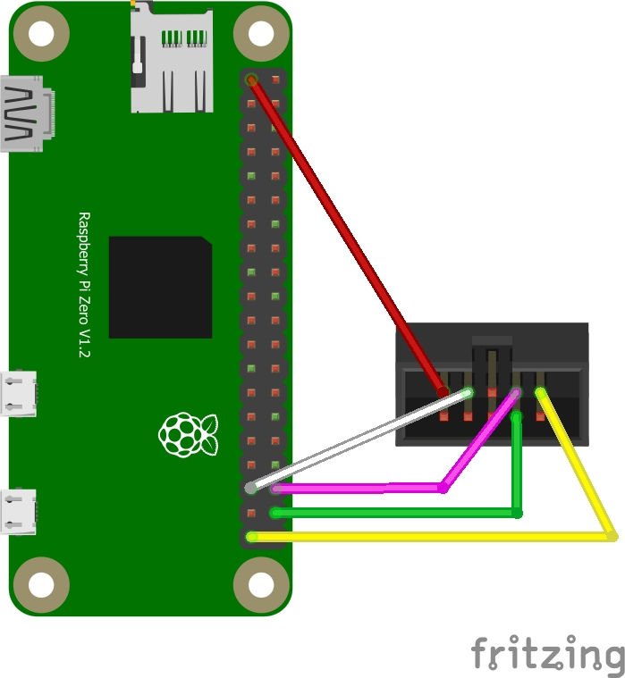
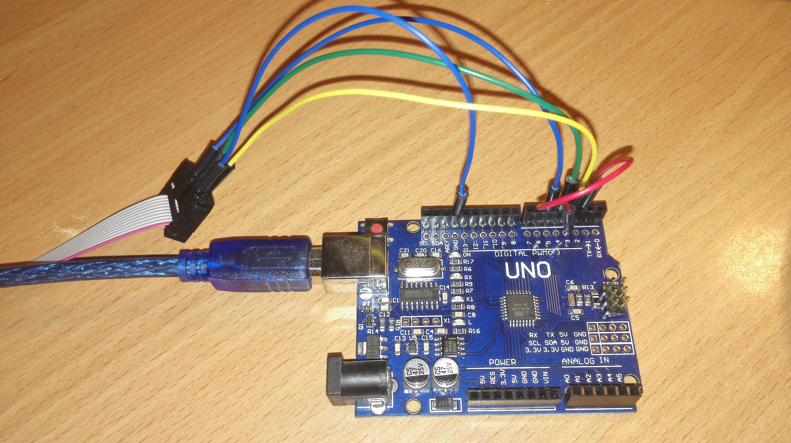
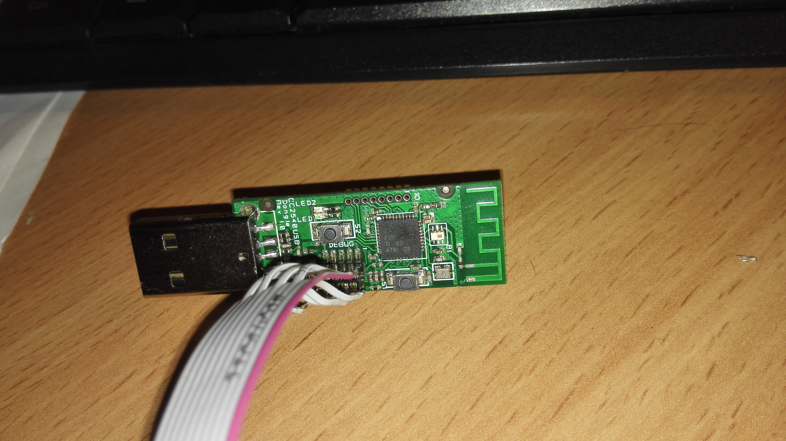
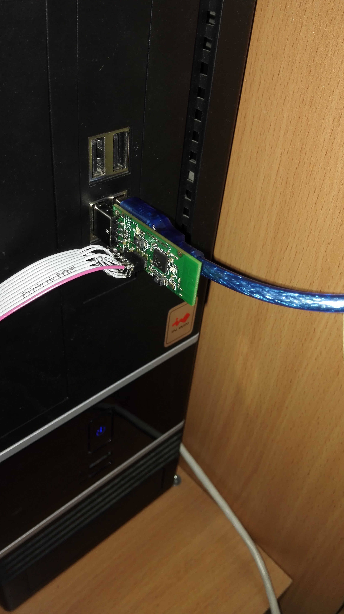

---
---

# Alternative flashing methods

-   [Raspberry pi](#raspberry_pi)
-   [Arduino/ESP8266 + CCLoader](#arduino_ccloader)
-   [Arduino/ESP8266 + CCLib](#arduino_cclib)
-   [Drag-and-Drop with RP2040](#rp2040_dragndrop)

---

### <a name=raspberry_pi></a> With Raspberry Pi (~3min)

1. Install [wiringPi](https://github.com/WiringPi/WiringPi/releases), if not already installed.

2. Install [flash_cc2531](https://github.com/jmichault/flash_cc2531) :

```bash
git clone https://github.com/jmichault/flash_cc2531.git
```

3. Connect the following pins of the debug port to the GPIO port :

-   pin 1 (GND) --> pin 39 (GND)
-   pin 7 (reset) --> pin 35 (GPIO24, BCM19)
-   pin 3 (DC) --> pin 36 (GPIO27, BCM16)
-   pin 4 (DD) --> pin 38 (GPIO28, BCM20)

  

Optionally, connecting Target Voltage Sense to a 3.3v source (Red wire) eliminates the need to plug the device into a usb port, so optionally connect the following too:

-   pin 2 (Target Voltage Sense) --> pin 1 or pin 17 (3.3v) on Raspi

See above for the dispositions of pins on CC2531, and at [https://pinout.xyz/](https://pinout.xyz/) for pins on Raspberry.

A downloader cable CC2531  and 4 Dupont line Female to Female are perfect for this purpose. If you don't want to buy a downloader cable, you need to bend the debug pins outwards to be able to connect your Dupont cables since the pins are too close together to connect the Dupont cables directly.

Now insert the usb dongle in an USB port :

 

4. Test by running :

```bash
cd flash_cc2531
./cc_chipid
```

it should return :

```
  ID = b524.
```

If you see 0000 or ffff, something is wrong and you should probably check your wiring.

5. Download and extract the latest firmware [CC2531_DEFAULT_20211115.zip](https://github.com/Koenkk/Z-Stack-firmware/raw/Z-Stack_Home_1.2_20211115/20211116/coordinator/Z-Stack_Home_1.2/bin/default/CC2531_DEFAULT_20211115.zip).

```bash
cd ~/flash_cc2531       #assuming you git-cloned the program to your home directory
wget https://github.com/Koenkk/Z-Stack-firmware/raw/Z-Stack_Home_1.2_20211115/20211116/coordinator/Z-Stack_Home_1.2/bin/default/CC2531_DEFAULT_20211115.zip
unzip CC2531_DEFAULT_20211115.zip
```

6. Erase and flash the CC2531 :

```bash
./cc_erase
./cc_write CC2531ZNP-Prod.hex
```

It takes around 3 minutes.

### <a name=arduino_ccloader></a>Via Arduino Uno/ESP8266 with CCLoader (~3min)

**This has been tested with a Genuine Arduino Uno, an Arduino Pro Micro - China clone, and a NodeMCU ESP8266 and is significantly faster than CCLib**

#### Prepare the firmware

1. Download the correct firmware (in this example we'll be using the [CC2531 firmware](https://github.com/Koenkk/Z-Stack-firmware/blob/master/coordinator/Z-Stack_Home_1.2/bin/))
1. Unpack firmware and convert the hex file to binary using `objcopy` (do not use the included binary file!)

    **_Windows_**: download `objcopy.exe` as per [this](https://stackoverflow.com/questions/11054534/how-to-use-install-gnu-binutils-objdump) answer from StackOverflow.

    ```
    objcopy.exe --gap-fill 0xFF --pad-to 0x040000 -I ihex CC2531ZNP-Prod.hex -O binary CC2531ZNP-Prod.bin
    ```

    **Linux or Bash on Ubuntu on Windows**: install the `binutils` package using your package manager

    ```bash
    objcopy --gap-fill 0xFF --pad-to 0x040000 -I ihex CC2531ZNP-Prod.hex -O binary /tmp/CC2531ZNP-Prod.bin
    ```

#### Prepare CCLoader

1. Download and unpack [CCLoader](https://github.com/RedBearLab/CCLoader)
1. On Windows you can use the precompiled `CCloader.exe`
1. On Linux you have to compile `CCLoader` yourself so change directory to `CCLoader/SourceCode/Linux`, and run
    ```bash
    gcc main.c -o CCLoader
    ```

#### Flashing the Arduino or ESP8266 and the CC2531 device

1. For Arduino, leave the pins set as default in 'Arduino\CCLoader\CCLoader.ino' (lines 86-90):

```
// Debug control pins & the indicate LED
int DD = 6;
int DC = 5;
int RESET = 4;
int LED = 13;
```

For ESP8266 (NodeMCU or WeMos D1 Mini) edit those pins in 'Arduino\CCLoader\CCLoader.ino' (lines 86-90) to usable pins for the ESP8266, these worked for me (note that the number is the GPIO number, not the label on the NodeMCU):

```
// Debug control pins & the indicate LED
int DD = 14; //GPIO14=D5 on NodeMCU/WeMos D1 Mini
int DC = 4; //GPIO4=D2 on NodeMCU/WeMos D1 Mini
int RESET = 5; //GPIO5=D1 on NodeMCU/WeMos D1 Mini
int LED = 2; //GPIO2=D4 and the Blue LED on the WeMos D1 Mini and the ESP-12E module on the NodeMCU, or can use GPIO16=D0 for the other Blue LED on NodeMCU
```

1. Flash Arduino Uno or ESP8266 board with `Arduino\CCLoader\CCLoader.ino` (For NodeMCU on Windows: install [the Arduino IDE](https://www.arduino.cc/en/main/software), then in Preferences, add the following URL to the Additional Boards Manager URL field: http://arduino.esp8266.com/stable/package_esp8266com_index.json , then go to the Boards Manager and install the esp8266 package, then set the board to "NodeMCU 1.0 (ESP-12E module)" or if you are using a WeMos D1 Mini set it to "LOLIN(WEMOS) D1 R2 & Mini", then set Port to the correct COM port (it was COM3 for me with a NodeMCU), then Upload the sketch.)
1. Note the COM port number or device name as this will be used later
1. Connect Arduino pins as described below to the debug header of the CC device

    | Arduino | CC Pin | CC Name          |
    | ------- | ------ | ---------------- |
    | GND     | 1      | GND              |
    | D4      | 7      | RESETn           |
    | D5      | 3      | DC (Debug Clock) |
    | D6      | 4      | DD (Debug Data)  |

  

If you have a 3.3V Arduino you can optionally connect `3.3V -> Target Voltage Sense (Pin 2)` and program the CC2531 without connecting the CC2531 to USB (in the next step).

Connect the ESP8266 pins as described below to the debug header of the CC device

| ESP8266   | CC Pin | CC Name          |
| --------- | ------ | ---------------- |
| GND       | 1      | GND              |
| D1/GPIO5  | 7      | RESETn           |
| D2/GPIO4  | 3      | DC (Debug Clock) |
| D5/GPIO14 | 4      | DD (Debug Data)  |

1. Connect Arduino/ESP8266 first, then within a couple seconds connect the CC2531 to USB power
1. Place the prepared `CC2531ZNP-Prod.bin` next to the executable file
1. Start the flashing process

    **Windows**

    ```
    CCLoader_x86_64.exe [Number of the COM port] CC2531ZNP-Prod.bin 0
    ```

    _Example:_ Arduino UNO on COM7

    ```
    CCLoader_x86_64.exe 7 CC2531ZNP-Prod.bin 0
    ```

    **Linux**

    ```
    ./CCLoader [Name of the USB device] CC2531ZNP-Prod.bin 0
    ```

    _Example:_ Arduino Uno on `/dev/ttyACM0`

    ```
    ./CCLoader /dev/ttyACM0 CC2531ZNP-Prod.bin 0
    ```

It should be done in a few minutes.

If burning fails/gets stuck at `Request sent already! Waiting for respond...` - try again, check your wiring, try using `1` instead of `0` as the last parameter. Or try run command with `sudo`.

### <a name=arduino_cclib></a> Via Arduino/ESP8266 with CCLib (~3hrs)

Flashing firmware via Arduino is implemented using the project https://github.com/wavesoft/CCLib
**But with minor improvements!!!**

[AndrewLinden](https://github.com/AndrewLinden) described that he was able to flash CC2531 using CCLib [with comments](https://github.com/wavesoft/CCLib/issues/19).

As described [I made a fork of the CCLib library with minor changes](https://github.com/kirovilya/CCLib) for flashing firmware via Arduino:

-   Timeouts of operations
-   After opening the port (I have in Windows 7) Arduino reboots and, accordingly, does not respond to requests - made a 3 seconds pause (found somewhere in internet).
-   The port speed is reduced to 9600, because at another speed leaving communication errors:
    `ERROR: Could not read from the serial port!`

Flashing process:

1. Download and unpack the archive with the library https://github.com/kirovilya/CCLib.

2. Flashing Arduino sketch via Arduino IDE
   CCLib\Arduino\CCLib\Examples\CCLib_proxy\CCLib_proxy.ino

**If flashing via esp8266 (wemos d1 mini), you need change connection (p. 5) and Pinout configuration in Arduino/CCLib/Examples/CCLib_proxy/CCLib_proxy.ino:**

```
int CC_RST   = 5;
int CC_DC    = 4;
int CC_DD_I  = 14;
int CC_DD_O  = 12;
```

3. Install Python 2.7 or later (tested with python 2.7.13), if not installed

4. Install pyserial 3.0.1, if not installed
   `pip install -r CCLib\Python\requirements.txt`
   or
   `pip install pyserial==3.0.1`

5. Connect the contacts as described https://github.com/kirovilya/CCLib#1-prepare-your-arduino-board
   **But in my case, I connected completely without resistors, combined the contacts CC_DD_I and CC_DD_O together and connected to the DD pin of the DEBUG connector!**


I connected only 3 specified contacts and GND. During the firmware, the stick and Arduino must be connected to the USB.

  

6. After that, try to get information about the chip - if it works, then the connection is correct (example for COM9 port - Arduino port):

```
C:\Projects\CCLib\Python>python cc_info.py -p COM9
```

::: details Command output

```
INFO: Found a CC2531 chip on COM9

Chip information:
      Chip ID : 0xb524
   Flash size : 256 Kb
    Page size : 2 Kb
    SRAM size : 8 Kb
          USB : Yes

Device information:
 IEEE Address : 00124b0014aa
           PC : 0000

Debug status:
 [ ] CHIP_ERASE_BUSY
 [ ] PCON_IDLE
 [X] CPU_HALTED
 [ ] PM_ACTIVE
 [ ] HALT_STATUS
 [ ] DEBUG_LOCKED
 [X] OSCILLATOR_STABLE
 [ ] STACK_OVERFLOW

Debug config:
 [ ] SOFT_POWER_MODE
 [ ] TIMERS_OFF
 [X] DMA_PAUSE
 [X] TIMER_SUSPEND
```

:::

[Another example of connection on MacOS](https://github.com/wavesoft/CCLib/issues/22#issuecomment-384452424)

7. If everything is successful, download [the firmware](https://github.com/Koenkk/Z-Stack-firmware/blob/master/coordinator/Z-Stack_Home_1.2/bin/).
   Before we flash the firmware we need to make a modification to it. Open the `.hex`
   file in a text editor and **remove the second last line**. Now save the file.

8. Start the flashing firmware (it takes a long time, about 2-3 hours):

```
C:\Projects\ZigBee>python cc_write_flash.py -e -p COM9 --in=CC2531ZNP-Pro-Secure_LinkKeyJoin_mod.hex
```

::: details Command output

```
INFO: Found a CC2531 chip on COM9

Chip information:
      Chip ID : 0xb524
   Flash size : 256 Kb
    Page size : 2 Kb
    SRAM size : 8 Kb
          USB : Yes
Sections in CC2531ZNP-Pro-Secure_LinkKeyJoin_mod.hex:

 Addr.    Size
-------- -------------
 0x0000   8176 B
 0x1ff6   10 B
 0x3fff0   1 B
 0x2000   239616 B

This is going to ERASE and REPROGRAM the chip. Are you sure? <y/N>:  y

Flashing:
 - Chip erase...
 - Flashing 4 memory blocks...
 -> 0x0000 : 8176 bytes
    Progress 100%... OK
 -> 0x1ff6 : 10 bytes
    Progress 100%... OK
 -> 0x3fff0 : 1 bytes
    Progress 100%... OK
 -> 0x2000 : 239616 bytes
    Progress 100%... OK

Completed
```

:::

### <a name=rp2040_dragndrop></a> Via RP2040 board with [pico_cc_flasher](https://github.com/stolen/pico_cc_flasher) (~3 min)

This method does not need a specialized programmer software. Flashing is as easy as drag-and-drop to a USB drive.

#### Prepare the firmware

1. Download the correct firmware (in this example we'll be using the [CC2531 firmware](https://github.com/Koenkk/Z-Stack-firmware/blob/master/coordinator/Z-Stack_Home_1.2/bin/))
1. Unpack firmware and convert the hex file to binary using `objcopy` (do not use the included binary file!)

    **_Windows_**: download `objcopy.exe` as per [this](https://stackoverflow.com/questions/11054534/how-to-use-install-gnu-binutils-objdump) answer from StackOverflow.

    ```
    objcopy.exe --gap-fill 0xFF --pad-to 0x040000 -I ihex CC2531ZNP-Prod.hex -O binary CC2531ZNP-Prod.bin
    ```

    **Linux or Bash on Ubuntu on Windows**: install the `binutils` package using your package manager

    ```bash
    objcopy --gap-fill 0xFF --pad-to 0x040000 -I ihex CC2531ZNP-Prod.hex -O binary /tmp/CC2531ZNP-Prod.bin
    ```

#### Flash your RP2040

I use Waveshare's RP2040-Zero, but on other boards the only difficulty should be no visual indication.

-   Automated installation
    -   clone repo `git clone https://github.com/stolen/pico_cc_flasher.git && cd pico_cc_flasher`
    -   Connect your RP2040 board in bootloader mode to your PC
    -   run `make install`
-   Manual installation
    -   Install [CircuitPython](https://circuitpython.org/downloads)
    -   Unzip [release zip](https://github.com/stolen/pico_cc_flasher/releases/latest/download/pico_cc_flasher.zip) into a CircuitPython USB drive

#### Connect RP2040 to CC2531 dongle

  
Connect some pins to your CC2531 stick

-   `GND   ->    GND`
-   `GP27  ->    DD`
-   `GP28  ->    DC`
-   `GP29  ->   nRST`

#### Connect RP2040 to PC and dongle to any power source

When pico_cc_flasher sees a chip, it reads chip firmware. This may take about a minute.  
Then it restarts and you can browse to `cc25xx` directory:

-   `data.read.bin` is the flash dump
-   Drop any `*.bin` file (except `data.read.bin`) into this directory to flash it
-   Remove `control.skip_flash_read` file to re-read flash

 
