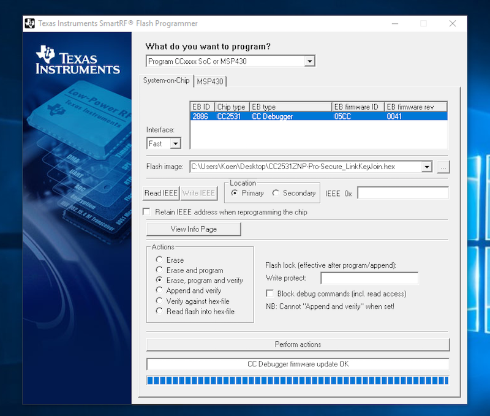

---
---

# Flashing the CC2531 USB stick

The firmware can be flashed with multiple devices. The easiest but most expensive option is with the _CC Debugger_ from Texas Instruments, which is described on this page. However, you can also use a _Raspberry Pi_ or a MCU like the _Arduino Uno_ or the cheap _ESP8266_ with four dupont cables and optionally a downloader cable. Information about these methods can be found here: [Alternative firmware flashing methods](./alternative_flashing_methods.md).

**NOTE 1**: In case you are already running a Zigbee network: reflashing does not require repairing of all devices, see [What does and does not require repairing of all devices?](../../faq/README.md#what-does-and-does-not-require-repairing-of-all-devices)

**NOTE 2**: In this tutorial we will flash the default firmware. For larger network (20+) or when experiencing stability problems the [source routing firmware](https://github.com/Koenkk/Z-Stack-firmware/tree/master/coordinator/Z-Stack_Home_1.2/bin/source_routing) is recommended. This firmware has a limitation of 5 direct children so make sure to have enough routers in your network.

**NOTE 3**: The CC2531 USB dongle can be flashed also with the [CC2530 firmware](https://github.com/Koenkk/Z-Stack-firmware/tree/master/coordinator/Z-Stack_Home_1.2/bin/default) to be operated via the P0.2/P0.3 serial pins (which are the first one and the second one of the IO expansion port). Be careful when using the CC2531 in association with an ESP8266 (as if it were the [CC2530](./connecting_cc2530.md#via-an-esp8266)): the onboard USB power supply may not be able to power an additional ESP8266 without overheating/failing.

## Required hardware

The following additional hardware is required in order to flash the CC2531:

| Name                    | Price              | Picture                                                          |
| ----------------------- | ------------------ | ---------------------------------------------------------------- |
| CC debugger             | +-9$ on AliExpress |                   |
| CC2531 downloader cable | +-2$ on AliExpress |  |

## Windows

1. Install [SmartRF Flash programmer](http://www.ti.com/tool/flash-programmer) (**NOT V2**). This software is free but requires a Texas Instruments account in order to download.
2. Install the [CC debugger driver](https://www.ti.com/tool/CC-DEBUGGER) on your PC (Windows only). Before continuing, verify that the CC Debugger driver has been installed correctly. See [Figure 1. Verify Correct Driver Installation @ Chapter 5.1](http://www.ti.com/lit/ug/swru197h/swru197h.pdf). In case the CC Debugger is not recognized correctly [install the driver manually](https://www.youtube.com/watch?v=jyKrxxXOvQY).
3. Connect `CC debugger --> Downloader cable CC2531 --> CC2531 USB sniffer`.
4. Connect **BOTH** the `CC2531 USB sniffer` and the `CC debugger` to your PC using USB.
5. If the light on the CC debugger is RED press set reset button on the CC debugger. The light on the CC debugger should now turn GREEN. If not use [CC debugger user guide](http://www.ti.com/lit/ug/swru197h/swru197h.pdf) to troubleshoot your problem.
   
6. Download the firmware [CC2531_DEFAULT_20211115.zip](https://github.com/Koenkk/Z-Stack-firmware/raw/Z-Stack_Home_1.2_20211115/20211116/coordinator/Z-Stack_Home_1.2/bin/default/CC2531_DEFAULT_20211115.zip)
7. Start SmartRF Flash Programmer, setup as shown below and press `Perform actions`. Make sure to select the `.hex` file, not the `.bin` file!
   

## Linux or MacOS

Credits to [@Frans-Willem](https://github.com/frans-Willem) for majority of instructions.

1. Install prerequisites for [CC-Tool](https://github.com/dashesy/cc-tool) using a package manager (e.g. [Homebrew](https://brew.sh/) for macOS)

-   Ubuntu (version >= 20.04): install cc-tool with `sudo apt install cc-tool` & go on with 3.
-   Ubuntu/Debian: libusb-1.0-0-dev, libboost-all-dev, autoconf, libtool
-   Fedora: dh-autoreconf, boost-devel, libusb1-devel, gcc-c++
-   Archlinux: dh-autoreconf, libusb, boost
-   macOS: `brew install autoconf automake libusb boost pkgconfig libtool`
-   Raspbian: dh-autoreconf, libusb-1.0-0-dev, libboost-all-dev

2. Build cc-tool

-   Linux:

```bash

git clone https://github.com/dashesy/cc-tool.git
cd cc-tool

CPPFLAGS="-I/usr/local/include" \
LDFLAGS="-I/usr/local/include" \
 ./bootstrap

CPPFLAGS="-I/usr/local/opt/boost@1.76/include" \
CXXFLAGS="-std=c++0x" \
LDFLAGS="-L/usr/local/opt/boost@1.76/lib" \
LIBUSB_CFLAGS="-I/usr/local/include/libusb-1.0" \
 ./configure

make
```

-   macOS:

```bash

git clone https://github.com/dashesy/cc-tool.git
cd cc-tool

CPPFLAGS="-I/opt/homebrew/include" \
LDFLAGS="-I/opt/homebrew/include" \
 ./bootstrap

CPPFLAGS="-I/opt/homebrew/include" \
CXXFLAGS="-std=c++0x" \
LDFLAGS="-L/opt/homebrew/lib" \
LIBUSB_CFLAGS="-I/opt/homebrew/include" \
 ./configure

make
```

3. Connect `CC debugger --> Downloader cable CC2531 --> CC2531 USB sniffer`.
4. Connect **BOTH** the `CC2531 USB sniffer` and the `CC debugger` to your PC using USB.
5. If the light on the CC debugger is RED, press the Reset button on the CC debugger. The light on the CC debugger should now turn GREEN. If not, try to reboot and retry or follow the [CC debugger user guide](http://www.ti.com/lit/ug/swru197h/swru197h.pdf) to troubleshoot your problem.
   
6. Download the firmware [CC2531_DEFAULT_20211115.zip](https://github.com/Koenkk/Z-Stack-firmware/raw/Z-Stack_Home_1.2_20211115/20211116/coordinator/Z-Stack_Home_1.2/bin/default/CC2531_DEFAULT_20211115.zip).
7. Flash your firmware:

```
sudo ./cc-tool -e -w CC2531ZNP-Prod.hex
```

# How-to check the installed firmware version

Zigbee2MQTT will output the installed firmware version to the Zigbee2MQTT log on startup:

```
Zigbee2MQTT:info  2019-11-09T13:01:14: Coordinator firmware version: '{"type":"zStack30x","meta":{"transportrev":2,"product":2,"majorrel":2,"minorrel":7,"maintrel":2,"revision":20190425}}'
```

In the above example the version is `20190425`.
