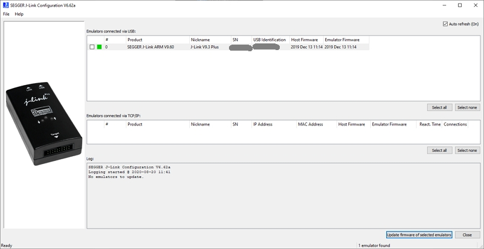
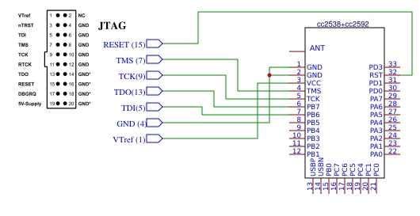
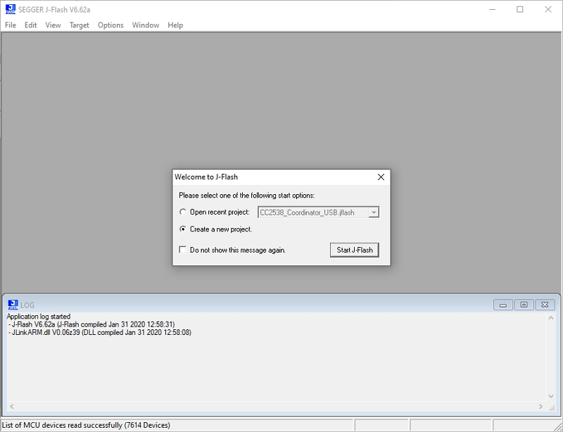
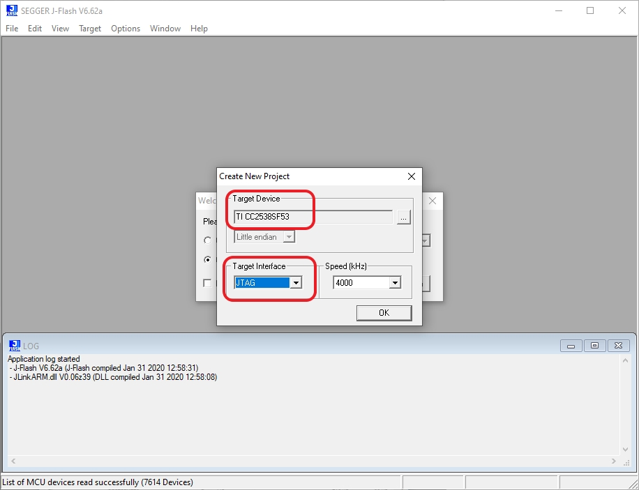
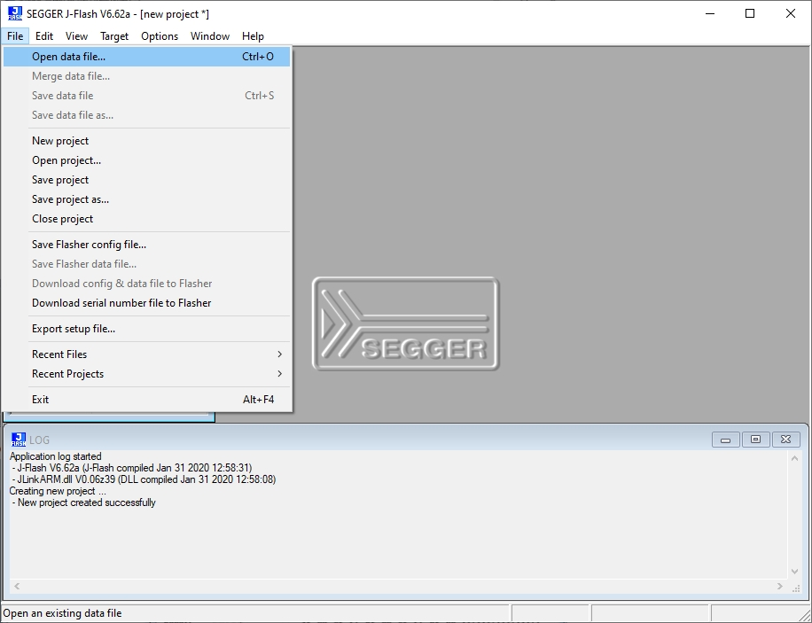
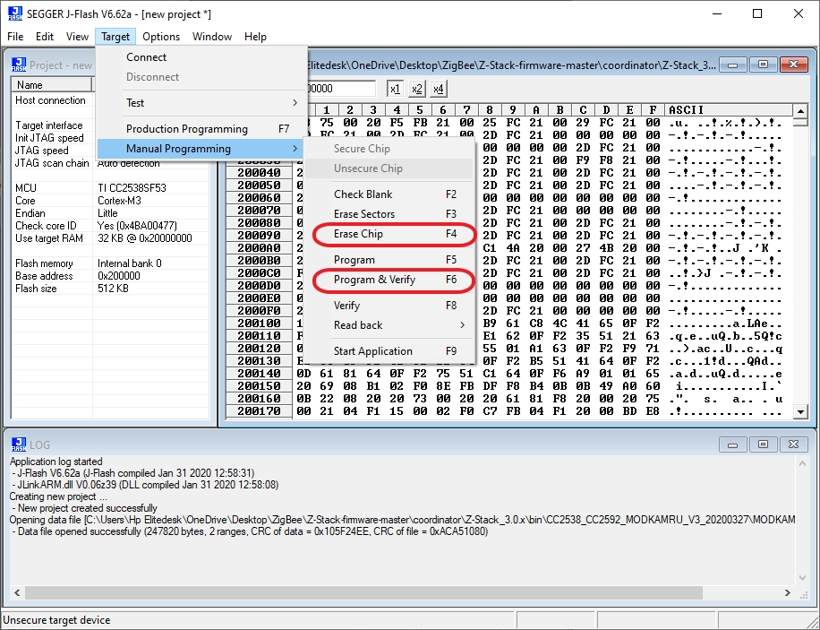

---
---

# Flashing the firmware on the CC2538 MODULE

The CC2538 module needs to be flashed with a custom firmware. This firmware can be flashed with a JTAG programmer.
The programmer can be found on [Aliexpress](https://www.aliexpress.com/wholesale?catId=0&initiative_id=SB_20191108075039&SearchText=jlink+V8+jtag)

## Windows

1. Install SEGGER [J-Link Software](https://www.segger.com/downloads/jlink/)
   
2. Open SEGGER J-Link Configurator and ensure your JTAG has the latest firmware (upgrade it if this is not your case)
   
3. Connect JTAG programmer to CC2538 module following below diagram:
   
4. Download [latest firmware](https://github.com/jethome-ru/zigbee-firmware/tree/master/ti/coordinator/cc2538_cc2592)
5. Open SEGGER J-Link Flash and select "Create a New Project"
   
6. Make sure you select the right module [TI CC2538SF53] and [JTAG] as Target Interface
   
7. Now select "Open Data File..." and select the right firmware [MODKAMRU_V3_USB.hex]
   
8. Now as a final step in order to successfully program the module select first [Target/Manual Programming/Erase Chip] (or press F4) and then [Target/Manual Programming/Program & Verify] (or press F6)
   

# How-to check the installed firmware version

Zigbee2MQTT will output the installed firmware version to the Zigbee2MQTT log on startup:

```
Zigbee2MQTT:info  2019-11-09T13:01:14: Coordinator firmware version: '{"type":"zStack30x","meta":{"transportrev":2,"product":2,"majorrel":2,"minorrel":7,"maintrel":2,"revision":20190425}}'
```

In the above example the version is `20190425`.
