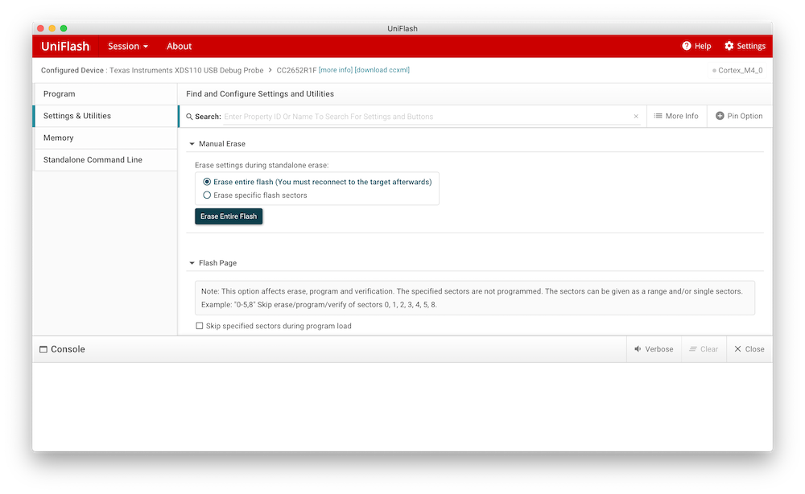
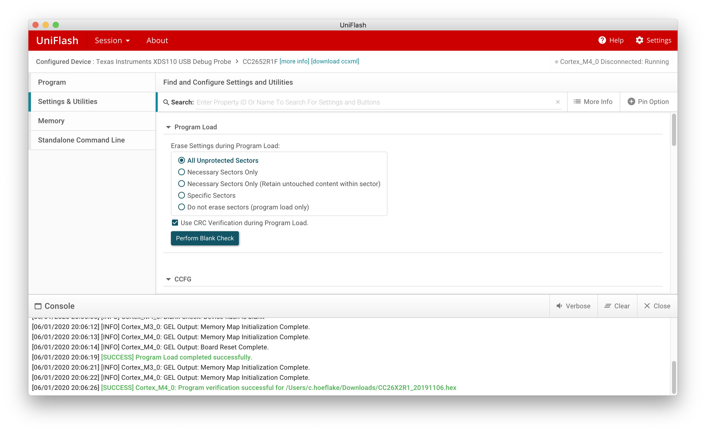
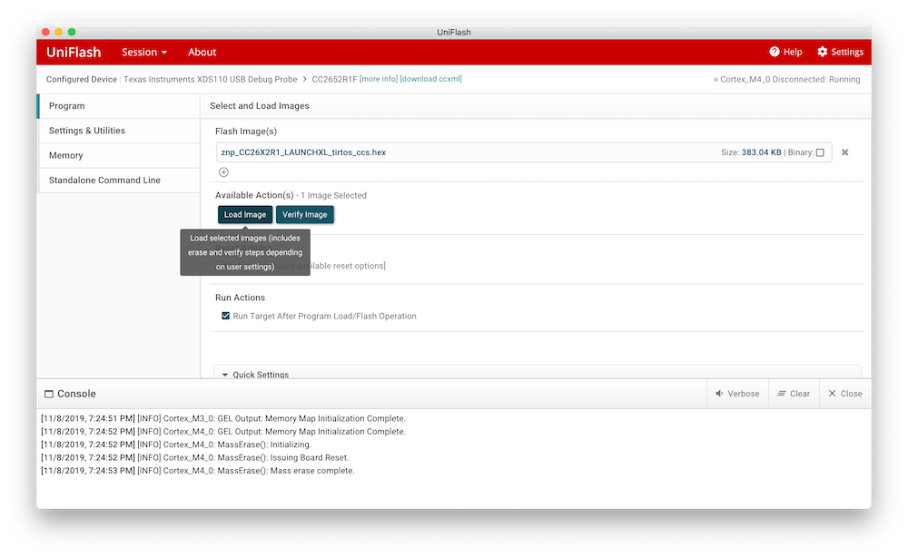

# Flashing via UNIFLASH

UNIFLASH can be used to flash certain Texas Instruments MCUs (e.g. CC26X2R1 and CC1352P-2). It runs on Windows, macOS and Linux.

**n.b.** UNIFLASH sometimes needs to update the programmer firmware, and this can fail if the device is connected to a USB 3 port. If this occurs, switch to a USB 2 port.

**Note for flashing on Linux:** Uniflash does not work well on some distributions. specifically, Fedora 31 may have some issue. Combinations that are verified to be working are:

-   _Ubuntu 18.4 (LTS)_:
    -   fresh install
    -   `# sudo apt install libgconf-2-4`
    -   `# sudo apt install libusb-0.1-4`
    -   ... then follow the instructions below

## Instructions

1. Download and install UNIFLASH: [download link](http://www.ti.com/tool/download/UNIFLASH)
2. Plug your device
3. Start UNIFLASH, your device will automatically be detected, press _Start_
   
4. Go to _Settings & Utilities_ -> _Manual Erase_ and press _Erase Entire Flash_
   
5. Go to _Settings & Utilities_ -> _Program Load_ and select _All Unprotected Sectors_, click _Perform Blank Check_
   
6. Go to _Program_ -> _Flash Image(s)_, press _Browse_ to select the firmware. Ensure that the path and file name do not contain any spaces (otherwise flashing may fail with "Error! Unable to open file ...").
7. Now click _Load image_ to upload the firmware
   
8. Done!
