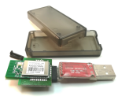

# ZiGate adapters

::: warning ATTENTION

Support for this adapter is **experimental**, not recommended yet for production setups

:::

Initial development started on experimental (alpha stage) support for various ZigGate adapters. This includes all ZiGate compatible hardware adapters which are currently based on NXP Zigbee MCU chips like JN5168 and JN5169 with ZigGate 3.1d firmware or later.

::: warning ATTENTION
Various features are not supported by this adapter, in case you depend on these features, consider a different adapter.

-   [Changing the channel](../configuration/zigbee-network.md#changing-the-zigbee-channel), changing requires re-pairing all devices.
-   Adding [install codes](../../guide/usage/mqtt_topics_and_messages.md#zigbee2mqttbridgerequestinstall_codeadd), which is required to pair some devices.
-   [Backups](../../guide/usage/mqtt_topics_and_messages.md#zigbee2mqttbridgerequestbackup)
-   Inter-PAN, which is required for [touchlink](../../guide/usage/touchlink.md)

:::

::: warning ATTENTION
zigbee-herdsman is looking for maintainers for the ZiGate adapter. See [https://github.com/Koenkk/zigbee-herdsman/issues/1037](https://github.com/Koenkk/zigbee-herdsman/issues/1037)
:::

### Configuration

```yaml
serial:
    adapter: zigate
```

Other supported settings are: `adapter_concurrent` and `transmit_power` ([docs](../configuration/adapter-settings.md)).

## Hardware

-   [Coordinator firmware](https://zigate.fr/tag/firmware/)
-   [Discussion](https://github.com/Koenkk/zigbee-herdsman/issues/242)
-   [Buy](https://zigate.fr/boutique/?orderby=date_desc)


