# zStack adapters (Texas Instruments)

### Configuration

```yaml
serial:
    adapter: zstack
```

Other supported settings are: `disable_led`, `adapter_concurrent` and `transmit_power` ([docs](../configuration/adapter-settings.md)).

### Firmware flashing (CC2652/CC1352)

Adapters based on CC1352 or CC2652 chips can be flashed by putting them in the BSL (bootloader) mode.
See the "Vendor flashing instructions" of your adapter below on how to do this.
Once you've successfully put your adapter into BSL mode, use any of the tools below to flash it.

-   UI tools
    -   [SMLIGHT firmware updater](https://smlight.tech/flasher/#other_cc) (**recommended**)
        -   Allows for flashing your adapter from the browser, eliminating the need for any software installation.
    -   Texas Instruments [FLASH PROGRAMMER 2](https://www.ti.com/tool/FLASH-PROGRAMMER) (Windows only) (can't find your device? read below!)
    -   [ZigStar GW Multi tool](https://github.com/xyzroe/ZigStarGW-MT) (multi platform GUI tool)
-   CLI tools (multi platform Python based command line tools)
    -   [CC2538-BSL](https://github.com/JelmerT/cc2538-bsl) ([instructions](./flashing/flashing_via_cc2538-bsl.md))
    -   [llama-bsl](https://github.com/electrolama/llama-bsl) (fork of cc2538-bsl with added features)
-   Home Assistant addon

    -   [TubesZB TI CC2652 FW Flasher](https://github.com/tube0013/tubeszb_addons)
    -   [ZigStar TI CC2652 FW Flasher](https://github.com/mercenaruss/zigstar_addons) (fork of TubesZB with added features)

-   Some Ethernet adapters support flashing Zigbee firmware over their own web-interface. In this case you do not need any external software and hardware. Just go to the webinterface and press "Update Zigbee firmware". Please refer to the manual of your particular Zigbee adapter for this functionality. For example the universal [XZG Firmware](https://github.com/xyzroe/XZG) that fits any CC1352/CC2652 based gateway ([video](https://github.com/Koenkk/zigbee2mqtt.io/assets/6440415/c2ca1d4c-166a-4bd9-b642-86595da1dcdb))

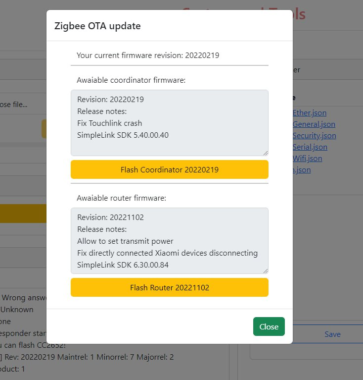

## Recommended (CC2652/CC1352)

### USB

::: details Electrolama zig-a-zig-ah! (zzh!)

USB connected adapter with external antenna based on CC2652R chip

-   [Coordinator firmware](https://github.com/Koenkk/Z-Stack-firmware/releases/download/Z-Stack_3.x.0_coordinator_20240710/CC2652R_coordinator_20240710.zip)
-   [Router firmware](https://github.com/Koenkk/Z-Stack-firmware/raw/Z-Stack_3.x.0_router_20221102/router/Z-Stack_3.x.0/bin/CC2652R_router_20221102.zip)
-   [Vendor flashing instructions](https://electrolama.com/radio-docs/#step-3-flash-the-firmware-on-your-stick)
-   [Buy](https://shop.electrolama.com/collections/usb-rf-sticks/products/zzh-multiprotocol-rf-stick)

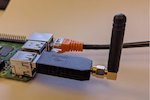
:::

::: details Slaesh's CC2652RB stick

USB connected adapter with external antenna based on CC2652RB chip

-   [Coordinator firmware](https://github.com/Koenkk/Z-Stack-firmware/releases/download/Z-Stack_3.x.0_coordinator_20240710/CC2652RB_coordinator_20240710.zip)
-   [Router firmware](https://github.com/Koenkk/Z-Stack-firmware/raw/Z-Stack_3.x.0_router_20221102/router/Z-Stack_3.x.0/bin/CC2652RB_router_20221102.zip)
-   [Vendor flashing instructions](https://slae.sh/projects/cc2652/#flashing)
-   [Buy](https://slae.sh/projects/cc2652/)

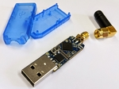
:::

::: details Tube's CC2652P2 USB Coordinator

Open source hardware CC2652P based USB connected adapter with external antenna and USB extension cable

-   [Coordinator firmware](https://github.com/Koenkk/Z-Stack-firmware/releases/download/Z-Stack_3.x.0_coordinator_20240710/CC1352P2_CC2652P_launchpad_coordinator_20240710.zip)
-   [Router firmware](https://github.com/Koenkk/Z-Stack-firmware/raw/Z-Stack_3.x.0_router_20221102/router/Z-Stack_3.x.0/bin/CC1352P2_CC2652P_launchpad_router_20221102.zip)
-   [Vendor flashing instructions](https://github.com/tube0013/tube_gateways)
-   [Buy](https://www.tubeszb.com/)

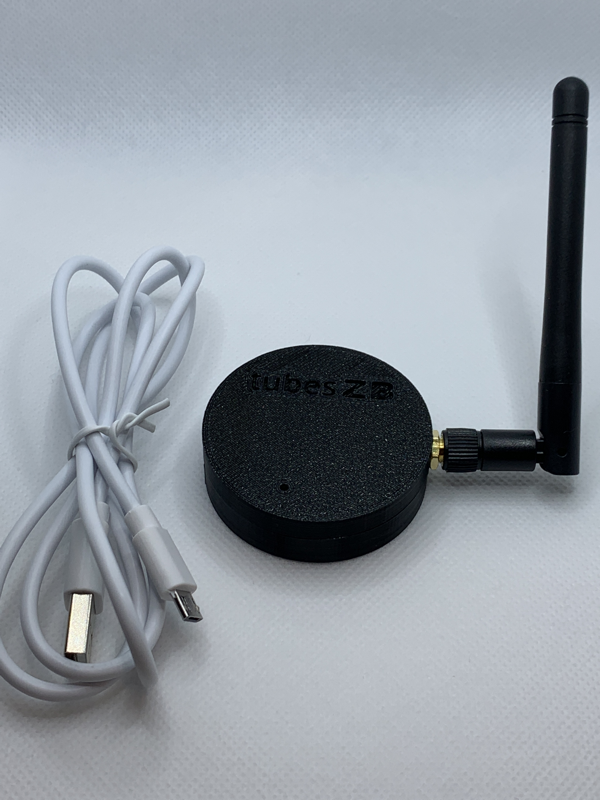
:::

::: details Egony Stick V4

Powerful CC2652P Zigbee USB dongle and Raspberry Pi GPIO module. Available in Ebyte (left picture) and RFSTAR (right picture) version.

-   Coordinator firmware: [Ebyte](https://github.com/Koenkk/Z-Stack-firmware/releases/download/Z-Stack_3.x.0_coordinator_20240710/CC1352P2_CC2652P_other_coordinator_20240710.zip) [RFSTAR](https://github.com/Koenkk/Z-Stack-firmware/releases/download/Z-Stack_3.x.0_coordinator_20240710/CC1352P2_CC2652P_launchpad_coordinator_20240710.zip)
-   Router firmware: [Ebyte](https://github.com/Koenkk/Z-Stack-firmware/raw/Z-Stack_3.x.0_router_20221102/router/Z-Stack_3.x.0/bin/CC1352P2_CC2652P_other_router_20221102.zip) [RFSTAR](https://github.com/Koenkk/Z-Stack-firmware/raw/Z-Stack_3.x.0_router_20221102/router/Z-Stack_3.x.0/bin/CC1352P2_CC2652P_launchpad_router_20221102.zip)
-   [Vendor flashing instructions](https://github.com/egony/cc2652p_E72-2G4M20S1E/wiki/Flashing-EN)
-   Description: [Ebyte](https://github.com/egony/cc2652p_E72-2G4M20S1E/wiki/Home-EN) [RFSTAR](https://github.com/egony/cc2652p_cc1352p_RF-STAR/wiki/Home-EN)
-   [Contact](http://t.me/Egony)

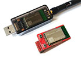 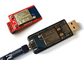

:::

::: details ZigStar Stick v4

Powerful Open source dongle with external antenna based on CC2652P

-   [Coordinator firmware](https://github.com/Koenkk/Z-Stack-firmware/releases/download/Z-Stack_3.x.0_coordinator_20240710/CC1352P2_CC2652P_launchpad_coordinator_20240710.zip)
-   [Router firmware](https://github.com/Koenkk/Z-Stack-firmware/raw/Z-Stack_3.x.0_router_20221102/router/Z-Stack_3.x.0/bin/CC1352P2_CC2652P_launchpad_router_20221102.zip)
-   [Description](https://zig-star.com/projects/zigbee-stick-v4/)
-   [Vendor flashing instructions](https://zig-star.com/radio-docs/flash-cc-bsl/)
-   [Buy](https://zig-star.com)

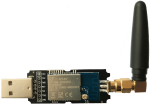
:::

::: details CircuitSetup's CC2652P2 USB Coordinator

CC2652P based USB connected adapter pre-programmed with Z-Stack

-   [Coordinator firmware](https://github.com/Koenkk/Z-Stack-firmware/releases/download/Z-Stack_3.x.0_coordinator_20240710/CC1352P2_CC2652P_launchpad_coordinator_20240710.zip)
-   [Router firmware](https://github.com/Koenkk/Z-Stack-firmware/raw/Z-Stack_3.x.0_router_20221102/router/Z-Stack_3.x.0/bin/CC1352P2_CC2652P_launchpad_router_20221102.zip)
-   [Vendor flashing instructions](https://circuitsetup.us/product/usb-zigbee-stick-z-stack-coordinator/)
-   [Buy](https://circuitsetup.us/product/usb-zigbee-stick-z-stack-coordinator/)

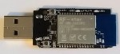
:::

::: details SMLIGHT CC2652P Zigbee USB Adapter SLZB-02

CC2652P factory-made Zigbee USB coordinator with external 6dB antenna and worldwide delivery

-   [Coordinator firmware](https://github.com/Koenkk/Z-Stack-firmware/releases/download/Z-Stack_3.x.0_coordinator_20240710/CC1352P2_CC2652P_other_coordinator_20240710.zip)
-   [Router firmware](https://github.com/Koenkk/Z-Stack-firmware/raw/Z-Stack_3.x.0_router_20221102/router/Z-Stack_3.x.0/bin/CC1352P2_CC2652P_other_router_20221102.zip)
-   [Description](https://smartlight.me/smart-home-devices/zigbee-devices/zigbee-coordinator-v4-cc2652p)
-   [Vendor flashing instructions](https://smartlight.me/flashing_slzb-02)
-   Buy: [Official store](https://smartlight.me/smart-home-devices/zigbee-devices/zigbee-coordinator-v4-cc2652p), [Tindie](https://www.tindie.com/products/smartlightme/zigbee-cc2652p-coordinator-dongle-stick-adapter/)

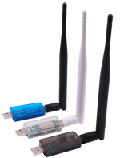
:::

::: details SONOFF Zigbee 3.0 USB Dongle Plus ZBDongle-P

CC2652P based USB connected adapter pre-programmed and with enclosure.

Note before buying that ITead slightly confusingly now sells both the Dongle Plus "ZBDongle-P" (based on CC2652P), and the Dongle Plus V2 "ZBDongle-E" (based on EFR32MG21).
This section is about the "ZBDongle-P", for "ZBDongle-E" see below.

-   [Coordinator firmware](https://github.com/Koenkk/Z-Stack-firmware/releases/download/Z-Stack_3.x.0_coordinator_20240710/CC1352P2_CC2652P_launchpad_coordinator_20240710.zip)
-   [Router firmware](https://github.com/Koenkk/Z-Stack-firmware/raw/Z-Stack_3.x.0_router_20221102/router/Z-Stack_3.x.0/bin/CC1352P2_CC2652P_launchpad_router_20221102.zip)
-   [Vendor flashing instructions](https://sonoff.tech/wp-content/uploads/2021/09/Zigbee-3.0-USB-dongle-plus-firmware-flashing-1-1.docx) ([PDF version](https://github.com/Koenkk/zigbee2mqtt.io/raw/master/docs/guide/adapters/flashing/zigbee-3.0-usb-dongle-plus-firmware_flashing-1-1.pdf) and [required python script](https://github.com/Koenkk/zigbee2mqtt.io/raw/master/docs/guide/adapters/flashing/zigbee-3.0-usb-dongle-plus-uartLog.zip))
-   [Buy](https://itead.cc/product/sonoff-zigbee-3-0-usb-dongle-plus/)

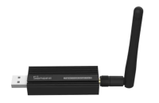
:::

::: details Vision CC2652 dongle

Adapter or small development board based on CC2652R (VS201) or CC2652P (VS202)  
Coordinator firmware: [VS201](https://github.com/Koenkk/Z-Stack-firmware/releases/download/Z-Stack_3.x.0_coordinator_20240710/CC2652R_coordinator_20240710.zip) [VS202](https://github.com/Koenkk/Z-Stack-firmware/releases/download/Z-Stack_3.x.0_coordinator_20240710/CC1352P2_CC2652P_launchpad_coordinator_20240710.zip)  
Router firmware: [VS201](https://github.com/Koenkk/Z-Stack-firmware/raw/Z-Stack_3.x.0_router_20221102/router/Z-Stack_3.x.0/bin/CC2652R_router_20221102.zip) [VS202](https://github.com/Koenkk/Z-Stack-firmware/raw/Z-Stack_3.x.0_router_20221102/router/Z-Stack_3.x.0/bin/CC1352P2_CC2652P_launchpad_router_20221102.zip)

-   [Vendor flashing instructions](https://www.aliexpress.com/item/1005002823262979.html?spm=a2g0o.productlist.0.0.1a1640b82yeViq&algo_pvid=e01b1872-ca85-4814-971f-ce9b058855b8&algo_exp_id=e01b1872-ca85-4814-971f-ce9b058855b8-0&pdp_ext_f=%7B%22sku_id%22%3A%2212000022351543786%22%7D)
-   Buy: [VS201](https://www.aliexpress.com/item/1005002809329614.html) [VS202](https://www.aliexpress.com/item/1005003393047763.html)

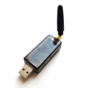
:::

::: details JetHome JetStick Z2/ZB6UX CC2652P1

Powerful CC2652P1 factory-made Zigbee USB dongle with external antenna.

-   [Documentation](https://docs.jethome.ru/en/zigbee/sticks/jetstick_z2.html)
-   [Vendor flashing instructions](https://docs.jethome.ru/en/zigbee/howto/cc_2538_bsl.html#zigbee-howto-2538-bsl)
-   [Firmware](https://docs.jethome.ru/en/zigbee/software/ti_cc2652p.html#zigbee-software-ti-cc2652p)
-   Buy: [JetStick Z2](https://jethome.ru/z2/)

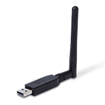
:::

::: details SMLIGHT SLZB-07p7 Zigbee USB CC2652P7 adapter

Powerful, tiny modern design, developed for Zigbee2MQTT, pre-flashed and ready to use Zigbee adapter. Autodiscovery in Home Assistant. AutoBSL (remote update) enabled.  
Rich packing that includes:
| Package includes | SLZB-07p7 adapter | +3dB antenna 360° | QR-manual |
|:-|:-:|:-:|:-:|
|Quantity: |1 pcs|1 pcs|1 pcs|1 pcs|  
|Image|  |  |  |

Remote Zigbee update, autodiscovery, LEDs, and flashing pins. It fits home and business use.

-   Zigbee firmware:  
    --[Coordinator firmware](https://github.com/Koenkk/Z-Stack-firmware/releases/download/Z-Stack_3.x.0_coordinator_20240710/CC1352P7_coordinator_20240710.zip).
-   [Product page](https://smlight.tech/product/slzb-07p7/).
-   Buy: [Official Store - Worldwide](https://smartlight.me/smart-home-devices/zigbee-devices/coordinator-slzb-07p7), [Aliexpress - Worldwide](https://www.aliexpress.com/item/1005006273914143.html).  
    Local fast delivery: [Australia](https://shop.dialedin.com.au/products/smlight-slzb-07p7-usb-zigbee-adapter), [France](https://www.domadoo.fr/fr/interface-domotique/7045-smlight-dongle-usb-zigbee-cc2652p7-soc-antenne-3db-zigbee2mqtt-et-zha.html), [Poland](https://pcblab.io/szukaj?controller=search&s=slzb).

        | Product picture 1 | Product picture 2 | Product picture 3 |
        |:-:|:-:|:-:|
        ||||

:::

### Network (TCP)

::: details Tube's Zigbee Gateways (CC2652P2 variant)

Open source hardware CC2652P and ESP32 based Zigbee to Ethernet Coordinator (left picture), POE variant is also available (right picture)

-   [Coordinator firmware](https://github.com/Koenkk/Z-Stack-firmware/releases/download/Z-Stack_3.x.0_coordinator_20240710/CC1352P2_CC2652P_launchpad_coordinator_20240710.zip)
-   [Router firmware](https://github.com/Koenkk/Z-Stack-firmware/raw/Z-Stack_3.x.0_router_20221102/router/Z-Stack_3.x.0/bin/CC1352P2_CC2652P_launchpad_router_20221102.zip)
-   [Vendor flashing instructions](https://github.com/tube0013/tube_gateways)
-   [Buy](https://www.tubeszb.com/)

 

:::

::: details cyijun OpenZ3Gateway

An open source Zstack3 gateway powered by ESP8266 and CC2652P modules. One costs less than 60 CNY in China.

-   [Coordinator firmware](https://github.com/Koenkk/Z-Stack-firmware/releases/download/Z-Stack_3.x.0_coordinator_20240710/CC1352P2_CC2652P_launchpad_coordinator_20240710.zip)
-   [Router firmware](https://github.com/Koenkk/Z-Stack-firmware/raw/Z-Stack_3.x.0_router_20221102/router/Z-Stack_3.x.0/bin/CC1352P2_CC2652P_launchpad_router_20221102.zip)
-   [Description](https://github.com/cyijun/OpenZ3Gateway)
-   [Tindie](https://www.tindie.com/products/cyijun/openz3gateway/)

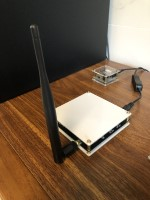
:::

::: details XGG 52PZ2MGateway

An open source Zstack3 gateway powered by ESP8266 and CC2652P modules. One costs less than 60 CNY in China.

-   [Coordinator firmware](https://github.com/Koenkk/Z-Stack-firmware/releases/download/Z-Stack_3.x.0_coordinator_20240710/CC1352P2_CC2652P_launchpad_coordinator_20240710.zip)
-   [Router firmware](https://github.com/Koenkk/Z-Stack-firmware/raw/Z-Stack_3.x.0_router_20221102/router/Z-Stack_3.x.0/bin/CC1352P2_CC2652P_launchpad_router_20221102.zip)
-   [Description](https://shop68536829.taobao.com/)
-   [Buy](https://shop68536829.taobao.com/)

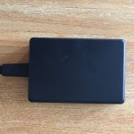
:::

::: details SMLIGHT Zigbee LAN Adapter CC2652P Model SLZB-05

Pre-flashed ready-to-use Zigbee LAN CC2652P Adapter, factory made, metal case, 6dB antenna, worldwide delivery, Zigbee firmware can be manually updated via USB in 5 easy steps, customer/tech support, fast order processing.

-   [Coordinator firmware](https://github.com/Koenkk/Z-Stack-firmware/releases/download/Z-Stack_3.x.0_coordinator_20240710/CC1352P2_CC2652P_other_coordinator_20240710.zip)
-   [Router firmware](https://github.com/Koenkk/Z-Stack-firmware/raw/Z-Stack_3.x.0_router_20221102/router/Z-Stack_3.x.0/bin/CC1352P2_CC2652P_other_router_20221102.zip)
-   [Description](https://smartlight.me/smart-home-devices/zigbee-devices/smlight-zigbee-lan-adapter-slzb-05en)
-   Buy: [eBay](https://www.ebay.com/itm/165178757770) [Official store](https://smartlight.me/smart-home-devices/zigbee-devices/smlight-zigbee-lan-adapter-slzb-05en) [Telegram](https://t.me/smartlightme)


:::

### Hybrid (USB + Network)

::: details Gio-dot Z-Bee Duo with CC2652P

4 in 1 zigbee adapter: USB Stick, WiFi, LAN, PI Zero Hat, with external antenna and 3D printed case.

-   [Description](https://gio-dot.github.io/Z-Bee-Duo/)
-   [Coordinator firmware](https://github.com/Koenkk/Z-Stack-firmware/releases/download/Z-Stack_3.x.0_coordinator_20240710/CC1352P2_CC2652P_other_coordinator_20240710.zip)
-   [Router firmware](https://github.com/Koenkk/Z-Stack-firmware/blob/master/router/Z-Stack_3.x.0/bin/CC1352P2_CC2652P_other_router_20221102.zip)
-   [Vendor flashing instructions](https://gio-dot.github.io/Z-Bee-Duo/Firmware-upgrade)
-   [Buy](https://www.tindie.com/products/gio_dot/z-bee-duo-modular-cc2652p-zigbee-30-adapter/)

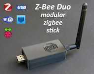
:::

::: details ZigStar LAN Coordinator

Powerful Open source LAN Coordinator with external antenna on CC2652P

-   [Coordinator firmware](https://github.com/Koenkk/Z-Stack-firmware/releases/download/Z-Stack_3.x.0_coordinator_20240710/CC1352P2_CC2652P_launchpad_coordinator_20240710.zip)
-   [Router firmware](https://github.com/Koenkk/Z-Stack-firmware/raw/Z-Stack_3.x.0_router_20221102/router/Z-Stack_3.x.0/bin/CC1352P2_CC2652P_launchpad_router_20221102.zip)
-   [Description](https://zig-star.com/projects/zigbee-gw-lan/)
-   [Vendor flashing instructions](https://zig-star.com/radio-docs/flash-cc-bsl/)
-   [Buy](https://zig-star.com) [Tindie](https://www.tindie.com/products/zigstar/zigstar-lan-gateway/)


:::

::: details ZigStar PoE Coordinator

Open source PoE af Coordinator with external antenna on CC2652P

-   [Coordinator firmware](https://github.com/Koenkk/Z-Stack-firmware/releases/download/Z-Stack_3.x.0_coordinator_20240710/CC1352P2_CC2652P_launchpad_coordinator_20240710.zip)
-   [Router firmware](https://github.com/Koenkk/Z-Stack-firmware/raw/Z-Stack_3.x.0_router_20221102/router/Z-Stack_3.x.0/bin/CC1352P2_CC2652P_launchpad_router_20221102.zip)
-   [Description](https://zig-star.com/projects/zigstar-olizig/)
-   [Vendor flashing instructions](https://zig-star.com/radio-docs/zigstar-multi-tool/)
-   [Buy](https://zig-star.com) [Tindie](https://www.tindie.com/products/zigstar/zigstar-olizig-poe/)

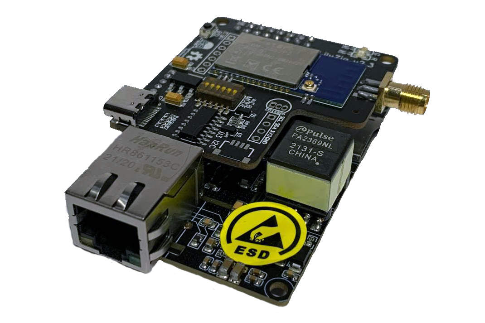
:::

::: details SMLIGHT SLZB-06 Zigbee+Matter/Thread+Bluetooth Ethernet USB POE WiFi LAN adapter

Powerful, tiny modern design, developed for Zigbee2MQTT, PoE supported, pre-flashed and ready to use Zigbee adapter.  
It supports **Zigbee 3.0**, experimental **Matter-over-Thread** and **Bluetooth**. Connections: Ethernet (+PoE), LAN, USB, and WiFi. Rich packing that includes:
| Package includes | SLZB-06 adapter | +5dB antenna 360° | Adhesive tape | Screws | Screwdriver | MicroUSB-Type-C | Screw-fix helper |
|:-|:-:|:-:|:-:|:-:|:-:|:-:|:-:|
|Quantity: |1 pcs|1 pcs|2 pcs|2 pcs|1 pcs|1 pcs|1 pcs|  
|Image|  |  |  |  |  |  |  |

Remote update (Zigbee and Core), modern UI firmware. Optoelectronic isolation for Ethernet, LEDs and physical button for interacting with users. It fits home and business use.

-   Zigbee firmware:  
    -- [Zigbee chip update process OTA](https://smlight.tech/manual/slzb-06/guide/flashing-and-updating/updating-zigbee.html#zigbee-auto-update-over-the-web-interface-recommended) for automatic updates.
    -- [Coordinator firmware](https://github.com/Koenkk/Z-Stack-firmware/releases/download/Z-Stack_3.x.0_coordinator_20240710/CC1352P2_CC2652P_launchpad_coordinator_20240710.zip)
-   Core firmware:  
    -- [Functionality and screenshots](https://smlight.tech/manual/slzb-06/guide/configuration/)  
    -- [Video review 1](https://www.youtube.com/watch?v=WwYVRuVpAJI), [Video review 2](https://www.youtube.com/watch?v=q3cWHQ8CdcA)
-   [Manual](https://smlight.tech/manual/slzb-06/)
-   [Product page](https://smlight.tech/product/slzb-06/)
-   Buy: [Official Store - Worldwide](https://smartlight.me/smart-home-devices/zigbee-devices/smlight-slzb-06en), [Aliexpress - Worldwide](https://www.aliexpress.com/item/1005004942648430.html), [Tindie - Worldwide](https://www.tindie.com/products/smartlightme/smlight-slzb-06-zigbee-ethernet-poe-usb-wifi-adapt/).  
    Local fast delivery: [AU](https://shop.dialedin.com.au/products/smlight-slzb-06-zigbee-adapter), [AT](https://www.hobbyelectronica.nl/product/slzb-06-zigbee-ethernet-poe-usb-adapter/), [BE](https://www.hobbyelectronica.nl/product/slzb-06-zigbee-ethernet-poe-usb-adapter/), [CH](https://shop.swiss-domotique.ch/de/gateways-antennen/2387-smlight-zigbee-ethernet-poe-usb-wifi-adapter-slzb-06.html), [EE](https://improveit.lt/produktas/smlight-slzb-06-zigbee-ethernet-poe-usb-lan-wifi-adapteris/), [FR](https://www.domadoo.fr/fr/box-domotique/7042-smlight-adaptateur-usb-ethernet-poe-zigbee-30-cc2652p-zigbee2mqtt-et-zha.html), [DE](https://www.hobbyelectronica.nl/product/slzb-06-zigbee-ethernet-poe-usb-adapter/), [LT](https://improveit.lt/produktas/smlight-slzb-06-zigbee-ethernet-poe-usb-lan-wifi-adapteris/), [LV](https://improveit.lt/produktas/smlight-slzb-06-zigbee-ethernet-poe-usb-lan-wifi-adapteris/), [PL](https://pcblab.io/slzb-06-adapter-zigbee-cc2652p-ethernet-poe-usb-lan-wifi.html), [TH](https://shopee.co.th/Zigbee-SLZB-06-LAN-POE-USB-WIFI-Hybrid-Coordinator-CC2652P-SMARTLIGHT-SLZB-06-HASS-Zigbee2mqtt-ZHA-CC2652-CC2531-i.25068823.21062349644), [UK](https://zigbeesmart.co.uk/products/zigbee-lan-poe-coordinator-smlight-slzb-06), [US official](https://cloudfree.shop/product/smlight-zigbee-ethernet-adapter/), [US Amazon](https://www.amazon.com/SMLIGHT-SLZB-06-Ethernet-Zigbee2MQTT-Assistant/dp/B0BL6DQSB3).

        | Product picture | Interface screenshot | Youtube review |
        |:-:|:-:|:-:|
        |||[](https://www.youtube.com/watch?v=q3cWHQ8CdcA)|

:::

::: details ZigStar UZG-01 - Universal ZigBee Gateway

Open source PoE af Coordinator with external antenna on CC2652P

-   [ESP32 Firmware](https://github.com/mercenaruss/uzg-firmware) Repository with latest firmware
-   [Coordinator firmware](https://github.com/Koenkk/Z-Stack-firmware/releases/download/Z-Stack_3.x.0_coordinator_20240710/CC1352P7_coordinator_20240710.zip)
-   [Router firmware](https://github.com/Koenkk/Z-Stack-firmware/raw/Z-Stack_3.x.0_router_20221102/router/Z-Stack_3.x.0/bin/)
-   [Official site](https://uzg.zig-star.com) with documentation
-   [Vendor flashing instructions](https://uzg.zig-star.com/flashing-and-updating/)
-   Buy: [Official Store](https://uzg.zig-star.com),[Tindie](https://www.tindie.com/stores/zigstar/),[Elecrow](https://www.elecrow.com/zigstar-uzg-01-universal-zigbee-gateway.html)

|                       ZigStar UZG-01                       |                         Dimensions                         |
| :--------------------------------------------------------: | :--------------------------------------------------------: |
|  |  |

:::

::: details SMLIGHT SLZB-06p7 Zigbee Ethernet USB POE WiFi LAN adapter

Powerful, tiny modern design, developed for Zigbee2MQTT, PoE supported, pre-flashed and ready to use Zigbee adapter.  
It supports Zigbee 3.0, Ethernet, LAN, USB, and WiFi connections. Rich packing that includes:
| Package includes | SLZB-06p7 adapter | +5dB antenna 360° | Adhesive tape | Screws | Screwdriver | MicroUSB-Type-C | Screw-fix helper |
|:-|:-:|:-:|:-:|:-:|:-:|:-:|:-:|
|Quantity: |1 pcs|1 pcs|2 pcs|2 pcs|1 pcs|1 pcs|1 pcs|  
|Image|  |  |  |  |  |  |  |

Remote update (Zigbee and Core), modern UI firmware. Optoelectronic isolation for Ethernet, LEDs and physical button for interacting with users. It fits home and business use.

-   Zigbee firmware:  
    -- [Zigbee chip update process OTA](https://smlight.tech/manual/slzb-06/guide/flashing-and-updating/updating-zigbee.html#zigbee-auto-update-over-the-web-interface-recommended) for automatic updates.  
    -- [Coordinator firmware](https://github.com/Koenkk/Z-Stack-firmware/releases/download/Z-Stack_3.x.0_coordinator_20240710/CC1352P7_coordinator_20240710.zip)
-   Core firmware:  
    -- [Functionality and screenshots](https://smlight.tech/manual/slzb-06/guide/configuration/)  
    -- [Video review](https://www.youtube.com/watch?v=q3cWHQ8CdcA)
-   [Manual](https://smlight.tech/manual/slzb-06/)
-   [Product page](https://smlight.tech/product/slzb-06p7/)
-   Buy: [Official Store - Worldwide](https://smartlight.me/smart-home-devices/zigbee-devices/coordinator-slzb-06p7), [Aliexpress - Worldwide](https://www.aliexpress.com/item/1005004942648430.html).  
    Local fast delivery: [AU](https://shop.dialedin.com.au/products/smlight-slzb-06p7-zigbee-adapter), [AT](https://www.hobbyelectronica.nl/product/slzb-06p7-zigbee-ethernet-poe-usb-adapter/), [BE](https://www.hobbyelectronica.nl/product/slzb-06p7-zigbee-ethernet-poe-usb-adapter/), [DE](https://www.hobbyelectronica.nl/product/slzb-06p7-zigbee-ethernet-poe-usb-adapter/), [PL](https://pcblab.io/slzb-06p7-adapter-zigbee-cc2652p7-ethernet-poe-usb-lan-wifi.html).

        | Product picture | Interface screenshot | Youtube videoreview |
        |:-:|:-:|:-:|
        |||[](https://www.youtube.com/watch?v=q3cWHQ8CdcA)|

:::

::: details cod.m Zigbee Coordinator CC2652P7 (CZC-1.0)

cod.m ZigBee Coordinator (CZC) - Network (LAN/Wi-Fi) with Power over Ethernet (optional) or USB-C.

Features:

-   CC2652P7 Texas Instruments multiprotocol 2.4GHz radio module
-   ZigBee 3.x, Z-Stack firmware (Koenkk)
-   LAN, WLAN or USB mode PoE (802.3af) or USB-C power, <1W power consumption
-   ESP32 open source firmware ([cod.m UZG Fork](https://github.com/codm/czc-firmware/releases))
-   ZigBee firmware update via network and in future via web interface
-   ESP32 firmware update via web interface or USB-C (Auto-BSL)
-   [3D-printed housing (CC-BY-NC-SA)](https://www.printables.com/de/model/857864-codm-zigbee-coordinator-cases-czc-10)
-   Made in Germany, CE, RoHS, WEEE

Links:

-   [ESP32 firmware](https://github.com/codm/czc-firmware/releases)
-   [Coordinator firmware](https://github.com/Koenkk/Z-Stack-firmware/releases/download/Z-Stack_3.x.0_coordinator_20240710/CC1352P7_coordinator_20240710.zip)
-   [Documentation](https://docs.codm.de/en/zigbee/coordinator/)
-   [Buy](https://shop.codm.de/en/automation/zigbee/40/zigbee-coordinator-cc2652p7-PoE)

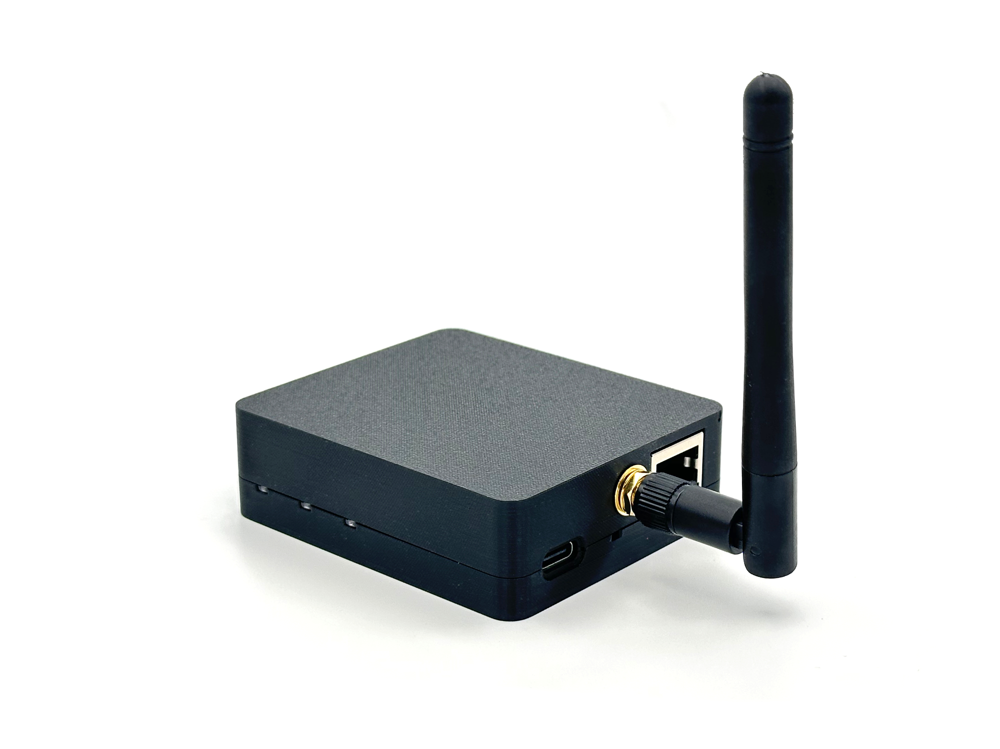 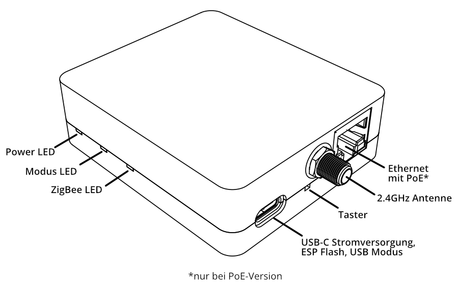

:::

### Hub

::: details JetHome JetHub D1+

Controller with ZigBee module onboard with external antenna.

JetHub D1+ is DIN-rail home automation controller with Ubuntu/Debian OS and a lot of peripherals.

Based on TI CC2652P1.

-   [Documentation](https://docs.jethome.ru/en/controllers/linux/din_rail/d1p.html)
-   [Buy](https://jethome.ru/d1p/)

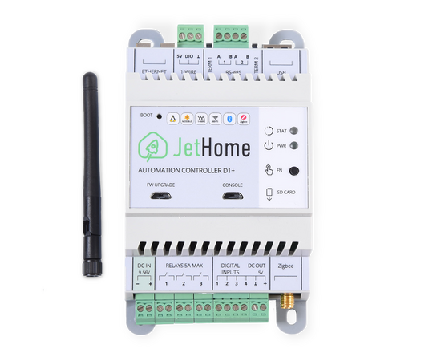
:::

### Custom

::: details cod.m Zigbee CC2652P RPi Module

Raspberry Pi GPIO module with CC2652P and integrated power amplifier (+20dBm)

-   [Coordinator firmware](https://github.com/Koenkk/Z-Stack-firmware/releases/download/Z-Stack_3.x.0_coordinator_20240710/CC1352P2_CC2652P_launchpad_coordinator_20240710.zip)
-   [Router firmware](https://github.com/Koenkk/Z-Stack-firmware/raw/Z-Stack_3.x.0_router_20221102/router/Z-Stack_3.x.0/bin/CC1352P2_CC2652P_launchpad_router_20221102.zip)
-   [Vendor flashing instructions](https://github.com/codm/cc2652-raspberry-pi-module#firmware)
-   [Buy](https://shop.codm.de/automation/zigbee/33/zigbee-cc2652p2-raspberry-pi-module)

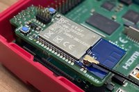
:::

::: details ZigStar ZigiHAT PoE

Powerful Open source Pi HAT based on CC2652P with PoE,RTC onboard

-   [Coordinator firmware](https://github.com/Koenkk/Z-Stack-firmware/releases/download/Z-Stack_3.x.0_coordinator_20240710/CC1352P2_CC2652P_launchpad_coordinator_20240710.zip)
-   [Router firmware](https://github.com/Koenkk/Z-Stack-firmware/raw/Z-Stack_3.x.0_router_20221102/router/Z-Stack_3.x.0/bin/CC1352P2_CC2652P_launchpad_router_20221102.zip)
-   [Description](https://zig-star.com/projects/zigbee-zigihat/)
-   [Vendor flashing instructions](https://zig-star.com/projects/zigbee-zigihat/#flashing)
-   [Buy](https://zig-star.com)

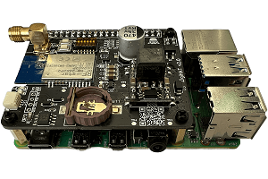
:::

::: details Texas Instruments LAUNCHXL-CC1352P-2

USB connected development kit, based on CC1352P chip  
These devices have two serial devices built in. Make sure you put the right serial device in the [configuration](../configuration/) or use auto detect (completely remove the `serial` section from `configuration.yaml`) if you only have one Texas Instruments CC device connected to your system.  
An external antenna can be connected which could increase range: [requires resoldering a tiny capacitor (moving C14 to C24)](http://e2e.ti.com/support/wireless-connectivity/zigbee-and-thread/f/158/t/880219?LAUNCHXL-CC26X2R1-Antenna-CC26X2R1)

-   [Coordinator firmware](https://github.com/Koenkk/Z-Stack-firmware/releases/download/Z-Stack_3.x.0_coordinator_20240710/CC1352P2_CC2652P_launchpad_coordinator_20240710.zip)
-   [Router firmware](https://github.com/Koenkk/Z-Stack-firmware/raw/Z-Stack_3.x.0_router_20221102/router/Z-Stack_3.x.0/bin/CC1352P2_CC2652P_launchpad_router_20221102.zip)
-   [Vendor flashing instructions](./flashing/flashing_via_uniflash.md)
-   [Buy](http://www.ti.com/tool/LAUNCHXL-CC1352P)

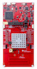
:::

::: details Texas Instruments LAUNCHXL-CC26X2R1

USB connected development kit, based on CC2652R chip  
These devices have two serial devices built in. Make sure you put the right serial device in the [configuration](../configuration/) or use auto detect (completely remove the `serial` section from `configuration.yaml`) if you only have one Texas Instruments CC device connected to your system.  
An external antenna can be connected which could increase range: [requires resoldering a tiny capacitor](https://github.com/Koenkk/zigbee2mqtt/issues/2162#issuecomment-570286663)

-   [Coordinator firmware](https://github.com/Koenkk/Z-Stack-firmware/releases/download/Z-Stack_3.x.0_coordinator_20240710/CC2652R_coordinator_20240710.zip)
-   [Router firmware](https://github.com/Koenkk/Z-Stack-firmware/raw/Z-Stack_3.x.0_router_20221102/router/Z-Stack_3.x.0/bin/CC2652R_router_20221102.zip)
-   [Vendor flashing instructions](./flashing/flashing_via_uniflash.md)
-   [Buy](http://www.ti.com/tool/LAUNCHXL-CC26X2R1)

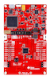
:::

::: details Texas Instruments LP-CC2652R7

USB connected development kit, based on CC2652R7 chip  
These devices have two serial devices built in. Make sure you put the right serial device in the [configuration](../configuration/) or use auto detect (completely remove the `serial` section from `configuration.yaml`) if you only have one Texas Instruments CC device connected to your system.

-   [Coordinator firmware](https://github.com/Koenkk/Z-Stack-firmware/releases/download/Z-Stack_3.x.0_coordinator_20240710/CC2652R7_coordinator_20240710.zip)
-   [Vendor flashing instructions](./flashing/flashing_via_uniflash.md)
-   [Buy](http://www.ti.com/tool/LP-CC2652R7)

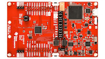
:::

::: details Texas Instruments LP-CC1352P7

USB connected development kit, based on CC1352P7 chip  
These devices have two serial devices built in. Make sure you put the right serial device in the [configuration](../configuration/) or use auto detect (completely remove the `serial` section from `configuration.yaml`) if you only have one Texas Instruments CC device connected to your system.

-   [Coordinator firmware](https://github.com/Koenkk/Z-Stack-firmware/releases/download/Z-Stack_3.x.0_coordinator_20240710/CC1352P7_coordinator_20240710.zip)
-   [Vendor flashing instructions](./flashing/flashing_via_uniflash.md)
-   [Buy](https://www.ti.com/tool/LP-CC1352P7)


:::

## Not recommended (CC2530/CC2531/CC2538)

### USB

::: details Texas Instruments CC2531

USB connected Zigbee adapter with PCB antenna  
**Warning 1:** requires additional hardware to flash (CC debugger + download cable)  
**Warning 2:** might not be powerful enough to handle networks of 20+ devices  
**Warning 3:** this adapter has bad range

-   [Coordinator firmware](https://github.com/Koenkk/Z-Stack-firmware/tree/master/coordinator/Z-Stack_Home_1.2/bin)
-   [Router firmware](https://github.com/Koenkk/Z-Stack-firmware/tree/master/router/Z-Stack_Home_1.2/bin)
-   [Flashing instructions](./flashing/flashing_the_cc2531.md)
-   [Buy](https://www.aliexpress.com/wholesale?catId=0&initiative_id=SB_20191108075039&SearchText=cc2531)

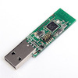
:::

### Serial

::: details Vision CC2538+CC2592 Dongle(VS203)

Adapter or small development board based on CC2538 and CC2592 chip

-   [Coordinator firmware](https://github.com/Koenkk/Z-Stack-firmware/tree/master/coordinator/Z-Stack_3.0.x/bin)
-   [Flashing instructions](https://www.aliexpress.com/item/1005002809329614.html?spm=a2g0o.store_pc_allProduct.8148356.2.4d7f1012TTc3uX)
-   [Buy](https://www.aliexpress.com/item/1005002809329614.html?spm=a2g0o.store_pc_allProduct.8148356.2.4d7f1012TTc3uX)


:::

::: details Texas Instruments CC2530

Serial connected adapter with external antenna optionally with CC2591 or CC2592 RF frontend  
**Warning 1:** requires additional hardware to flash (CC debugger + download cable)  
**Warning 2:** might not be powerful enough to handle networks of 20+ devices

-   [Coordinator firmware](https://github.com/Koenkk/Z-Stack-firmware/tree/master/coordinator/Z-Stack_Home_1.2/bin)
-   [Router firmware](https://github.com/Koenkk/Z-Stack-firmware/tree/master/router/Z-Stack_Home_1.2/bin)
-   [Flashing instructions](../../advanced/zigbee/05_create_a_cc2530_router.md#2-flashing-the-cc2530)
-   [Connecting](./flashing/connecting_cc2530.md)
-   Buy: [AliExpress](http://www.aliexpress.com/wholesale?catId=0&initiative_id=SB_20181213104041&SearchText=cc2530) [GBAN](http://www.gban.cn/en/product_show.asp?id=43) [Tindie](https://www.tindie.com/products/GiovanniCas/cc2530-cc2592-zigbee-dongle/)


:::

::: details Texas Instruments CC2538

Serial connected adapter with CC2592 RF Amplifier

-   [Coordinator firmware](https://github.com/Koenkk/Z-Stack-firmware/tree/master/coordinator/Z-Stack_3.0.x/bin)
-   [Flashing instructions](./flashing/flashing_the_cc2538.md)
-   Buy: [AliExpress](https://www.aliexpress.com/wholesale?catId=0&initiative_id=SB_20191108075039&SearchText=cc2538)

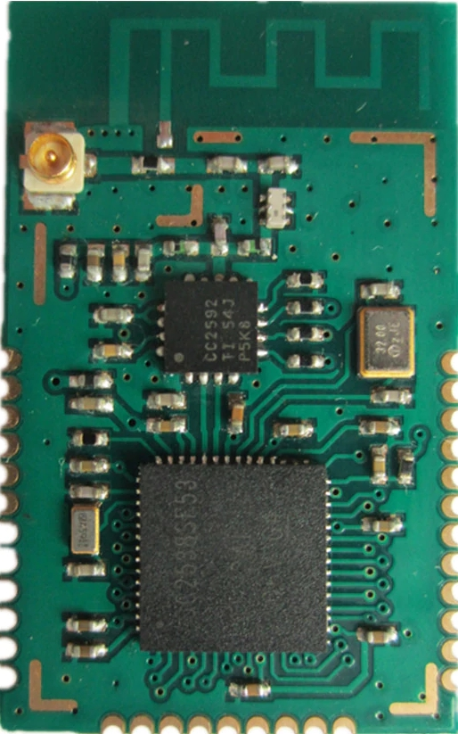
:::

### Network

::: details XGG gateway

An open source zigbee gateway powered by ESP8266 and CC2538+CC2592PA (XGG 38PZ2MGateway) or CC2530 (XGG 30Z2MGateway)  
Coordinator firmware: [XGG 38PZ2MGateway](https://github.com/Koenkk/Z-Stack-firmware/tree/master/coordinator/Z-Stack_3.0.x/bin) [XGG 30Z2MGateway](https://github.com/Koenkk/Z-Stack-firmware/tree/master/coordinator/Z-Stack_Home_1.2/bin)

-   [Contact](https://shop68536829.taobao.com/)


:::

### Custom

::: details Texas Instruments CC2538 HAT

Raspberry pinout compatible HAT with CC2538 and optional external antenna

-   [Coordinator firmware](https://github.com/Koenkk/Z-Stack-firmware/tree/master/coordinator/Z-Stack_3.0.x/bin)
-   [Flashing instructions](./flashing/flashing_the_cc2538.md)
-   [Buy](https://www.tindie.com/products/GiovanniCas/zigbee-hat-with-cc2538-for-raspberry/)

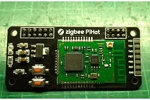
:::
