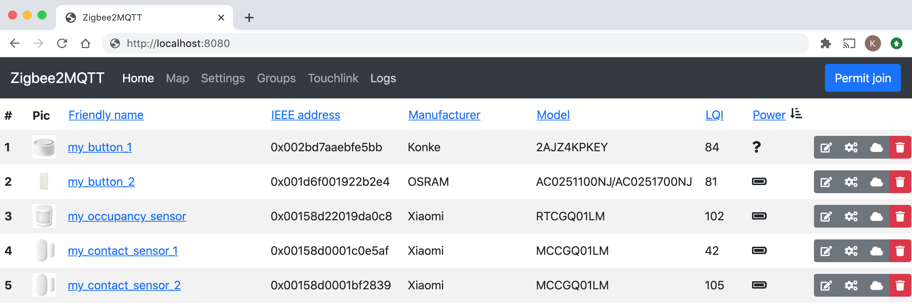

# Frontend

::: tip
Ongoing discussion about the frontend can be found [here](https://github.com/Koenkk/zigbee2mqtt/issues/4266)
:::

Zigbee2MQTT has a built-in web-based frontend.



To enable the frontend add the following to your `configuration.yaml`. This will start the frontend on port `8080`.

```yaml
frontend: true
```

## Advanced configuration

```yaml
frontend:
    # Optional, default 8080
    port: 8080
    # Optional, empty by default to listen on both IPv4 and IPv6. Opens a unix socket when given a path instead of an address (e.g. '/run/zigbee2mqtt/zigbee2mqtt.sock')
    # Don't set this if you use Docker or the Home Assistant add-on unless you're sure the chosen IP is available inside the container
    host: 0.0.0.0
    # Optional, enables authentication, disabled by default, cleartext (no hashing required)
    auth_token: your-secret-token
    # Optional, url on which the frontend can be reached, currently only used for the Home Assistant device configuration page
    url: 'https://zigbee2mqtt.myhouse.org'
    # Optional, certificate file path for exposing HTTPS. The sibling property 'ssl_key' must be set for HTTPS to be activated
    ssl_cert: /config/etc/letsencrypt/live/mydomain.com/fullchain.pem
    # Optional, private key file path for exposing HTTPS. The sibling property 'ssl_cert' must be set for HTTPS to be activated
    ssl_key: /config/etc/letsencrypt/live/mydomain.com/privkey.pem
    # Optional, base URL for the frontend, when served from a subpath, e.g. behind the proxy. Default value is '/'
    base_url: /zigbee2mqtt
```

To specify the `auth_token` in a different file set e.g. `auth_token: '!secret.yaml auth_token'`, create a file called `secret.yaml` next to `configuration.yaml` with content `auth_token: super-secret-token`.

**NOTE:** If you are running Zigbee2MQTT via the Home Assistant addon you cannot change the port. The addon will force the frontend to run on port 8099 as Home Assistant Ingress requires this.

## Nginx proxy configuration

In case you want to run the frontend behind a proxy you can use the following config as an example.

Due to [WebKit Bug 80362](https://bugs.webkit.org/show_bug.cgi?id=80362), which prevents basic authentication from being used with WebSockets, the frontend will not work in WebKit-based browsers when this type of authentication is configured. This includes desktop Safari on Mac and _all_ browsers and web views on iOS. To work around the issue, configure the frontend's `auth_token` to configure application-level auth and remove `auth_basic` from the web server config.

```
server {
    listen       80;
    server_name  zigbee2mqtt.mydomain.com;
    return 301   https://zigbee2mqtt.mydomain.com$request_uri;
}

server {
    listen      443 ssl http2;
    listen      [::]:443 ssl http2;

    # In case you want to use basic authentication:
    auth_basic "Login";
    auth_basic_user_file /zigbee2mqtt_htpasswd;

    ssl_certificate     /config/etc/letsencrypt/live/mydomain.com/fullchain.pem;
    ssl_certificate_key /config/etc/letsencrypt/live/mydomain.com/privkey.pem;

    server_name zigbee2mqtt.mydomain.com;

    location / {
        proxy_pass http://localhost:8080/;
        proxy_set_header Host $host;
        proxy_set_header X-Real-IP $remote_addr;
        proxy_set_header X-Forwarded-For $proxy_add_x_forwarded_for;
    }

    location /api {
        proxy_pass         http://localhost:8080/api;
        proxy_set_header Host $host;

        proxy_http_version 1.1;
        proxy_set_header Upgrade $http_upgrade;
        proxy_set_header Connection "upgrade";
    }
}
```

## Apache2 proxy configuration

Credit: [Florian Metzger-Noel](https://stackoverflow.com/questions/38838567/proxy-websocket-wss-to-ws-apache/60506715#60506715)

Enable these modules using
`a2enmod proxy proxy_wstunnel proxy_http rewrite`

```
<VirtualHost *:80>
   ServerName example.com
   ServerAdmin info@example.com


    ProxyRequests off
    ProxyVia on
    RewriteEngine On

    RewriteEngine On
    RewriteCond %{HTTP:Connection} Upgrade [NC]
    RewriteCond %{HTTP:Upgrade} websocket [NC]
    RewriteRule /(.*) ws://localhost:8080/$1 [P,L]

    ProxyPass               / http://localhost:8080/
    ProxyPassReverse        / http://localhost:8080/


   <Proxy *>
   Order deny,allow
   Allow from all
   </Proxy>

   ErrorLog ${APACHE_LOG_DIR}/company2-error.log
   CustomLog ${APACHE_LOG_DIR}/company2-access.log combined

</VirtualHost>


```
