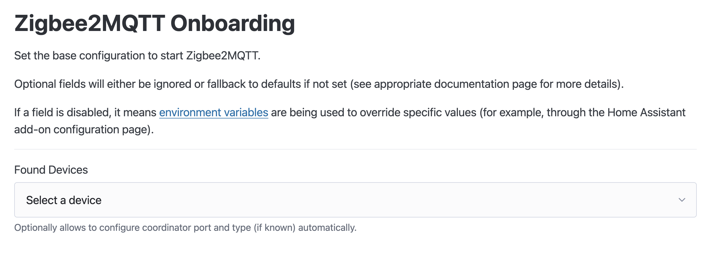

# Getting started

## Prerequisites

In order to use Zigbee2MQTT we need the following hardware:

1.  **A Zigbee adapter** which is the interface between the host system where you run Zigbee2MQTT and the Zigbee radio
   communication. Zigbee2MQTT supports a variety of adapters with different kind of connections like USB, GPIO or remote via WIFI or Ethernet.
   Recommended adapters are [zStack](../adapters/zstack.md) and [EmberZNet](../adapters/emberznet.md). See [Supported Adapters](../adapters/README.md) for all supported adapters. It's recommended to check out your adapter's recommendation details before the installation process, to find out whether it needs any additional configuration parameters. <br class="clear" />

2.  **A host system** where you would run Zigbee2MQTT (e.g. a Raspberry Pi or Intel NUC). Zigee2MQTT runs on many computers and platforms including Linux, Windows and MacOS. It should have an MQTT broker installed. [Mosquitto](https://www.mosquitto.org/download/) ([tutorial for Raspberry-Pi](https://randomnerdtutorials.com/how-to-install-mosquitto-broker-on-raspberry-pi/)) is the recommended MQTT broker but [others](https://mqtt.org/software/) should also work fine. <br class="clear" />

3.  One or more **Zigbee devices** which will be paired with Zigbee2MQTT. <br class="clear" />

::: tip TIP
 To improve network range and stability use a USB extension cable. If you experience ANY trouble with device (timeouts, not pairing, devices unreachable, devices dropping from the network, etc.) this is the first thing to do to avoid interference.
See [Improve network range and stability](../../advanced/zigbee/02_improve_network_range_and_stability.md). <br class="clear" />
:::

## Installation

The next step is to install Zigbee2MQTT, follow [installation instructions](../installation/) for your platform. Once Zigbee2MQTT is started, you can continue with the onboarding procedure below.

## Onboarding

Zigbee2MQTT offers an onboarding process on first run (when no `configuration.yaml` exists).

The onboarding page, by default, is reachable at the same URL as the frontend (`http://localhost:8080`). _Note: This URL may be different for specific setups (like Home Assistant)._



If the `adapter type` is unknown by the discovery process, you can find a list of the most common adapters in the corresponding pages: [zstack](../adapters/zstack.md), [ember](../adapters/emberznet.md), [deconz](../adapters/deconz.md), [zigate](../adapters/zigate.md), [zboss](../adapters/zboss.md).

:::tip TIP
The adapter discovery process will try to find serial and mDNS-discoverable devices.
Refreshing the page will re-execute the discovery process.

_Note: This may not be available on all setups. If not, you will have to enter the adapter path and type manually._
:::

If Zigbee2MQTT fails validation after submitting the configuration, the page will show the error details.

If Zigbee2MQTT fails to start after submitting the initial configuration (due to something like a wrong adapter path), the onboarding will be executed again on the following start.

:::tip TIP
Onboarding failure pages will hold the `node` process from exiting until the page's `Close` button is triggered or the process is manually exited.
:::

:::tip TIP
You can also force the onboarding to run later (if configuration needs changing) with the environment variable `Z2M_ONBOARD_FORCE_RUN=1`.
Depending on your setup, this may be offered in form of a toggle (Home Assistant add-on for example), or you may have to set it manually for the `node` process.
:::

:::details Environment variables available to customize the onboarding process
The following environment variables are available, if your setup requires customizing the onboarding server:

- `Z2M_ONBOARD_NO_SERVER=1` => disable onboarding server completely (_supersedes all below_)
- `Z2M_ONBOARD_URL=http://0.0.0.0:8080` => set the URL where the onboarding page can be reached
- `Z2M_ONBOARD_NO_FAILURE_PAGE=1` => disable failure pages (_failure is logged, and the process exits immediately_)
- `Z2M_ONBOARD_FORCE_RUN=1` => see above TIP
- `Z2M_ONBOARD_NO_REDIRECT=1` => if frontend is enabled, prevent the onboarding validation page from trying to redirect to frontend (_useful for setups where frontend has an unusual URL_)
  :::

## Connect a device

Search the [supported devices](../../supported-devices/) for your device and follow the instructions how to pair.

If no instructions are available, the device can probably be paired by factory resetting it.

Once you see something similar to below in the log your device is paired and you can start controlling it using the frontend and MQTT messages.

```
Zigbee2MQTT:info  2019-11-09T12:19:56: Successfully interviewed '0x00158d0001dc126a', device has successfully been paired
```
