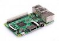
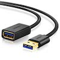

# Getting started

## Prerequisites

In order to use Zigbee2MQTT we need the following hardware:

1.  **A Zigbee Adapter** which is the interface between the Computer (or Server) where you run Zigbee2MQTT and the Zigbee radio
   communication. Zigbee2MQTT supports a variety of adapters with different kind of connections like USB, GPIO or remote via WIFI or Ethernet.
   Recommended adapters have a chip starting with CC2652 or CC1352. See [supported Adapters](../adapters/README.md). It's recommended to check out your adapter's recommendation details before the installation process, to find out whether it needs any additional configuration parameters. <br class="clear" />

2.  **A Server** where you would run Zigbee2MQTT. Most Raspberry-Pi models are known to work but you can run it on many computers and platforms including Linux, Windows and MacOS. It should have an MQTT broker installed. [Mosquitto](https://www.mosquitto.org/download/) ([Tutorial for Raspberry-Pi](https://randomnerdtutorials.com/how-to-install-mosquitto-broker-on-raspberry-pi/)) is the recommended MQTT broker but [others](https://mqtt.org/software/) should also work fine. <br class="clear" />

3.  One or more **Zigbee Devices** which will be paired with Zigbee2MQTT. <br class="clear" />

::: tip TIP
 To improve network range and stability use a USB extension cable. If you experience ANY trouble with device (timeouts, not pairing, devices unreachable, devices dropping from the network, etc.) this is the first thing to do to avoid interference.
See [Improve network range and stability](../../advanced/zigbee/02_improve_network_range_and_stability.md). <br class="clear" />
:::

## Installation

You can run Zigbee2MQTT in different ways, see [Installation](../installation/). In this example
[Docker](https://docs.docker.com/get-docker/) and [Docker Compose](https://docs.docker.com/compose/install/) is used to
set up and run Zigbee2MQTT.

### 1.) Find the Zigbee-Adapter

#### 1.1) USB Zigbee adapter

After you plug the adapter in see the `dmesg` output to find the device location:

```bash
$ sudo dmesg

...
usbcore: registered new interface driver ch341
usbserial: USB Serial support registered for ch341-uart
ch341 3-1:1.0: ch341-uart converter detected
usb 3-1: ch341-uart converter now attached to ttyUSB0
```

As we can see the adapter was identified and mounted on `ttyUSB0`.

```bash
$ ls -l /dev/ttyUSB0
crw-rw---- 1 root dialout 188, May 16 19:15 /dev/ttyUSB0
```

Here we can see that the adapter is owned by `root` and accessible from all users in the `dialout` group.

#### 1.2) Network Zigbee adapter

Zigbee2MQTT supports mDNS autodiscovery feature for network Zigbee adapters. If your network Zigbee adapter supports mDNS, you do not need to know the IP address of your network Zigbee adapter, Zigbee2MQTT will detect it and configure. Otherwise, you need to know the network Zigbee adapter's IP address:

-   Connect your adapter to your LAN network either over Ethernet or Wi-Fi, depending on your adapter.
-   Go to your router/switch setting and find the list of connected device.
-   Find the IP address and of your Ethernet Zigbee adapter.
-   You also need to know the communication port of your Ethernet Zigbee-Adapter. In most cases (TubeZB, SLZB-06) the default port is `6638`. You can check the port at your Adapter's user manual.

### 2.) Setup and start Zigbee2MQTT

It's assumed, that you have a recent version of Docker and Docker Compose installed.

First, we create a folder where we want the project to reside `mkdir folder-name`. In the folder, we create we save the `docker-compose.yml` file which defines how Docker would run our containers. The following file consists of two services, one for the MQTT-Server and one for Zigbee2MQTT itself. Be sure to adjust the file to your needs and match the devices-mount in the case your adapter was not mounted on `/dev/ttyUSB0` or in case you use a network adapter.

```yaml
version: '3.8'
services:
    mqtt:
        image: eclipse-mosquitto:2.0
        restart: unless-stopped
        volumes:
            - './mosquitto-data:/mosquitto'
        ports:
            - '1883:1883'
            - '9001:9001'
        command: 'mosquitto -c /mosquitto-no-auth.conf'

    zigbee2mqtt:
        container_name: zigbee2mqtt
        restart: unless-stopped
        image: koenkk/zigbee2mqtt
        volumes:
            - ./zigbee2mqtt-data:/app/data
            - /run/udev:/run/udev:ro
        ports:
            - 8080:8080
        environment:
            - TZ=Europe/Berlin
        devices:
            - /dev/ttyUSB0:/dev/ttyUSB0
```

In the next step we'll create a simple [Zigbee2MQTT config file](../configuration/) in `zigbee2mqtt-data/configuration.yaml`.

```yaml
# Let new devices join our zigbee network
permit_join: true
# Docker Compose makes the MQTT-Server available using "mqtt" hostname
mqtt:
    base_topic: zigbee2mqtt
    server: mqtt://mqtt
# Zigbee Adapter path
serial:
    port: /dev/ttyUSB0
# Enable the Zigbee2MQTT frontend
frontend:
    port: 8080
# Let Zigbee2MQTT generate a new network key on first start
advanced:
    network_key: GENERATE
```

For network adapters, `serial` settings should look like this:

```yaml
serial:
    port: tcp://192.168.1.12:6638
```

Where `192.168.1.112` is the IP address of your network Zigbee adapter, and `6638` is the port.

In case you adapter supports mDNS, you can omit the IP address and use a configuration like:

```yaml
serial:
    port: mdns://slzb-06
```

Where `slzb-06` is the mDNS name of your network Zigbee adapter.

We should now have two files in our directory and can start the stack:

```bash
$ find
./docker-compose.yml
./zigbee2mqtt-data/configuration.yaml

# First start
$ docker compose up -d

# Check the logs
$ docker compose logs -f
```

After some short time you should see some log messages that Mosquitto and Zigbee2MQTT is running now.
You can open the frontend using [http://localhost:8080](http://localhost:8080) (or the hostname of your remote server).

We can now go on and pair our first device.

## Connect a device

Search the [supported devices](../../supported-devices/) for your device and follow the instructions how to pair.

If no instructions are available, the device can probably be paired by factory resetting it.

Once you see something similar to below in the log your device is paired and you can start controlling it using the frontend and MQTT messages.

```
Zigbee2MQTT:info  2019-11-09T12:19:56: Successfully interviewed '0x00158d0001dc126a', device has successfully been paired
```

::: warning ATTENTION
It's important that `permit_join` is set to `false` in your `configuration.yaml` after initial setup is
done to keep your Zigbee network safe and to avoid accidental joining of other Zigbee devices.
:::
