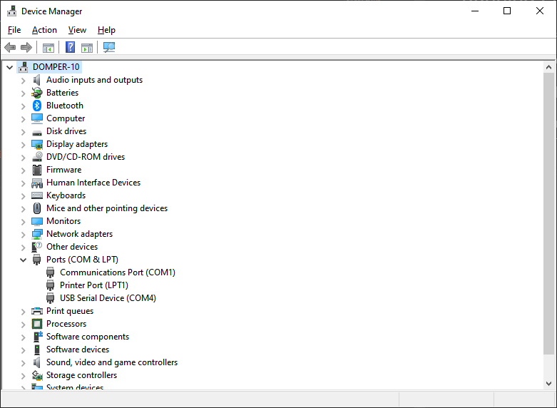

# Windows

These instructions explain how to run Zigbee2MQTT on Windows.

::: tip TIP
Before starting make sure you have an MQTT broker installed on your system.
There are many tutorials available on how to do this, [example](https://cedalo.com/blog/how-to-install-mosquitto-mqtt-broker-on-windows/).
Mosquitto is the recommended MQTT broker but others should also work fine.
:::

## Install a USB-to-UART Bridge Virtual COM Port driver

In order to be able to communicate with your USB device over a virtual COM port, you might need a driver for your OS in order for it to be able to be found by your flashing software.

-   For CP210x based chipsets, there is a driver available at [Silicon Labs' website](https://www.silabs.com/developers/usb-to-uart-bridge-vcp-drivers).
-   For CC1352/CC2652/CC2538 based chipsets, have a look at [FTDI chip's website](https://ftdichip.com/drivers/vcp-drivers/) for drivers.

## Determine which COM port is assigned to your device

1. Connect your sniffer device
1. Open up Start menu and start typing `Device Manager`
1. Expand `Ports (COM & LPT)`
1. Look for a node similar to `USB Serial Device (COM4)`
1. Take note of the port number, it will be needed during configuration



## Installing

1. Download and install Node.js 20 LTS from [their website](https://nodejs.org/)
1. Open up a `Command prompt` or `Powershell` from the Start menu (Powershell has prettier colors)
1. Verify Node.js was successfully installed
    ```bash
    node --version
    ```
1. Choose a suitable directory for Zigbee2MQTT and copy all the files from the [Zigbee2MQTT repository](https://github.com/koenkk/zigbee2mqtt)
    - if you prefer to use git (which you should), just clone the whole repository
        ```bash
        git clone --depth 1 https://github.com/Koenkk/zigbee2mqtt/
        ```
    - otherwise use the green `Clone or download` button to download the zip archive, then extract it
1. Change to the newly created directory and install dependencies with Node.js own package manager `npm`
    ```bash
    npm ci
    ```

## Configuring

1. Copy `data\configuration.example.yaml` to `data\configuration.yaml`
1. Open `data\configuration.yaml` in a text editor
1. Change the serial port configuration to match your setup
    ```yaml
    serial:
        port: COM4
    ```
1. Make sure other settings are correct as well
1. Save and exit

Congratulations, you're now ready to start your Zigbee2MQTT installation

::: warning ATTENTION
Some Windows drivers for adapters may prevent auto-detect from working properly. Make sure to specify the port as indicated above.
:::

## Starting Zigbee2MQTT

Just change to the root directory of your installation and run the application:

```bash
npm start
```

A successful setup produces an output similar to this:

```
> zigbee2mqtt@1.6.0 start C:\Users\me\Documents\GitHub\zigbee2mqtt
> node index.js

  Zigbee2MQTT:info 2019-10-18 10:56:22 PM Logging to directory: 'D:\Documents\GitHub\zigbee2mqtt\data\log\2019-10-18.22-56-22'
  Zigbee2MQTT:info 2019-10-18 10:56:22 PM Starting Zigbee2MQTT version 1.6.0 (commit #e26ad2a)
  Zigbee2MQTT:info 2019-10-18 10:56:22 PM Starting zigbee-shepherd
  Zigbee2MQTT:info 2019-10-18 10:56:24 PM zigbee-shepherd started
  Zigbee2MQTT:info 2019-10-18 10:56:24 PM Coordinator firmware version: '20190608'
```

The `Coordinator firmware version: '20190608'` entry means that Zigbee2MQTT has successfully communicated with the USB sniffer.

Zigbee2MQTT can be stopped anytime by pressing `CTRL + C` and then confirming with `Y`.

## Updating Zigbee2MQTT

It is recommended to back up the Zigbee2MQTT `\data` subdirectory before performing any modifications.

1. First, stop Zigbee2MQTT
1. Navigate to the directory where the Zigbee2MQTT repository was cloned to in the [Installing](#installing) step
1. Pull the latest content from the configured source
    ```bat
    git pull
    ```
1. Update NPM dependencies
    ```bat
    npm ci
    ```
1. Restart Zigbee2MQTT
    ```bat
    npm start
    ```

Below is a sample PowerShell script to run which will take care of:

-   Backing up the data directory
-   Updating Zigbee2MQTT
-   Restoring the data directory contents

The script will automatically check if node is running (in case Zigbee2MQTT is still running) and ask to close if it is. You will need to manually stop and restart it afterwards.

Ensure you update the relevant paths in the script to match your environment. By default, the script will target `D:\ProgramData\zigbee2mqtt\` as the install folder and `C:\Temp\` as the folder where to temporarily store the `data` folder backup

Run script from an elevated administrative PowerShell console

```powershell
# Z2M must not be running
# This script will NOT re-start it

# Modify below paths as necessary
$z2mPath = "D:\ProgramData\zigbee2mqtt"
$backupPath = "C:\Temp"


# DO NOT MODIFY below this line
# ------------------------------------------------------------------------------
# Build paths
$z2mDataPath = Join-Path -Path $z2mPath -ChildPath 'data'
$z2mBackupPath = Join-Path -Path $backupPath -ChildPath 'z2mdata'

# Check if Z2M is running
if (Get-Process -Name "node" -ErrorAction SilentlyContinue) {
    # Found running instance of node, stop script
    "Node still running, please close first" | Write-Host -ForegroundColor Red
    pause
    return
}
else {
    # Continue!
    "Node not running, Zigbee2MQTT upgrade will continue" | Write-Host -ForegroundColor Green
}
# Change working directory to:
"Setting location to ""$($z2mPath)""" | Write-Host
Set-Location -Path $z2mPath
# Back up data directory:
"Backing up data subdirectory" | Write-Host
Copy-Item -Path $z2mDataPath -Destination $z2mBackupPath -Recurse
# Pull the latest release:
"Running ""git pull""" | Write-Host
& git pull
# Update NPM dependencies:
"Running ""npm ci""" | Write-Host
& npm ci
# Restore backed-up data:
"Restore backed up data directory" | Write-Host
Copy-Item -Path "$($z2mBackupPath)\*" -Destination $z2mDataPath -Recurse -Force
# Delete back up folder:
"Delete backed up folder" | Write-Host
Remove-Item -Path $z2mBackupPath -Recurse
"Update completed!" | Write-Host -ForegroundColor Green
pause
```
