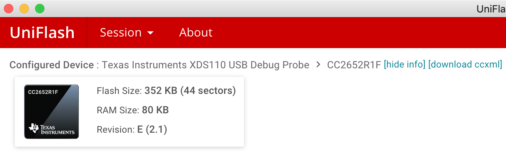
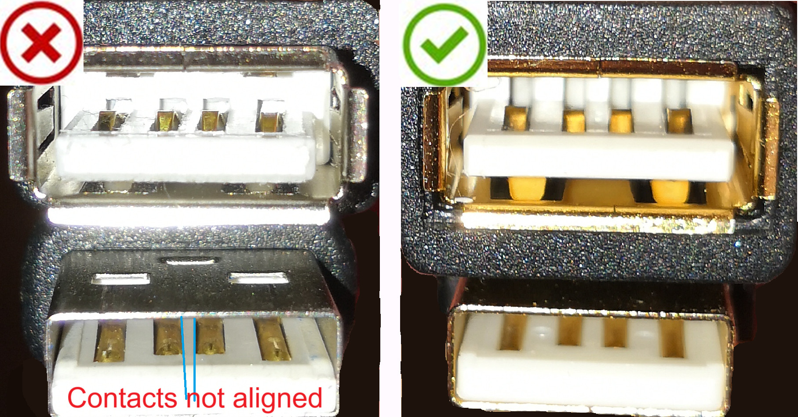

# Zigbee2MQTT fails to start/crashes runtime

Most of the time this is caused by Zigbee2MQTT not being able to communicate with your Zigbee adapter.

[[toc]]

## Error: `USB adapter discovery error (No valid USB adapter found). Specify valid 'adapter' and 'port' in your configuration.`

Configure the `serial` section as described [here](../configuration/adapter-settings.md).

## Error: `SRSP - SYS - ping after 6000ms` for zStack or `HOST_FATAL_ERROR` for EmberZNet

Common reasons for this error:

1. The port of your serial adapter changed.
   Check [this](../configuration/adapter-settings.md) to find out the port of your adapter.
2. If you are using a CC2530 or CC2531; it is a common issue for this adapter to crash (due to its outdated hardware).
   Reflashing the firmware should fix the problem. If it happens often consider flashing the [source routing firmware](https://github.com/Koenkk/Z-Stack-firmware/tree/master/coordinator/Z-Stack_Home_1.2/bin/source_routing) or upgrade to a [more powerful adapter](../adapters/README.md).
3. Your adapter requires additional configuration parameters. Check [supported Adapters](../adapters/README.md) section to find out if your adapter requires extra parameters (eg. ConBee II / RaspBee II).
4. Home Assistant's "Zigbee Home Automation" (ZHA) integration is enabled. Try to disable the ZHA integration and restart the Zigbee2MQTT add-on.
5. Your hardware adapter is flashed with the router firmware and not with the coordinator firmware.
6. Your network Zigbee adapter is not accessible over the LAN network.
7. Another software on your machine (including Home Assistant integration) is interfering with USB devices (example: [HA EDL21 integration](https://www.home-assistant.io/integrations/edl21) trying to find a USB device).

## Verify that you put the correct port in configuration.yaml

Execute the following command to find out the correct path:

```bash
pi@raspberry:/ $ ls -l /dev/serial/by-id
total 0
lrwxrwxrwx. 1 root root 13 Oct 19 19:26 usb-Texas_Instruments_TI_CC2531_USB_CDC___0X00124B0018ED3DDF-if00 -> ../../ttyACM0
```

In this example the correct `port` would be `/dev/ttyACM0`.

### Which port should I use for Texas Instruments LAUNCHXL-CC26X2R1/CC1352P-2, /dev/ttyACM0 or /dev/ttyACM1?

The Texas Instruments launchpad has a build in debugger. This debugger also registers a port next to the device data port. Of course this
is not necessarily number 0 and 1. But normally the lowest number is the device data port and the other the debugger.

To find the correct port, execute:

```bash
pi@raspberry:/ $ ls -l /dev/serial/by-id
total 0
lrwxrwxrwx 1 root root 13 Jan  6 19:07 usb-Texas_Instruments_XDS110__03.00.00.05__Embed_with_CMSIS-DAP_L1100BTD-if00 -> ../../ttyACM0
lrwxrwxrwx 1 root root 13 Jan  6 19:07 usb-Texas_Instruments_XDS110__03.00.00.05__Embed_with_CMSIS-DAP_L1100BTD-if03 -> ../../ttyACM1
```

The device with id ending with _if00_ is for device data. Use this port in your configuration.

## Verify that the user you run Zigbee2MQTT as has write access to the port

This can be tested by executing: `test -w [PORT] && echo success || echo failure` (
e.g. `test -w /dev/ttyACM0 && echo success || echo failure`).

If it outputs `failure` it could mean your user does not have access to the port. To test assign write access by
executing: `sudo chown [USER] [PORT]` (e.g. `sudo chown pi /dev/ttyACM0`).

if it outputs `failure`, then you need to permanently give your user permission to the device.

### Method 1: Give your user permissions on every reboot.

You can create a 'udev' rule to give your user permissions after every reboot:

1. `udevadm info -a -n /dev/ttyACM0 | grep 'serial'`
   get the serial to your device `YOURSERIAL`

2. Create the rule file with:
   `sudo nano /etc/udev/rules.d/99-usb-serial.rules`

3. add this line:
   `SUBSYSTEM=="tty", ATTRS{idVendor}=="0451", ATTRS{idProduct}=="16a8", ATTRS{serial}=="YOURSERIAL", SYMLINK="ttyUSB.CC2531-01", OWNER="pi"`

4. modify your Zigbee2MQTT config to adjust new SYMLINK name:
   `nano /opt/zigbee2mqtt/data/configuration.yaml`

`… serial:
port: /dev/ttyUSB.CC2531-01 …`

After reboot your device will have the right permissions and always the same name.

### Method 2: Add your user to specific groups

As mentioned on https://github.com/esp8266/source-code-examples/issues/26 , depending on your linux installation,
various groups could have ownership of the device.

Add your user to the `uucp ` , `tty ` , `dialout ` groups:

```
sudo usermod -a -G uucp $USER
sudo usermod -a -G tty $USER
sudo usermod -a -G dialout $USER
```

Reboot your device and now your user should have access to the device.

## Error: `Coordinator failed to start, probably the panID is already in use, try a different panID or channel`

- If you still get this error after increasing the panID (as explained [here](../configuration/zigbee-network.md#network-config))
  and you are using a Raspberry Pi with other USB devices attached (e.g. SSD) try connecting the SSD or adapter through a powered USB hub.
- In case you are getting this after first starting successfully and pairing a device it might be that the firmware has
  been flashed incorrectly. Try flashing the stick on a different
  computer ([detailed info](https://github.com/Koenkk/zigbee2mqtt/issues/6302)). This issue mainly occurs in combination with a Slaesh's CC2652RB stick.
- If you had your Zigbee network before and such an error appears with the new Zigbee adapter, try to switch off the Zigbee routers that were connected to your previous Zigbee network and restart Zigbee2MQTT.

## Error: `Resource temporarily unavailable Cannot lock port`

This error occurs when another program is already using (and thus locking) the adapter. You can find out which via the
following command: `ls -l /proc/[0-9]/fd/ |grep /dev/ttyACM0` (replace `/dev/ttyACM0` with your adapter port).

## Raspberry Pi users: use a good power supply

A bad power supply can make your system and its USB devices unstable. Make sure to use a good power supply.

In case you see message like below when running `dmesg -w` you are using a bad power supply.

```
[44870.355590] Under-voltage detected! (0x00050005)
[44874.515618] Voltage normalised (0x00000000)
[44880.755718] Under-voltage detected! (0x00050005)
[44889.075627] Voltage normalised (0x00000000)
```

Also try connecting the adapter via a powered USB hub (especially if you have an SSD connected to the Pi).

## Make sure the extension cable works

A bad extension cable can lead to connection issues between the system and the adapter. Symptoms of this are
disconnection messages in the `dmesg -w` log like below.

```
[44929.156957] usb 1-1.5: USB disconnect, device number 119
[44929.455555] usb 1-1.5: new full-speed USB device number 120 using dwc_otg
[44929.604582] usb 1-1.5: New USB device found, idVendor=0451, idProduct=16a8, bcdDevice= 0.09
[44929.604596] usb 1-1.5: New USB device strings: Mfr=1, Product=2, SerialNumber=3
[44929.604606] usb 1-1.5: Product: TI CC2531 USB CDC
[44929.604615] usb 1-1.5: Manufacturer: Texas Instruments
```

## For Openhab users: disable zwave binding

The Openhab zwave binding interferes with Zigbee2MQTT,
click [here](https://community.openhab.org/t/apparently-the-zwave-binding-blocks-the-dev-ttyusb0-port-in-combination-with-a-cc2652rb-zigbee2mqtt-dongle/103245)
for more information.

## In case of a CC2530 or CC2531 adapter, verify that don't have a CC2540

The CC2540 can be confused easily with the CC2531 as it looks (almost) exactly the same. However, this device does not
support zigbee but bluetooth. This can be verified by looking at the chip.

## [ModemManager](https://www.freedesktop.org/wiki/Software/ModemManager/) is installed

ModemManager, which is default installed on e.g. Ubuntu, is known to cause problems. It can easily be fixed by removing
ModemManager through `sudo apt-get purge modemmanager`.

## hciuart is running

hciuart can be disabled by executing: `sudo systemctl disable hciuart`.

## Texas Instruments LAUNCHXL-CC1352P-2/CC26X2R1 only: press the reset button on the device

If Zigbee2MQTT fails to start with a Texas Instruments LAUNCHXL-CC1352P-2/CC26X2R1 with `Error: SRSP - SYS - version after 6000ms`, you most probably have connected your device to a system that requires pressing the reset button (the one next to the USB connector)
momentarily/shortly after connecting the USB cable. This issue has primarily been observed on x86 architectures only (
e.g., Intel NUC, HPE Microserver, i7 laptop), see also [#2162](https://github.com/Koenkk/zigbee2mqtt/issues/2162). The
procedure has to be repeated every time the adapter is re-connected and it's not clear yet, whether this can be fixed
at all. It does not seem to occur on ARM based boards (Raspberry Pi, ODROID XU4).

Something that can also solve the issue is to replug the USB cable.

## CC2531 coordinators only: press the reset button on the device

When you plug the CC2531 in your computer, the green LED should go on. By pressing the reset button on the CC2531 the
green LED should go off. The CC2531 has 2 buttons on it, the reset button is the one which is closest to the USB port.
Now try starting Zigbee2MQTT again.

## Texas Instruments LAUNCHXL-CC26X2R1 coordinator only: verify that you have the correct revision

The revision of your board can be seen in UniFlash by clicking _more info_ in the top, now press _Read device info_.

The correct revision is: **E** like shown below.



All earlier version are not supported (these are development boards). Return this board to the seller immediately.

## EmberZNet coordinators only

See [EmberZNet errors](../adapters/emberznet.md#error-level).

## Multiple cheap USB-UART

If you have multiple devices connected that are running cheap USB-UART converters (CH341) they may be indistinguishable to your system, since they all possibly have the same idProduct, SerialNumber etc. so they will share the same /dev/serial/by-id.
The easiest solution is to change one of your devices to something with a different uart-usb converter. The second solution would be swapping the whole converter or adding external EEPROM memory to a chip that does not have one (like CH341) so you would be able to add a serial number.

## MQTT v5 disconnecting

If you use an MQTT broker with version 5 of the MQTT specification, you may get disconnects when something is misbehaving.
This can happen, for example, when "maximum packet size" is exceeded (large networks).

To remedy that, configure your broker accordingly, and check if Zigbee2MQTT has a corresponding setting to adjust too. See [MQTT configuration](../configuration/mqtt.md#server-connection).

## Error: `startup failed - configuration-adapter mismatch - see logs above for more information`

This happens when you edit one or more of the `pan_id`, `network_key` or `ext_pan_id` values in `configuration.yml`. If your intent was to do this, the easiest way to resolve this error is to remove the `data/coordinator-backup.json` file and restart again. Note that this will reset your network and **all devices will need to be re-paired!**. Alternatively, you can revert back to the previous value(s). In that case, look a few lines before the error in the log, you'll find something like this:

```
[2024-12-14 20:25:39] error: 	zh:adapter:zstack:manager: Configuration is not consistent with adapter state/backup!
[2024-12-14 20:25:39] error: 	zh:adapter:zstack:manager: - PAN ID: configured=****, adapter=****
[2024-12-14 20:25:39] error: 	zh:adapter:zstack:manager: - Extended PAN ID: configured=****, adapter=****
[2024-12-14 20:25:39] error: 	zh:adapter:zstack:manager: - Network Key: configured=****, adapter=****
[2024-12-14 20:25:39] error: 	zh:adapter:zstack:manager: - Channel List: configured=**, adapter=**
```

(In this example the actual values are replaced with `*`s) You can used the values that are listed for the adapter and put them back in the configuration file. Note that you can't just paste them back: in the logs the keys are printed as hexadecimal strings, but in the config file, `ext_pan_id` and `ext_pan_id` should be entered as arrays. Suppose your network key shows as `39af4d83h2dcb389` in the logs, then you should put the following in your config file:

```
ext_pan_id: [0x39,0xaf,0x4d,0x83,0xh2,0xdc,0xb3,0x89]
```

## Zigbee adapters over the network: use robust and reliable network adapters on Zigbee2MQTT server

If you have a WiFi or ethernet-connected Zigbee adapter, Zigbee2MQTT is communicating with the Zigbee adapter over the LAN through serial-over-IP protocol.

The use of USB-WiFi or USB-ethernet adapters on the Zigbee2MQTT server is discouraged because despite the apparent equivalence to the onboard adapters in terms of specifications, they are designed in small enclosures, often not well ventilated and tend to overheat.  
These adapters are known to stall or stop working in case of high loads or overheating, causing errors like:

```
[2024-06-24 03:37:22] error: zh:ember:uart:ash: Received ERROR from NCP while connecting, with code=ERROR_EXCEEDED_MAXIMUM_ACK_TIMEOUT_COUNT.
[2024-06-24 03:37:22] error: zh:ember:uart:ash: ASH disconnected | NCP status: ASH_NCP_FATAL_ERROR
[2024-06-24 03:37:22] error: zh:ember:uart:ash: Error while parsing received frame, status=ASH_NCP_FATAL_ERROR.
```

where a timeout occurred on the serial-over-IP protocol, or:

```
[2024-06-24 03:37:24] warning: zh:ember:uart:ash: Frame(s) in progress cancelled in [1ac1020b0a527e]
[2024-06-24 03:37:24] error: zh:ember:uart:ash: Received unexpected reset from NCP, with reason=RESET_SOFTWARE.
[2024-06-24 03:37:24] error: zh:ember:uart:ash: ASH disconnected: ASH_ERROR_NCP_RESET | NCP status: ASH_NCP_FATAL_ERROR
[2024-06-24 03:37:24] error: zh:ember:uart:ash: Error while parsing received frame, status=HOST_FATAL_ERROR.
[2024-06-24 03:37:24] error: zh:ember: !!! NCP FATAL ERROR reason=HOST_FATAL_ERROR. ATTEMPTING RESET... !!!
```

which shows a communication out of sync between host and NCP but also, and this is a clear hint of network problems:

```
[2024-06-24 03:38:05] error: z2m:mqtt: Not connected to MQTT server!
[2024-06-24 03:38:05] error: z2m:mqtt: Cannot send message: topic: 'zigbee2mqtt/bridge/state', payload: '{"state":"offline"}
[2024-06-24 03:38:05] info: z2m:mqtt: Disconnecting from MQTT server
```

where Zigbee2MQTT could not connect to the MQTT server over the LAN.

The best setup for this situation is to use the ethernet port embedded into the Zigbee2MQTT server motherboard which guarantees reliability of communications in all load conditions.  
As a second choice you can use the onboard WiFi adapter which should as well be designed for reliability, but also consider the stability of your WiFi network.  
If all the onboard adapters are in use and you need to add another network adapter, the best choice is to install an internal network card on the PCIe bus, with proper cooling design.

## Error: regular crashes with timeout errors or failure to start after the serial port is opened

These errors may occur when the serial communication between the ZigBee dongle and Zigbee2MQTT unexpectedly stops working.

Possible reasons that may cause this error:

1. The hardware connection between the host computer and the ZigBee dongle is unreliable.
   In the following example a cheap USB cable causing unreliable connection is compared with a good USB cable:
   
   With such cheap cable it is enough to touch the cable to cause USB disconnections.

2. Zigbee2MQTT is running in a Virtual Machine and the USB passthrough between the host and the VM is unreliable.
   This can be caused by the virtualization environment, the USB hardware or a combination of both.
   If these error appear, we can do something to reduce the complexity of the setup, improve stability and help investigating the usb connection with the host.
   Instead of passing through to the VM the full USB device we passthrough the serial device.
   The VM configuration changes from
   host-(USB passtrough)->VM->USB-serial->serial(for Zigbee2MQTT configuration)
   to
   host-(serial passtrough)->VM->serial(for Zigbee2MQTT configuration)

As an example, this is the procedure to passthrough the serial device to a Proxmox Home Assistant OS installation:

- Add a serial0 (or serial1 or 2 or 3) to the proxmox VM hardware  
  By default the serial port is a socket in the Proxmox hardware VM config ("serial0: socket") so we have to change this parameter in the VM configuration file /etc/pve/quemu-server/{VMID}.conf to point to the real serial device, for example: "serial0: /dev/serial/by-id/usb-ITEAD_SONOFF_Zigbee_3.0_USB_Dongle_Plus_V2_20240122184528-if00"
- Free up the ttyS0 serial port from getty in Home Assistant OS  
  In the VM this serial port passed through is recognized as ttyS0, but the Home Assistant OS systemd by default is spawning an agetty on /dev/ttyS0, in factin the file /mnt/boot/cmdline.txt kernel commandline parameters the ttyS0 is set as console (content is "console=ttyS0 console=tty0").
  We have to change this cmdline.txt file in the VM so that systemd leaves ttyS0 alone without spawning agetty, therefore we remove the ttyS0 part and the cmdline.txt becomes "console=tty0".

Now Zigbee2MQTT is able to reach the dongle through /dev/ttyS0 which is a "real" serial port inside the VM.
Any issue with the USB device is logged by the host kernel and can be easily spotted with dmesg in this way we isolate them from the issues on the serial device.
