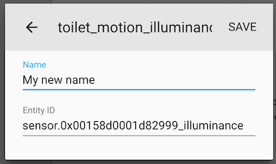
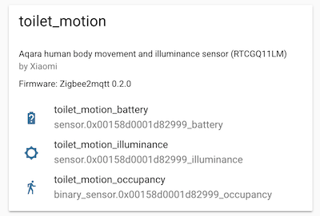

# Home Assistant

## MQTT discovery

The easiest way to integrate Zigbee2MQTT with Home Assistant is by
using [MQTT discovery](https://www.home-assistant.io/integrations/mqtt#mqtt-discovery).
This allows Zigbee2MQTT to automatically add devices to Home Assistant.

To achieve the best possible integration (including MQTT discovery):

-   In your **Zigbee2MQTT** `configuration.yaml` set `homeassistant: true`
-   Enable the [MQTT integration](https://www.home-assistant.io/integrations/mqtt/) in Home Assistant

## Device/group page

Since Home Assistant 2021.11 the device/group page in Home Assistant can directly link to the frontend (_Visit device_ button).
To enable this set the `url` in the [frontend](../../configuration/frontend.md) configuration.

## Home Assistant device registry

When using Home Assistant MQTT discovery, Zigbee2MQTT integrates
with the [Home Assistant device registry](https://developers.home-assistant.io/docs/en/device_registry_index.html).
This allows you to change the Home Assistant `entity_id` and `friendly_name` from the Home Assistant web interface
without having to restart Home Assistant. It also makes it possible to show which entities belong to which device.





## Customizing discovery

The device specific configuration allows you to modify the discovery payload. Here you can also prevent a device from being discovered. See [Device specific configuration](../../configuration/devices-groups.html#specific-device-options) for the available options.

## Responding to button clicks

To respond to button clicks (e.g. WXKG01LM) you can use one of the following three Home Assistant configurations.

### Via MQTT device trigger (recommended)

[MQTT device trigger](https://www.home-assistant.io/integrations/device_trigger.mqtt/) is the recommended way to respond to button clicks.
The MQTT device triggers are discovered by Zigbee2MQTT **once the event is triggered on the device at least once**.

```yaml
automation:
    - alias: Respond to button click
      trigger:
          - device_id: ad44cabee4c646f493814306aa6446e1
            discovery_id: 0x000b57fffecb472d action_arrow_left_click
            domain: mqtt
            platform: device
            subtype: arrow_left_click
            type: action
      action:
          entity_id: light.my_bulb_light
          service: light.toggle
```

If you only plan to use this and want to disable the _Via Home Assistant entity_ integration below, set `homeassistant: {legacy_triggers: false}` (see [Configuration](../../configuration/homeassistant.md) for more info).

### Via Home Assistant entity

This method work by responding to the state change event of a sensor.

```yaml
automation:
    - alias: Respond to button click
      trigger:
          platform: state
          entity_id: sensor.my_switch_click
          to: 'single'
      action:
          entity_id: light.my_bulb_light
          service: light.toggle
```

### Via MQTT

As an alternative to the above way of integrating, you can also listen to MQTT topics.

```yaml
automation:
    - alias: Respond to button clicks
      trigger:
          platform: mqtt
          topic: 'zigbee2mqtt/<FRIENDLY_NAME'
      condition:
          condition: template
          value_template: '{{ "single" == trigger.payload_json.click }}'
      action:
          entity_id: light.bedroom
          service: light.toggle
```

## Groups

Groups discovery is supported for groups of lights, switches, locks and covers. For other types you have to manually create a config in the Home Assistant `configuration.yaml`.

## Overriding discovery properties

Any Home Assistant MQTT discovery property can be overridden on a device. Two examples are shown below. For a full and current list of discovery properties, see [the Home Assistant MQTT Discovery integration](https://www.home-assistant.io/integrations/mqtt/#mqtt-discovery) and [the Home Assistant extension](https://github.com/Koenkk/zigbee2mqtt/blob/03ba647dc6b5f299f8f3ab441712999fcb3a253e/lib/extension/homeassistant.ts) in the Zigbee2MQTT source code.

### Changing `supported_color_modes`

This is useful for switching light bulbs from reporting values from X/Y (which is the default) to reporting in hue / saturation (which is what bulbs report color in when changing via hue or saturation, such as with the `hue_move` and `saturation_move` commands).

This example changes a [light's `supported_color_modes` discovery property](https://www.home-assistant.io/integrations/light.mqtt/#supported_color_modes) to hue / saturation and color temperature:

```yaml
devices:
    '0x12345678':
        friendly_name: my_light
        homeassistant:
            light:
                supported_color_modes: ['hs', 'color_temp']
```

### Exposing switch as a light

If your device is currently discovered as a switch and you want to discover it as a light, the following config in the Zigbee2MQTT `configuration.yaml` can be used:

```yaml
devices:
    '0x12345678':
        friendly_name: my_switch
        homeassistant:
            switch:
                type: light
                object_id: light
            light:
                name: null
                value_template: null
                state_value_template: '{{ value_json.state }}'
            # OR if your devices has multiple endpoints (e.g. left/right)
            switch_left:
                type: light
                object_id: light_left
            light_left:
                name: my_switch_left
                value_template: null
                state_value_template: '{{ value_json.state_left }}'
            switch_right:
                type: light
                object_id: light_right
            light_right:
                name: my_switch_right
                value_template: null
                state_value_template: '{{ value_json.state_right }}'
```

### Changing device properties

As an advanced example to show changing any MQTT property can be overridden, the following configuration changes the `suggested_area` property of the `device`. The example shows that you can just copy the given MQTT discovery hierarchy underneath the `homeassistant` property (given that `suggested_area` is underneath the `device` property). Please note, that other `device` properties are possibly set by Zigbee2MQTT (e.g. `manufacturer`).

This example changes the [light's device's `suggested area` discovery property](https://www.home-assistant.io/integrations/light.mqtt/#device) to "Living Room":

```yaml
devices:
    '0x12345678':
        friendly_name: my_light
        homeassistant:
            device:
                suggested_area: 'Living Room'
```

## Using a custom name for the device and entities

In order to get a more readable name for the device and entities in Home Assistant, a specific name for Home Assistant can be set in the device configuration. If set, this name will be used instead of `friendly_name`.

```yaml
devices:
    '0x12345678':
        friendly_name: living_room/temperature_sensor
        homeassistant:
            name: Living Room Temperature Sensor
```

## Controlling Zigbee2MQTT via Home Assistant

The following Home Assistant configuration allows you to control Zigbee2MQTT from Home Assistant.

You can add it to the appropriate section of your `configuration.yaml`, or you can add it as a [Home Assistant Package](https://www.home-assistant.io/docs/configuration/packages/) by adding the following to `zigbee2mqtt.yaml` in your packages folder.

```yaml
# Input number for joining time remaining (in minutes)
input_number:
    zigbee2mqtt_join_minutes:
        name: 'Zigbee2MQTT join minutes'
        initial: 2
        min: 1
        max: 5
        step: 1
        mode: slider

# Input text to input Zigbee2MQTT friendly_name for scripts
input_text:
    zigbee2mqtt_new_name:
        name: Zigbee2MQTT New Name
        initial: ''
        icon: 'mdi:moon-new'

# Input select for choosing Zigbee2MQTT devices
input_select:
    zigbee2mqtt_old_name_select:
        name: Zigbee2MQTT Old Name
        icon: 'mdi:moon-full'
        options:
            - Initial Option
    zigbee2mqtt_remove_select:
        name: Zigbee2MQTT Remove
        icon: 'mdi:trash-can'
        options:
            - Initial Option

# Input boolean to set the force remove flag for devices
input_boolean:
    zigbee2mqtt_force_remove:
        name: Zigbee2MQTT Force Remove
        initial: false
        icon: mdi:alert-remove

# Scripts for renaming & removing devices
script:
    zigbee2mqtt_rename:
        alias: Zigbee2MQTT Rename
        icon: 'mdi:pencil'
        sequence:
            service: mqtt.publish
            data_template:
                topic: zigbee2mqtt/bridge/request/device/rename
                payload_template: >-
                    {
                      "from": "{{ states('input_select.zigbee2mqtt_old_name_select') }}",
                      "to": "{{ states('input_text.zigbee2mqtt_new_name') }}"
                    }
    zigbee2mqtt_remove:
        alias: Zigbee2MQTT Remove
        icon: 'mdi:trash-can'
        sequence:
            service: mqtt.publish
            data_template:
                topic: zigbee2mqtt/bridge/request/device/remove
                payload_template: >-
                    {
                      "id": "{{ states('input_select.zigbee2mqtt_remove_select') }}",
                      "force": {{ is_state('input_boolean.zigbee2mqtt_force_remove', 'on') }}
                    }

automation:
    - id: 'zigbee2mqtt_create_notification_on_successful_interview'
      alias: Zigbee Device Joined Notification
      trigger:
          platform: mqtt
          topic: 'zigbee2mqtt/bridge/event'
      condition:
          condition: template
          value_template: '{{trigger.payload_json.type == "device_interview" and trigger.payload_json.data.status == "successful" and trigger.payload_json.data.supported}}'
      action:
          - service: persistent_notification.create
            data_template:
                title: Device joined the Zigbee2MQTT network
                message: 'Name: {{trigger.payload_json.data.friendly_name}},
                    Vendor: {{trigger.payload_json.data.definition.vendor}},
                    Model: {{trigger.payload_json.data.definition.model}},
                    Description: {{trigger.payload_json.data.definition.description}}'

    - id: 'zigbee2mqtt_update_devices_list'
      alias: Update Zigbee Devices List
      description: ''
      trigger:
          - platform: mqtt
            topic: zigbee2mqtt/bridge/event
          - platform: mqtt
            topic: zigbee2mqtt/bridge/response/device/rename
          - platform: homeassistant
            event: start
      condition: []
      action:
          - delay:
                hours: 0
                minutes: 0
                seconds: 1
                milliseconds: 0
          - service: input_select.set_options
            metadata: {}
            data:
                options: |
                     
                     
                     
                     
                       
                       
                         
                         
                       
                     
                     {{ ns.entities}}
            target:
                entity_id:
                    - input_select.zigbee2mqtt_old_name_select
                    - input_select.zigbee2mqtt_remove_select
          - service: input_text.set_value
            metadata: {}
            data:
                value: ''
            target:
                entity_id: input_text.zigbee2mqtt_new_name
      mode: single
```

The following is an example lovelace card configuration.

```yaml
title: Zigbee2MQTT
type: entities
show_header_toggle: false
entities:
    - entity: binary_sensor.zigbee2mqtt_bridge_connection_state
    - entity: sensor.zigbee2mqtt_bridge_version
    - entity: sensor.zigbee2mqtt_bridge_coordinator_version
    - type: divider
    - entity: switch.zigbee2mqtt_bridge_permit_join
    - entity: input_number.zigbee2mqtt_join_minutes
    - entity: sensor.zigbee2mqtt_bridge_permit_join_timeout
    - type: divider
    - entity: input_select.zigbee2mqtt_old_name_select
    - entity: input_text.zigbee2mqtt_new_name
    - entity: script.zigbee2mqtt_rename
    - type: divider
    - entity: input_select.zigbee2mqtt_remove_select
    - entity: input_boolean.zigbee2mqtt_force_remove
    - entity: script.zigbee2mqtt_remove
```

## Zigbee Network Map (Custom Card)

[Zigbee Network Map Home Assistant Custom Card](https://github.com/azuwis/zigbee2mqtt-networkmap/).
