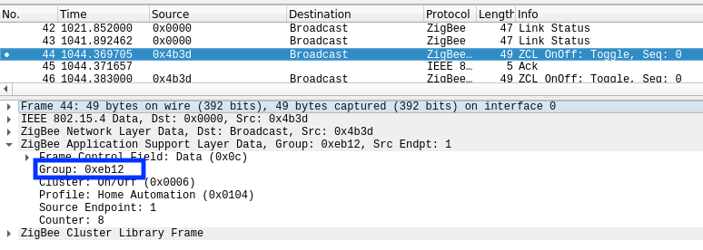

---
---
# Binding
*This is an experimental feature, ongoing discussion can be found here: https://github.com/Koenkk/zigbee2mqtt/issues/782*

Zigbee has support for binding which makes it possible that devices can directly control each other without the intervention of zigbee2mqtt or any home automation software.

## When to use this
A use case for this is e.g. the TRADFRI wireless dimmer. Binding the dimmer directly to a bulb or group has the following advantages:
- Smoothness; this will greatly improve the dimming feedback as the dimmer directly dims the bulb and thus does not have to make the MQTT/home automation software roundtrip.
- It will work even when home automation software, zigbee2mqtt or the coordinator is down.

## Commands
Binding can be configured using the following topics:

- `zigbee2mqtt/bridge/bind/[SOURCE_DEVICE_FRIENDLY_NAME]` with payload `TARGET_DEVICE_FRIENDLY_NAME` will bind the source device to the target device. In the above example, the TRADFRI wireless dimmer would be the source device and the bulb the target device.
- `zigbee2mqtt/bridge/unbind/[SOURCE_DEVICE_FRIENDLY_NAME]` with payload `TARGET_DEVICE_FRIENDLY_NAME` will unbind the devices.

### Binding specific endpoint
**This is not applicable for most users**

By default, the first endpoint is taken. In case your device has multiple endpoints, e.g. `left` and `right`. The following can be done to specifcy an endpoint:
- **Source**: append the endpoint friendly name to the topic, e.g. `zigbee2mqtt/bridge/bind/my_switch/left`
- **Target**: append the endpoint friendly name to the payload, e.g. `my_switch/right`

## Devices
Not all devices support this, it basically comes down to the Zigbee implementation of the device itself. Below is a list of results.

### IKEA TRADRI remote control (E1524)
This device does not support binding (limitation of the device). A workaround is to sniff the group ID where the remote is sending it's commands to and add bulbs to the same group.

1. Pair the device to Zigbee2mqtt.
2. Setup your Zigbee traffic sniffer by following [How to sniff Zigbee traffic](../how_tos/how_to_sniff_zigbee_traffic.md).
3. Press a button on the device, this will produce the following message in Wireshark:

4. Retrieve the group from the message, which is `0xeb12` in the above example.
5. Convert this hexadecimal number to decimal using [Hexadecimal to Decimal Converter](https://www.binaryhexconverter.com/hex-to-decimal-converter). E.g. `0xeb12` = `60178`.
6. Add this group to `configuration.yaml` and add your device (e.g.) bulb to this group. ([documentation](./groups.md))

With newer version of Zigbee2mqtt (> 1.6) you do not need to sniff the group ID ([discussion](https://github.com/Koenkk/zigbee2mqtt/issues/782#issuecomment-514526256)).

1. Pair the IKEA TRADRI remote control
2. Enable debug logging (log_level: debug) ([documentation](../configuration/configuration.md))
3. You will get log output like this: 10/3/2019, 9:28:02 AM - debug: Received Zigbee message from '0x90fd9ffffe90d778' of type 'commandToggle' with data '{}' from endpoint 1 with groupID 57173`
4. Retrieve the group from the log output, which is `57173` in the above example.
5. Add this group to `configuration.yaml` and add your device (e.g.) bulb to this group. ([documentation](./groups.md))
