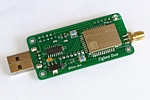
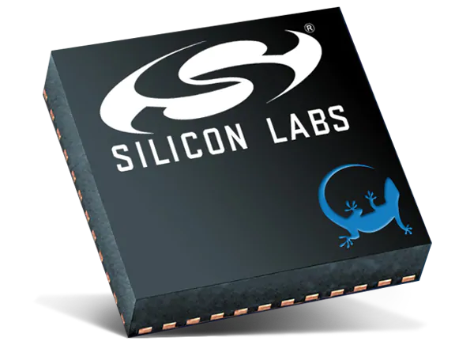

# Supported adapters

## Overview
Zigbee2MQTT officially supports the following adapters:

<div style="width: 1000px">
<table>
  <tr>
    <td><b>Picture</b></td>
    <td><b>Name</b></td>
    <td><b>Description</b></td>
    <td><b>Firmware</b></td>
    <td><b>Guides</b></td>
    <td><b>Buy</b></td>
  </tr>
  <tr>
    <td></td>
    <td>Electrolama zig-a-zig-ah! (zzh!)</td>
    <td>USB connected adapter with external antenna based on CC2652R chip</td>
    <td><a href="https://github.com/Koenkk/Z-Stack-firmware/raw/master/coordinator/Z-Stack_3.x.0/bin/CC2652R_coordinator_20210708.zip">Coordinator</a><br/> <a href="https://github.com/Koenkk/Z-Stack-firmware/raw/master/router/Z-Stack_3.x.0/bin/CC2652R_router_20210128.zip">Router</a></td>
    <td><a href="https://electrolama.com/radio-docs/#step-3-flash-the-firmware-on-your-stick">Flashing</a></td>
    <td><a href="https://www.tindie.com/products/electrolama/zzh-cc2652r-multiprotocol-rf-stick/#product-reviews">Tindie</a></td>
  </tr>
  <tr>
    <td></td>
    <td>Slaesh's CC2652RB stick</td>
    <td>USB connected adapter with external antenna. Based on CC2652RB chip</td>
    <td><a href="https://github.com/Koenkk/Z-Stack-firmware/raw/master/coordinator/Z-Stack_3.x.0/bin/CC2652RB_coordinator_20210708.zip">Coordinator</a><br/> <a href="https://github.com/Koenkk/Z-Stack-firmware/raw/master/router/Z-Stack_3.x.0/bin/CC2652RB_router_20210128.zip">Router</a></td>
    <td><a href="https://slae.sh/projects/cc2652/#flashing">Flashing</a></td>
    <td><a href="https://slae.sh/projects/cc2652/">Slae.sh</a></td>
  </tr>
  <tr>
    <td></td>
    <td>SMARTLIGHT CC2652P Zigbee USB dongle</td>
    <td>CC2652P factory-made Zigbee USB coordinator with external 6dB antenna and worldwide delivery</td>
    <td><a href="https://github.com/Koenkk/Z-Stack-firmware/raw/master/coordinator/Z-Stack_3.x.0/bin/CC1352P2_CC2652P_other_coordinator_20210708.zip">Coordinator</a><br/><a href="https://github.com/Koenkk/Z-Stack-firmware/raw/master/router/Z-Stack_3.x.0/bin/CC1352P2_CC2652P_other_router_20210128.zip">Router</a></td>
    <td><a href="https://smartlight.me/smart-home-devices/zigbee-devices/zigbee-coordinator-v4-cc2652p">Description</a><br><a href="https://smartlight.me/flashing_slzb-02">Flashing</a></td>
    <td><a href="https://www.ebay.com/itm/164928826521">eBay</a><br/><a href="https://www.aliexpress.com/item/1005002684189079.html">Aliexpress</a><br/><a href="https://smartlight.me/smart-home-devices/zigbee-devices/zigbee-coordinator-v4-cc2652p">Official store</a><br/><a href="https://t.me/smartlightme">Telegram</a></td>
  </tr>
  <tr>
    <td></td>
    <td>ZigStar Stick v4</td>
    <td>Powerfull Open source dongle with external antenna based on CC2652P</td>
    <td><a href="https://github.com/Koenkk/Z-Stack-firmware/raw/master/coordinator/Z-Stack_3.x.0/bin/CC1352P2_CC2652P_launchpad_coordinator_20210708.zip">Coordinator</a><br/> <a href="https://github.com/Koenkk/Z-Stack-firmware/raw/master/router/Z-Stack_3.x.0/bin/CC1352P2_CC2652P_launchpad_router_20210128.zip">Router</a></td>
    <td><a href="https://zig-star.com/projects/zigbee-stick-v4/">Description</a><br><a href="https://zig-star.com/radio-docs/flash-cc-bsl/">Flashing</a></td>
    <td><a href="https://zig-star.com">ZigStar Shop</a></td>
  </tr>
  <tr>
    <td></td>
    <td>ZigStar LAN Coordinator</td>
    <td>Powerfull Open source LAN Coordinator with external antenna on CC2652P</td>
    <td><a href="https://github.com/Koenkk/Z-Stack-firmware/raw/master/coordinator/Z-Stack_3.x.0/bin/CC1352P2_CC2652P_launchpad_coordinator_20210708.zip">Coordinator</a><br/> <a href="https://github.com/Koenkk/Z-Stack-firmware/raw/master/router/Z-Stack_3.x.0/bin/CC1352P2_CC2652P_launchpad_router_20210128.zip">Router</a></td>
    <td><a href="https://zig-star.com/projects/zigbee-gw-lan/">Description</a><br><a href="https://zig-star.com/radio-docs/flash-cc-bsl/">Flashing</a></td>
    <td><a href="https://zig-star.com">ZigStar Shop</a></td>
  </tr>
  <tr>
    <td></td>
    <td>ZigStar Shield</td>
    <td>Powerfull Open source Pi Shield based on CC2652P</td>
    <td><a href="https://github.com/Koenkk/Z-Stack-firmware/raw/master/coordinator/Z-Stack_3.x.0/bin/CC1352P2_CC2652P_launchpad_coordinator_20210708.zip">Coordinator</a><br/> <a href="https://github.com/Koenkk/Z-Stack-firmware/raw/master/router/Z-Stack_3.x.0/bin/CC1352P2_CC2652P_launchpad_router_20210128.zip">Router</a></td>
    <td><a href="https://zig-star.com/projects/zigbee-shield/">Description</a><br><a href="https://zig-star.com/radio-docs/flash-cc-bsl/">Flashing</a></td>
    <td><a href="https://zig-star.com">ZigStar Shop</a></td>
  </tr>
  <tr>
    <td></td>
    <td>Tube's CC2652P2 USB Coordinator</td>
    <td>Open source hardware CC2652P based USB connected adapter with external antenna and USB extension cable</td>
    <td><a href="https://github.com/Koenkk/Z-Stack-firmware/raw/master/coordinator/Z-Stack_3.x.0/bin/CC1352P2_CC2652P_launchpad_coordinator_20210708.zip">Coordinator</a><br/> <a href="https://github.com/Koenkk/Z-Stack-firmware/raw/master/router/Z-Stack_3.x.0/bin/CC1352P2_CC2652P_launchpad_router_20210128.zip">Router</a></td>
    <td><a href="https://github.com/tube0013/tube_gateways">Flashing</a></td>
    <td><a href="https://www.tubeszb.com/">Tube's ZB Store</a></td>
  </tr>
  <tr>
    <td></td>
    <td>Tube's Zigbee Gateways (CC2652P2 variant)</td>
    <td>Open source hardware CC2652P and ESP32 based Zigbee to Ethernet Coordinator</td>
    <td><a href="https://github.com/Koenkk/Z-Stack-firmware/raw/master/coordinator/Z-Stack_3.x.0/bin/CC1352P2_CC2652P_launchpad_coordinator_20210708.zip">Coordinator</a></td>
    <td><a href="https://github.com/tube0013/tube_gateways">Flashing</a></td>
    <td><a href="https://www.tubeszb.com/">Tube's ZB Store</a></td>
  </tr>
  <tr>
    <td></td>
    <td>Tube's Zigbee Tube's Zigbee PoE Serial Coordinator (CC2652P2 variant)</td>
    <td>Open source hardware CC2652P and ESP32 based Zigbee to Ethernet Coordinator powered via PoE (Power Over Ethernet)</td>
    <td><a href="https://github.com/Koenkk/Z-Stack-firmware/raw/master/coordinator/Z-Stack_3.x.0/bin/CC1352P2_CC2652P_launchpad_coordinator_20210708.zip">Coordinator</a></td>
    <td><a href="https://github.com/tube0013/tube_gateways">Flashing</a></td>
    <td><a href="https://www.tubeszb.com/">Tube's ZB Store</a></td>
  </tr>
  <tr>
    <td></td>
    <td>CircuitSetup's CC2652P2 USB Coordinator</td>
    <td>CC2652P based USB connected adapter pre-programmed with Z-Stack</td>
    <td><a href="https://github.com/Koenkk/Z-Stack-firmware/raw/master/coordinator/Z-Stack_3.x.0/bin/CC1352P2_CC2652P_launchpad_coordinator_20210708.zip">Coordinator</a><br/> <a href="https://github.com/Koenkk/Z-Stack-firmware/raw/master/router/Z-Stack_3.x.0/bin/CC1352P2_CC2652P_launchpad_router_20210128.zip">Router</a></td>
    <td><a href="https://circuitsetup.us/product/usb-zigbee-stick-z-stack-coordinator/">Flashing</a></td>
    <td><a href="https://circuitsetup.us/product/usb-zigbee-stick-z-stack-coordinator/">CircuitSetup's Store</a></td>
  </tr>
  <tr>
    <td></td>
    <td>Texas Instruments CC2531 <b>(not recommended)</b></td>
    <td>USB connected Zigbee adapter with PCB antenna</td>
    <td>
      <a href="https://github.com/Koenkk/Z-Stack-firmware/tree/master/coordinator/Z-Stack_Home_1.2/bin">Coordinator</a><br/> <a href="https://github.com/Koenkk/Z-Stack-firmware/tree/master/router/Z-Stack_Home_1.2/bin">Router</a></td>
    <td><a href="/information/flashing_the_cc2531.html">Flashing</a></td>
    <td><a href="https://www.aliexpress.com/wholesale?catId=0&initiative_id=SB_20191108075039&SearchText=cc2531">AliExpress</a></td>
  </tr>
  <tr>
    <td></td>
    <td>Texas Instruments CC2530 <b>(not recommended)</b></td>
    <td>Serial connected adapter with external antenna optionally with CC2591 or CC2592 RF frontend</td>
    <td>
      <a href="https://github.com/Koenkk/Z-Stack-firmware/tree/master/coordinator/Z-Stack_Home_1.2/bin">Coordinator</a><br/> <a href="https://github.com/Koenkk/Z-Stack-firmware/tree/master/router/Z-Stack_Home_1.2/bin">Router</a></td>
    <td><a href="/how_tos/how_to_create_a_cc2530_router.html#2-flashing-the-cc2530">Flashing</a> <a href="/information/connecting_cc2530.html">Connecting</a></td>
    <td><a href="http://www.aliexpress.com/wholesale?catId=0&initiative_id=SB_20181213104041&SearchText=cc2530">AliExpress</a> <a href="http://www.gban.cn/en/product_show.asp?id=43">GBAN</a> <a href="https://www.tindie.com/products/GiovanniCas/cc2530-cc2592-zigbee-dongle/">Tindie</a> <br/> <a href="https://www.aliexpress.com/item/1005001587860129.html">RF ZU USB</a></td>
  </tr>
  <tr>
    <td></td>
    <td>Texas Instruments CC2538 PCB</td>
    <td>Serial connected adapter with CC2592 RF Amplifier</td>
    <td>
      <a href="https://github.com/Koenkk/Z-Stack-firmware/tree/master/coordinator/Z-Stack_3.0.x/bin">Coordinator</a><br/></td>
    <td><a href="/information/flashing_the_cc2538.html">Flashing</a></td>
    <td><a href="https://www.aliexpress.com/wholesale?catId=0&initiative_id=SB_20191108075039&SearchText=cc2538">AliExpress</a> <a href="https://www.tindie.com/products/GiovanniCas/cc2538-cc2592-zigbee-dongle-new-zb30/">Tindie</a></td>
  </tr>
  <tr>
    <td></td>
    <td>Texas Instruments CC2538 HAT</td>
    <td>Raspberry pinout compatible HAT with CC2538 and optional external antenna</td>
    <td>
      <a href="https://github.com/Koenkk/Z-Stack-firmware/tree/master/coordinator/Z-Stack_3.0.x/bin">Coordinator</a><br/></td>
    <td><a href="/information/flashing_the_cc2538.html">Flashing</a></td>
    <td><a href="https://www.tindie.com/products/GiovanniCas/zigbee-hat-with-cc2538-for-raspberry/">Tindie</a></td>
  </tr>
  <tr>
    <td></td>
    <td>Gio-dot Z-Bee Duo with CC2652P</td>
    <td>3 in 1 adapter: USB Stick, PI Zero Hat, Ser2net, with external antenna and 3D printed case</td>
    <td><a href="https://github.com/Koenkk/Z-Stack-firmware/blob/master/coordinator/Z-Stack_3.x.0/bin/CC1352P2_CC2652P_other_coordinator_20210708.zip">Coordinator</a><br/> <a href="https://github.com/Koenkk/Z-Stack-firmware/blob/master/router/Z-Stack_3.x.0/bin/CC1352P2_CC2652P_other_router_20210128.zip">Router</a></td>
    <td><a href="https://github.com/Gio-dot/Z-Bee-Duo#how-to-flash">Flashing</a></td>
    <td><a href="https://www.tindie.com/products/23046/">Tindie</a></td>
  </tr>
  <tr>
    <td></td>
    <td>cod.m Zigbee CC2652P RPi Module</td>
    <td>Raspberry Pi GPIO module with CC2652P and integrated power amplifier (+20dBm)</td>
    <td><a href="https://github.com/Koenkk/Z-Stack-firmware/raw/master/coordinator/Z-Stack_3.x.0/bin/CC1352P2_CC2652P_launchpad_coordinator_20210708.zip">Coordinator</a><br/> <a href="https://github.com/Koenkk/Z-Stack-firmware/raw/master/router/Z-Stack_3.x.0/bin/CC1352P2_CC2652P_launchpad_router_20210128.zip">Router</a></td>
    <td><a href="https://github.com/codm/cc2652-raspberry-pi-module#firmware">Flashing</a></td>
    <td><a href="https://shop.codm.de/automation/zigbee/33/zigbee-cc2652p2-raspberry-pi-module">cod.m Shop</a></td>
  </tr>
  <tr>
    <td></td>
    <td>Egony Stick V4 (Ebyte ver.)</td>
    <td>Powerful CC2652P Zigbee USB dongle and Raspberry Pi GPIO module</td>
    <td><a href="https://github.com/Koenkk/Z-Stack-firmware/raw/master/coordinator/Z-Stack_3.x.0/bin/CC1352P2_CC2652P_other_coordinator_20210708.zip">Coordinator</a><br/><a href="https://github.com/Koenkk/Z-Stack-firmware/raw/master/router/Z-Stack_3.x.0/bin/CC1352P2_CC2652P_other_router_20210128.zip">Router</a></td>
    <td><a href="https://github.com/egony/cc2652p_E72-2G4M20S1E/wiki/Home-EN">Description</a><br><a href="https://github.com/egony/cc2652p_E72-2G4M20S1E/wiki/Flashing-EN">Flashing</a></td>
    <td><a href="http://t.me/Egony">Contact</a></td>
  </tr>
  <tr>
    <td></td>
    <td>Egony Stick V4 (RFSTAR ver.)</td>
    <td>Powerful CC2652P Zigbee USB dongle and Raspberry Pi GPIO module</td>
    <td><a href="https://github.com/Koenkk/Z-Stack-firmware/raw/master/coordinator/Z-Stack_3.x.0/bin/CC1352P2_CC2652P_launchpad_coordinator_20210708.zip">Coordinator</a><br/><a href="https://github.com/Koenkk/Z-Stack-firmware/raw/master/router/Z-Stack_3.x.0/bin/CC1352P2_CC2652P_launchpad_router_20210128.zip">Router</a></td>
    <td><a href="https://github.com/egony/cc2652p_cc1352p_RF-STAR/wiki/Home-EN">Description</a><br><a href="https://github.com/egony/cc2652p_E72-2G4M20S1E/wiki/Flashing-EN">Flashing</a></td>
    <td><a href="http://t.me/Egony">Contact</a></td>
  </tr>
  <tr>
    <td></td>
    <td>cyijun OpenZ3Gateway</td>
    <td>An open source Zstack3 gateway powered by ESP8266 and CC2652P modules. One costs less than 60 CNY in China.</td>
    <td><a href="https://github.com/Koenkk/Z-Stack-firmware/raw/master/coordinator/Z-Stack_3.x.0/bin/CC1352P2_CC2652P_launchpad_coordinator_20210708.zip">Coordinator</a><br/><a href="https://github.com/Koenkk/Z-Stack-firmware/raw/master/router/Z-Stack_3.x.0/bin/CC1352P2_CC2652P_launchpad_router_20210128.zip">Router</a></td>
    <td><a href="https://github.com/cyijun/OpenZ3Gateway">Description</a></td>
    <td><a href="mailto:cyjason2000@163.com">Contact</a></td>
  </tr>
  <tr>
    <td></td>
    <td>XGG 52PZ2MGateway</td>
    <td>An open source Zstack3 gateway powered by ESP8266 and CC2652P modules. One costs less than 60 CNY in China.</td>
    <td><a href="https://github.com/Koenkk/Z-Stack-firmware/raw/master/coordinator/Z-Stack_3.x.0/bin/CC1352P2_CC2652P_launchpad_coordinator_20210708.zip">Coordinator</a><br/><a href="https://github.com/Koenkk/Z-Stack-firmware/raw/master/router/Z-Stack_3.x.0/bin/CC1352P2_CC2652P_launchpad_router_20210128.zip">Router</a></td>
    <td><a href="https://z2m.wiki/">Description</a></td>
    <td><a href="https://z2m.wiki/">Contact</a></td>
  </tr> 
   <tr>
    <td></td>
    <td>XGG 38PZ2MGateway</td>
    <td>An open source zigbee gateway powered by ESP8266 and CC2538+CC2592PA modules. One costs less than 50 CNY in China.</td>
    <td><a href="https://github.com/Koenkk/Z-Stack-firmware/tree/master/coordinator/Z-Stack_3.0.x/bin">Coordinator</a><br/><a href="https://github.com/Koenkk/Z-Stack-firmware/tree/master/coordinator/Z-Stack_3.0.x/bin">Router</a></td>
    <td><a href="https://z2m.wiki/">Description</a></td>
    <td><a href="https://z2m.wiki/">Contact</a></td>
    </tr>  
    <tr>
    <td></td>
    <td>XGG 30Z2MGateway</td>
    <td>An open source zigbee gateway powered by ESP8266 and CC2530 modules. One costs less than 40 CNY in China.</td>
    <td><a href="https://github.com/Koenkk/Z-Stack-firmware/tree/master/coordinator/Z-Stack_Home_1.2/bin">Coordinator</a><br/><a href="https://github.com/Koenkk/Z-Stack-firmware/tree/master/coordinator/Z-Stack_Home_1.2/bin">Router</a></td>
    <td><a href="https://z2m.wiki/">Description</a></td>
    <td><a href="https://z2m.wiki/">Contact</a></td>
  </tr>
  <tr>
    <td></td>
    <td>Texas Instruments LAUNCHXL-CC26X2R1</td>
    <td>USB connected development kit, based on CC2652R chip</td>
    <td><a href="https://github.com/Koenkk/Z-Stack-firmware/raw/master/coordinator/Z-Stack_3.x.0/bin/CC2652R_coordinator_20210708.zip">Coordinator</a><br/> <a href="https://github.com/Koenkk/Z-Stack-firmware/raw/master/router/Z-Stack_3.x.0/bin/CC2652R_router_20210128.zip">Router</a></td>
    <td><a href="/information/flashing_via_uniflash.html">Flashing</a></td>
    <td><a href="http://www.ti.com/tool/LAUNCHXL-CC26X2R1">Texas Instruments</a></td>
  </tr>
  <tr>
    <td></td>
    <td>Texas Instruments LAUNCHXL-CC1352P-2</td>
    <td>USB connected development kit, based on CC1352P chip</td>
    <td><a href="https://github.com/Koenkk/Z-Stack-firmware/raw/master/coordinator/Z-Stack_3.x.0/bin/CC1352P2_CC2652P_launchpad_coordinator_20210708.zip">Coordinator</a><br/> <a href="https://github.com/Koenkk/Z-Stack-firmware/raw/master/router/Z-Stack_3.x.0/bin/CC1352P2_CC2652P_launchpad_router_20210128.zip">Router</a></td>
    <td><a href="/information/flashing_via_uniflash.html">Flashing</a></td>
    <td><a href="http://www.ti.com/tool/LAUNCHXL-CC1352P">Texas Instruments</a></td>
  </tr>
  <tr>
    <td></td>
    <td>ConBee II <b>(experimental)</b></td>
    <td>USB connected adapter</td>
    <td><a href="https://github.com/dresden-elektronik/deconz-rest-plugin/wiki/Update-deCONZ-manually">Coordinator</a><br/></td>
    <td><a href="https://github.com/dresden-elektronik/deconz-rest-plugin/wiki/Update-deCONZ-manually">Flashing</a></td>
    <td><a href="https://phoscon.de/en/conbee2?buy=1#buy">Phoscon</a></td>
  </tr>
  <tr>
    <td></td>
    <td>ZiGate USB-TTL <b>(experimental)</b></td>
    <td>USB connected adapter based on NXP JN516x (JN5168/JN5169), 3.1d firmware or later required</td>
    <td><a href="https://zigate.fr/tag/firmware/">Coordinator</a><br/></td>
    <td></td>
    <td><a href="https://zigate.fr/boutique/?orderby=date_desc">ZiGate</a></td>
  </tr>
  <tr>
    <td></td>
    <td>Silicon Labs EZSP v8 <b>(experimental)</b></td>
    <td>Initial development started on experimental (pre-alpha stage) support for various adapters based on Silicon Labs EM35X and EFR32MG SoC families with EmberZNet NCP 6.7.8 firmware or later via EZSP version 8 (EmberZNet Serial Protocol) interface. This include all hardware based on SoCs/Modules from Silabs EFR32MG21/MGM210 and EFR32MG12/MGM12 series.</td>
    <td><a href="https://github.com/Koenkk/zigbee-herdsman/issues/319">Coordinator</a><br/></td>
    <td></td>
    <td></td>
  </tr>
</table>
</div>

## Notes
Before buying an adapter, please read the notes below!

- Recommended adapters are the ones with a **CC2652R**, **CC2652P**, **CC2652RB** or **CC1352P** chip (e.g. the **Electrolama zig-a-zig-ah! (zzh!)**). They are very powerful, have good range, are well tested with Zigbee2MQTT and can be flashed without additional hardware.
- The following adapters require additional hardware to flash: adapters based on the **CC2530** and **CC2531** require a CC debugger and downloader cable, adapters based on the **CC2538** require a JTAG flasher.
- The adapters based on the CC2652R, CC2652RB, CC2652P and CC1352P chips are very similar to each other since (almost) the same chip is used. The differences:
  - The CC2652P and and CC1352P have a power amplifier which support up-to 20dBm output vs 5dBm on CC2652R(B).
  - The CC1352P support the sub-1 GHz frequency (which is not relevant for Zigbee since it uses 2.4 GHz), the CC2652* only supports 2.4 GHz
  - The difference between the CC2652R and CC2652RB is that the CC2652RB doesn't require a crystal on the PCB, this only relevant for the manufacturing process.
- Adapters based on the **CC2530** or **CC2531** chip are not powerful and not recommended for networks larger than 20 devices.
- Adapters that can handle large networks are; adapters using the following chips **CC2652R**, **CC2652P**, **CC2652RB**, **CC1352P**, **CC2538** and the **Conbee II**.
- Of all adapter the **Texas Instruments CC2531** has the worst range, other adapters with a PCB antenna like the **Texas Instruments LAUNCHXL-CC26X2R1** and **ConBee II** provide better range. Adapters with an external antenna have the best range.
- When migrating to another adapter make sure to modify your `pan_id` in your [configuration](configuration.md), otherwise Zigbee2MQTT won't start. Migrating to a different adapter [may require](./FAQ.md#what-does-and-does-not-require-repairing-of-all-devices) repairing all devices.
- Support for the **Conbee II** ([discussion](https://github.com/Koenkk/zigbee-herdsman/issues/72)), **ZiGate USB-TTL** ([discussion](https://github.com/Koenkk/zigbee-herdsman/issues/242)), and **Silicon Labs EZSP** ([discussion](https://github.com/Koenkk/zigbee-herdsman/issues/319)) is experimental, meaning not feature complete nor recommended for a stable enviroment.
- WiFi-based Serial-to-IP bridges are not recommended for **Silicon Labs EZSP** adapters as the serial protocol does not have enough fault-tolerance to handle packet loss or latency delays that can normally occur over WiFi connections. If cannot use a locally connected USB or UART/GPIO adapter then the recommendation is to use remote adapter that connected via Ethernet (wired) to avoid issues with EZSP caused by WiFi connections.
- When using a **Conbee II** or **ZiGate USB-TTL** and you get: `Error: Failed to connect to the adapter (Error: SRSP - SYS - ping after 6000ms)` when starting Zigbee2MQTT set the following in your `configuration.yaml`.

```yaml
serial:
  adapter: deconz # deconz for Conbee II OR "zigate" for the ZiGate USB-TTL
```

### Router
Besides serving as a coordinator some adapters can also be used as a Zigbee router (check if there is a router firmware in the firmware column). To factory reset/pair:
- Texas Instruments CC2531: Press the S2 button for 5 seconds.
- Texas Instruments CC2530: Power on/power off the device three times (power on, wait 2 seconds, power off, repeat this cycle three times).
- Adapters based on CC2652R, CC2652RB and CC1352P: single press (one of the) buttons on the device
  - Slaesh's CC2652RB stick has 2 buttons where only the one furthest away from the USB connector can be used to factory reset.

### Texas Instruments LAUNCHXL-CC1352P-2 and LAUNCHXL-CC26X2R1
- These devices have two serial devices built in. Make sure you put the right serial device in the [configuration](configuration.md) or use auto detect (completely remove the `serial` section from `configuration.yaml`) if you only have one Texas Instruments CC device connected to your system.
- An external antenna can be connected which could increase range further:
  - LAUNCHXL-CC26X2R1: Has UF.L connector for external antenna ([requires resoldering a tiny capacitor (moving C14 to C24)](http://e2e.ti.com/support/wireless-connectivity/zigbee-and-thread/f/158/t/880219?LAUNCHXL-CC26X2R1-Antenna-CC26X2R1)).
  - LAUNCHXL-CC1352P-2: Has SMA connector for external antenna ([requires resoldering a tiny capacitor](https://github.com/Koenkk/zigbee2mqtt/issues/2162#issuecomment-570286663)).
