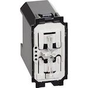
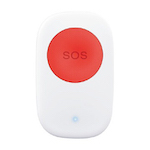
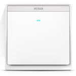
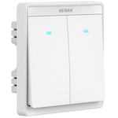
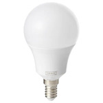
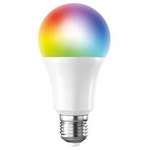
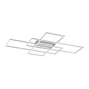
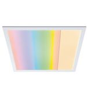
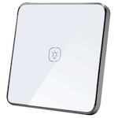
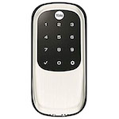

---
---
# Supported devices

*NOTE: This file has been generated, do not edit this file manually!*

Currently **644** devices are supported from **116** different vendors.

In case you own a Zigbee device which is **NOT** listed here, please see
[How to support new devices](../how_tos/how_to_support_new_devices.md).

### AXIS

| Model | Description | Picture |
| ------------- | ------------- | -------------------------- |
| [GR-ZB01-W](../devices/GR-ZB01-W.md) | AXIS Gear window shade motor (open, close, position, battery) |  |

### AduroSmart

| Model | Description | Picture |
| ------------- | ------------- | -------------------------- |
| [81809](../devices/81809.md) | AduroSmart ERIA colors and white shades smart light bulb A19 (on/off, brightness, color temperature, color xy) |  |
| [81825](../devices/81825.md) | AduroSmart ERIA smart wireless dimming switch (on, off, up, down) |  |

### Airam

| Model | Description | Picture |
| ------------- | ------------- | -------------------------- |
| [4713407](../devices/4713407.md) | Airam LED OP A60 ZB 9W/827 E27 (on/off, brightness) |  |
| [AIRAM-CTR.U](../devices/AIRAM-CTR.U.md) | Airam CTR.U remote (on/off, brightness up/down and click/hold/release) |  |

### Ajax Online

| Model | Description | Picture |
| ------------- | ------------- | -------------------------- |
| [Aj_Zigbee_Led_Strip](../devices/Aj_Zigbee_Led_Strip.md) | Ajax Online LED Strip (on/off, brightness, color xy) |  |

### Anchor

| Model | Description | Picture |
| ------------- | ------------- | -------------------------- |
| [67200BL](../devices/67200BL.md) | Anchor Vetaar smart plug (on/off) |  |

### BTicino

| Model | Description | Picture |
| ------------- | ------------- | -------------------------- |
| [K4003C](../devices/K4003C.md) | BTicino Light switch with neutral (on/off, led color) |  |

### Belkin

| Model | Description | Picture |
| ------------- | ------------- | -------------------------- |
| [F7C033](../devices/F7C033.md) | Belkin WeMo smart LED bulb (on/off, brightness) |  |

### Bitron

| Model | Description | Picture |
| ------------- | ------------- | -------------------------- |
| [AV2010/34](../devices/AV2010_34.md) | Bitron 4-Touch single click buttons (click) |  |
| [AV2010/22](../devices/AV2010_22.md) | Bitron Wireless motion detector (occupancy) |  |
| [AV2010/25](../devices/AV2010_25.md) | Bitron Video wireless socket (on/off, power measurement) |  |
| [AV2010/32](../devices/AV2010_32.md) | Bitron Wireless wall thermostat with relay (temperature, heating/cooling system control) |  |
| [AV2010/21A](../devices/AV2010_21A.md) | Bitron Compact magnetic contact sensor (contact, tamper) |  |
| [AV2010/24A](../devices/AV2010_24A.md) | Bitron Optical smoke detector (hardware version v2) (smoke, tamper and battery) |  |
| [902010/24](../devices/902010_24.md) | Bitron Optical smoke detector (hardware version v1) (smoke, tamper and battery) |  |

### Blaupunkt

| Model | Description | Picture |
| ------------- | ------------- | -------------------------- |
| [SCM-S1](../devices/SCM-S1.md) | Blaupunkt Roller shutter (open/close) |  |

### BlitzWolf

| Model | Description | Picture |
| ------------- | ------------- | -------------------------- |
| [BW-IS2](../devices/BW-IS2.md) | BlitzWolf Rechargeable Zigbee contact sensor (contact) |  |
| [BW-IS3](../devices/BW-IS3.md) | BlitzWolf Rechargeable Zigbee PIR motion sensor (occupancy) |  |

### Bosch

| Model | Description | Picture |
| ------------- | ------------- | -------------------------- |
| [RADON TriTech ZB](../devices/RADON_TriTech_ZB.md) | Bosch Wireless motion detector (occupancy and temperature) |  |
| [ISW-ZPR1-WP13](../devices/ISW-ZPR1-WP13.md) | Bosch Motion sensor (occupancy and temperature) |  |

### Busch-Jaeger

| Model | Description | Picture |
| ------------- | ------------- | -------------------------- |
| [6717-84](../devices/6717-84.md) | Busch-Jaeger Adaptor plug (on/off) |  |
| [6735/6736/6737](../devices/6735_6736_6737.md) | Busch-Jaeger Zigbee Light Link power supply/relay/dimmer (on/off) |  |

### CR Smart Home

| Model | Description | Picture |
| ------------- | ------------- | -------------------------- |
| [TS0001](../devices/TS0001.md) | CR Smart Home Valve control (control) |  |
| [TS0202](../devices/TS0202.md) | CR Smart Home Motion sensor (occupancy) |  |
| [TS0203](../devices/TS0203.md) | CR Smart Home Door sensor (contact) |  |
| [TS0204](../devices/TS0204.md) | CR Smart Home Gas sensor (gas) |  |
| [TS0205](../devices/TS0205.md) | CR Smart Home Smoke sensor (smoke) |  |
| [TS0111](../devices/TS0111.md) | CR Smart Home Socket (on/off) |  |
| [TS0207](../devices/TS0207.md) | CR Smart Home Water leak detector (water leak) |  |
| [TS0218](../devices/TS0218.md) | CR Smart Home Button (click) |  |

### CREE

| Model | Description | Picture |
| ------------- | ------------- | -------------------------- |
| [B00TN589ZG](../devices/B00TN589ZG.md) | CREE Connected bulb (on/off, brightness) |  |

### Calex

| Model | Description | Picture |
| ------------- | ------------- | -------------------------- |
| [421786](../devices/421786.md) | Calex LED A60 Zigbee GLS-lamp (on/off, brightness) |  |
| [421792](../devices/421792.md) | Calex LED A60 Zigbee RGB lamp (on/off, brightness, color temperature, color xy) |  |

### Centralite

| Model | Description | Picture |
| ------------- | ------------- | -------------------------- |
| [4256251-RZHAC](../devices/4256251-RZHAC.md) | Centralite White Swiss power outlet switch with power meter (switch and power meter) |  |
| [4257050-ZHAC](../devices/4257050-ZHAC.md) | Centralite 3-Series smart dimming outlet (on/off, brightness, power measurement) |  |
| [3323-G](../devices/3323-G.md) | Centralite Micro-door sensor (contact, temperature) |  |

### Climax

| Model | Description | Picture |
| ------------- | ------------- | -------------------------- |
| [PSS-23ZBS](../devices/PSS-23ZBS.md) | Climax Power plug (on/off) |  |
| [SCM-5ZBS](../devices/SCM-5ZBS.md) | Climax Roller shutter (open/close) |  |
| [PSM-29ZBSR](../devices/PSM-29ZBSR.md) | Climax Power plug (on/off) |  |

### Commercial Electric

| Model | Description | Picture |
| ------------- | ------------- | -------------------------- |
| [53170161](../devices/53170161.md) | Commercial Electric Matte White Recessed Retrofit Smart Led Downlight - 4 Inch (on/off, brightness, color temperature) |  |

### Custom devices (DiY)

| Model | Description | Picture |
| ------------- | ------------- | -------------------------- |
| [CC2530.ROUTER](../devices/CC2530.ROUTER.md) | Custom devices (DiY) [CC2530 router](http://ptvo.info/cc2530-based-zigbee-coordinator-and-router-112/) (state, description, type, rssi) |  |
| [ptvo.switch](../devices/ptvo.switch.md) | Custom devices (DiY) [Multi-channel relay switch](https://ptvo.info/zigbee-switch-configurable-firmware-router-199/) (hold, single, double and triple click, on/off) |  |
| [DNCKATSW001](../devices/DNCKATSW001.md) | Custom devices (DiY) [DNCKAT single key wired wall light switch](https://github.com/dzungpv/dnckatsw00x/) (on/off) |  |
| [DNCKATSW002](../devices/DNCKATSW002.md) | Custom devices (DiY) [DNCKAT double key wired wall light switch](https://github.com/dzungpv/dnckatsw00x/) (hold/release, on/off) |  |
| [DNCKATSW003](../devices/DNCKATSW003.md) | Custom devices (DiY) [DNCKAT triple key wired wall light switch](https://github.com/dzungpv/dnckatsw00x/) (hold/release, on/off) |  |
| [DNCKATSW004](../devices/DNCKATSW004.md) | Custom devices (DiY) [DNCKAT quadruple key wired wall light switch](https://github.com/dzungpv/dnckatsw00x/) (hold/release, on/off) |  |
| [ZigUP](../devices/ZigUP.md) | Custom devices (DiY) [CC2530 based ZigBee relais, switch, sensor and router](https://github.com/formtapez/ZigUP/) (relais, RGB-stripe, sensors, S0-counter, ADC, digital I/O) |  |
| [ZWallRemote0](../devices/ZWallRemote0.md) | Custom devices (DiY) Matts Wall Switch Remote (https://github.com/mattlokes/ZWallRemote) (on/off) |  |
| [DTB190502A1](../devices/DTB190502A1.md) | Custom devices (DiY) [CC2530 based IO Board https://databyte.ch/?portfolio=zigbee-erstes-board-dtb190502a) (switch, buttons) |  |

### DIYRuZ

| Model | Description | Picture |
| ------------- | ------------- | -------------------------- |
| [DIYRuZ_R4_5](../devices/DIYRuZ_R4_5.md) | DIYRuZ [DiY 4 Relays + 4 switches + 1 buzzer](http://modkam.ru/?p=1054) (on/off) |  |
| [DIYRuZ_KEYPAD20](../devices/DIYRuZ_KEYPAD20.md) | DIYRuZ [DiY 20 button keypad](http://modkam.ru/?p=1114) (click) |  |
| [DIYRuZ_magnet](../devices/DIYRuZ_magnet.md) | DIYRuZ [DIYRuZ contact sensor](https://modkam.ru/?p=1220) (contact) |  |
| [DIYRuZ_rspm](../devices/DIYRuZ_rspm.md) | DIYRuZ [DIYRuZ relay switch power meter](https://modkam.ru/?p=1309) (relay, switch, adc) |  |

### Danalock

| Model | Description | Picture |
| ------------- | ------------- | -------------------------- |
| [V3-BTZB](../devices/V3-BTZB.md) | Danalock BT/ZB smartlock (lock/unlock, battery) |  |

### Dawon DNS

| Model | Description | Picture |
| ------------- | ------------- | -------------------------- |
| [PM-C140-ZB](../devices/PM-C140-ZB.md) | Dawon DNS IOT remote control smart buried-type outlet (on/off, power and energy measurement) |  |
| [PM-B530-ZB](../devices/PM-B530-ZB.md) | Dawon DNS IOT smart plug 16A (on/off, power and energy measurement) |  |
| [PM-B430-ZB](../devices/PM-B430-ZB.md) | Dawon DNS IOT smart plug 10A (on/off, power and energy measurement) |  |
| [PM-S140-ZB](../devices/PM-S140-ZB.md) | Dawon DNS IOT smart switch 1 gang (on/off) |  |
| [PM-S240-ZB](../devices/PM-S240-ZB.md) | Dawon DNS IOT smart switch 2 gang (on/off) |  |
| [PM-S340-ZB](../devices/PM-S340-ZB.md) | Dawon DNS IOT smart switch 3 gang (on/off) |  |

### Dresden Elektronik

| Model | Description | Picture |
| ------------- | ------------- | -------------------------- |
| [Mega23M12](../devices/Mega23M12.md) | Dresden Elektronik ZigBee Light Link wireless electronic ballast (on/off, brightness, color temperature, color xy) |  |
| [XVV-Mega23M12](../devices/XVV-Mega23M12.md) | Dresden Elektronik ZigBee Light Link wireless electronic ballast color temperature (on/off, brightness, color temperature) |  |

### EDP

| Model | Description | Picture |
| ------------- | ------------- | -------------------------- |
| [PLUG EDP RE:DY](../devices/PLUG_EDP_RE_DY.md) | EDP re:dy plug (on/off, power measurement) |  |
| [SWITCH EDP RE:DY](../devices/SWITCH_EDP_RE_DY.md) | EDP re:dy switch (on/off) |  |

### ELKO

| Model | Description | Picture |
| ------------- | ------------- | -------------------------- |
| [316GLEDRF](../devices/316GLEDRF.md) | ELKO ZigBee in-wall smart dimmer (on/off, brightness) |  |

### EcoDim

| Model | Description | Picture |
| ------------- | ------------- | -------------------------- |
| [Eco-Dim.07](../devices/Eco-Dim.07.md) | EcoDim Zigbee & Z-wave dimmer  (on/off, brightness) |  |

### EcoSmart

| Model | Description | Picture |
| ------------- | ------------- | -------------------------- |
| [A9A19A60WESDZ02](../devices/A9A19A60WESDZ02.md) | EcoSmart Tuneable white (A19) (on/off, brightness, color temperature) |  |
| [D1821](../devices/D1821.md) | EcoSmart A19 RGB bulb (on/off, brightness, color temperature, color xy) |  |
| [D1531](../devices/D1531.md) | EcoSmart A19 bright white bulb (on/off, brightness) |  |
| [D1532](../devices/D1532.md) | EcoSmart A19 soft white bulb (on/off, brightness) |  |
| [D1542](../devices/D1542.md) | EcoSmart GU10 adjustable white bulb (on/off, brightness, color temperature) |  |
| [D1533](../devices/D1533.md) | EcoSmart PAR20 bright white bulb (on/off, brightness) |  |

### Eurotronic

| Model | Description | Picture |
| ------------- | ------------- | -------------------------- |
| [SPZB0001](../devices/SPZB0001.md) | Eurotronic Spirit Zigbee wireless heater thermostat (temperature, heating system control) |  |

### Feibit

| Model | Description | Picture |
| ------------- | ------------- | -------------------------- |
| [TZSW22FW-L4](../devices/TZSW22FW-L4.md) | Feibit Smart light switch - 2 gang (on/off) |  |

### GE

| Model | Description | Picture |
| ------------- | ------------- | -------------------------- |
| [PSB19-SW27](../devices/PSB19-SW27.md) | GE Link smart LED light bulb, A19 soft white (2700K) (on/off, brightness) |  |
| [22670](../devices/22670.md) | GE Link smart LED light bulb, A19/BR30 soft white (2700K) (on/off, brightness) |  |
| [45852GE](../devices/45852GE.md) | GE ZigBee plug-in smart dimmer (on/off, brightness) |  |
| [45853GE](../devices/45853GE.md) | GE Plug-in smart switch (on/off, power measurement) |  |
| [45856GE](../devices/45856GE.md) | GE In-wall smart switch (on/off) |  |
| [45857GE](../devices/45857GE.md) | GE ZigBee in-wall smart dimmer (on/off, brightness) |  |
| [PTAPT-WH02](../devices/PTAPT-WH02.md) | GE Quirky smart switch (on/off) |  |

### GMY Smart Bulb

| Model | Description | Picture |
| ------------- | ------------- | -------------------------- |
| [B07KG5KF5R](../devices/B07KG5KF5R.md) | GMY Smart Bulb GMY Smart bulb, 470lm, vintage dimmable, 2700-6500k, E27 (on/off, brightness, color temperature) |  |

### GS

| Model | Description | Picture |
| ------------- | ------------- | -------------------------- |
| [BDHM8E27W70-I1](../devices/BDHM8E27W70-I1.md) | GS Active light, warm to cool white (E27 & B22) (on/off, brightness, color temperature) |  |

### Gira

| Model | Description | Picture |
| ------------- | ------------- | -------------------------- |
| [2430-100](../devices/2430-100.md) | Gira ZigBee Light Link wall transmitter (action) |  |

### Gledopto

| Model | Description | Picture |
| ------------- | ------------- | -------------------------- |
| [GL-C-007/GL-C-008](../devices/GL-C-007_GL-C-008.md) | Gledopto Zigbee LED controller RGB + CCT or RGBW (on/off, brightness, color temperature or white, color) |  |
| [GL-C-006](../devices/GL-C-006.md) | Gledopto Zigbee LED controller WW/CW (on/off, brightness, color temperature) |  |
| [GL-C-007](../devices/GL-C-007.md) | Gledopto Zigbee LED controller RGBW (on/off, brightness, color, white) |  |
| [GL-C-007S](../devices/GL-C-007S.md) | Gledopto Zigbee LED controller RGBW plus model (on/off, brightness, color, white) |  |
| [GL-C-008](../devices/GL-C-008.md) | Gledopto Zigbee LED controller RGB + CCT (on/off, brightness, color temperature, color) |  |
| [GL-C-008S](../devices/GL-C-008S.md) | Gledopto Zigbee LED controller RGB + CCT plus model (on/off, brightness, color temperature, color) |  |
| [GL-C-009](../devices/GL-C-009.md) | Gledopto Zigbee LED controller dimmer (on/off, brightness) |  |
| [GL-MC-001](../devices/GL-MC-001.md) | Gledopto Zigbee USB mini LED controller RGB + CCT (on/off, brightness, color temperature, color) |  |
| [GL-S-004Z](../devices/GL-S-004Z.md) | Gledopto Zigbee Smart WW/CW GU10 (on/off, brightness, color temperature) |  |
| [GL-S-007Z](../devices/GL-S-007Z.md) | Gledopto Smart RGBW GU10 (on/off, brightness, color, white) |  |
| [GL-S-007ZS](../devices/GL-S-007ZS.md) | Gledopto Smart RGB+CCT GU10 (on/off, brightness, color, color temperature) |  |
| [GL-S-008Z](../devices/GL-S-008Z.md) | Gledopto Soposh dual white and color  (on/off, brightness, color temperature, color) |  |
| [GL-B-001Z](../devices/GL-B-001Z.md) | Gledopto Smart 4W E14 RGB / CCT LED bulb (on/off, brightness, color temperature, color) |  |
| [GL-G-001Z](../devices/GL-G-001Z.md) | Gledopto Smart garden lamp (on/off, brightness, color temperature, color) |  |
| [GL-G-007Z](../devices/GL-G-007Z.md) | Gledopto Smart garden lamp 9W RGB / CCT (on/off, brightness, color temperature, color) |  |
| [GL-B-007Z](../devices/GL-B-007Z.md) | Gledopto Smart 6W E27 RGB / CCT LED bulb (on/off, brightness, color temperature, color) |  |
| [GL-B-007ZS](../devices/GL-B-007ZS.md) | Gledopto Smart+ 6W E27 RGB / CCT LED bulb (on/off, brightness, color temperature, color) |  |
| [GL-B-008Z](../devices/GL-B-008Z.md) | Gledopto Smart 12W E27 RGB / CCT LED bulb (on/off, brightness, color temperature, color) |  |
| [GL-B-008ZS](../devices/GL-B-008ZS.md) | Gledopto Smart 12W E27 RGB / CW LED bulb (on/off, brightness, color temperature, color) |  |
| [GL-D-003Z](../devices/GL-D-003Z.md) | Gledopto LED RGB + CCT downlight  (on/off, brightness, color temperature, color) |  |
| [GL-D-004ZS](../devices/GL-D-004ZS.md) | Gledopto LED RGB + CCT downlight plus version 9W (on/off, brightness, color temperature, color) |  |
| [GL-D-005Z](../devices/GL-D-005Z.md) | Gledopto LED RGB + CCT downlight  (on/off, brightness, color temperature, color) |  |
| [GL-S-003Z](../devices/GL-S-003Z.md) | Gledopto Smart RGBW GU10  (on/off, brightness, color, white) |  |
| [GL-S-005Z](../devices/GL-S-005Z.md) | Gledopto Smart RGBW MR16 (on/off, brightness, color, white) |  |
| [GD-CZ-006](../devices/GD-CZ-006.md) | Gledopto Zigbee LED Driver (on/off, brightness) |  |
| [GL-FL-004TZ](../devices/GL-FL-004TZ.md) | Gledopto Zigbee 10W floodlight RGB CCT (on/off, brightness, color temperature, color) |  |
| [GL-W-001Z](../devices/GL-W-001Z.md) | Gledopto Zigbee ON/OFF Wall Switch (on/off) |  |
| [GL-D-003ZS](../devices/GL-D-003ZS.md) | Gledopto Smart+ 6W LED spot (on/off, brightness, color temperature, color) |  |

### HEIMAN

| Model | Description | Picture |
| ------------- | ------------- | -------------------------- |
| [HS1CA-M](../devices/HS1CA-M.md) | HEIMAN Smart carbon monoxide sensor (carbon monoxide) |  |
| [HS3MS](../devices/HS3MS.md) | HEIMAN Smart motion sensor (occupancy) |  |
| [HS2SK](../devices/HS2SK.md) | HEIMAN Smart metering plug (on/off, power measurement) |  |
| [HS1SA-M](../devices/HS1SA-M.md) | HEIMAN Smoke detector (smoke) |  |
| [HS3SA](../devices/HS3SA.md) | HEIMAN Smoke detector (smoke) |  |
| [HS3CG](../devices/HS3CG.md) | HEIMAN Combustible gas sensor (gas) |  |
| [HS1CG-M](../devices/HS1CG-M.md) | HEIMAN Combustible gas sensor (gas) |  |
| [HS1CG_M](../devices/HS1CG_M.md) | HEIMAN Combustible gas sensor (gas) |  |
| [HS1DS/HS3DS](../devices/HS1DS_HS3DS.md) | HEIMAN Door sensor (contact) |  |
| [HEIMAN-M1](../devices/HEIMAN-M1.md) | HEIMAN Door sensor (contact) |  |
| [HS1DS-E](../devices/HS1DS-E.md) | HEIMAN Door sensor (contact) |  |
| [HS1WL/HS3WL](../devices/HS1WL_HS3WL.md) | HEIMAN Water leakage sensor (water leak) |  |
| [HS1-WL-E](../devices/HS1-WL-E.md) | HEIMAN Water leakage sensor (water leak) |  |
| [HS1CA-E](../devices/HS1CA-E.md) | HEIMAN Smart carbon monoxide sensor (carbon monoxide) |  |
| [HS2WD-E](../devices/HS2WD-E.md) | HEIMAN Smart siren (warning) |  |
| [SOHM-I1](../devices/SOHM-I1.md) | HEIMAN Door contact sensor (contact) |  |
| [SWHM-I1](../devices/SWHM-I1.md) | HEIMAN Water leakage sensor (water leak) |  |
| [SMHM-I1](../devices/SMHM-I1.md) | HEIMAN Smart motion sensor (occupancy) |  |
| [HS1HT](../devices/HS1HT.md) | HEIMAN Smart temperature & humidity Sensor (temperature and humidity) |  |
| [SKHMP30-I1](../devices/SKHMP30-I1.md) | HEIMAN Smart metering plug (on/off, power measurement) |  |
| [HS2ESK-E](../devices/HS2ESK-E.md) | HEIMAN Smart in wall plug (on/off, power measurement) |  |
| [SGMHM-I1](../devices/SGMHM-I1.md) | HEIMAN Combustible gas sensor (gas) |  |
| [STHM-I1H](../devices/STHM-I1H.md) | HEIMAN Heiman temperature & humidity sensor (temperature and humidity) |  |
| [HS1EB](../devices/HS1EB.md) | HEIMAN Smart emergency button (click) |  |
| [HM-900SW_1](../devices/HM-900SW_1.md) | HEIMAN Smart switch - 1 gang with neutral wire (on/off) |  |
| [HM-900SW_2](../devices/HM-900SW_2.md) | HEIMAN Smart switch - 2 gang with neutral wire (on/off) |  |
| [HM-900SW_3](../devices/HM-900SW_3.md) | HEIMAN Smart switch - 3 gang with neutral wire (on/off) |  |

### HORNBACH

| Model | Description | Picture |
| ------------- | ------------- | -------------------------- |
| [10011725](../devices/10011725.md) | HORNBACH FLAIR Viyu Smarte LED bulb RGB E27 (on/off, brightness, color temperature, color xy) |  |

### Hampton Bay

| Model | Description | Picture |
| ------------- | ------------- | -------------------------- |
| [99432](../devices/99432.md) | Hampton Bay Universal wink enabled white ceiling fan premier remote control (on/off, brightness, fan_mode and fan_state) |  |
| [54668161](../devices/54668161.md) | Hampton Bay 12 in. LED smart puff (on/off, brightness, color temperature) |  |

### Hej

| Model | Description | Picture |
| ------------- | ------------- | -------------------------- |
| [GLSK3ZB-1711](../devices/GLSK3ZB-1711.md) | Hej Goqual 1 gang Switch (on/off) |  |
| [GLSK3ZB-1712](../devices/GLSK3ZB-1712.md) | Hej Goqual 2 gang Switch (on/off) |  |
| [GLSK3ZB-1713](../devices/GLSK3ZB-1713.md) | Hej Goqual 3 gang Switch (on/off) |  |
| [GLSK6ZB-1714](../devices/GLSK6ZB-1714.md) | Hej Goqual 4 gang Switch (on/off) |  |
| [GLSK6ZB-1715](../devices/GLSK6ZB-1715.md) | Hej Goqual 5 gang Switch (on/off) |  |
| [GLSK6ZB-1716](../devices/GLSK6ZB-1716.md) | Hej Goqual 6 gang Switch (on/off) |  |

### Hive

| Model | Description | Picture |
| ------------- | ------------- | -------------------------- |
| [HALIGHTDIMWWE27](../devices/HALIGHTDIMWWE27.md) | Hive Active smart bulb white LED (E27) (on/off, brightness) |  |
| [HALIGHTDIMWWB22](../devices/HALIGHTDIMWWB22.md) | Hive Active smart bulb white LED (B22) (on/off, brightness) |  |
| [1613V](../devices/1613V.md) | Hive Active plug (on/off, power measurement) |  |
| [HV-GSCXZB269](../devices/HV-GSCXZB269.md) | Hive Active light cool to warm white (E26)  (on/off, brightness, color temperature) |  |
| [HV-GSCXZB279_HV-GSCXZB229](../devices/HV-GSCXZB279_HV-GSCXZB229.md) | Hive Active light, warm to cool white (E27 & B22) (on/off, brightness, color temperature) |  |
| [HV-GUCXZB5](../devices/HV-GUCXZB5.md) | Hive Active light, warm to cool white (GU10) (on/off, brightness, color temperature) |  |
| [UK7004240](../devices/UK7004240.md) | Hive Radiator valve (temperature) |  |
| [SLR1b](../devices/SLR1b.md) | Hive Heating thermostat (thermostat, occupied heating, weekly schedule) |  |
| [WPT1](../devices/WPT1.md) | Hive Heating thermostat remote control (none, communicate via thermostat) |  |

### Honyar

| Model | Description | Picture |
| ------------- | ------------- | -------------------------- |
| [U86K31ND6](../devices/U86K31ND6.md) | Honyar 3 gang switch  (on/off) |  |

### IKEA

| Model | Description | Picture |
| ------------- | ------------- | -------------------------- |
| [LED1545G12](../devices/LED1545G12.md) | IKEA TRADFRI LED bulb E26/E27 980 lumen, dimmable, white spectrum, opal white (on/off, brightness, color temperature) |  |
| [LED1546G12](../devices/LED1546G12.md) | IKEA TRADFRI LED bulb E26/E27 950 lumen, dimmable, white spectrum, clear (on/off, brightness, color temperature) |  |
| [LED1623G12](../devices/LED1623G12.md) | IKEA TRADFRI LED bulb E27 1000 lumen, dimmable, opal white (on/off, brightness) |  |
| [LED1537R6](../devices/LED1537R6.md) | IKEA TRADFRI LED bulb GU10 400 lumen, dimmable, white spectrum (on/off, brightness, color temperature) |  |
| [LED1650R5](../devices/LED1650R5.md) | IKEA TRADFRI LED bulb GU10 400 lumen, dimmable (on/off, brightness) |  |
| [LED1536G5](../devices/LED1536G5.md) | IKEA TRADFRI LED bulb E12/E14 400 lumen, dimmable, white spectrum, opal white (on/off, brightness, color temperature) |  |
| [LED1903C5](../devices/LED1903C5.md) | IKEA TRADFRI bulb E14 WS 470 lumen, dimmable, white spectrum, opal white (on/off, brightness, color temperature) |  |
| [LED1837R5](../devices/LED1837R5.md) | IKEA TRADFRI LED bulb GU10 400 lumen, dimmable (on/off, brightness) |  |
| [LED1842G3](../devices/LED1842G3.md) | IKEA TRADFRI LED bulb E27 WW clear 250 lumen, dimmable (on/off, brightness) |  |
| [LED1733G7](../devices/LED1733G7.md) | IKEA TRADFRI LED bulb E14 600 lumen, dimmable, white spectrum, opal white (on/off, brightness, color temperature) |  |
| [LED1622G12](../devices/LED1622G12.md) | IKEA TRADFRI LED bulb E26 1000 lumen, dimmable, opal white (on/off, brightness) |  |
| [LED1624G9](../devices/LED1624G9.md) | IKEA TRADFRI LED bulb E14/E26/E27 600 lumen, dimmable, color, opal white (on/off, brightness, color xy) |  |
| [LED1649C5](../devices/LED1649C5.md) | IKEA TRADFRI LED bulb E12/E14/E17 400 lumen, dimmable warm white, chandelier opal (on/off, brightness) |  |
| [LED1732G11](../devices/LED1732G11.md) | IKEA TRADFRI LED bulb E27 1000 lumen, dimmable, white spectrum, opal white (on/off, brightness, color temperature) |  |
| [LED1836G9](../devices/LED1836G9.md) | IKEA TRADFRI LED bulb E26/E27 806 lumen, dimmable, warm white (on/off, brightness) |  |
| [LED1736G9](../devices/LED1736G9.md) | IKEA TRADFRI LED bulb E27 806 lumen, dimmable, white spectrum, clear (on/off, brightness, color temperature) |  |
| [T1820](../devices/T1820.md) | IKEA LEPTITER Recessed spot light, dimmable, white spectrum (on/off, brightness, color temperature) |  |
| [ICTC-G-1](../devices/ICTC-G-1.md) | IKEA TRADFRI wireless dimmer (brightness [0-255] (quick rotate for instant 0/255), action) |  |
| [ICPSHC24-10EU-IL-1](../devices/ICPSHC24-10EU-IL-1.md) | IKEA TRADFRI driver for wireless control (10 watt) (on/off, brightness) |  |
| [ICPSHC24-30EU-IL-1](../devices/ICPSHC24-30EU-IL-1.md) | IKEA TRADFRI driver for wireless control (30 watt) (on/off, brightness) |  |
| [L1527](../devices/L1527.md) | IKEA FLOALT LED light panel, dimmable, white spectrum (30x30 cm) (on/off, brightness, color temperature) |  |
| [L1529](../devices/L1529.md) | IKEA FLOALT LED light panel, dimmable, white spectrum (60x60 cm) (on/off, brightness, color temperature) |  |
| [L1528](../devices/L1528.md) | IKEA FLOALT LED light panel, dimmable, white spectrum (30x90 cm) (on/off, brightness, color temperature) |  |
| [L1531](../devices/L1531.md) | IKEA SURTE door light panel, dimmable, white spectrum (38x64 cm) (on/off, brightness, color temperature) |  |
| [E1603/E1702](../devices/E1603_E1702.md) | IKEA TRADFRI control outlet (on/off) |  |
| [E1524/E1810](../devices/E1524_E1810.md) | IKEA TRADFRI remote control (toggle, arrow left/right click/hold/release, brightness up/down click/hold/release) |  |
| [E1743](../devices/E1743.md) | IKEA TRADFRI ON/OFF switch (on, off, brightness up/down/stop) |  |
| [E1744](../devices/E1744.md) | IKEA SYMFONISK sound controller (volume up/down, play/pause, skip forward/backward) |  |
| [E1525/E1745](../devices/E1525_E1745.md) | IKEA TRADFRI motion sensor (occupancy) |  |
| [E1746](../devices/E1746.md) | IKEA TRADFRI signal repeater (linkquality) |  |
| [E1757](../devices/E1757.md) | IKEA FYRTUR roller blind (open, close, stop, position) |  |
| [E1926](../devices/E1926.md) | IKEA KADRILJ roller blind (open, close, stop, position) |  |
| [E1766](../devices/E1766.md) | IKEA TRADFRI open/close remote (click) |  |
| [T1828](../devices/T1828.md) | IKEA GUNNARP panel round (on/off, brightness, color temperature) |  |
| [T1829](../devices/T1829.md) | IKEA GUNNARP panel 40*40 (on/off, brightness, color temperature) |  |
| [LED1738G7](../devices/LED1738G7.md) | IKEA TRADFRI LED bulb E12 600 lumen, dimmable, white spectrum, opal white (on/off, brightness, color temperature) |  |

### Iluminize

| Model | Description | Picture |
| ------------- | ------------- | -------------------------- |
| [511.10](../devices/511.10.md) | Iluminize Zigbee LED-Controller  (on/off, brightness) |  |
| [511.201](../devices/511.201.md) | Iluminize ZigBee 3.0 Dimm-Aktor mini 1x 230V (on/off, brightness) |  |
| [511.012](../devices/511.012.md) | Iluminize Zigbee LED-Controller  (on/off, brightness) |  |
| [511.202](../devices/511.202.md) | Iluminize Zigbee 3.0 Schalt-Aktor mini 1x230V, 200W/400W (on/off) |  |

### Immax

| Model | Description | Picture |
| ------------- | ------------- | -------------------------- |
| [07005B](../devices/07005B.md) | Immax Neo SMART LED E14 5W warm white, dimmable, Zigbee 3.0 (on/off, brightness) |  |
| [07004D](../devices/07004D.md) | Immax Neo SMART LED E27 8,5W color, dimmable, Zigbee 3.0 (on/off, brightness, color temperature, color xy) |  |
| [07046L](../devices/07046L.md) | Immax 4-Touch single click buttons (action) |  |
| [07045L](../devices/07045L.md) | Immax Magnetic contact sensor (contact, tamper) |  |
| [07048L](../devices/07048L.md) | Immax NEO SMART plug (on/off, power and energy measurement) |  |

### Innr

| Model | Description | Picture |
| ------------- | ------------- | -------------------------- |
| [FL 130 C](../devices/FL_130_C.md) | Innr Color Flex LED strip (on/off, brightness, color temperature, color xy) |  |
| [BF 263](../devices/BF_263.md) | Innr B22 filament bulb dimmable (on/off, brightness) |  |
| [RB 185 C](../devices/RB_185_C.md) | Innr E27 bulb RGBW (on/off, brightness, color temperature, color xy) |  |
| [BY 185 C](../devices/BY_185_C.md) | Innr B22 bulb RGBW (on/off, brightness, color temperature, color xy) |  |
| [RB 250 C](../devices/RB_250_C.md) | Innr E14 bulb RGBW (on/off, brightness, color temperature, color xy) |  |
| [RB 265](../devices/RB_265.md) | Innr E27 bulb (on/off, brightness) |  |
| [RF 265](../devices/RF_265.md) | Innr E27 bulb filament clear (on/off, brightness) |  |
| [RB 278 T](../devices/RB_278_T.md) | Innr Smart bulb tunable white E27 (on/off, brightness, color temperature) |  |
| [RB 285 C](../devices/RB_285_C.md) | Innr E27 bulb RGBW (on/off, brightness, color temperature, color xy) |  |
| [BY 285 C](../devices/BY_285_C.md) | Innr B22 bulb RGBW (on/off, brightness, color temperature, color xy) |  |
| [RB 165](../devices/RB_165.md) | Innr E27 bulb (on/off, brightness) |  |
| [RB 162](../devices/RB_162.md) | Innr E27 bulb (on/off, brightness) |  |
| [RB 175 W](../devices/RB_175_W.md) | Innr E27 bulb warm dimming (on/off, brightness) |  |
| [RB 178 T](../devices/RB_178_T.md) | Innr Smart bulb tunable white E27 (on/off, brightness, color temperature) |  |
| [BY 178 T](../devices/BY_178_T.md) | Innr Smart bulb tunable white B22 (on/off, brightness, color temperature) |  |
| [RS 122](../devices/RS_122.md) | Innr GU10 spot (on/off, brightness) |  |
| [RS 125](../devices/RS_125.md) | Innr GU10 spot (on/off, brightness) |  |
| [RS 225](../devices/RS_225.md) | Innr GU10 Spot (on/off, brightness) |  |
| [RS 128 T](../devices/RS_128_T.md) | Innr GU10 spot 350 lm, dimmable, white spectrum (on/off, brightness, color temperature) |  |
| [RS 228 T](../devices/RS_228_T.md) | Innr GU10 spot 350 lm, dimmable, white spectrum (on/off, brightness, color temperature) |  |
| [RS 230 C](../devices/RS_230_C.md) | Innr GU10 spot 350 lm, dimmable, RGBW (on/off, brightness, color temperature, color xy) |  |
| [RB 145](../devices/RB_145.md) | Innr E14 candle (on/off, brightness) |  |
| [RB 245](../devices/RB_245.md) | Innr E14 candle (on/off, brightness) |  |
| [RB 248 T](../devices/RB_248_T.md) | Innr E14 candle with white spectrum (on/off, brightness, color temperature) |  |
| [RB 148 T](../devices/RB_148_T.md) | Innr E14 candle with white spectrum (on/off, brightness, color temperature) |  |
| [RF 263](../devices/RF_263.md) | Innr E27 filament bulb dimmable (on/off, brightness) |  |
| [BY 165](../devices/BY_165.md) | Innr B22 bulb dimmable (on/off, brightness) |  |
| [PL 110](../devices/PL_110.md) | Innr Puck Light (on/off, brightness) |  |
| [ST 110](../devices/ST_110.md) | Innr Strip Light (on/off, brightness) |  |
| [UC 110](../devices/UC_110.md) | Innr Under cabinet light (on/off, brightness) |  |
| [DL 110 N](../devices/DL_110_N.md) | Innr Spot narrow (on/off, brightness) |  |
| [DL 110 W](../devices/DL_110_W.md) | Innr Spot wide (on/off, brightness) |  |
| [SL 110 N](../devices/SL_110_N.md) | Innr Spot Flex narrow (on/off, brightness) |  |
| [SL 110 M](../devices/SL_110_M.md) | Innr Spot Flex medium (on/off, brightness) |  |
| [SL 110 W](../devices/SL_110_W.md) | Innr Spot Flex wide (on/off, brightness) |  |
| [SP 120](../devices/SP_120.md) | Innr Smart plug (on/off, power measurement) |  |
| [SP 222](../devices/SP_222.md) | Innr Smart plug (on/off) |  |
| [SP 224](../devices/SP_224.md) | Innr Smart plug (on/off) |  |

### Iris

| Model | Description | Picture |
| ------------- | ------------- | -------------------------- |
| [3210-L](../devices/3210-L.md) | Iris Smart plug (on/off, power measurement) |  |
| [3326-L](../devices/3326-L.md) | Iris Motion and temperature sensor (occupancy and temperature) |  |
| [3320-L](../devices/3320-L.md) | Iris Contact and temperature sensor (contact and temperature) |  |
| [iL07_1](../devices/iL07_1.md) | Iris Motion Sensor (motion, tamper and battery) |  |

### JIAWEN

| Model | Description | Picture |
| ------------- | ------------- | -------------------------- |
| [K2RGBW01](../devices/K2RGBW01.md) | JIAWEN Wireless Bulb E27 9W RGBW (on/off, brightness, color temperature, color xy) |  |

### Keen Home

| Model | Description | Picture |
| ------------- | ------------- | -------------------------- |
| [SV01](../devices/SV01.md) | Keen Home Smart vent (open, close, position, temperature, pressure, battery) |  |
| [SV02](../devices/SV02.md) | Keen Home Smart vent (open, close, position, temperature, pressure, battery) |  |

### Konke

| Model | Description | Picture |
| ------------- | ------------- | -------------------------- |
| [2AJZ4KPKEY](../devices/2AJZ4KPKEY.md) | Konke Multi-function button (single, double and long click) |  |
| [2AJZ4KPBS](../devices/2AJZ4KPBS.md) | Konke Motion sensor (occupancy) |  |
| [2AJZ4KPFT](../devices/2AJZ4KPFT.md) | Konke Temperature and humidity sensor (temperature and humidity) |  |
| [2AJZ4KPDR](../devices/2AJZ4KPDR.md) | Konke Contact sensor (contact) |  |
| [LH07321](../devices/LH07321.md) | Konke Water detector (water_leak) |  |

### Ksentry Electronics

| Model | Description | Picture |
| ------------- | ------------- | -------------------------- |
| [KS-SM001](../devices/KS-SM001.md) | Ksentry Electronics [Zigbee OnOff Controller](http://ksentry.manufacturer.globalsources.com/si/6008837134660/pdtl/ZigBee-module/1162731630/zigbee-on-off-controller-modules.htm) (on/off) |  |

### Kwikset

| Model | Description | Picture |
| ------------- | ------------- | -------------------------- |
| [66492-001](../devices/66492-001.md) | Kwikset Home connect smart lock conversion kit (lock/unlock, battery) |  |

### Leedarson

| Model | Description | Picture |
| ------------- | ------------- | -------------------------- |
| [ZM350STW1TCF](../devices/ZM350STW1TCF.md) | Leedarson LED PAR16 50 GU10 tunable white (on/off, brightness, color temperature) |  |
| [M350STW1](../devices/M350STW1.md) | Leedarson LED PAR16 50 GU10 (on/off, brightness) |  |
| [A806S-Q1R](../devices/A806S-Q1R.md) | Leedarson LED E27 tunable white (on/off, brightness) |  |
| [ZA806SQ1TCF](../devices/ZA806SQ1TCF.md) | Leedarson LED E27 tunable white (on/off, brightness, color temperature) |  |
| [6ARCZABZH](../devices/6ARCZABZH.md) | Leedarson 4-Key Remote Controller (on/off, brightness up/down and click/hold/release, cct) |  |

### Legrand

| Model | Description | Picture |
| ------------- | ------------- | -------------------------- |
| [067776](../devices/067776.md) | Legrand Netatmo wired shutter switch (open, close, stop, position, tilt) |  |
| [067773](../devices/067773.md) | Legrand Wireless remote switch (action) |  |
| [067771](../devices/067771.md) | Legrand Wired switch without neutral (on/off) |  |
| [067775](../devices/067775.md) | Legrand Power socket with power consumption monitoring (on/off, power measurement) |  |
| [064888](../devices/064888.md) | Legrand Wired micromodule switch (on/off) |  |
| [064873](../devices/064873.md) | Legrand Home & away switch / master switch (action) |  |

### Leviton

| Model | Description | Picture |
| ------------- | ------------- | -------------------------- |
| [DL15S-1BZ](../devices/DL15S-1BZ.md) | Leviton Lumina RF 15A switch, 120/277V (on/off) |  |

### LifeControl

| Model | Description | Picture |
| ------------- | ------------- | -------------------------- |
| [LifeControl_Leak_Sensor](../devices/LifeControl_Leak_Sensor.md) | LifeControl Water leak switch (water leak) |  |
| [LifeControl_Door_Sensor](../devices/LifeControl_Door_Sensor.md) | LifeControl Door sensor (contact) |  |
| [LifeControl_RGB_Led](../devices/LifeControl_RGB_Led.md) | LifeControl RGB LED lamp (on/off, brightness, color temperature, color xy) |  |

### Linkind

| Model | Description | Picture |
| ------------- | ------------- | -------------------------- |
| [ZL1000100-CCT-US-V1A02](../devices/ZL1000100-CCT-US-V1A02.md) | Linkind Zigbee LED 9W A19 bulb, dimmable & tunable (on/off, brightness) |  |
| [ZL1000400-CCT-EU-2-V1A02](../devices/ZL1000400-CCT-EU-2-V1A02.md) | Linkind Zigbee LED 5.4W C35 bulb E14, dimmable & tunable (on/off, brightness, color temperature) |  |

### LivingWise

| Model | Description | Picture |
| ------------- | ------------- | -------------------------- |
| [LVS-ZB500D](../devices/LVS-ZB500D.md) | LivingWise ZigBee smart dimmer switch (on/off, brightness) |  |
| [LVS-ZB15S](../devices/LVS-ZB15S.md) | LivingWise ZigBee smart in-wall switch (on/off) |  |
| [LVS-SM10ZW](../devices/LVS-SM10ZW.md) | LivingWise Door or window contact switch (contact) |  |
| [LVS-SN10ZW_SN11](../devices/LVS-SN10ZW_SN11.md) | LivingWise Occupancy sensor (occupancy) |  |
| [LVS-ZB15R](../devices/LVS-ZB15R.md) | LivingWise Zigbee smart outlet (on/off) |  |
| [LVS-SC7](../devices/LVS-SC7.md) | LivingWise Scene controller  (action) |  |

### Livolo

| Model | Description | Picture |
| ------------- | ------------- | -------------------------- |
| [TI0001](../devices/TI0001.md) | Livolo Zigbee switch (1 and 2 gang) [work in progress](https://github.com/Koenkk/zigbee2mqtt/issues/592) (on/off) |  |

### Lonhonso

| Model | Description | Picture |
| ------------- | ------------- | -------------------------- |
| [X702](../devices/TS0002.md) | Lonhonso 2 gang switch (white-label of TuYa TS0002) (on/off) |  |

### Lonsonho

| Model | Description | Picture |
| ------------- | ------------- | -------------------------- |
| [4000116784070](../devices/4000116784070.md) | Lonsonho Smart plug EU (on/off) |  |

### Lupus

| Model | Description | Picture |
| ------------- | ------------- | -------------------------- |
| [12031](../devices/12031.md) | Lupus Roller shutter (open/close) |  |
| [LS12128](../devices/LS12128.md) | Lupus Roller shutter (open/close) |  |
| [12050](../devices/12050.md) | Lupus LUPUSEC mains socket with power meter (on/off, power measurement) |  |
| [12126](../devices/12126.md) | Lupus 1 chanel relay (on/off) |  |

### Lutron

| Model | Description | Picture |
| ------------- | ------------- | -------------------------- |
| [LZL4BWHL01](../devices/LZL4BWHL01.md) | Lutron Connected bulb remote control (on/off, brightness) |  |
| [Z3-1BRL](../devices/Z3-1BRL.md) | Lutron Aurora smart bulb dimmer (brightness) |  |

### M-ELEC

| Model | Description | Picture |
| ------------- | ------------- | -------------------------- |
| [ML-ST-D200](../devices/ML-ST-D200.md) | M-ELEC Stitchy Dim switchable wall module (on/off, brightness) |  |

### MOES

| Model | Description | Picture |
| ------------- | ------------- | -------------------------- |
| [ZK-EU-2U](../devices/ZK-EU-2U.md) | MOES ZigBee3.0 dual USB wireless socket plug (on/off) |  |

### Meazon

| Model | Description | Picture |
| ------------- | ------------- | -------------------------- |
| [MEAZON_BIZY_PLUG](../devices/MEAZON_BIZY_PLUG.md) | Meazon Bizy plug meter (on/off, power, energy measurement and temperature) |  |
| [MEAZON_DINRAIL](../devices/MEAZON_DINRAIL.md) | Meazon DinRail 1-phase meter (on/off, power, energy measurement and temperature) |  |

### Müller Licht

| Model | Description | Picture |
| ------------- | ------------- | -------------------------- |
| [404000/404005/404012](../devices/404000_404005_404012.md) | Müller Licht Tint LED bulb GU10/E14/E27 350/470/806 lumen, dimmable, color, opal white (on/off, brightness, color temperature, color xy) |  |
| [404006/404008/404004](../devices/404006_404008_404004.md) | Müller Licht Tint LED bulb GU10/E14/E27 350/470/806 lumen, dimmable, opal white (on/off, brightness, color temperature) |  |
| [44435](../devices/44435.md) | Müller Licht Tint LED Stripe, color, opal white (on/off, brightness, color temperature, color xy) |  |
| [404028](../devices/404028.md) | Müller Licht Tint LED Panel, color, opal white (on/off, brightness, color temperature, color xy) |  |
| [MLI-404011](../devices/MLI-404011.md) | Müller Licht Tint remote control (toggle, brightness, other buttons are not supported yet!) |  |
| [404021](../devices/404021.md) | Müller Licht Tint smart switch (on/off) |  |

### NET2GRID

| Model | Description | Picture |
| ------------- | ------------- | -------------------------- |
| [N2G-SP](../devices/N2G-SP.md) | NET2GRID White Net2Grid power outlet switch with power meter (on/off, power measurement) |  |

### Namron

| Model | Description | Picture |
| ------------- | ------------- | -------------------------- |
| [4512700](../devices/4512700.md) | Namron ZigBee dimmer 400W (on/off, brightness) |  |
| [4512704](../devices/4512704.md) | Namron Zigbee switch 400W (on/off) |  |
| [1402755](../devices/1402755.md) | Namron ZigBee LED dimmer (on/off, brightness) |  |
| [4512703](../devices/4512703.md) | Namron Zigbee 4 channel switch K8 (action) |  |
| [4512702](../devices/4512702.md) | Namron Zigbee 1 channel switch K4 (action) |  |

### Nanoleaf

| Model | Description | Picture |
| ------------- | ------------- | -------------------------- |
| [NL08-0800](../devices/NL08-0800.md) | Nanoleaf Smart Ivy Bulb E27 (on/off, brightness) |  |

### Netvox

| Model | Description | Picture |
| ------------- | ------------- | -------------------------- |
| [Z809A](../devices/Z809A.md) | Netvox Power socket with power consumption monitoring (on/off, power measurement) |  |

### Ninja Blocks

| Model | Description | Picture |
| ------------- | ------------- | -------------------------- |
| [Z809AF](../devices/Z809AF.md) | Ninja Blocks Zigbee smart plug with power meter (on/off, power measurement) |  |

### Nordtronic

| Model | Description | Picture |
| ------------- | ------------- | -------------------------- |
| [98425031](../devices/98425031.md) | Nordtronic Box Dimmer 2.0 (on/off, brightness) |  |

### Norklmes

| Model | Description | Picture |
| ------------- | ------------- | -------------------------- |
| [MKS-CM-W5](../devices/MKS-CM-W5.md) | Norklmes 1, 2, 3 or 4 gang switch (on/off) |  |

### Nue / 3A

| Model | Description | Picture |
| ------------- | ------------- | -------------------------- |
| [HGZB-1S](../devices/HGZB-1S.md) | Nue / 3A Smart 1 key scene wall switch (on/off, click) |  |
| [HGZB-02S](../devices/HGZB-02S.md) | Nue / 3A Smart 2 key scene wall switch (on/off, click) |  |
| [HGZB-045](../devices/HGZB-045.md) | Nue / 3A Smart 4 key scene wall switch (on/off, click) |  |
| [LXZB-02A](../devices/LXZB-02A.md) | Nue / 3A Smart light controller (on/off, brightness) |  |
| [HGZB-43](../devices/HGZB-43.md) | Nue / 3A Smart light switch - 3 gang v2.0 (on/off) |  |
| [HGZB-043](../devices/HGZB-043.md) | Nue / 3A Smart light switch - 3 gang (on/off) |  |
| [HGZB-04D / HGZB-4D-UK](../devices/HGZB-04D___HGZB-4D-UK.md) | Nue / 3A Smart dimmer wall switch (on/off, brightness) |  |
| [HGZB-042](../devices/HGZB-042.md) | Nue / 3A Smart light switch - 2 gang (on/off) |  |
| [HGZB-42](../devices/HGZB-42.md) | Nue / 3A Smart light switch - 2 gang v2.0 (on/off) |  |
| [HGZB-20A](../devices/HGZB-20A.md) | Nue / 3A Power plug (on/off) |  |
| [HGZB-41](../devices/HGZB-41.md) | Nue / 3A Smart one gang wall switch (on/off) |  |
| [MG-AUWS01](../devices/MG-AUWS01.md) | Nue / 3A Smart Double GPO (on/off) |  |
| [XY12S-15](../devices/XY12S-15.md) | Nue / 3A Smart light controller RGBW (on/off, brightness, color temperature, color xy) |  |
| [HGZB-01A](../devices/HGZB-01A.md) | Nue / 3A Smart in-wall switch (on/off) |  |
| [HGZB-02A](../devices/HGZB-02A.md) | Nue / 3A Smart light controller (on/off, brightness) |  |
| [HGZB-42-UK / HGZB-41 / HGZB-41-UK](../devices/HGZB-42-UK___HGZB-41___HGZB-41-UK.md) | Nue / 3A Smart switch 1 or 2 gang (on/off) |  |
| [HGZB-06A](../devices/HGZB-06A.md) | Nue / 3A Smart 7W E27 light bulb (on/off, brightness, color temperature, color xy) |  |
| [HGZB-20-UK](../devices/HGZB-20-UK.md) | Nue / 3A Power plug (on/off) |  |
| [HGZB-DLC4-N12B](../devices/HGZB-DLC4-N12B.md) | Nue / 3A RGB LED downlight (on/off, brightness, color temperature, color xy) |  |

### Nyce

| Model | Description | Picture |
| ------------- | ------------- | -------------------------- |
| [NCZ-3011-HA](../devices/NCZ-3011-HA.md) | Nyce Door/window sensor (motion, humidity and temperature) |  |
| [NCZ-3043-HA](../devices/NCZ-3043-HA.md) | Nyce Ceiling motion sensor (motion, humidity and temperature) |  |
| [NCZ-3041-HA](../devices/NCZ-3041-HA.md) | Nyce Wall motion sensor (motion, humidity and temperature) |  |
| [NCZ-3045-HA](../devices/NCZ-3045-HA.md) | Nyce Curtain motion sensor (motion, humidity and temperature) |  |

### ORVIBO

| Model | Description | Picture |
| ------------- | ------------- | -------------------------- |
| [CR11S8UZ](../devices/CR11S8UZ.md) | ORVIBO Smart sticker switch (click, hold, release) |  |
| [T18W3Z](../devices/T18W3Z.md) | ORVIBO Neutral smart switch 3 gang (on/off) |  |
| [SM10ZW](../devices/SM10ZW.md) | ORVIBO Door or window contact switch (contact) |  |

### OSRAM

| Model | Description | Picture |
| ------------- | ------------- | -------------------------- |
| [4058075816718](../devices/4058075816718.md) | OSRAM SMART+ outdoor wall lantern RGBW (on/off, brightness, color temperature, color xy) |  |
| [4058075816732](../devices/4058075816732.md) | OSRAM SMART+ outdoor lantern RGBW (on/off, brightness, color temperature, color xy) |  |
| [AA69697](../devices/AA69697.md) | OSRAM Classic A60 RGBW (on/off, brightness, color temperature, color xy) |  |
| [AC10787](../devices/AC10787.md) | OSRAM SMART+ classic E27 TW (on/off, brightness, color temperature) |  |
| [AC03645](../devices/AC03645.md) | OSRAM LIGHTIFY LED CLA60 E27 RGBW (on/off, brightness, color temperature, color xy) |  |
| [AC03642](../devices/AC03642.md) | OSRAM SMART+ CLASSIC A 60 TW (on/off, brightness, color temperature) |  |
| [AC08560](../devices/AC08560.md) | OSRAM SMART+ LED PAR16 GU10 (on/off, brightness) |  |
| [AC10786-DIM](../devices/AC10786-DIM.md) | OSRAM SMART+ classic E27 dimmable (on/off, brightness) |  |
| [AC03647](../devices/AC03647.md) | OSRAM SMART+ LED CLASSIC E27 RGBW (on/off, brightness, color temperature, color xy) |  |
| [AA70155](../devices/AA70155.md) | OSRAM LIGHTIFY LED A19 tunable white / Classic A60 TW (on/off, brightness, color temperature) |  |
| [AA68199](../devices/AA68199.md) | OSRAM LIGHTIFY LED PAR16 50 GU10 tunable white (on/off, brightness, color temperature) |  |
| [AB32840](../devices/AB32840.md) | OSRAM LIGHTIFY LED Classic B40 tunable white (on/off, brightness, color temperature) |  |
| [4058075816794](../devices/4058075816794.md) | OSRAM Smart+ Ceiling TW (on/off, brightness, color temperature) |  |
| [AC03641](../devices/AC03641.md) | OSRAM LIGHTIFY LED Classic A60 clear (on/off, brightness) |  |
| [4052899926158](../devices/4052899926158.md) | OSRAM LIGHTIFY Surface Light TW (on/off, brightness) |  |
| [AB401130055](../devices/AB401130055.md) | OSRAM LIGHTIFY Surface Light LED Tunable White (on/off, brightness, color temperature) |  |
| [AB3257001NJ](../devices/AB3257001NJ.md) | OSRAM Smart+ plug (on/off) |  |
| [AC10691](../devices/AC10691.md) | OSRAM Smart+ plug (on/off) |  |
| [4052899926110](../devices/4052899926110.md) | OSRAM Flex RGBW (on/off, brightness, color temperature, color xy) |  |
| [4058075036185](../devices/4058075036185.md) | OSRAM Outdoor Flex RGBW (on/off, brightness, color temperature, color xy) |  |
| [4058075036147](../devices/4058075036147.md) | OSRAM Smart+ gardenpole 8.7W RGBW (on/off, brightness, color temperature, color xy) |  |
| [4058075047853](../devices/4058075047853.md) | OSRAM Smart+ gardenpole 4W RGBW (on/off, brightness, color temperature, color xy) |  |
| [AC0363900NJ](../devices/AC0363900NJ.md) | OSRAM Smart+ mini gardenpole RGBW (on/off, brightness, color temperature, color xy) |  |
| [AB35996](../devices/AB35996.md) | OSRAM Smart+ Spot GU10 Multicolor (on/off, brightness, color temperature, color xy) |  |
| [AC08559](../devices/AC08559.md) | OSRAM SMART+ Spot GU10 Multicolor (on/off, brightness, color temperature, color xy) |  |
| [AC08562](../devices/AC08562.md) | OSRAM SMART+ Candle E14 Dimmable White (on/off, brightness) |  |
| [AC01353010G](../devices/AC01353010G.md) | OSRAM SMART+ Motion Sensor (occupancy, tamper and temperature) |  |
| [AC03648](../devices/AC03648.md) | OSRAM SMART+ spot GU5.3 tunable white (on/off, brightness, color temperature) |  |
| [AC0251100NJ/AC0251700NJ](../devices/AC0251100NJ_AC0251700NJ.md) | OSRAM Smart+ switch mini (circle, up, down and hold/release) |  |
| [ST8AU-CON](../devices/ST8AU-CON.md) | OSRAM OSRAM SubstiTUBE T8 Advanced UO Connected (on/off, brightness) |  |
| [595UGR22](../devices/595UGR22.md) | OSRAM OSRAM LED panel TW 595 UGR22 (on/off, brightness, color temperature) |  |

### Oujiabao

| Model | Description | Picture |
| ------------- | ------------- | -------------------------- |
| [CR701-YZ](../devices/CR701-YZ.md) | Oujiabao Gas and carbon monoxide alarm (gas and carbon monoxide) |  |

### PEQ

| Model | Description | Picture |
| ------------- | ------------- | -------------------------- |
| [3300-P](../devices/3300-P.md) | PEQ Door & window contact sensor (contact, temperature) |  |

### Paul Neuhaus

| Model | Description | Picture |
| ------------- | ------------- | -------------------------- |
| [100.424.11](../devices/100.424.11.md) | Paul Neuhaus Q-INIGO LED ceiling light (on/off, brightness, color temperature) |  |
| [8195-55](../devices/8195-55.md) | Paul Neuhaus Q-Inigo ceiling light, Smart-Home (on/off, brightness, color temperature) |  |
| [100.110.39](../devices/100.110.39.md) | Paul Neuhaus Q-FLAG LED Panel, Smart-Home RGBW (on/off, brightness, color temperature, color xy) |  |
| [100.425.90](../devices/100.425.90.md) | Paul Neuhaus Q-PLUG adapter plug with night orientation light (on/off) |  |
| [100.110.51](../devices/100.110.51.md) | Paul Neuhaus Q-FLAG LED panel, Smart-Home CCT (on/off, brightness, color temperature) |  |

### Paulmann

| Model | Description | Picture |
| ------------- | ------------- | -------------------------- |
| [50043](../devices/50043.md) | Paulmann SmartHome Zigbee Cephei Switch Controller (on/off) |  |
| [50044/50045](../devices/50044_50045.md) | Paulmann SmartHome Zigbee Dimmer or LED-stripe (on/off, brightness) |  |
| [50049](../devices/50049.md) | Paulmann SmartHome Yourled RGB Controller (on/off, brightness, color temperature, color xy) |  |
| [50064](../devices/50064.md) | Paulmann SmartHome led spot (on/off, brightness, color temperature) |  |
| [371000001](../devices/371000001.md) | Paulmann SmartHome led spot tuneable white (on/off, brightness, color temperature) |  |
| [798.09](../devices/798.09.md) | Paulmann LED panel Amaris 595x595mm 35W matt white (on/off, brightness, color temperature, color xy) |  |
| [798.15](../devices/798.15.md) | Paulmann SmartHome Zigbee Pendulum Light Aptare (on/off, brightness) |  |
| [500.48](../devices/500.48.md) | Paulmann SmartHome Zigbee YourLED dim/switch controller max. 60 W (on/off, brightness) |  |
| [93999](../devices/93999.md) | Paulmann Plug Shine Zigbee controller (on/off, brightness) |  |

### Philips

| Model | Description | Picture |
| ------------- | ------------- | -------------------------- |
| [4034031P7](../devices/4034031P7.md) | Philips Hue Fair (on/off, brightness, color temperature, power-on behavior) |  |
| [3306431P7](../devices/3306431P7.md) | Philips Hue Struana (on/off, brightness, color temperature, power-on behavior) |  |
| [5900131C5](../devices/5900131C5.md) | Philips Hue Aphelion downlight (on/off, brightness, color temperature, power-on behavior) |  |
| [7299760PH](../devices/7299760PH.md) | Philips Hue Bloom (on/off, brightness, color xy, power-on behavior) |  |
| [4090331P9](../devices/4090331P9.md) | Philips Hue Ensis (on/off, brightness, color temperature, color xy, power-on behavior) |  |
| [7146060PH](../devices/7146060PH.md) | Philips Hue Go (on/off, brightness, color temperature, color xy, power-on behavior) |  |
| [9290022411](../devices/9290022411.md) | Philips White single filament bulb A19 E26 with Bluetooth (on/off, brightness, power-on behavior) |  |
| [929002277501](../devices/929002277501.md) | Philips Hue white A19 bulb E26 bluetooth (on/off, brightness, power-on behavior) |  |
| [7602031P7](../devices/7602031P7.md) | Philips Hue Go with Bluetooth (on/off, brightness, color temperature, color xy, power-on behavior) |  |
| [8718696167991](../devices/8718696167991.md) | Philips Hue Calla outdoor (on/off, brightness, color temperature, color xy, power-on behavior) |  |
| [4090531P7](../devices/4090531P7.md) | Philips Hue Flourish white and color ambiance ceiling light (on/off, brightness, color temperature, color xy, power-on behavior) |  |
| [929001953101](../devices/929001953101.md) | Philips Hue White and Color Ambiance GU10 (on/off, brightness, color temperature, color xy, power-on behavior) |  |
| [8718699688820](../devices/8718699688820.md) | Philips Hue Filament Standard A60/E27 bluetooth (on/off, brightness, power-on behavior) |  |
| [548727](../devices/548727.md) | Philips Hue White and Color Ambiance BR30 with bluetooth (on/off, brightness, color temperature, color xy, power-on behavior) |  |
| [433714](../devices/433714.md) | Philips Hue Lux A19 bulb E27 (on/off, brightness, power-on behavior) |  |
| [9290011370](../devices/9290011370.md) | Philips Hue white A60 bulb E27 (on/off, brightness, power-on behavior) |  |
| [8718699673147](../devices/8718699673147.md) | Philips Hue white A60 bulb E27 bluetooth (on/off, brightness, power-on behavior) |  |
| [9290018215](../devices/9290018215.md) | Philips Hue white A19 bulb E26 bluetooth (on/off, brightness, power-on behavior) |  |
| [9290022169](../devices/9290022169.md) | Philips Hue white ambiance E27 with Bluetooth (on/off, brightness, color temperature, power-on behavior) |  |
| [4090631P7](../devices/4090631P7.md) | Philips Hue Flourish white and color ambiance pendant light (on/off, brightness, color temperature, color xy, power-on behavior) |  |
| [8718696449691](../devices/8718696449691.md) | Philips Hue White Single bulb B22 (on/off, brightness, power-on behavior) |  |
| [9290018195](../devices/9290018195.md) | Philips Hue white GU10 (on/off, brightness, power-on behavior) |  |
| [LWG004](../devices/LWG004.md) | Philips Hue white GU10 bluetooth (on/off, brightness, power-on behavior) |  |
| [8718699688882](../devices/8718699688882.md) | Philips Hue white Filament bulb G93 E27 bluetooth (on/off, brightness, power-on behavior) |  |
| [7299355PH](../devices/7299355PH.md) | Philips Hue white and color ambiance LightStrip (on/off, brightness, color xy, power-on behavior) |  |
| [915005106701](../devices/915005106701.md) | Philips Hue white and color ambiance LightStrip plus (on/off, brightness, color temperature, color xy, power-on behavior) |  |
| [9290018187B](../devices/9290018187B.md) | Philips Hue white and color ambiance LightStrip Outdoor (on/off, brightness, color temperature, color xy, power-on behavior) |  |
| [9290022166](../devices/9290022166.md) | Philips Hue white and color ambiance E26/E27 (on/off, brightness, color temperature, color xy, power-on behavior) |  |
| [9290012573A](../devices/9290012573A.md) | Philips Hue white and color ambiance E26/E27/E14 (on/off, brightness, color temperature, color xy, power-on behavior) |  |
| [9290002579A](../devices/9290002579A.md) | Philips Hue white and color ambiance BR30 (on/off, brightness, color temperature, color xy, power-on behavior) |  |
| [8718696485880](../devices/8718696485880.md) | Philips Hue white and color ambiance GU10 (on/off, brightness, color temperature, color xy, power-on behavior) |  |
| [915005733701](../devices/915005733701.md) | Philips Hue White and color ambiance Play Lightbar (on/off, brightness, color temperature, color xy, power-on behavior) |  |
| [464800](../devices/464800.md) | Philips Hue white ambiance BR30 flood light (on/off, brightness, color temperature, power-on behavior) |  |
| [8718696695203](../devices/8718696695203.md) | Philips Hue white ambiance E14 (on/off, brightness, color temperature, power-on behavior) |  |
| [9290020399](../devices/9290020399.md) | Philips Hue white E14 (on/off, brightness, power-on behavior) |  |
| [8718696598283](../devices/8718696598283.md) | Philips Hue white ambiance GU10 (on/off, brightness, color temperature, power-on behavior) |  |
| [929001953301](../devices/929001953301.md) | Philips Hue white ambiance GU10 with Bluetooth (on/off, brightness, color temperature, power-on behavior) |  |
| [9290011998B](../devices/9290011998B.md) | Philips Hue white ambiance E26 (on/off, brightness, color temperature, power-on behavior) |  |
| [9290022167](../devices/9290022167.md) | Philips Hue white ambiance E26 with Bluetooth (on/off, brightness, color temperature, power-on behavior) |  |
| [8718696548738](../devices/8718696548738.md) | Philips Hue white ambiance E26/E27 (on/off, brightness, color temperature, power-on behavior) |  |
| [915005587401](../devices/915005587401.md) | Philips Hue white ambiance Adore light (on/off, brightness, color temperature, power-on behavior) |  |
| [3402831P7](../devices/3402831P7.md) | Philips Hue white ambiance bathroom mirror light Adore (on/off, brightness, color temperature, power-on behavior) |  |
| [3435011P7](../devices/3435011P7.md) | Philips Hue white ambiance bathroom ceiling light Adore (on/off, brightness, color temperature, power-on behavior) |  |
| [4503848C5](../devices/4503848C5.md) | Philips Hue White ambiance Muscari pendant light (on/off, brightness, color temperature, power-on behavior) |  |
| [4090130P7](../devices/4090130P7.md) | Philips Hue Sana (on/off, brightness, color temperature, color xy, power-on behavior) |  |
| [3261030P7](../devices/3261030P7.md) | Philips Hue Being (on/off, brightness, color temperature, power-on behavior) |  |
| [3261331P7](../devices/3261331P7.md) | Philips Hue white ambiance Still (on/off, brightness, color temperature, power-on behavior) |  |
| [4096730U7](../devices/4096730U7.md) | Philips Hue Cher ceiling light (on/off, brightness, color temperature, power-on behavior) |  |
| [3216131P5](../devices/3216131P5.md) | Philips Hue white ambiance Aurelle square panel light (on/off, brightness, color temperature, power-on behavior) |  |
| [3216331P5](../devices/3216331P5.md) | Philips Hue white ambiance Aurelle rectangle panel light (on/off, brightness, color temperature, power-on behavior) |  |
| [3216431P5](../devices/3216431P5.md) | Philips Hue white ambiance Aurelle round panel light (on/off, brightness, color temperature, power-on behavior) |  |
| [4033930P7](../devices/4033930P7.md) | Philips Hue white ambiance suspension Fair (on/off, brightness, color temperature, power-on behavior) |  |
| [4023330P7](../devices/4023330P7.md) | Philips Hue white ambiance suspension Amaze (on/off, brightness, color temperature, power-on behavior) |  |
| [9290011370B](../devices/9290011370B.md) | Philips Hue white A60 bulb E27 (on/off, brightness, power-on behavior) |  |
| [046677476816](../devices/046677476816.md) | Philips Hue white PAR38 outdoor (on/off, brightness, power-on behavior) |  |
| [7199960PH](../devices/7199960PH.md) | Philips Hue Iris (on/off, brightness, color xy, power-on behavior) |  |
| [1742930P7](../devices/1742930P7.md) | Philips Hue outdoor Impress wall lamp (on/off, brightness, color temperature, color xy, power-on behavior) |  |
| [1743230P7](../devices/1743230P7.md) | Philips Hue outdoor Impress lantern (on/off, brightness, color temperature, color xy, power-on behavior) |  |
| [7099930PH](../devices/7099930PH.md) | Philips Hue Iris (Generation 2) (on/off, brightness, color xy, power-on behavior) |  |
| [324131092621](../devices/324131092621.md) | Philips Hue dimmer switch (on/off, brightness, up/down/hold/release, click count) |  |
| [8718699693985](../devices/8718699693985.md) | Philips Hue smart button (action) |  |
| [9290012607](../devices/9290012607.md) | Philips Hue motion sensor (occupancy, temperature, illuminance) |  |
| [9290019758](../devices/9290019758.md) | Philips Hue motion outdoor sensor (occupancy, temperature, illuminance) |  |
| [929002240401](../devices/929002240401.md) | Philips Hue smart plug - EU (on/off) |  |
| [046677552343](../devices/046677552343.md) | Philips Hue smart plug bluetooth (on/off) |  |
| [7099860PH](../devices/7099860PH.md) | Philips LivingColors Aura (on/off, brightness, color xy, power-on behavior) |  |
| [3216231P5](../devices/3216231P5.md) | Philips Hue white ambiance Aurelle rectangle panel light (on/off, brightness, color temperature, power-on behavior) |  |
| [8718696170625](../devices/8718696170625.md) | Philips Hue Fuzo outdoor wall light (on/off, brightness, power-on behavior) |  |
| [17436/30/P7](../devices/17436_30_P7.md) | Philips Hue Welcome white flood light (on/off, brightness, power-on behavior) |  |
| [17435/30/P7](../devices/17435_30_P7.md) | Philips Hue Discover white and color ambiance flood light (on/off, brightness, color xy, power-on behavior) |  |
| [1741830P7](../devices/1741830P7.md) | Philips Hue Lily outdoor spot light (on/off, brightness, color temperature, color xy, power-on behavior) |  |
| [929002241201](../devices/929002241201.md) | Philips Hue white filament Edison E27 LED (on/off, brightness, power-on behavior) |  |
| [046677551780](../devices/046677551780.md) | Philips Hue white filament Edison ST19 LED (on/off, brightness, power-on behavior) |  |
| [3115331PH](../devices/3115331PH.md) | Philips Phoenix light (on/off, brightness, color temperature, color xy, power-on behavior) |  |

### Piri

| Model | Description | Picture |
| ------------- | ------------- | -------------------------- |
| [HSIO18008](../devices/HSIO18008.md) | Piri Combustible gas sensor (gas) |  |

### RGB Genie

| Model | Description | Picture |
| ------------- | ------------- | -------------------------- |
| [ZGRC-KEY-013](../devices/ZGRC-KEY-013.md) | RGB Genie 3 Zone remote and dimmer (click) |  |

### ROBB

| Model | Description | Picture |
| ------------- | ------------- | -------------------------- |
| [ROB_200-004-0](../devices/ROB_200-004-0.md) | ROBB ZigBee AC phase-cut dimmer (on/off, brightness) |  |
| [ROB_200-003-0](../devices/ROB_200-003-0.md) | ROBB Zigbee AC in wall switch (on/off) |  |
| [ROB_200-014-0](../devices/ROB_200-014-0.md) | ROBB ZigBee AC phase-cut rotary dimmer (on/off, brightness) |  |
| [ROB_200-007-0](../devices/ROB_200-007-0.md) | ROBB Zigbee 8 button wall switch (action) |  |

### SONOFF

| Model | Description | Picture |
| ------------- | ------------- | -------------------------- |
| [BASICZBR3](../devices/BASICZBR3.md) | SONOFF Zigbee smart switch (on/off) |  |
| [S31ZB](../devices/S31ZB.md) | SONOFF Zigbee smart plug (US version) (on/off) |  |

### Salus

| Model | Description | Picture |
| ------------- | ------------- | -------------------------- |
| [SP600](../devices/SP600.md) | Salus Smart plug (on/off, power measurement) |  |

### Schneider Electric

| Model | Description | Picture |
| ------------- | ------------- | -------------------------- |
| [WV704R0A0902](../devices/WV704R0A0902.md) | Schneider Electric Wiser radiator thermostat (temperature, battery, keypad lock, heating demand) |  |
| [U202DST600ZB](../devices/U202DST600ZB.md) | Schneider Electric EZinstall3 2 gang 2x300W dimmer module (on/off, brightness) |  |
| [U201DST600ZB](../devices/U201DST600ZB.md) | Schneider Electric EZinstall3 1 gang 550W dimmer module (on/off, brightness) |  |
| [U201SRY2KWZB](../devices/U201SRY2KWZB.md) | Schneider Electric Ulti 240V 9.1 A 1 gang relay switch impress switch module, amber LED (on/off) |  |
| [U202SRY2KWZB](../devices/U202SRY2KWZB.md) | Schneider Electric Ulti 240V 9.1 A 2 gangs relay switch impress switch module, amber LED (on/off) |  |

### Securifi

| Model | Description | Picture |
| ------------- | ------------- | -------------------------- |
| [PP-WHT-US](../devices/PP-WHT-US.md) | Securifi Peanut Smart Plug (on/off, power measurement) |  |
| [B01M7Y8BP9](../devices/B01M7Y8BP9.md) | Securifi Almond Click multi-function button (single, double and long click) |  |

### Sengled

| Model | Description | Picture |
| ------------- | ------------- | -------------------------- |
| [E11-G13](../devices/E11-G13.md) | Sengled Element Classic (A19) (on/off, brightness) |  |
| [E11-G23/E11-G33](../devices/E11-G23_E11-G33.md) | Sengled Element Classic (A60) (on/off, brightness) |  |
| [Z01-CIA19NAE26](../devices/Z01-CIA19NAE26.md) | Sengled Element Touch (A19) (on/off, brightness) |  |
| [Z01-A19NAE26](../devices/Z01-A19NAE26.md) | Sengled Element Plus (A19) (on/off, brightness, color temperature) |  |
| [Z01-A60EAE27](../devices/Z01-A60EAE27.md) | Sengled Element Plus (A60) (on/off, brightness, color temperature) |  |
| [E11-N1EA](../devices/E11-N1EA.md) | Sengled Element Plus Color (A19) (on/off, brightness, color temperature, color xy) |  |
| [E11-U2E](../devices/E11-U2E.md) | Sengled Element color plus E27 (on/off, brightness, color temperature, color xy) |  |
| [E12-N14](../devices/E12-N14.md) | Sengled Element Classic (BR30) (on/off, brightness) |  |
| [E1ACA4ABE38A](../devices/E1ACA4ABE38A.md) | Sengled Element downlight smart LED bulb (on/off, brightness) |  |
| [E1D-G73WNA](../devices/E1D-G73WNA.md) | Sengled Smart window and door sensor (contact) |  |
| [E1C-NB6](../devices/E1C-NB6.md) | Sengled Smart plug (on/off) |  |

### Sercomm

| Model | Description | Picture |
| ------------- | ------------- | -------------------------- |
| [SZ-ESW01](../devices/SZ-ESW01.md) | Sercomm Telstra smart plug (on/off, power consumption) |  |
| [SZ-ESW01-AU](../devices/SZ-ESW01-AU.md) | Sercomm Telstra smart plug (on/off, power consumption) |  |
| [XHS2-SE](../devices/XHS2-SE.md) | Sercomm Magnetic door & window contact sensor (contact, temperature) |  |
| [SZ-DWS04](../devices/SZ-DWS04.md) | Sercomm Magnetic door & window contact sensor (contact) |  |
| [AL-PIR02](../devices/AL-PIR02.md) | Sercomm PIR motion sensor (occupancy) |  |

### Shenzhen Homa

| Model | Description | Picture |
| ------------- | ------------- | -------------------------- |
| [HLD812-Z-SC](../devices/HLD812-Z-SC.md) | Shenzhen Homa Smart LED driver (on/off, brightness) |  |
| [HLC610-Z](../devices/HLC610-Z.md) | Shenzhen Homa Wireless dimmable controller (on/off, brightness) |  |
| [HLC821-Z-SC](../devices/HLC821-Z-SC.md) | Shenzhen Homa ZigBee AC phase-cut dimmer (on/off, brightness) |  |

### Sinope

| Model | Description | Picture |
| ------------- | ------------- | -------------------------- |
| [TH1123ZB](../devices/TH1123ZB.md) | Sinope Zigbee line volt thermostat (local temp, units, keypad lockout, mode, state, backlight, outdoor temp, time) |  |
| [TH1124ZB](../devices/TH1124ZB.md) | Sinope Zigbee line volt thermostat (local temp, units, keypad lockout, mode, state, backlight, outdoor temp, time) |  |
| [TH1400ZB](../devices/TH1400ZB.md) | Sinope Zigbee low volt thermostat (local temp, units, keypad lockout, mode, state, backlight, outdoor temp, time) |  |
| [TH1500ZB](../devices/TH1500ZB.md) | Sinope Zigbee dual pole line volt thermostat (local temp, units, keypad lockout, mode, state, backlight, outdoor temp, time) |  |
| [SW2500ZB](../devices/SW2500ZB.md) | Sinope Zigbee smart light switch (on/off) |  |

### Smart Home Pty

| Model | Description | Picture |
| ------------- | ------------- | -------------------------- |
| [HGZB-07A](../devices/HGZB-07A.md) | Smart Home Pty RGBW Downlight (on/off, brightness, color temperature, color xy) |  |
| [HGZB-20-DE](../devices/HGZB-20-DE.md) | Smart Home Pty Power plug (on/off) |  |

### Smart9

| Model | Description | Picture |
| ------------- | ------------- | -------------------------- |
| [S9TSZGB_1](../devices/S9TSZGB_1.md) | Smart9 Touch switch (1 button) (action) |  |
| [S9TSZGB_3](../devices/S9TSZGB_3.md) | Smart9 Touch switch (3 button) (action) |  |

### SmartThings

| Model | Description | Picture |
| ------------- | ------------- | -------------------------- |
| [STSS-MULT-001](../devices/STSS-MULT-001.md) | SmartThings Multipurpose sensor (contact) |  |
| [STS-PRS-251](../devices/STS-PRS-251.md) | SmartThings Arrival sensor (presence) |  |
| [3325-S](../devices/3325-S.md) | SmartThings Motion sensor (2015 model) (occupancy and temperature) |  |
| [3321-S](../devices/3321-S.md) | SmartThings Multi Sensor (2015 model) (contact and temperature) |  |
| [F-APP-UK-V2](../devices/F-APP-UK-V2.md) | SmartThings Zigbee Outlet UK with power meter (on/off, power measurement) |  |
| [GP-WOU019BBDWG](../devices/GP-WOU019BBDWG.md) | SmartThings Outlet with power meter (on/off, power measurement) |  |
| [IM6001-OTP05](../devices/IM6001-OTP05.md) | SmartThings Outlet (on/off) |  |
| [STS-OUT-US-2](../devices/STS-OUT-US-2.md) | SmartThings Zigbee smart plug with power meter (on/off, power measurement) |  |
| [IM6001-MTP01](../devices/IM6001-MTP01.md) | SmartThings Motion sensor (2018 model) (occupancy and temperature) |  |
| [STS-IRM-250](../devices/STS-IRM-250.md) | SmartThings Motion sensor (2016 model) (occupancy and temperature) |  |
| [3305-S](../devices/3305-S.md) | SmartThings Motion sensor (2014 model) (occupancy and temperature) |  |
| [3300-S](../devices/3300-S.md) | SmartThings Door sensor (contact and temperature) |  |
| [F-MLT-US-2](../devices/F-MLT-US-2.md) | SmartThings Multipurpose sensor (2016 model) (contact) |  |
| [IM6001-MPP01](../devices/IM6001-MPP01.md) | SmartThings Multipurpose sensor (2018 model) (contact) |  |
| [3310-S](../devices/3310-S.md) | SmartThings Temperature and humidity sensor (temperature) |  |
| [3315-S](../devices/3315-S.md) | SmartThings Water sensor (water and temperature) |  |
| [WTR-UK-V2](../devices/WTR-UK-V2.md) | SmartThings Water leak sensor (2015 model) (water and temperature) |  |
| [IM6001-WLP01](../devices/IM6001-WLP01.md) | SmartThings Water leak sensor (2018 model) (water leak and temperature) |  |
| [STS-WTR-250](../devices/STS-WTR-250.md) | SmartThings Water leak sensor (2016 model) (water leak) |  |
| [3315-G](../devices/3315-G.md) | SmartThings Water sensor (water and temperature) |  |
| [IM6001-BTP01](../devices/IM6001-BTP01.md) | SmartThings Button (single, double and hold click, temperature) |  |
| [SZ-SRN12N](../devices/SZ-SRN12N.md) | SmartThings Smart siren (warning) |  |
| [GP-LBU019BBAWU](../devices/GP-LBU019BBAWU.md) | SmartThings Smart bulb (on/off, brightness) |  |

### Stelpro

| Model | Description | Picture |
| ------------- | ------------- | -------------------------- |
| [ST218](../devices/ST218.md) | Stelpro Built-in electronic thermostat (temperature ) |  |
| [STZB402](../devices/STZB402.md) | Stelpro Ki, line-voltage thermostat (temperature) |  |
| [SMT402](../devices/SMT402.md) | Stelpro Maestro, line-voltage thermostat (temperature, humidity, outdoor temp display) |  |

### Sunricher

| Model | Description | Picture |
| ------------- | ------------- | -------------------------- |
| [ZG9101SAC-HP](../devices/ZG9101SAC-HP.md) | Sunricher ZigBee AC phase-cut dimmer (on/off, brightness) |  |
| [ZG9101SAC-HP-Switch](../devices/ZG9101SAC-HP-Switch.md) | Sunricher Zigbee AC in wall switch (on/off) |  |
| [ZG2835RAC](../devices/ZG2835RAC.md) | Sunricher ZigBee knob smart dimmer (on/off, brightness) |  |
| [SR-ZG9001K4-DIM2](../devices/SR-ZG9001K4-DIM2.md) | Sunricher ZigBee double key wall switch (on/off, brightness) |  |

### Swann

| Model | Description | Picture |
| ------------- | ------------- | -------------------------- |
| [SWO-KEF1PA](../devices/SWO-KEF1PA.md) | Swann Key fob remote (panic, home, away, sleep) |  |
| [SWO-WDS1PA](../devices/SWO-WDS1PA.md) | Swann Window/door sensor (contact) |  |

### Sylvania

| Model | Description | Picture |
| ------------- | ------------- | -------------------------- |
| [73743](../devices/73743.md) | Sylvania Lightify Smart Dimming Switch (up, down and hold/release) |  |
| [73742](../devices/73742.md) | Sylvania LIGHTIFY LED adjustable white RT 5/6 (on/off, brightness, color temperature) |  |
| [73741](../devices/73741.md) | Sylvania LIGHTIFY LED adjustable color RT 5/6 (on/off, brightness, color temperature, color xy) |  |
| [73740](../devices/73740.md) | Sylvania LIGHTIFY LED adjustable white BR30 (on/off, brightness, color temperature) |  |
| [73739](../devices/73739.md) | Sylvania LIGHTIFY LED RGBW BR30 (on/off, brightness, color temperature, color xy) |  |
| [73693](../devices/73693.md) | Sylvania LIGHTIFY LED RGBW A19 (on/off, brightness, color temperature, color xy) |  |
| [74283](../devices/74283.md) | Sylvania LIGHTIFY LED soft white dimmable A19 (on/off, brightness) |  |
| [74696](../devices/74696.md) | Sylvania LIGHTIFY LED soft white dimmable A19 (on/off, brightness) |  |
| [72922-A](../devices/72922-A.md) | Sylvania SMART+ Smart Plug (on/off) |  |
| [71831](../devices/71831.md) | Sylvania Smart Home adjustable white A19 LED bulb (on/off, brightness, color temperature) |  |
| [74282](../devices/74282.md) | Sylvania Smart Home adjustable white MR16 LED bulb (on/off, brightness, color temperature) |  |
| [LTFY004](../devices/LTFY004.md) | Sylvania LIGHTIFY LED gardenspot mini RGB (on/off, brightness, color xy) |  |
| [74580](../devices/74580.md) | Sylvania Smart Home soft white PAR38 outdoor bulb (on/off, brightness) |  |
| [72569](../devices/72569.md) | Sylvania SMART+ Zigbee adjustable white edge-lit under cabinet light (on/off, brightness, color temperature) |  |
| [72567](../devices/72567.md) | Sylvania SMART+ Zigbee adjustable white edge-lit flush mount light (on/off, brightness, color temperature) |  |

### TERNCY

| Model | Description | Picture |
| ------------- | ------------- | -------------------------- |
| [TERNCY-PP01](../devices/TERNCY-PP01.md) | TERNCY Awareness switch (temperature, occupancy, illuminance, click, double click, triple click) |  |
| [TERNCY-SD01](../devices/TERNCY-SD01.md) | TERNCY Knob smart dimmer (single, double and triple click, rotate) |  |

### TUYATEC

| Model | Description | Picture |
| ------------- | ------------- | -------------------------- |
| [RH3040](../devices/RH3040.md) | TUYATEC PIR sensor (occupancy) |  |
| [TT001ZAV20](../devices/TT001ZAV20.md) | TUYATEC Temperature & humidity sensor (temperature and humidity) |  |
| [GDKES-01TZXD](../devices/GDKES-01TZXD.md) | TUYATEC Smart light switch - 1 gang without neutral wire (on/off) |  |
| [GDKES-02TZXD](../devices/GDKES-02TZXD.md) | TUYATEC Smart light switch - 2 gang without neutral wire (on/off) |  |
| [GDKES-03TZXD](../devices/GDKES-03TZXD.md) | TUYATEC Smart light switch - 3 gang without neutral wire (on/off) |  |
| [gq8b1uv](../devices/gq8b1uv.md) | TUYATEC Zigbee smart dimmer (on/off, brightness) |  |
| [U86KCJ-ZP](../devices/U86KCJ-ZP.md) | TUYATEC Smart 6 key scene wall switch (action) |  |

### Third Reality

| Model | Description | Picture |
| ------------- | ------------- | -------------------------- |
| [3RSS008Z](../devices/3RSS008Z.md) | Third Reality RealitySwitch Plus (on/off, battery) |  |
| [3RSS007Z](../devices/3RSS007Z.md) | Third Reality Smart light switch (on/off) |  |

### Trust

| Model | Description | Picture |
| ------------- | ------------- | -------------------------- |
| [ZWLD-100](../devices/ZWLD-100.md) | Trust Water leakage detector (water leak) |  |
| [ZYCT-202](../devices/ZYCT-202.md) | Trust Remote control (on, off, stop, up-press, down-press) |  |
| [ZLED-2709](../devices/ZLED-2709.md) | Trust Smart Dimmable LED Bulb (on/off, brightness) |  |
| [ZLED-TUNE9](../devices/ZLED-TUNE9.md) | Trust Smart tunable LED bulb (on/off, brightness, color temperature) |  |
| [ZPIR-8000](../devices/ZPIR-8000.md) | Trust Motion Sensor (occupancy) |  |
| [ZCTS-808](../devices/ZCTS-808.md) | Trust Wireless contact sensor (contact) |  |

### TuYa

| Model | Description | Picture |
| ------------- | ------------- | -------------------------- |
| [TS0201](../devices/TS0201.md) | TuYa Temperature & humidity sensor with display (temperature and humidity) |  |
| [TS0042](../devices/TS0042.md) | TuYa Touch wall remote 2 gang (action) |  |
| [TS0002](../devices/TS0002.md) | TuYa 2 gang switch (on/off) |  |

### Ubisys

| Model | Description | Picture |
| ------------- | ------------- | -------------------------- |
| [S1](../devices/S1.md) | Ubisys Power switch S1 (on/off, power measurement) |  |
| [S2](../devices/S2.md) | Ubisys Power switch S2 (on/off, power measurement) |  |
| [D1](../devices/D1.md) | Ubisys Universal dimmer D1 (on/off, brightness, power measurement) |  |
| [J1](../devices/J1.md) | Ubisys Shutter control J1 (open, close, stop, position, tilt) |  |
| [C4](../devices/C4.md) | Ubisys Control unit C4 (action) |  |

### Visonic

| Model | Description | Picture |
| ------------- | ------------- | -------------------------- |
| [MP-841](../devices/MP-841.md) | Visonic Motion sensor (occupancy) |  |
| [MCT-370 SMA](../devices/MCT-370_SMA.md) | Visonic Magnetic door & window contact sensor (contact) |  |
| [MCT-350 SMA](../devices/MCT-350_SMA.md) | Visonic Magnetic door & window contact sensor (contact) |  |
| [MCT-340 E](../devices/MCT-340_E.md) | Visonic Magnetic door & window contact sensor (contact, temperature) |  |
| [MCT-340 SMA](../devices/MCT-340_SMA.md) | Visonic Magnetic door & window contact sensor (contact, temperature) |  |

### Weiser

| Model | Description | Picture |
| ------------- | ------------- | -------------------------- |
| [9GED18000-009](../devices/9GED18000-009.md) | Weiser SmartCode 10 (lock/unlock, battery) |  |
| [9GED21500-005](../devices/9GED21500-005.md) | Weiser SmartCode 10 Touch (lock/unlock, battery) |  |

### Xiaomi

| Model | Description | Picture |
| ------------- | ------------- | -------------------------- |
| [ZNLDP12LM](../devices/ZNLDP12LM.md) | Xiaomi Aqara smart LED bulb (on/off, brightness, color temperature) |  |
| [WXKG01LM](../devices/WXKG01LM.md) | Xiaomi MiJia wireless switch (single, double, triple, quadruple, many, long, long_release click) |  |
| [WXKG11LM](../devices/WXKG11LM.md) | Xiaomi Aqara wireless switch (single, double click (and triple, quadruple, hold, release depending on model)) |  |
| [WXKG12LM](../devices/WXKG12LM.md) | Xiaomi Aqara wireless switch (with gyroscope) (single, double, shake, hold, release) |  |
| [WXKG03LM](../devices/WXKG03LM.md) | Xiaomi Aqara single key wireless wall switch (single (and double, hold, release and long click depending on model)) |  |
| [WXKG02LM](../devices/WXKG02LM.md) | Xiaomi Aqara double key wireless wall switch (left, right, both click (and double, long click for left, right and both depending on model)) |  |
| [QBKG04LM](../devices/QBKG04LM.md) | Xiaomi Aqara single key wired wall switch without neutral wire. Doesn't work as a router and doesn't support power meter (release/hold, on/off) |  |
| [QBKG11LM](../devices/QBKG11LM.md) | Xiaomi Aqara single key wired wall switch (on/off, power measurement) |  |
| [QBKG03LM](../devices/QBKG03LM.md) | Xiaomi Aqara double key wired wall switch without neutral wire. Doesn't work as a router and doesn't support power meter (release/hold, on/off, temperature) |  |
| [QBKG12LM](../devices/QBKG12LM.md) | Xiaomi Aqara double key wired wall switch (on/off, power measurement, temperature) |  |
| [WSDCGQ01LM](../devices/WSDCGQ01LM.md) | Xiaomi MiJia temperature & humidity sensor (temperature and humidity) |  |
| [WSDCGQ11LM](../devices/WSDCGQ11LM.md) | Xiaomi Aqara temperature, humidity and pressure sensor (temperature, humidity and pressure) |  |
| [RTCGQ01LM](../devices/RTCGQ01LM.md) | Xiaomi MiJia human body movement sensor (occupancy) |  |
| [RTCGQ11LM](../devices/RTCGQ11LM.md) | Xiaomi Aqara human body movement and illuminance sensor (occupancy and illuminance) |  |
| [MCCGQ01LM](../devices/MCCGQ01LM.md) | Xiaomi MiJia door & window contact sensor (contact) |  |
| [MCCGQ11LM](../devices/MCCGQ11LM.md) | Xiaomi Aqara door & window contact sensor (contact) |  |
| [SJCGQ11LM](../devices/SJCGQ11LM.md) | Xiaomi Aqara water leak sensor (water leak true/false) |  |
| [MFKZQ01LM](../devices/MFKZQ01LM.md) | Xiaomi Mi/Aqara smart home cube (shake, wakeup, fall, tap, slide, flip180, flip90, rotate_left and rotate_right) |  |
| [ZNCZ02LM](../devices/ZNCZ02LM.md) | Xiaomi Mi power plug ZigBee (on/off, power measurement) |  |
| [ZNCZ03LM](../devices/ZNCZ03LM.md) | Xiaomi Mi power plug ZigBee TW (on/off, power measurement) |  |
| [ZNCZ04LM](../devices/ZNCZ04LM.md) | Xiaomi Mi power plug ZigBee EU (on/off, power measurement) |  |
| [ZNCZ12LM](../devices/ZNCZ12LM.md) | Xiaomi Mi power plug ZigBee US (on/off, power measurement) |  |
| [SP-EUC01](../devices/SP-EUC01.md) | Xiaomi Aqara EU smart plug (on/off, power measurements) |  |
| [QBCZ11LM](../devices/QBCZ11LM.md) | Xiaomi Aqara socket Zigbee (on/off, power measurement) |  |
| [JTYJ-GD-01LM/BW](../devices/JTYJ-GD-01LM_BW.md) | Xiaomi MiJia Honeywell smoke detector (smoke) |  |
| [JTQJ-BF-01LM/BW](../devices/JTQJ-BF-01LM_BW.md) | Xiaomi MiJia gas leak detector  (gas) |  |
| [A6121](../devices/A6121.md) | Xiaomi Vima Smart Lock (inserted, forgotten, key error) |  |
| [DJT11LM](../devices/DJT11LM.md) | Xiaomi Aqara vibration sensor (drop, tilt and touch) |  |
| [ZNCLDJ11LM](../devices/ZNCLDJ11LM.md) | Xiaomi Aqara curtain motor (open, close, stop, position) |  |
| [ZNCLDJ12LM](../devices/ZNCLDJ12LM.md) | Xiaomi Aqara B1 curtain motor  (open, close, stop, position) |  |
| [LLKZMK11LM](../devices/LLKZMK11LM.md) | Xiaomi Aqara wireless relay controller (on/off, power measurement) |  |
| [ZNMS12LM](../devices/ZNMS12LM.md) | Xiaomi Aqara S2 lock (open, close, operation (reporting only)) |  |
| [ZNMS13LM](../devices/ZNMS13LM.md) | Xiaomi Aqara S2 lock pro (open, close, operation (reporting only)) |  |
| [ZNMS11LM](../devices/ZNMS11LM.md) | Xiaomi Xiaomi Aqara smart lock (open, close, operation (reporting only)) |  |
| [WXCJKG11LM](../devices/WXCJKG11LM.md) | Xiaomi Aqara Opple switch 1 band (action) |  |
| [WXCJKG12LM](../devices/WXCJKG12LM.md) | Xiaomi Aqara Opple switch 2 bands (action) |  |
| [WXCJKG13LM](../devices/WXCJKG13LM.md) | Xiaomi Aqara Opple switch 3 bands (action) |  |
| [GZCGQ01LM](../devices/GZCGQ01LM.md) | Xiaomi MiJia light intensity sensor (illuminance) |  |

### Yale

| Model | Description | Picture |
| ------------- | ------------- | -------------------------- |
| [YRD426NRSC](../devices/YRD426NRSC.md) | Yale Assure lock (lock/unlock, battery) |  |
| [YRD226HA2619](../devices/YRD226HA2619.md) | Yale Assure lock (lock/unlock, battery) |  |
| [YRD256HA20BP](../devices/YRD256HA20BP.md) | Yale Assure lock SL (lock/unlock, battery) |  |
| [YMF40](../devices/YMF40.md) | Yale Real living lock (lock/unlock, battery) |  |
| [YRD210-HA-605](../devices/YRD210-HA-605.md) | Yale Real living keyless push button deadbolt lock (lock/unlock, battery) |  |
| [YRD226/246 TSDB](../devices/YRD226_246_TSDB.md) | Yale Assure lock (lock/unlock, battery) |  |
| [YRD220/240 TSDB](../devices/YRD220_240_TSDB.md) | Yale Lockwood keyless push button deadbolt lock (lock/unlock, battery) |  |

### Zemismart

| Model | Description | Picture |
| ------------- | ------------- | -------------------------- |
| [LXZB-12A](../devices/LXZB-12A.md) | Zemismart RGB LED downlight (on/off, brightness, color temperature, color xy) |  |
| [ZM-CSW032-D](../devices/ZM-CSW032-D.md) | Zemismart Curtain/roller blind switch (open, close, stop) |  |
| [ZM-L03E-Z](../devices/ZM-L03E-Z.md) | Zemismart Smart light switch - 3 gang with neutral wire (on/off) |  |
| [ZM-CSW002-D](../devices/TS0002.md) | Zemismart 2 gang switch (white-label of TuYa TS0002) (on/off) |  |

### Zen

| Model | Description | Picture |
| ------------- | ------------- | -------------------------- |
| [Zen-01-W](../devices/Zen-01-W.md) | Zen Thermostat (temperature, heating/cooling system control) |  |

### eCozy

| Model | Description | Picture |
| ------------- | ------------- | -------------------------- |
| [1TST-EU](../devices/1TST-EU.md) | eCozy Smart heating thermostat (temperature, occupancy, un-/occupied heating, schedule) |  |

### eWeLink

| Model | Description | Picture |
| ------------- | ------------- | -------------------------- |
| [SA-003-Zigbee](../devices/SA-003-Zigbee.md) | eWeLink Zigbee smart plug (on/off) |  |
| [RHK06](../devices/RHK06.md) | eWeLink Contact sensor (contact) |  |
| [RHK07](../devices/RHK07.md) | eWeLink Wireless button (single, double, long) |  |
| [RHK08](../devices/RHK08.md) | eWeLink Temperature and humidity sensor (temperature and humidity) |  |
| [RHK09](../devices/RHK09.md) | eWeLink Motion sensor (occupancy) |  |

### iCasa

| Model | Description | Picture |
| ------------- | ------------- | -------------------------- |
| [ICZB-IW11D](../devices/ICZB-IW11D.md) | iCasa ZigBee AC dimmer (on/off, brightness) |  |
| [ICZB-IW11SW](../devices/ICZB-IW11SW.md) | iCasa Zigbee 3.0 AC switch (on/off) |  |
| [ICZB-KPD14S](../devices/ICZB-KPD14S.md) | iCasa Zigbee 3.0 Keypad Pulse 4S (click, action, brightness, scenes) |  |
| [ICZB-KPD18S](../devices/ICZB-KPD18S.md) | iCasa Zigbee 3.0 Keypad Pulse 8S (click, action, brightness, scenes) |  |
| [ICZB-B1FC60/B3FC64/B2FC95/B2FC125](../devices/ICZB-B1FC60_B3FC64_B2FC95_B2FC125.md) | iCasa Zigbee 3.0 Filament Lamp 60/64/95/125 mm, 806 lumen, dimmable, clear (on/off, brightness, color temperature) |  |
| [ICZB-R11D](../devices/ICZB-R11D.md) | iCasa Zigbee AC dimmer (on/off, brightness) |  |

### iHORN

| Model | Description | Picture |
| ------------- | ------------- | -------------------------- |
| [LH-32ZB](../devices/LH-32ZB.md) | iHORN Temperature & humidity sensor (temperature and humidity) |  |
| [LH-992ZB](../devices/LH-992ZB.md) | iHORN Motion sensor (occupancy) |  |

### ilux

| Model | Description | Picture |
| ------------- | ------------- | -------------------------- |
| [900008-WW](../devices/900008-WW.md) | ilux Dimmable A60 E27 LED Bulb (on/off, brightness) |  |

