---
---
# Supported devices

*NOTE: This file has been generated, do not edit this file manually!*

Currently **380** devices are supported from **84** different vendors.

In case you own a Zigbee device which is **NOT** listed here, please see
[How to support new devices](../how_tos/how_to_support_new_devices.md).

### AXIS

| Model | Description | Picture |
| ------------- | ------------- | -------------------------- |
| [GR-ZB01-W](../devices/GR-ZB01-W.html) | AXIS Gear window shade motor (open, close, position, battery) |  |

### AduroSmart

| Model | Description | Picture |
| ------------- | ------------- | -------------------------- |
| [81809](../devices/81809.html) | AduroSmart ERIA colors and white shades smart light bulb A19 (on/off, brightness, color temperature, color xy) |  |
| [81825](../devices/81825.html) | AduroSmart ERIA smart wireless dimming switch (on, off, up, down) |  |

### Airam

| Model | Description | Picture |
| ------------- | ------------- | -------------------------- |
| [4713407](../devices/4713407.html) | Airam LED OP A60 ZB 9W/827 E27 (on/off, brightness) | 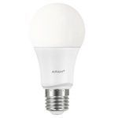 |
| [AIRAM-CTR.U](../devices/AIRAM-CTR.U.html) | Airam CTR.U remote (on/off, brightness up/down and click/hold/release) |  |

### Anchor

| Model | Description | Picture |
| ------------- | ------------- | -------------------------- |
| [67200BL](../devices/67200BL.html) | Anchor Vetaar smart plug (on/off) |  |

### Belkin

| Model | Description | Picture |
| ------------- | ------------- | -------------------------- |
| [F7C033](../devices/F7C033.html) | Belkin WeMo smart LED bulb (on/off, brightness) |  |

### Bitron

| Model | Description | Picture |
| ------------- | ------------- | -------------------------- |
| [AV2010/34](../devices/AV2010_34.html) | Bitron 4-Touch single click buttons (click) |  |
| [AV2010/22](../devices/AV2010_22.html) | Bitron Wireless motion detector (occupancy) |  |
| [AV2010/25](../devices/AV2010_25.html) | Bitron Video wireless socket (on/off, power measurement) |  |
| [AV2010/32](../devices/AV2010_32.html) | Bitron Wireless wall thermostat with relay (temperature, heating/cooling system control) |  |

### Blaupunkt

| Model | Description | Picture |
| ------------- | ------------- | -------------------------- |
| [SCM-S1](../devices/SCM-S1.html) | Blaupunkt Roller shutter (open/close) | 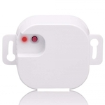 |

### Bosch

| Model | Description | Picture |
| ------------- | ------------- | -------------------------- |
| [RADON TriTech ZB](../devices/RADON_TriTech_ZB.html) | Bosch Wireless motion detector (occupancy and temperature) |  |
| [ISW-ZPR1-WP13](../devices/ISW-ZPR1-WP13.html) | Bosch Motion sensor (occupancy and temperature) |  |

### CREE

| Model | Description | Picture |
| ------------- | ------------- | -------------------------- |
| [B00TN589ZG](../devices/B00TN589ZG.html) | CREE Connected bulb (on/off, brightness) | 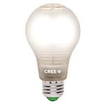 |

### Calex

| Model | Description | Picture |
| ------------- | ------------- | -------------------------- |
| [421786](../devices/421786.html) | Calex LED A60 Zigbee GLS-lamp (on/off, brightness) |  |
| [421792](../devices/421792.html) | Calex LED A60 Zigbee RGB lamp (on/off, brightness, color temperature, color xy) | 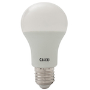 |

### Centralite

| Model | Description | Picture |
| ------------- | ------------- | -------------------------- |
| [4256251-RZHAC](../devices/4256251-RZHAC.html) | Centralite White Swiss power outlet switch with power meter (switch and power meter) |  |

### Climax

| Model | Description | Picture |
| ------------- | ------------- | -------------------------- |
| [PSS-23ZBS](../devices/PSS-23ZBS.html) | Climax Power plug (on/off) | 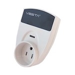 |
| [SCM-5ZBS](../devices/SCM-5ZBS.html) | Climax Roller shutter (open/close) |  |
| [PSM-29ZBSR](../devices/PSM-29ZBSR.html) | Climax Power plug (on/off) |  |

### Commercial Electric

| Model | Description | Picture |
| ------------- | ------------- | -------------------------- |
| [53170161](../devices/53170161.html) | Commercial Electric Matte White Recessed Retrofit Smart Led Downlight - 4 Inch (on/off, brightness, color temperature) |  |

### Custom devices (DiY)

| Model | Description | Picture |
| ------------- | ------------- | -------------------------- |
| [CC2530.ROUTER](../devices/CC2530.ROUTER.html) | Custom devices (DiY) [CC2530 router](http://ptvo.info/cc2530-based-zigbee-coordinator-and-router-112/) (state, description, type, rssi) |  |
| [ptvo.switch](../devices/ptvo.switch.html) | Custom devices (DiY) [Multi-channel relay switch](https://ptvo.info/zigbee-switch-configurable-firmware-router-199/) (hold, single, double and triple click, on/off) |  |
| [DNCKATSW001](../devices/DNCKATSW001.html) | Custom devices (DiY) [DNCKAT single key wired wall light switch](https://github.com/dzungpv/dnckatsw00x/) (on/off) |  |
| [DNCKATSW002](../devices/DNCKATSW002.html) | Custom devices (DiY) [DNCKAT double key wired wall light switch](https://github.com/dzungpv/dnckatsw00x/) (hold/release, on/off) |  |
| [DNCKATSW003](../devices/DNCKATSW003.html) | Custom devices (DiY) [DNCKAT triple key wired wall light switch](https://github.com/dzungpv/dnckatsw00x/) (hold/release, on/off) |  |
| [DNCKATSW004](../devices/DNCKATSW004.html) | Custom devices (DiY) [DNCKAT quadruple key wired wall light switch](https://github.com/dzungpv/dnckatsw00x/) (hold/release, on/off) |  |
| [ZigUP](../devices/ZigUP.html) | Custom devices (DiY) [CC2530 based ZigBee relais, switch, sensor and router](https://github.com/formtapez/ZigUP/) (relais, RGB-stripe, sensors, S0-counter, ADC, digital I/O) |  |
| [DIYRuZ_R4_5](../devices/DIYRuZ_R4_5.html) | Custom devices (DiY) [DiY 4 Relays + 4 switches + 1 buzzer](http://modkam.ru/?p=1054) (on/off) |  |
| [DIYRuZ_KEYPAD20](../devices/DIYRuZ_KEYPAD20.html) | Custom devices (DiY) [DiY 20 button keypad](http://modkam.ru/?p=1114) (click) |  |
| [DTB190502A1](../devices/DTB190502A1.html) | Custom devices (DiY) [CC2530 based IO Board https://databyte.ch/?portfolio=zigbee-erstes-board-dtb190502a) (switch, buttons) | 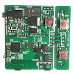 |

### Danalock

| Model | Description | Picture |
| ------------- | ------------- | -------------------------- |
| [V3-BTZB](../devices/V3-BTZB.html) | Danalock BT/ZB smartlock (lock/unlock, battery) |  |

### Dawon DNS

| Model | Description | Picture |
| ------------- | ------------- | -------------------------- |
| [PM-C140-ZB](../devices/PM-C140-ZB.html) | Dawon DNS IOT remote control smart buried-type outlet (on/off, power and energy measurement) | 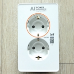 |

### Dresden Elektronik

| Model | Description | Picture |
| ------------- | ------------- | -------------------------- |
| [Mega23M12](../devices/Mega23M12.html) | Dresden Elektronik ZigBee Light Link wireless electronic ballast (on/off, brightness, color temperature, color xy) |  |
| [XVV-Mega23M12](../devices/XVV-Mega23M12.html) | Dresden Elektronik ZigBee Light Link wireless electronic ballast color temperature (on/off, brightness, color temperature) |  |

### EDP

| Model | Description | Picture |
| ------------- | ------------- | -------------------------- |
| [PLUG EDP RE:DY](../devices/PLUG_EDP_RE_DY.html) | EDP re:dy plug (on/off, power measurement) | 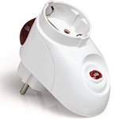 |
| [SWITCH EDP RE:DY](../devices/SWITCH_EDP_RE_DY.html) | EDP re:dy switch (on/off) | 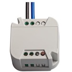 |

### ELKO

| Model | Description | Picture |
| ------------- | ------------- | -------------------------- |
| [316GLEDRF](../devices/316GLEDRF.html) | ELKO ZigBee in-wall smart dimmer (on/off, brightness) |  |

### EcoSmart

| Model | Description | Picture |
| ------------- | ------------- | -------------------------- |
| [D1821](../devices/D1821.html) | EcoSmart A19 RGB bulb (on/off, brightness, color temperature, color xy) | 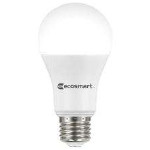 |
| [D1531](../devices/D1531.html) | EcoSmart A19 bright white bulb (on/off, brightness) |  |
| [D1532](../devices/D1532.html) | EcoSmart A19 soft white bulb (on/off, brightness) |  |
| [D1542](../devices/D1542.html) | EcoSmart GU10 adjustable white bulb (on/off, brightness, color temperature) |  |

### Eurotronic

| Model | Description | Picture |
| ------------- | ------------- | -------------------------- |
| [SPZB0001](../devices/SPZB0001.html) | Eurotronic Spirit Zigbee wireless heater thermostat (temperature, heating system control) |  |

### GE

| Model | Description | Picture |
| ------------- | ------------- | -------------------------- |
| [PSB19-SW27](../devices/PSB19-SW27.html) | GE Link smart LED light bulb, A19 soft white (2700K) (on/off, brightness) | 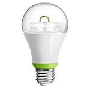 |
| [22670](../devices/22670.html) | GE Link smart LED light bulb, A19/BR30 soft white (2700K) (on/off, brightness) |  |
| [45852GE](../devices/45852GE.html) | GE ZigBee plug-in smart dimmer (on/off, brightness) |  |
| [45853GE](../devices/45853GE.html) | GE Plug-in smart switch (on/off) | 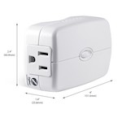 |
| [45856GE](../devices/45856GE.html) | GE In-wall smart switch (on/off) |  |
| [45857GE](../devices/45857GE.html) | GE ZigBee in-wall smart dimmer (on/off, brightness) |  |

### GMY Smart Bulb

| Model | Description | Picture |
| ------------- | ------------- | -------------------------- |
| [B07KG5KF5R](../devices/B07KG5KF5R.html) | GMY Smart Bulb GMY Smart bulb, 470lm, vintage dimmable, 2700-6500k, E27 (on/off, brightness, color temperature) |  |

### Gira

| Model | Description | Picture |
| ------------- | ------------- | -------------------------- |
| [2430-100](../devices/2430-100.html) | Gira ZigBee Light Link wall transmitter (action) | 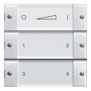 |

### Gledopto

| Model | Description | Picture |
| ------------- | ------------- | -------------------------- |
| [GL-C-008](../devices/GL-C-008.html) | Gledopto Zigbee LED controller RGB + CCT / RGBW / WWCW / Dimmer (on/off, brightness, color temperature, color xy) |  |
| [GL-S-004Z](../devices/GL-S-004Z.html) | Gledopto Zigbee Smart WW/CW GU10 (on/off, brightness, color temperature) | 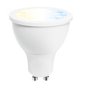 |
| [GL-C-006/GL-C-009](../devices/GL-C-006_GL-C-009.html) | Gledopto Zigbee LED controller WW/CW Dimmer (on/off, brightness, color temperature) |  |
| [GL-S-007Z](../devices/GL-S-007Z.html) | Gledopto Smart RGBW GU10 (on/off, brightness, color temperature, color xy) |  |
| [GL-B-001Z](../devices/GL-B-001Z.html) | Gledopto Smart 4W E14 RGB / CW LED bulb (on/off, brightness, color temperature, color xy) |  |
| [GL-G-001Z](../devices/GL-G-001Z.html) | Gledopto Smart garden lamp (on/off, brightness, color temperature, color xy) | 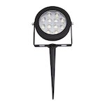 |
| [GL-B-007Z](../devices/GL-B-007Z.html) | Gledopto Smart 6W E27 RGB / CW LED bulb (on/off, brightness, color temperature, color xy) |  |
| [GL-B-008Z](../devices/GL-B-008Z.html) | Gledopto Smart 12W E27 RGB / CW LED bulb (on/off, brightness, color temperature, color xy) | 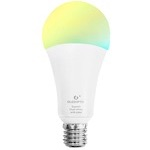 |
| [GL-D-003Z](../devices/GL-D-003Z.html) | Gledopto LED RGB + CCT downlight  (on/off, brightness, color temperature, color xy) |  |
| [GL-S-003Z](../devices/GL-S-003Z.html) | Gledopto Smart RGBW GU10  (on/off, brightness, color temperature, color xy) |  |
| [GD-CZ-006](../devices/GD-CZ-006.html) | Gledopto Zigbee LED Driver (on/off, brightness) |  |
| [GL-FL-004TZ](../devices/GL-FL-004TZ.html) | Gledopto Zigbee 10W floodlight RGB CCT (on/off, brightness, color temperature, color xy) |  |

### HEIMAN

| Model | Description | Picture |
| ------------- | ------------- | -------------------------- |
| [HS1CA-M](../devices/HS1CA-M.html) | HEIMAN Smart carbon monoxide sensor (carbon monoxide) | 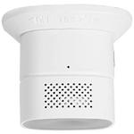 |
| [HS3MS](../devices/HS3MS.html) | HEIMAN Smart motion sensor (occupancy) |  |
| [HS2SK](../devices/HS2SK.html) | HEIMAN Smart metering plug (on/off, power measurement) |  |
| [HS1SA](../devices/HS1SA.html) | HEIMAN Smoke detector (smoke) |  |
| [HS3SA](../devices/HS3SA.html) | HEIMAN Smoke detector (smoke) | 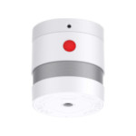 |
| [HS3CG](../devices/HS3CG.html) | HEIMAN Combustible gas sensor (gas) |  |
| [HS1CG-M](../devices/HS1CG-M.html) | HEIMAN Combustible gas sensor (gas) | 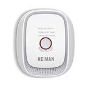 |
| [HS1DS/HS3DS](../devices/HS1DS_HS3DS.html) | HEIMAN Door sensor (contact) |  |
| [HEIMAN-M1](../devices/HEIMAN-M1.html) | HEIMAN Door sensor (contact) |  |
| [HS1DS-E](../devices/HS1DS-E.html) | HEIMAN Door sensor (contact) |  |
| [HS1WL/HS3WL](../devices/HS1WL_HS3WL.html) | HEIMAN Water leakage sensor (water leak) |  |
| [HS1-WL-E](../devices/HS1-WL-E.html) | HEIMAN Water leakage sensor (water leak) | 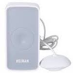 |
| [HS1RC-M](../devices/HS1RC-M.html) | HEIMAN Smart remote controller (action) |  |
| [HS1CA-E](../devices/HS1CA-E.html) | HEIMAN Smart carbon monoxide sensor (carbon monoxide) |  |
| [HS2WD-E](../devices/HS2WD-E.html) | HEIMAN Smart siren (warning) |  |

### Hampton Bay

| Model | Description | Picture |
| ------------- | ------------- | -------------------------- |
| [99432](../devices/99432.html) | Hampton Bay Universal wink enabled white ceiling fan premier remote control (on/off, brightness, fan_mode and fan_state) |  |

### Hej

| Model | Description | Picture |
| ------------- | ------------- | -------------------------- |
| [GLSK3ZB-1711](../devices/GLSK3ZB-1711.html) | Hej Goqual 1 gang Switch (on/off) | 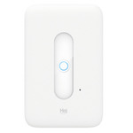 |
| [GLSK3ZB-1712](../devices/GLSK3ZB-1712.html) | Hej Goqual 2 gang Switch (on/off) | 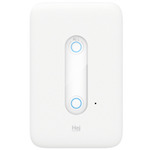 |
| [GLSK3ZB-1713](../devices/GLSK3ZB-1713.html) | Hej Goqual 3 gang Switch (on/off) | 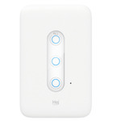 |
| [GLSK6ZB-1714](../devices/GLSK6ZB-1714.html) | Hej Goqual 4 gang Switch (on/off) |  |
| [GLSK6ZB-1715](../devices/GLSK6ZB-1715.html) | Hej Goqual 5 gang Switch (on/off) | 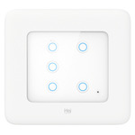 |
| [GLSK6ZB-1716](../devices/GLSK6ZB-1716.html) | Hej Goqual 6 gang Switch (on/off) | 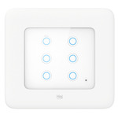 |

### Hive

| Model | Description | Picture |
| ------------- | ------------- | -------------------------- |
| [HALIGHTDIMWWE27](../devices/HALIGHTDIMWWE27.html) | Hive Active smart bulb white LED (E27) (on/off, brightness) |  |
| [HALIGHTDIMWWB22](../devices/HALIGHTDIMWWB22.html) | Hive Active smart bulb white LED (B22) (on/off, brightness) | 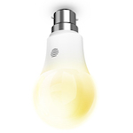 |
| [1613V](../devices/1613V.html) | Hive Active plug (on/off, power measurement) |  |
| [HV-GSCXZB269](../devices/HV-GSCXZB269.html) | Hive Active light cool to warm white (E26)  (on/off, brightness, color temperature) | 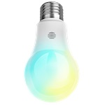 |
| [HV-GSCXZB279_HV-GSCXZB229](../devices/HV-GSCXZB279_HV-GSCXZB229.html) | Hive Active light, warm to cool white (E27 & B22) (on/off, brightness, color temperature) |  |

### Honyar

| Model | Description | Picture |
| ------------- | ------------- | -------------------------- |
| [U86K31ND6](../devices/U86K31ND6.html) | Honyar 3 gang switch  (on/off) |  |

### IKEA

| Model | Description | Picture |
| ------------- | ------------- | -------------------------- |
| [LED1545G12](../devices/LED1545G12.html) | IKEA TRADFRI LED bulb E26/E27 980 lumen, dimmable, white spectrum, opal white (on/off, brightness, color temperature) |  |
| [LED1546G12](../devices/LED1546G12.html) | IKEA TRADFRI LED bulb E26/E27 950 lumen, dimmable, white spectrum, clear (on/off, brightness, color temperature) |  |
| [LED1623G12](../devices/LED1623G12.html) | IKEA TRADFRI LED bulb E27 1000 lumen, dimmable, opal white (on/off, brightness) |  |
| [LED1537R6](../devices/LED1537R6.html) | IKEA TRADFRI LED bulb GU10 400 lumen, dimmable, white spectrum (on/off, brightness, color temperature) |  |
| [LED1650R5](../devices/LED1650R5.html) | IKEA TRADFRI LED bulb GU10 400 lumen, dimmable (on/off, brightness) |  |
| [LED1536G5](../devices/LED1536G5.html) | IKEA TRADFRI LED bulb E12/E14 400 lumen, dimmable, white spectrum, opal white (on/off, brightness, color temperature) |  |
| [LED1837R5](../devices/LED1837R5.html) | IKEA TRADFRI LED bulb GU10 400 lumen, dimmable (on/off, brightness) | 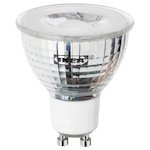 |
| [LED1733G7](../devices/LED1733G7.html) | IKEA TRADFRI LED bulb E14 600 lumen, dimmable, white spectrum, opal white (on/off, brightness, color temperature) | 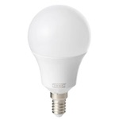 |
| [LED1622G12](../devices/LED1622G12.html) | IKEA TRADFRI LED bulb E26 1000 lumen, dimmable, opal white (on/off, brightness) |  |
| [LED1624G9](../devices/LED1624G9.html) | IKEA TRADFRI LED bulb E14/E26/E27 600 lumen, dimmable, color, opal white (on/off, brightness, color xy) |  |
| [LED1649C5](../devices/LED1649C5.html) | IKEA TRADFRI LED bulb E12/E14/E17 400 lumen, dimmable warm white, chandelier opal (on/off, brightness) |  |
| [LED1732G11](../devices/LED1732G11.html) | IKEA TRADFRI LED bulb E27 1000 lumen, dimmable, white spectrum, opal white (on/off, brightness, color temperature) |  |
| [LED1736G9](../devices/LED1736G9.html) | IKEA TRADFRI LED bulb E27 806 lumen, dimmable, white spectrum, clear (on/off, brightness, color temperature) | 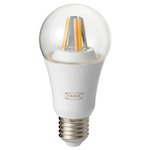 |
| [ICTC-G-1](../devices/ICTC-G-1.html) | IKEA TRADFRI wireless dimmer (brightness [0-255] (quick rotate for instant 0/255), action) |  |
| [ICPSHC24-10EU-IL-1](../devices/ICPSHC24-10EU-IL-1.html) | IKEA TRADFRI driver for wireless control (10 watt) (on/off, brightness) |  |
| [ICPSHC24-30EU-IL-1](../devices/ICPSHC24-30EU-IL-1.html) | IKEA TRADFRI driver for wireless control (30 watt) (on/off, brightness) |  |
| [L1527](../devices/L1527.html) | IKEA FLOALT LED light panel, dimmable, white spectrum (30x30 cm) (on/off, brightness, color temperature) |  |
| [L1529](../devices/L1529.html) | IKEA FLOALT LED light panel, dimmable, white spectrum (60x60 cm) (on/off, brightness, color temperature) |  |
| [L1528](../devices/L1528.html) | IKEA FLOALT LED light panel, dimmable, white spectrum (30x90 cm) (on/off, brightness, color temperature) |  |
| [L1531](../devices/L1531.html) | IKEA SURTE door light panel, dimmable, white spectrum (38x64 cm) (on/off, brightness, color temperature) |  |
| [E1603/E1702](../devices/E1603_E1702.html) | IKEA TRADFRI control outlet (on/off) |  |
| [E1524/E1810](../devices/E1524_E1810.html) | IKEA TRADFRI remote control (toggle, arrow left/right click/hold/release, brightness up/down click/hold/release) |  |
| [E1743](../devices/E1743.html) | IKEA TRADFRI ON/OFF switch (on, off, brightness up/down/stop) |  |
| [E1525](../devices/E1525.html) | IKEA TRADFRI motion sensor (occupancy) |  |
| [E1746](../devices/E1746.html) | IKEA TRADFRI signal repeater (linkquality) |  |

### Iluminize

| Model | Description | Picture |
| ------------- | ------------- | -------------------------- |
| [511.10](../devices/511.10.html) | Iluminize Zigbee LED-Controller  (on/off, brightness) |  |

### Immax

| Model | Description | Picture |
| ------------- | ------------- | -------------------------- |
| [IM-Z3.0-DIM](../devices/IM-Z3.0-DIM.html) | Immax LED E14/230V C35 5W TB 440LM ZIGBEE DIM (on/off, brightness) |  |

### Innr

| Model | Description | Picture |
| ------------- | ------------- | -------------------------- |
| [RB 185 C](../devices/RB_185_C.html) | Innr E27 bulb RGBW (on/off, brightness, color temperature, color xy) |  |
| [BY 185 C](../devices/BY_185_C.html) | Innr B22 bulb RGBW (on/off, brightness, color temperature, color xy) |  |
| [RB 250 C](../devices/RB_250_C.html) | Innr E14 bulb RGBW (on/off, brightness, color temperature, color xy) |  |
| [RB 265](../devices/RB_265.html) | Innr E27 bulb (on/off, brightness) |  |
| [RF 265](../devices/RF_265.html) | Innr E27 bulb filament clear (on/off, brightness) | 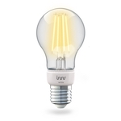 |
| [RB 278 T](../devices/RB_278_T.html) | Innr E27 bulb (on/off, brightness) |  |
| [RB 285 C](../devices/RB_285_C.html) | Innr E27 bulb RGBW (on/off, brightness, color temperature, color xy) |  |
| [BY 285 C](../devices/BY_285_C.html) | Innr B22 bulb RGBW (on/off, brightness, color temperature, color xy) | 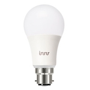 |
| [RB 165](../devices/RB_165.html) | Innr E27 bulb (on/off, brightness) |  |
| [RB 175 W](../devices/RB_175_W.html) | Innr E27 bulb warm dimming (on/off, brightness) | 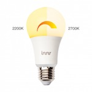 |
| [RB 178 T](../devices/RB_178_T.html) | Innr Smart bulb tunable white E27 (on/off, brightness, color temperature) |  |
| [RS 122](../devices/RS_122.html) | Innr GU10 spot (on/off, brightness) |  |
| [RS 125](../devices/RS_125.html) | Innr GU10 spot (on/off, brightness) |  |
| [RS 225](../devices/RS_225.html) | Innr GU10 Spot (on/off, brightness) |  |
| [RS 128 T](../devices/RS_128_T.html) | Innr GU10 spot 350 lm, dimmable, white spectrum (on/off, brightness, color temperature) |  |
| [RS 228 T](../devices/RS_228_T.html) | Innr GU10 spot 350 lm, dimmable, white spectrum (on/off, brightness, color temperature) | 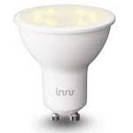 |
| [RB 145](../devices/RB_145.html) | Innr E14 candle (on/off, brightness) |  |
| [RB 245](../devices/RB_245.html) | Innr E14 candle (on/off, brightness) |  |
| [RB 248 T](../devices/RB_248_T.html) | Innr E14 candle with white spectrum (on/off, brightness, color temperature) |  |
| [RF 263](../devices/RF_263.html) | Innr E27 filament bulb dimmable (on/off, brightness) | 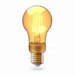 |
| [BY 165](../devices/BY_165.html) | Innr B22 bulb dimmable (on/off, brightness) |  |
| [PL 110](../devices/PL_110.html) | Innr Puck Light (on/off, brightness) |  |
| [ST 110](../devices/ST_110.html) | Innr Strip Light (on/off, brightness) |  |
| [UC 110](../devices/UC_110.html) | Innr Under cabinet light (on/off, brightness) |  |
| [DL 110 N](../devices/DL_110_N.html) | Innr Spot narrow (on/off, brightness) |  |
| [DL 110 W](../devices/DL_110_W.html) | Innr Spot wide (on/off, brightness) |  |
| [SL 110 N](../devices/SL_110_N.html) | Innr Spot Flex narrow (on/off, brightness) |  |
| [SL 110 M](../devices/SL_110_M.html) | Innr Spot Flex medium (on/off, brightness) |  |
| [SL 110 W](../devices/SL_110_W.html) | Innr Spot Flex wide (on/off, brightness) |  |
| [SP 120](../devices/SP_120.html) | Innr Smart plug (on/off, power measurement) |  |

### Iris

| Model | Description | Picture |
| ------------- | ------------- | -------------------------- |
| [3210-L](../devices/3210-L.html) | Iris Smart plug (on/off) |  |
| [3326-L](../devices/3326-L.html) | Iris Motion and temperature sensor (occupancy and temperature) |  |
| [3320-L](../devices/3320-L.html) | Iris Contact sensor (contact) |  |

### JIAWEN

| Model | Description | Picture |
| ------------- | ------------- | -------------------------- |
| [K2RGBW01](../devices/K2RGBW01.html) | JIAWEN Wireless Bulb E27 9W RGBW (on/off, brightness, color temperature, color xy) |  |

### Keen Home

| Model | Description | Picture |
| ------------- | ------------- | -------------------------- |
| [SV01](../devices/SV01.html) | Keen Home Smart vent (open, close, position, temperature, pressure, battery) |  |
| [SV02](../devices/SV02.html) | Keen Home Smart vent (open, close, position, temperature, pressure, battery) |  |

### Konke

| Model | Description | Picture |
| ------------- | ------------- | -------------------------- |
| [2AJZ4KPKEY](../devices/2AJZ4KPKEY.html) | Konke Multi-function button (single, double and long click) |  |
| [2AJZ4KPFT](../devices/2AJZ4KPFT.html) | Konke Temperature and humidity sensor (temperature and humidity) | 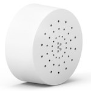 |

### Ksentry Electronics

| Model | Description | Picture |
| ------------- | ------------- | -------------------------- |
| [KS-SM001](../devices/KS-SM001.html) | Ksentry Electronics [Zigbee OnOff Controller](http://ksentry.manufacturer.globalsources.com/si/6008837134660/pdtl/ZigBee-module/1162731630/zigbee-on-off-controller-modules.htm) (on/off) | 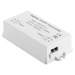 |

### Leedarson

| Model | Description | Picture |
| ------------- | ------------- | -------------------------- |
| [ZM350STW1TCF](../devices/ZM350STW1TCF.html) | Leedarson LED PAR16 50 GU10 tunable white (on/off, brightness, color temperature) |  |
| [M350STW1](../devices/M350STW1.html) | Leedarson LED PAR16 50 GU10 (on/off, brightness) |  |
| [A806S-Q1R](../devices/A806S-Q1R.html) | Leedarson LED E27 tunable white (on/off, brightness) |  |
| [ZA806SQ1TCF](../devices/ZA806SQ1TCF.html) | Leedarson LED E27 tunable white (on/off, brightness, color temperature) | 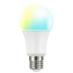 |

### Lingan

| Model | Description | Picture |
| ------------- | ------------- | -------------------------- |
| [DZ4743-00B](../devices/DZ4743-00B.html) | Lingan Zigbee OnOff controller (on/off) | 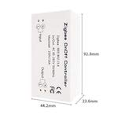 |

### LivingWise

| Model | Description | Picture |
| ------------- | ------------- | -------------------------- |
| [LVS-ZB500D](../devices/LVS-ZB500D.html) | LivingWise ZigBee smart dimmer switch (on/off, brightness) |  |
| [LVS-ZB15S](../devices/LVS-ZB15S.html) | LivingWise ZigBee smart in-wall switch (on/off) | 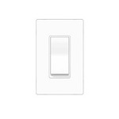 |
| [LVS-SM10ZW](../devices/LVS-SM10ZW.html) | LivingWise Door or window contact switch (contact) |  |
| [LVS-SN10ZW_SN11](../devices/LVS-SN10ZW_SN11.html) | LivingWise Occupancy sensor (occupancy) | 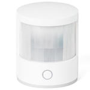 |
| [LVS-ZB15R](../devices/LVS-ZB15R.html) | LivingWise Zigbee smart outlet (on/off) | 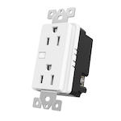 |

### Livolo

| Model | Description | Picture |
| ------------- | ------------- | -------------------------- |
| [TI0001](../devices/TI0001.html) | Livolo Zigbee switch (1 and 2 gang) [work in progress](https://github.com/Koenkk/zigbee2mqtt/issues/592) (on/off) |  |

### Lupus

| Model | Description | Picture |
| ------------- | ------------- | -------------------------- |
| [12031](../devices/12031.html) | Lupus Roller shutter (open/close) |  |
| [12050](../devices/12050.html) | Lupus LUPUSEC mains socket with power meter (on/off, power measurement) |  |

### Lutron

| Model | Description | Picture |
| ------------- | ------------- | -------------------------- |
| [LZL4BWHL01](../devices/LZL4BWHL01.html) | Lutron Connected bulb remote control (on/off, brightness) |  |
| [Z3-1BRL](../devices/Z3-1BRL.html) | Lutron Aurora smart bulb dimmer (brightness) | 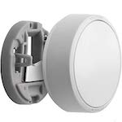 |

### Meazon

| Model | Description | Picture |
| ------------- | ------------- | -------------------------- |
| [MEAZON_BIZY_PLUG](../devices/MEAZON_BIZY_PLUG.html) | Meazon Bizy plug meter (on/off, power, energy measurement and temperature) |  |
| [MEAZON_DINRAIL](../devices/MEAZON_DINRAIL.html) | Meazon DinRail 1-phase meter (on/off, power, energy measurement and temperature) |  |

### Müller Licht

| Model | Description | Picture |
| ------------- | ------------- | -------------------------- |
| [404000/404005/404012](../devices/404000_404005_404012.html) | Müller Licht Tint LED bulb GU10/E14/E27 350/470/806 lumen, dimmable, color, opal white (on/off, brightness, color temperature, color xy) |  |
| [404006/404008/404004](../devices/404006_404008_404004.html) | Müller Licht Tint LED bulb GU10/E14/E27 350/470/806 lumen, dimmable, opal white (on/off, brightness, color temperature) |  |
| [MLI-404011](../devices/MLI-404011.html) | Müller Licht Tint remote control (toggle, brightness, other buttons are not supported yet!) | 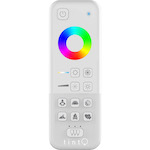 |

### NET2GRID

| Model | Description | Picture |
| ------------- | ------------- | -------------------------- |
| [N2G-SP](../devices/N2G-SP.html) | NET2GRID White Net2Grid power outlet switch with power meter (on/off, power and energy measurement) |  |

### Nanoleaf

| Model | Description | Picture |
| ------------- | ------------- | -------------------------- |
| [NL08-0800](../devices/NL08-0800.html) | Nanoleaf Smart Ivy Bulb E27 (on/off, brightness) |  |

### Netvox

| Model | Description | Picture |
| ------------- | ------------- | -------------------------- |
| [Z809A](../devices/Z809A.html) | Netvox Power socket with power consumption monitoring (on/off, power measurement) |  |

### Ninja Blocks

| Model | Description | Picture |
| ------------- | ------------- | -------------------------- |
| [Z809AF](../devices/Z809AF.html) | Ninja Blocks Zigbee smart plug with power meter (on/off, power measurement) |  |

### Nue / 3A

| Model | Description | Picture |
| ------------- | ------------- | -------------------------- |
| [HGZB-1S](../devices/HGZB-1S.html) | Nue / 3A Smart 1 key scene wall switch (on/off, click) | 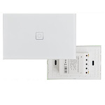 |
| [HGZB-02S](../devices/HGZB-02S.html) | Nue / 3A Smart 2 key scene wall switch (on/off, click) |  |
| [HGZB-045](../devices/HGZB-045.html) | Nue / 3A Smart 4 key scene wall switch (on/off, click) |  |
| [LXZB-02A](../devices/LXZB-02A.html) | Nue / 3A Smart light controller (on/off, brightness) |  |
| [HGZB-43](../devices/HGZB-43.html) | Nue / 3A Smart light switch - 3 gang v2.0 (on/off) | 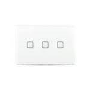 |
| [HGZB-043](../devices/HGZB-043.html) | Nue / 3A Smart light switch - 3 gang (on/off) |  |
| [HGZB-04D](../devices/HGZB-04D.html) | Nue / 3A Smart dimmer wall switch (on/off, brightness) |  |
| [HGZB-042](../devices/HGZB-042.html) | Nue / 3A Smart light switch - 2 gang (on/off) |  |
| [HGZB-42](../devices/HGZB-42.html) | Nue / 3A Smart light switch - 2 gang.  (on/off) |  |
| [HGZB-41](../devices/HGZB-41.html) | Nue / 3A Smart one gang wall switch (on/off) |  |
| [MG-AUWS01](../devices/MG-AUWS01.html) | Nue / 3A Smart Double GPO (on/off) |  |
| [XY12S-15](../devices/XY12S-15.html) | Nue / 3A Smart light controller RGBW (on/off, brightness, color temperature, color xy) | 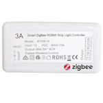 |
| [HGZB-01A](../devices/HGZB-01A.html) | Nue / 3A Smart in-wall switch (on/off) |  |
| [HGZB-02A](../devices/HGZB-02A.html) | Nue / 3A Smart light controller (on/off, brightness) |  |
| [HGZB-42-UK / HGZB-41](../devices/HGZB-42-UK___HGZB-41.html) | Nue / 3A Smart switch 1 or 2 gang (on/off) |  |
| [HGZB-06A](../devices/HGZB-06A.html) | Nue / 3A Smart 7W E27 light bulb (on/off, brightness, color temperature, color xy) |  |

### Nyce

| Model | Description | Picture |
| ------------- | ------------- | -------------------------- |
| [NCZ-3011-HA](../devices/NCZ-3011-HA.html) | Nyce Door/window sensor (motion, humidity and temperature) |  |
| [NCZ-3043-HA](../devices/NCZ-3043-HA.html) | Nyce Ceiling motion sensor (motion, humidity and temperature) | 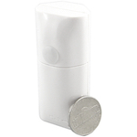 |
| [NCZ-3041-HA](../devices/NCZ-3041-HA.html) | Nyce Wall motion sensor (motion, humidity and temperature) | 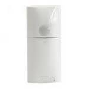 |
| [NCZ-3045-HA](../devices/NCZ-3045-HA.html) | Nyce Curtain motion sensor (motion, humidity and temperature) | 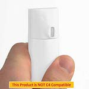 |

### OSRAM

| Model | Description | Picture |
| ------------- | ------------- | -------------------------- |
| [4058075816718](../devices/4058075816718.html) | OSRAM SMART+ outdoor wall lantern RGBW (on/off, brightness, color temperature, color xy) |  |
| [AA69697](../devices/AA69697.html) | OSRAM Classic A60 RGBW (on/off, brightness, color temperature, color xy) |  |
| [AC03645](../devices/AC03645.html) | OSRAM LIGHTIFY LED CLA60 E27 RGBW (on/off, brightness, color temperature, color xy) |  |
| [AC03642](../devices/AC03642.html) | OSRAM SMART+ CLASSIC A 60 TW (on/off, brightness, color temperature) |  |
| [AC08560](../devices/AC08560.html) | OSRAM SMART+ LED PAR16 GU10 (on/off, brightness) |  |
| [AC03647](../devices/AC03647.html) | OSRAM SMART+ LED CLASSIC E27 RGBW (on/off, brightness, color temperature, color xy) |  |
| [AA70155](../devices/AA70155.html) | OSRAM LIGHTIFY LED A19 tunable white / Classic A60 TW (on/off, brightness, color temperature) |  |
| [AA68199](../devices/AA68199.html) | OSRAM LIGHTIFY LED PAR16 50 GU10 tunable white (on/off, brightness, color temperature) |  |
| [AB32840](../devices/AB32840.html) | OSRAM LIGHTIFY LED Classic B40 tunable white (on/off, brightness, color temperature) |  |
| [4058075816794](../devices/4058075816794.html) | OSRAM Smart+ Ceiling TW (on/off, brightness, color temperature) |  |
| [AC03641](../devices/AC03641.html) | OSRAM LIGHTIFY LED Classic A60 clear (on/off, brightness) |  |
| [4052899926158](../devices/4052899926158.html) | OSRAM LIGHTIFY Surface Light TW (on/off, brightness) |  |
| [AB401130055](../devices/AB401130055.html) | OSRAM LIGHTIFY Surface Light LED Tunable White (on/off, brightness, color temperature) |  |
| [AB3257001NJ](../devices/AB3257001NJ.html) | OSRAM Smart+ plug (on/off) |  |
| [4052899926110](../devices/4052899926110.html) | OSRAM Flex RGBW (on/off, brightness, color temperature, color xy) |  |
| [4058075036185](../devices/4058075036185.html) | OSRAM Outdoor Flex RGBW (on/off, brightness, color temperature, color xy) |  |
| [4058075036147](../devices/4058075036147.html) | OSRAM Smart+ gardenpole RGBW (on/off, brightness, color temperature, color xy) |  |
| [AC0363900NJ](../devices/AC0363900NJ.html) | OSRAM Smart+ mini gardenpole RGBW (on/off, brightness, color temperature, color xy) |  |
| [AB35996](../devices/AB35996.html) | OSRAM Smart+ Spot GU10 Multicolor (on/off, brightness, color temperature, color xy) |  |
| [AC08559](../devices/AC08559.html) | OSRAM SMART+ Spot GU10 Multicolor (on/off, brightness, color temperature) |  |
| [AC08562](../devices/AC08562.html) | OSRAM SMART+ Candle E14 Dimmable White (on/off, brightness) |  |
| [AC01353010G](../devices/AC01353010G.html) | OSRAM SMART+ Motion Sensor (occupancy and temperature) |  |
| [AC03648](../devices/AC03648.html) | OSRAM SMART+ spot GU5.3 tunable white (on/off, brightness, color temperature) |  |
| [AC0251100NJ](../devices/AC0251100NJ.html) | OSRAM Smart+ switch mini (circle, up, down and hold/release) |  |
| [ST8AU-CON](../devices/ST8AU-CON.html) | OSRAM OSRAM SubstiTUBE T8 Advanced UO Connected (on/off, brightness) |  |

### Oujiabao

| Model | Description | Picture |
| ------------- | ------------- | -------------------------- |
| [CR701-YZ](../devices/CR701-YZ.html) | Oujiabao Gas and carbon monoxide alarm (gas and carbon monoxide) |  |

### Paul Neuhaus

| Model | Description | Picture |
| ------------- | ------------- | -------------------------- |
| [100.424.11](../devices/100.424.11.html) | Paul Neuhaus Q-INIGO LED ceiling light (on/off, brightness, color temperature) |  |
| [100.110.39](../devices/100.110.39.html) | Paul Neuhaus Q-FLAG LED Panel, Smart-Home RGBW (on/off, brightness, color temperature, color xy) |  |
| [100.425.90](../devices/100.425.90.html) | Paul Neuhaus Q-PLUG adapter plug with night orientation light (on/off) |  |

### Paulmann

| Model | Description | Picture |
| ------------- | ------------- | -------------------------- |
| [50043](../devices/50043.html) | Paulmann SmartHome Zigbee Cephei Switch Controller (on/off) |  |
| [50045](../devices/50045.html) | Paulmann SmartHome Zigbee LED-stripe (on/off, brightness) |  |
| [50049](../devices/50049.html) | Paulmann SmartHome Yourled RGB Controller (on/off, brightness, color temperature, color xy) |  |
| [50064](../devices/50064.html) | Paulmann SmartHome led spot (on/off, brightness, color temperature) |  |

### Philips

| Model | Description | Picture |
| ------------- | ------------- | -------------------------- |
| [3306431P7](../devices/3306431P7.html) | Philips Hue Struana (on/off, brightness, color temperature, power-on behavior) |  |
| [7299760PH](../devices/7299760PH.html) | Philips Hue Bloom (on/off, brightness, color xy, power-on behavior) |  |
| [7146060PH](../devices/7146060PH.html) | Philips Hue Go (on/off, brightness, color temperature, color xy, power-on behavior) |  |
| [4090531P7](../devices/4090531P7.html) | Philips Hue Flourish white and color ambiance ceiling light (on/off, brightness, color temperature, color xy, power-on behavior) |  |
| [433714](../devices/433714.html) | Philips Hue Lux A19 bulb E27 (on/off, brightness, power-on behavior) |  |
| [9290011370](../devices/9290011370.html) | Philips Hue white A60 bulb E27 (on/off, brightness, power-on behavior) |  |
| [8718696449691](../devices/8718696449691.html) | Philips Hue White Single bulb B22 (on/off, brightness, power-on behavior) |  |
| [9290018195](../devices/9290018195.html) | Philips Hue white GU10 (on/off, brightness, power-on behavior) |  |
| [7299355PH](../devices/7299355PH.html) | Philips Hue white and color ambiance LightStrip (on/off, brightness, color xy, power-on behavior) |  |
| [915005106701](../devices/915005106701.html) | Philips Hue white and color ambiance LightStrip plus (on/off, brightness, color temperature, color xy, power-on behavior) |  |
| [9290018187B](../devices/9290018187B.html) | Philips Hue white and color ambiance LightStrip Outdoor (on/off, brightness, color temperature, color xy, power-on behavior) |  |
| [9290022166](../devices/9290022166.html) | Philips Hue white and color ambiance E26 (on/off, brightness, color temperature, color xy, power-on behavior) |  |
| [9290012573A](../devices/9290012573A.html) | Philips Hue white and color ambiance E26/E27/E14 (on/off, brightness, color temperature, color xy, power-on behavior) |  |
| [9290002579A](../devices/9290002579A.html) | Philips Hue white and color ambiance BR30 (on/off, brightness, color temperature, color xy, power-on behavior) |  |
| [8718696485880](../devices/8718696485880.html) | Philips Hue white and color ambiance GU10 (on/off, brightness, color temperature, color xy, power-on behavior) |  |
| [915005733701](../devices/915005733701.html) | Philips Hue White and color ambiance Play Lightbar (on/off, brightness, color temperature, color xy, power-on behavior) |  |
| [464800](../devices/464800.html) | Philips Hue white ambiance BR30 flood light (on/off, brightness, color temperature, power-on behavior) |  |
| [8718696695203](../devices/8718696695203.html) | Philips Hue white ambiance E14 (on/off, brightness, color temperature, power-on behavior) |  |
| [8718696598283](../devices/8718696598283.html) | Philips Hue white ambiance GU10 (on/off, brightness, color temperature, power-on behavior) |  |
| [9290011998B](../devices/9290011998B.html) | Philips Hue white ambiance E26 (on/off, brightness, color temperature, power-on behavior) |  |
| [9290022167](../devices/9290022167.html) | Philips Hue white ambiance E26 with Bluetooth (on/off, brightness, color temperature, power-on behavior) |  |
| [8718696548738](../devices/8718696548738.html) | Philips Hue white ambiance E26/E27 (on/off, brightness, color temperature, power-on behavior) |  |
| [915005587401](../devices/915005587401.html) | Philips Hue white ambiance Adore light (on/off, brightness, color temperature, power-on behavior) |  |
| [4090130P7](../devices/4090130P7.html) | Philips Hue Sana (on/off, brightness, color temperature, color xy, power-on behavior) |  |
| [3261030P7](../devices/3261030P7.html) | Philips Hue Being (on/off, brightness, color temperature, power-on behavior) |  |
| [3261331P7](../devices/3261331P7.html) | Philips Hue white ambiance Still (on/off, brightness, color temperature, power-on behavior) |  |
| [4096730U7](../devices/4096730U7.html) | Philips Hue Cher ceiling light (on/off, brightness, color temperature, power-on behavior) |  |
| [3216131P5](../devices/3216131P5.html) | Philips Hue white ambiance Aurelle square panel light (on/off, brightness, color temperature, power-on behavior) |  |
| [3216331P5](../devices/3216331P5.html) | Philips Hue white ambiance Aurelle rectangle panel light (on/off, brightness, color temperature, power-on behavior) |  |
| [3216431P5](../devices/3216431P5.html) | Philips Hue white ambiance Aurelle round panel light (on/off, brightness, color temperature, power-on behavior) |  |
| [4033930P7](../devices/4033930P7.html) | Philips Hue white ambiance suspension Fair (on/off, brightness, color temperature, power-on behavior) |  |
| [9290011370B](../devices/9290011370B.html) | Philips Hue white A60 bulb E27 (on/off, brightness, power-on behavior) |  |
| [046677476816](../devices/046677476816.html) | Philips Hue white PAR38 outdoor (on/off, brightness, power-on behavior) |  |
| [7199960PH](../devices/7199960PH.html) | Philips Hue Iris (on/off, brightness, color xy, power-on behavior) |  |
| [324131092621](../devices/324131092621.html) | Philips Hue dimmer switch (on/off, brightness, up/down/hold/release, click count) |  |
| [9290012607](../devices/9290012607.html) | Philips Hue motion sensor (occupancy, temperature, illuminance) |  |
| [9290019758](../devices/9290019758.html) | Philips Hue motion outdoor sensor (occupancy, temperature, illuminance) |  |
| [7099860PH](../devices/7099860PH.html) | Philips LivingColors Aura (on/off, brightness, color xy, power-on behavior) |  |
| [3216231P5](../devices/3216231P5.html) | Philips Hue white ambiance Aurelle rectangle panel light (on/off, brightness, color temperature, power-on behavior) |  |
| [8718696170625](../devices/8718696170625.html) | Philips Hue Fuzo outdoor wall light (on/off, brightness, power-on behavior) |  |
| [17436/30/P7](../devices/17436_30_P7.html) | Philips Hue Welcome white flood light (on/off, brightness, power-on behavior) |  |
| [1741830P7](../devices/1741830P7.html) | Philips Hue Lily outdoor spot light (on/off, brightness, color temperature, color xy, power-on behavior) |  |

### RGB Genie

| Model | Description | Picture |
| ------------- | ------------- | -------------------------- |
| [ZGRC-KEY-013](../devices/ZGRC-KEY-013.html) | RGB Genie 3 Zone remote and dimmer (click) |  |

### ROBB

| Model | Description | Picture |
| ------------- | ------------- | -------------------------- |
| [ROB_200-004-0](../devices/ROB_200-004-0.html) | ROBB ZigBee AC phase-cut dimmer (on/off, brightness) |  |

### Salus

| Model | Description | Picture |
| ------------- | ------------- | -------------------------- |
| [SP600](../devices/SP600.html) | Salus Smart plug (on/off, power measurement) |  |

### Securifi

| Model | Description | Picture |
| ------------- | ------------- | -------------------------- |
| [PP-WHT-US](../devices/PP-WHT-US.html) | Securifi Peanut Smart Plug (on/off, power measurement) |  |

### Sengled

| Model | Description | Picture |
| ------------- | ------------- | -------------------------- |
| [E11-G13](../devices/E11-G13.html) | Sengled Element Classic (A19) (on/off, brightness) |  |
| [E11-G23/E11-G33](../devices/E11-G23_E11-G33.html) | Sengled Element Classic (A60) (on/off, brightness) |  |
| [Z01-CIA19NAE26](../devices/Z01-CIA19NAE26.html) | Sengled Element Touch (A19) (on/off, brightness) |  |
| [Z01-A19NAE26](../devices/Z01-A19NAE26.html) | Sengled Element Plus (A19) (on/off, brightness, color temperature) |  |
| [Z01-A60EAE27](../devices/Z01-A60EAE27.html) | Sengled Element Plus (A60) (on/off, brightness, color temperature) |  |
| [E11-N1EA](../devices/E11-N1EA.html) | Sengled Element Plus Color (A19) (on/off, brightness, color temperature, color xy) |  |
| [E12-N14](../devices/E12-N14.html) | Sengled Element Classic (BR30) (on/off, brightness) |  |
| [E1ACA4ABE38A](../devices/E1ACA4ABE38A.html) | Sengled Element downlight smart LED bulb (on/off, brightness) |  |

### Sercomm

| Model | Description | Picture |
| ------------- | ------------- | -------------------------- |
| [SZ-ESW01-AU](../devices/SZ-ESW01-AU.html) | Sercomm Telstra smart plug (on/off, power consumption) |  |

### Shenzhen Homa

| Model | Description | Picture |
| ------------- | ------------- | -------------------------- |
| [HLD812-Z-SC](../devices/HLD812-Z-SC.html) | Shenzhen Homa Smart LED driver (on/off, brightness) |  |
| [HLC610-Z](../devices/HLC610-Z.html) | Shenzhen Homa Wireless dimmable controller (on/off, brightness) |  |
| [HLC821-Z-SC](../devices/HLC821-Z-SC.html) | Shenzhen Homa ZigBee AC phase-cut dimmer (on/off, brightness) |  |

### Sinope

| Model | Description | Picture |
| ------------- | ------------- | -------------------------- |
| [TH1123ZB](../devices/TH1123ZB.html) | Sinope Zigbee line volt thermostat (local temp, units, keypad lockout, mode, state, backlight, outdoor temp, time) |  |

### Smart Home Pty

| Model | Description | Picture |
| ------------- | ------------- | -------------------------- |
| [HGZB-07A](../devices/HGZB-07A.html) | Smart Home Pty RGBW Downlight (on/off, brightness, color temperature, color xy) |  |
| [HGZB-20-DE](../devices/HGZB-20-DE.html) | Smart Home Pty Power plug (on/off) |  |

### SmartThings

| Model | Description | Picture |
| ------------- | ------------- | -------------------------- |
| [STSS-MULT-001](../devices/STSS-MULT-001.html) | SmartThings Multipurpose sensor (contact) |  |
| [STS-PRS-251](../devices/STS-PRS-251.html) | SmartThings Arrival sensor (presence) |  |
| [3325-S](../devices/3325-S.html) | SmartThings Motion sensor (2015 model) (occupancy and temperature) |  |
| [3321-S](../devices/3321-S.html) | SmartThings Multi Sensor (2015 model) (contact and temperature) |  |
| [IM6001-OTP05](../devices/IM6001-OTP05.html) | SmartThings Outlet (on/off) |  |
| [IM6001-MTP01](../devices/IM6001-MTP01.html) | SmartThings Motion sensor (2018 model) (occupancy and temperature) |  |
| [STS-IRM-250](../devices/STS-IRM-250.html) | SmartThings Motion sensor (2016 model) (occupancy and temperature) |  |
| [3305-S](../devices/3305-S.html) | SmartThings Motion sensor (2014 model) (occupancy and temperature) |  |
| [3300-S](../devices/3300-S.html) | SmartThings Door sensor (contact and temperature) |  |
| [F-MLT-US-2](../devices/F-MLT-US-2.html) | SmartThings Multipurpose sensor (2016 model) (contact) |  |
| [IM6001-MPP01](../devices/IM6001-MPP01.html) | SmartThings Multipurpose sensor (2018 model) (contact) |  |
| [3310-S](../devices/3310-S.html) | SmartThings Temperature and humidity sensor (temperature) |  |
| [IM6001-WLP01](../devices/IM6001-WLP01.html) | SmartThings Water leak sensor (water leak) |  |
| [3315-S](../devices/3315-S.html) | SmartThings Water sensor (water and temperature) |  |
| [F-WTR-UK-V2](../devices/F-WTR-UK-V2.html) | SmartThings Water leak sensor (2018 model) (water leak and temperature) |  |
| [3315-G](../devices/3315-G.html) | SmartThings Water sensor (water and temperature) |  |
| [IM6001-BTP01](../devices/IM6001-BTP01.html) | SmartThings Button (single click, double click, hold and temperature) |  |

### Stelpro

| Model | Description | Picture |
| ------------- | ------------- | -------------------------- |
| [ST218](../devices/ST218.html) | Stelpro Built-in electronic thermostat (temperature ) |  |

### Sunricher

| Model | Description | Picture |
| ------------- | ------------- | -------------------------- |
| [ZG9101SAC-HP](../devices/ZG9101SAC-HP.html) | Sunricher ZigBee AC phase-cut dimmer (on/off, brightness) |  |

### Swann

| Model | Description | Picture |
| ------------- | ------------- | -------------------------- |
| [SWO-KEF1PA](../devices/SWO-KEF1PA.html) | Swann Key fob remote (panic, home, away, sleep) |  |
| [SWO-WDS1PA](../devices/SWO-WDS1PA.html) | Swann Window/door sensor (contact) |  |

### Sylvania

| Model | Description | Picture |
| ------------- | ------------- | -------------------------- |
| [73742](../devices/73742.html) | Sylvania LIGHTIFY LED adjustable white RT 5/6 (on/off, brightness, color temperature) |  |
| [73741](../devices/73741.html) | Sylvania LIGHTIFY LED adjustable color RT 5/6 (on/off, brightness, color temperature, color xy) |  |
| [73740](../devices/73740.html) | Sylvania LIGHTIFY LED adjustable white BR30 (on/off, brightness, color temperature) |  |
| [73739](../devices/73739.html) | Sylvania LIGHTIFY LED RGBW BR30 (on/off, brightness, color temperature, color xy) |  |
| [73693](../devices/73693.html) | Sylvania LIGHTIFY LED RGBW A19 (on/off, brightness, color temperature, color xy) |  |
| [74283](../devices/74283.html) | Sylvania LIGHTIFY LED soft white dimmable A19 (on/off, brightness) |  |
| [74696](../devices/74696.html) | Sylvania LIGHTIFY LED soft white dimmable A19 (on/off, brightness) |  |
| [72922-A](../devices/72922-A.html) | Sylvania SMART+ Smart Plug (on/off) |  |
| [71831](../devices/71831.html) | Sylvania Smart Home adjustable white A19 LED bulb (on/off, brightness, color temperature) |  |
| [74282](../devices/74282.html) | Sylvania Smart Home adjustable white MR16 LED bulb (on/off, brightness, color temperature) |  |
| [LTFY004](../devices/LTFY004.html) | Sylvania LIGHTIFY LED gardenspot mini RGB (on/off, brightness, color xy) |  |
| [74580](../devices/74580.html) | Sylvania Smart Home soft white PAR38 outdoor bulb (on/off, brightness) |  |

### TUYATEC

| Model | Description | Picture |
| ------------- | ------------- | -------------------------- |
| [RH3040](../devices/RH3040.html) | TUYATEC PIR sensor (occupancy) |  |
| [TT001ZAV20](../devices/TT001ZAV20.html) | TUYATEC Temperature & humidity sensor (temperature and humidity) |  |

### Third Reality

| Model | Description | Picture |
| ------------- | ------------- | -------------------------- |
| [3RSS008Z](../devices/3RSS008Z.html) | Third Reality RealitySwitch Plus (on/off, battery) |  |

### Trust

| Model | Description | Picture |
| ------------- | ------------- | -------------------------- |
| [ZYCT-202](../devices/ZYCT-202.html) | Trust Remote control (on, off, stop, up-press, down-press) |  |
| [ZLED-2709](../devices/ZLED-2709.html) | Trust Smart Dimmable LED Bulb (on/off, brightness) |  |
| [ZPIR-8000](../devices/ZPIR-8000.html) | Trust Motion Sensor (occupancy) |  |
| [ZCTS-808](../devices/ZCTS-808.html) | Trust Wireless contact sensor (contact) |  |

### Ubisys

| Model | Description | Picture |
| ------------- | ------------- | -------------------------- |
| [S1](../devices/S1.html) | Ubisys Power switch S1 (on/off, power measurement) |  |
| [S2](../devices/S2.html) | Ubisys Power switch S2 (on/off, power measurement) |  |
| [D1](../devices/D1.html) | Ubisys Universal dimmer D1 (on/off, brightness, power measurement) |  |
| [J1](../devices/J1.html) | Ubisys Shutter control J1 (open, close, stop, position, tilt) |  |

### Visonic

| Model | Description | Picture |
| ------------- | ------------- | -------------------------- |
| [MCT-350 SMA](../devices/MCT-350_SMA.html) | Visonic Magnetic door & window contact sensor (contact) |  |
| [MCT-340 E](../devices/MCT-340_E.html) | Visonic Magnetic door & window contact sensor (contact) |  |

### Xiaomi

| Model | Description | Picture |
| ------------- | ------------- | -------------------------- |
| [ZNLDP12LM](../devices/ZNLDP12LM.html) | Xiaomi Aqara smart LED bulb (on/off, brightness, color temperature) |  |
| [WXKG01LM](../devices/WXKG01LM.html) | Xiaomi MiJia wireless switch (single, double, triple, quadruple, many, long, long_release click) |  |
| [WXKG11LM](../devices/WXKG11LM.html) | Xiaomi Aqara wireless switch (single, double click (and triple, quadruple, hold, release depending on model)) |  |
| [WXKG12LM](../devices/WXKG12LM.html) | Xiaomi Aqara wireless switch (with gyroscope) (single, double, shake, hold, release) |  |
| [WXKG03LM](../devices/WXKG03LM.html) | Xiaomi Aqara single key wireless wall switch (single (and double, hold, release and long click depending on model)) |  |
| [WXKG02LM](../devices/WXKG02LM.html) | Xiaomi Aqara double key wireless wall switch (left, right, both click (and double, long click for left, right and both depending on model)) |  |
| [QBKG04LM](../devices/QBKG04LM.html) | Xiaomi Aqara single key wired wall switch without neutral wire. Doesn't work as a router and doesn't support power meter (release/hold, on/off) |  |
| [QBKG11LM](../devices/QBKG11LM.html) | Xiaomi Aqara single key wired wall switch (on/off, power measurement) |  |
| [QBKG03LM](../devices/QBKG03LM.html) | Xiaomi Aqara double key wired wall switch without neutral wire. Doesn't work as a router and doesn't support power meter (release/hold, on/off, temperature) |  |
| [QBKG12LM](../devices/QBKG12LM.html) | Xiaomi Aqara double key wired wall switch (on/off, power measurement) |  |
| [WSDCGQ01LM](../devices/WSDCGQ01LM.html) | Xiaomi MiJia temperature & humidity sensor (temperature and humidity) |  |
| [WSDCGQ11LM](../devices/WSDCGQ11LM.html) | Xiaomi Aqara temperature, humidity and pressure sensor (temperature, humidity and pressure) |  |
| [RTCGQ01LM](../devices/RTCGQ01LM.html) | Xiaomi MiJia human body movement sensor (occupancy) |  |
| [RTCGQ11LM](../devices/RTCGQ11LM.html) | Xiaomi Aqara human body movement and illuminance sensor (occupancy and illuminance) |  |
| [MCCGQ01LM](../devices/MCCGQ01LM.html) | Xiaomi MiJia door & window contact sensor (contact) |  |
| [MCCGQ11LM](../devices/MCCGQ11LM.html) | Xiaomi Aqara door & window contact sensor (contact) |  |
| [SJCGQ11LM](../devices/SJCGQ11LM.html) | Xiaomi Aqara water leak sensor (water leak true/false) |  |
| [MFKZQ01LM](../devices/MFKZQ01LM.html) | Xiaomi Mi/Aqara smart home cube (shake, wakeup, fall, tap, slide, flip180, flip90, rotate_left and rotate_right) |  |
| [ZNCZ02LM](../devices/ZNCZ02LM.html) | Xiaomi Mi power plug ZigBee (on/off, power measurement) |  |
| [ZNCZ03LM](../devices/ZNCZ03LM.html) | Xiaomi Mi power plug ZigBee TW (on/off, power measurement) |  |
| [QBCZ11LM](../devices/QBCZ11LM.html) | Xiaomi Aqara socket Zigbee (on/off, power measurement) |  |
| [JTYJ-GD-01LM/BW](../devices/JTYJ-GD-01LM_BW.html) | Xiaomi MiJia Honeywell smoke detector (smoke) |  |
| [JTQJ-BF-01LM/BW](../devices/JTQJ-BF-01LM_BW.html) | Xiaomi MiJia gas leak detector  (gas) |  |
| [A6121](../devices/A6121.html) | Xiaomi Vima Smart Lock (inserted, forgotten, key error) |  |
| [DJT11LM](../devices/DJT11LM.html) | Xiaomi Aqara vibration sensor (drop, tilt and touch) |  |
| [ZNCLDJ11LM](../devices/ZNCLDJ11LM.html) | Xiaomi Aqara curtain motor (open, close, stop, position) |  |
| [LLKZMK11LM](../devices/LLKZMK11LM.html) | Xiaomi Aqara wireless relay controller (on/off, power measurement) |  |
| [ZNMS12LM](../devices/ZNMS12LM.html) | Xiaomi Aqara S2 Lock (report: open, close, operation) |  |
| [ZNMS13LM](../devices/ZNMS13LM.html) | Xiaomi Aqara S2 Lock Pro (report: open, close, operation) |  |

### Yale

| Model | Description | Picture |
| ------------- | ------------- | -------------------------- |
| [YRD426NRSC](../devices/YRD426NRSC.html) | Yale Assure lock (lock/unlock, battery) |  |
| [YRD226HA2619](../devices/YRD226HA2619.html) | Yale Assure lock (lock/unlock, battery) |  |
| [YRD256HA20BP](../devices/YRD256HA20BP.html) | Yale Assure lock SL (lock/unlock, battery) |  |
| [YMF40](../devices/YMF40.html) | Yale Real living lock (lock/unlock, battery) |  |

### Zemismart

| Model | Description | Picture |
| ------------- | ------------- | -------------------------- |
| [ZM-CSW002-D](../devices/ZM-CSW002-D.html) | Zemismart 2 gang switch (on/off) |  |

### Zen

| Model | Description | Picture |
| ------------- | ------------- | -------------------------- |
| [Zen-01-W](../devices/Zen-01-W.html) | Zen Thermostat (temperature, heating/cooling system control) |  |

### eCozy

| Model | Description | Picture |
| ------------- | ------------- | -------------------------- |
| [1TST-EU](../devices/1TST-EU.html) | eCozy Smart heating thermostat (temperature, occupancy, un-/occupied heating, schedule) |  |

### iCasa

| Model | Description | Picture |
| ------------- | ------------- | -------------------------- |
| [ICZB-IW11D](../devices/ICZB-IW11D.html) | iCasa Zigbee 3.0 Dimmer (on/off, brightness) |  |

### ilux

| Model | Description | Picture |
| ------------- | ------------- | -------------------------- |
| [900008-WW](../devices/900008-WW.html) | ilux Dimmable A60 E27 LED Bulb (on/off, brightness) |  |

