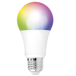
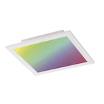
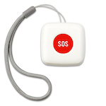
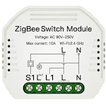
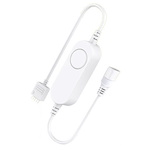

---
---
<!---
This file has been generated, do not edit this file manually!
-->
# Supported devices

Currently **1015** devices are supported from **168** different vendors.

In case you own a Zigbee device which is **NOT** listed here, please see
[How to support new devices](../how_tos/how_to_support_new_devices.md).

###  Somgoms

| Model | Description | Picture |
| ------------- | ------------- | -------------------------- |
| [ZSTY-SM-11ZG-US-W](../devices/ZSTY-SM-11ZG-US-W.md) |  Somgoms 1 gang switch (on/off) |  |

### AXIS

| Model | Description | Picture |
| ------------- | ------------- | -------------------------- |
| [GR-ZB01-W](../devices/GR-ZB01-W.md) | AXIS Gear window shade motor (open, close, position, battery) |  |

### AduroSmart

| Model | Description | Picture |
| ------------- | ------------- | -------------------------- |
| [81809/81813](../devices/81809_81813.md) | AduroSmart ERIA colors and white shades smart light bulb A19/BR30 (on/off, brightness, color temperature, color xy) |  |
| [81825](../devices/81825.md) | AduroSmart ERIA smart wireless dimming switch (on, off, up, down) |  |

### Airam

| Model | Description | Picture |
| ------------- | ------------- | -------------------------- |
| [4713407](../devices/4713407.md) | Airam LED OP A60 ZB 9W/827 E27 (on/off, brightness) |  |
| [AIRAM-CTR.U](../devices/AIRAM-CTR.U.md) | Airam CTR.U remote (on/off, brightness up/down and click/hold/release) |  |
| [CTR.UBX](../devices/CTR.UBX.md) | Airam CTR.U remote BX (action) |  |
| [4713406](../devices/4713406.md) | Airam GU10 spot 4.8W 2700K 385lm (on/off, brightness) |  |

### Ajax Online

| Model | Description | Picture |
| ------------- | ------------- | -------------------------- |
| [Aj_Zigbee_Led_Strip](../devices/Aj_Zigbee_Led_Strip.md) | Ajax Online LED Strip (on/off, brightness, color xy) |  |

### Anchor

| Model | Description | Picture |
| ------------- | ------------- | -------------------------- |
| [67200BL](../devices/67200BL.md) | Anchor Vetaar smart plug (on/off) |  |

### Aurora Lighting

| Model | Description | Picture |
| ------------- | ------------- | -------------------------- |
| [AU-A1GUZBCX5](../devices/AU-A1GUZBCX5.md) | Aurora Lighting AOne 5.4W smart tuneable GU10 lamp (on/off, brightness, color temperature) |  |
| [AU-A1GUZB5/30](../devices/AU-A1GUZB5_30.md) | Aurora Lighting AOne 4.8W smart dimmable GU10 lamp 3000K (on/off, brightness) |  |
| [AU-A1GUZBRGBW](../devices/AU-A1GUZBRGBW.md) | Aurora Lighting AOne 5.6w smart RGBW tuneable GU10 lamp (on/off, brightness, color temperature, color xy) |  |
| [AU-A1GSZ9RGBW](../devices/AU-A1GSZ9RGBW.md) | Aurora Lighting AOne 9.5W smart RGBW GLS E27/B22 (on/off, brightness, color temperature, color xy) |  |
| [AU-A1ZBRC](../devices/AU-A1ZBRC.md) | Aurora Lighting AOne smart remote (action) |  |
| [AU-A1ZBPIRS](../devices/AU-A1ZBPIRS.md) | Aurora Lighting AOne PIR sensor (occupancy) |  |
| [AU-A1ZBPIAB](../devices/AU-A1ZBPIAB.md) | Aurora Lighting Power plug Zigbee EU (on/off, power measurements) |  |
| [AU-A1ZBDWS](../devices/AU-A1ZBDWS.md) | Aurora Lighting Magnetic door & window contact sensor (contact) |  |
| [AU-A1ZB2WDM](../devices/AU-A1ZB2WDM.md) | Aurora Lighting AOne 250W smart rotary dimmer module (on/off, brightness) |  |

### BTicino

| Model | Description | Picture |
| ------------- | ------------- | -------------------------- |
| [K4003C/L4003C/N4003C/NT4003C](../devices/K4003C_L4003C_N4003C_NT4003C.md) | BTicino Light switch with neutral (on/off, led color) |  |

### Bandi

| Model | Description | Picture |
| ------------- | ------------- | -------------------------- |
| [BDS03G1](../devices/TS0001.md) | Bandi 1 gang switch (white-label of TuYa TS0001) (on/off) |  |

### Belkin

| Model | Description | Picture |
| ------------- | ------------- | -------------------------- |
| [F7C033](../devices/F7C033.md) | Belkin WeMo smart LED bulb (on/off, brightness) |  |

### Binthen

| Model | Description | Picture |
| ------------- | ------------- | -------------------------- |
| [BCM100D](../devices/TS0601_curtain.md) | Binthen Curtain motor (white-label of TuYa TS0601_curtain) (open, close, stop, position) |  |
| [CV01A](../devices/TS0601_curtain.md) | Binthen Curtain motor (white-label of TuYa TS0601_curtain) (open, close, stop, position) |  |

### Bitron

| Model | Description | Picture |
| ------------- | ------------- | -------------------------- |
| [AV2010/34](../devices/AV2010_34.md) | Bitron 4-Touch single click buttons (click, action) |  |
| [AV2010/22](../devices/AV2010_22.md) | Bitron Wireless motion detector (occupancy) |  |
| [AV2010/22A](../devices/AV2010_22A.md) | Bitron Wireless motion detector (occupancy) |  |
| [AV2010/25](../devices/AV2010_25.md) | Bitron Video wireless socket (on/off, power measurement) |  |
| [AV2010/32](../devices/AV2010_32.md) | Bitron Wireless wall thermostat with relay (temperature, heating/cooling system control) |  |
| [AV2010/21A](../devices/AV2010_21A.md) | Bitron Compact magnetic contact sensor (contact, tamper) |  |
| [AV2010/24A](../devices/AV2010_24A.md) | Bitron Optical smoke detector (hardware version v2) (smoke, tamper and battery) |  |
| [902010/24](../devices/902010_24.md) | Bitron Optical smoke detector (hardware version v1) (smoke, tamper and battery) |  |

### Blaupunkt

| Model | Description | Picture |
| ------------- | ------------- | -------------------------- |
| [SCM-S1](../devices/SCM-S1.md) | Blaupunkt Roller shutter (open/close) |  |
| [PSM-S1](../devices/PSM-29ZBSR.md) | Blaupunkt Power plug (white-label of Climax PSM-29ZBSR) (on/off, power measurement) |  |

### BlitzWolf

| Model | Description | Picture |
| ------------- | ------------- | -------------------------- |
| [BW-IS2](../devices/BW-IS2.md) | BlitzWolf Rechargeable Zigbee contact sensor (contact) |  |
| [BW-IS3](../devices/BW-IS3.md) | BlitzWolf Rechargeable Zigbee PIR motion sensor (occupancy) |  |
| [BW-SHP13](../devices/TS0121_plug.md) | BlitzWolf 10A UK or 16A EU smart plug (white-label of TuYa TS0121_plug) (on/off, power measurements) |  |

### Bosch

| Model | Description | Picture |
| ------------- | ------------- | -------------------------- |
| [RADON TriTech ZB](../devices/RADON_TriTech_ZB.md) | Bosch Wireless motion detector (occupancy and temperature) |  |
| [ISW-ZPR1-WP13](../devices/ISW-ZPR1-WP13.md) | Bosch Motion sensor (occupancy and temperature) |  |

### Busch-Jaeger

| Model | Description | Picture |
| ------------- | ------------- | -------------------------- |
| [6717-84](../devices/6717-84.md) | Busch-Jaeger Adaptor plug (on/off) |  |
| [6735/6736/6737](../devices/6735_6736_6737.md) | Busch-Jaeger Zigbee Light Link power supply/relay/dimmer (on/off and level control for 6715) |  |

### CR Smart Home

| Model | Description | Picture |
| ------------- | ------------- | -------------------------- |
| [TS0202](../devices/TS0202.md) | CR Smart Home Motion sensor (occupancy) |  |
| [TS0203](../devices/TS0203.md) | CR Smart Home Door sensor (contact) |  |
| [TS0204](../devices/TS0204.md) | CR Smart Home Gas sensor (gas) |  |
| [TS0205](../devices/TS0205.md) | CR Smart Home Smoke sensor (smoke) |  |
| [TS0111](../devices/TS0111.md) | CR Smart Home Socket (on/off) |  |
| [TS0207](../devices/TS0207.md) | CR Smart Home Water leak detector (water leak) |  |
| [TS0218](../devices/TS0218.md) | CR Smart Home Button (click) |  |
| [TS0001](../devices/TS0001.md) | CR Smart Home Valve control (white-label of TuYa TS0001) (on/off) |  |

### CREE

| Model | Description | Picture |
| ------------- | ------------- | -------------------------- |
| [B00TN589ZG](../devices/B00TN589ZG.md) | CREE Connected bulb (on/off, brightness) |  |

### CY-LIGHTING

| Model | Description | Picture |
| ------------- | ------------- | -------------------------- |
| [DM A60F](../devices/DM_A60F.md) | CY-LIGHTING 6W smart dimmable E27 lamp 2700K (on/off, brightness) |  |

### Calex

| Model | Description | Picture |
| ------------- | ------------- | -------------------------- |
| [421786](../devices/421786.md) | Calex LED A60 Zigbee GLS-lamp (on/off, brightness) |  |
| [421792](../devices/421792.md) | Calex LED A60 Zigbee RGB lamp (on/off, brightness, color temperature, color xy) |  |

### CentraLite

| Model | Description | Picture |
| ------------- | ------------- | -------------------------- |
| [3400-D](../devices/3400-D.md) | CentraLite 3-Series security keypad (action, arm) |  |

### Centralite

| Model | Description | Picture |
| ------------- | ------------- | -------------------------- |
| [4256251-RZHAC](../devices/4256251-RZHAC.md) | Centralite White Swiss power outlet switch with power meter (switch and power meter) |  |
| [4257050-ZHAC](../devices/4257050-ZHAC.md) | Centralite 3-Series smart dimming outlet (on/off, brightness, power measurement) |  |
| [4257050-RZHAC](../devices/4257050-RZHAC.md) | Centralite 3-Series smart outlet (on/off, power measurement) |  |
| [3323-G](../devices/3323-G.md) | Centralite Micro-door sensor (contact, temperature) |  |
| [3420-G](../devices/3420-G.md) | Centralite 3-Series night light repeater (on/off, brightness) |  |
| [3157100](../devices/3157100.md) | Centralite 3-Series pearl touch thermostat, (temperature, heating/cooling system control, fan) |  |
| [4200-C](../devices/4200-C.md) | Centralite Smart outlet (on/off) |  |

### Climax

| Model | Description | Picture |
| ------------- | ------------- | -------------------------- |
| [PSS-23ZBS](../devices/PSS-23ZBS.md) | Climax Power plug (on/off) |  |
| [SCM-5ZBS](../devices/SCM-5ZBS.md) | Climax Roller shutter (open/close) |  |
| [PSM-29ZBSR](../devices/PSM-29ZBSR.md) | Climax Power plug (on/off, power measurement) |  |
| [RS-23ZBS](../devices/RS-23ZBS.md) | Climax Temperature & humidity sensor (temperature, humidity) |  |

### Commercial Electric

| Model | Description | Picture |
| ------------- | ------------- | -------------------------- |
| [53170161](../devices/53170161.md) | Commercial Electric Matte White Recessed Retrofit Smart Led Downlight - 4 Inch (on/off, brightness, color temperature) |  |

### Custom devices (DiY)

| Model | Description | Picture |
| ------------- | ------------- | -------------------------- |
| [CC2530.ROUTER](../devices/CC2530.ROUTER.md) | Custom devices (DiY) [CC2530 router](http://ptvo.info/cc2530-based-zigbee-coordinator-and-router-112/) (state, description, type, rssi) |  |
| [ptvo.switch](../devices/ptvo.switch.md) | Custom devices (DiY) [Multi-channel relay switch](https://ptvo.info/zigbee-switch-configurable-firmware-router-199/) (hold, single, double and triple click, on/off, type, rssi) |  |
| [DNCKATSD001](../devices/DNCKATSD001.md) | Custom devices (DiY) [DNCKAT single key wired wall dimmable light switch](https://github.com/dzungpv/dnckatsw00x/) (on/off, brightness) |  |
| [DNCKATSW001](../devices/DNCKATSW001.md) | Custom devices (DiY) [DNCKAT single key wired wall light switch](https://github.com/dzungpv/dnckatsw00x/) (on/off) |  |
| [DNCKATSW002](../devices/DNCKATSW002.md) | Custom devices (DiY) [DNCKAT double key wired wall light switch](https://github.com/dzungpv/dnckatsw00x/) (hold/release, on/off) |  |
| [DNCKATSW003](../devices/DNCKATSW003.md) | Custom devices (DiY) [DNCKAT triple key wired wall light switch](https://github.com/dzungpv/dnckatsw00x/) (hold/release, on/off) |  |
| [DNCKATSW004](../devices/DNCKATSW004.md) | Custom devices (DiY) [DNCKAT quadruple key wired wall light switch](https://github.com/dzungpv/dnckatsw00x/) (hold/release, on/off) |  |
| [ZigUP](../devices/ZigUP.md) | Custom devices (DiY) [CC2530 based ZigBee relais, switch, sensor and router](https://github.com/formtapez/ZigUP/) (relais, RGB-stripe, sensors, S0-counter, ADC, digital I/O) |  |
| [ZWallRemote0](../devices/ZWallRemote0.md) | Custom devices (DiY) [Matts Wall Switch Remote](https://github.com/mattlokes/ZWallRemote) (on/off) |  |

### DIYRuZ

| Model | Description | Picture |
| ------------- | ------------- | -------------------------- |
| [DIYRuZ_R4_5](../devices/DIYRuZ_R4_5.md) | DIYRuZ [DiY 4 Relays + 4 switches + 1 buzzer](http://modkam.ru/?p=1054) (on/off) |  |
| [DIYRuZ_KEYPAD20](../devices/DIYRuZ_KEYPAD20.md) | DIYRuZ [DiY 20 button keypad](http://modkam.ru/?p=1114) (click) |  |
| [DIYRuZ_magnet](../devices/DIYRuZ_magnet.md) | DIYRuZ [DIYRuZ contact sensor](https://modkam.ru/?p=1220) (contact) |  |
| [DIYRuZ_rspm](../devices/DIYRuZ_rspm.md) | DIYRuZ [DIYRuZ relay switch power meter](https://modkam.ru/?p=1309) (relay, switch, adc) |  |
| [DIYRuZ_FreePad](../devices/DIYRuZ_FreePad.md) | DIYRuZ [DiY 8/12/20 button keypad](http://modkam.ru/?p=1114) (single, double, triple, quadruple, many, hold/release) |  |
| [DIYRuZ_Geiger](../devices/DIYRuZ_Geiger.md) | DIYRuZ [DiY Geiger counter](https://modkam.ru/?p=1591) (radioactive pulses perminute) |  |
| [DIYRuZ_R8_8](../devices/DIYRuZ_R8_8.md) | DIYRuZ [DiY 8 Relays + 8 switches](https://modkam.ru/?p=1638) (on/off) |  |
| [DIYRuZ_RT](../devices/DIYRuZ_RT.md) | DIYRuZ [DiY CC2530 Zigbee 3.0 firmware](https://habr.com/ru/company/iobroker/blog/495926/) (on/off, temperature) |  |

### Danalock

| Model | Description | Picture |
| ------------- | ------------- | -------------------------- |
| [V3-BTZB](../devices/V3-BTZB.md) | Danalock BT/ZB smartlock (lock/unlock, battery) |  |

### Dawon DNS

| Model | Description | Picture |
| ------------- | ------------- | -------------------------- |
| [PM-C140-ZB](../devices/PM-C140-ZB.md) | Dawon DNS IOT remote control smart buried-type outlet (on/off, power and energy measurement) |  |
| [PM-B530-ZB](../devices/PM-B530-ZB.md) | Dawon DNS IOT smart plug 16A (on/off, power and energy measurement) |  |
| [PM-B540-ZB](../devices/PM-B540-ZB.md) | Dawon DNS IOT smart plug 16A (on/off, power and energy measurement) |  |
| [PM-B430-ZB](../devices/PM-B430-ZB.md) | Dawon DNS IOT smart plug 10A (on/off, power and energy measurement) |  |
| [PM-S140-ZB](../devices/PM-S140-ZB.md) | Dawon DNS IOT smart switch 1 gang without neutral wire (on/off) |  |
| [PM-S240-ZB](../devices/PM-S240-ZB.md) | Dawon DNS IOT smart switch 2 gang without neutral wire (on/off) |  |
| [PM-S340-ZB](../devices/PM-S340-ZB.md) | Dawon DNS IOT smart switch 3 gang without neutral wire (on/off) |  |
| [PM-S140R-ZB](../devices/PM-S140R-ZB.md) | Dawon DNS IOT smart switch 1 gang router without neutral wire (on/off) |  |
| [PM-S240R-ZB](../devices/PM-S240R-ZB.md) | Dawon DNS IOT smart switch 2 gang without neutral wire (on/off) |  |
| [PM-S340R-ZB](../devices/PM-S340R-ZB.md) | Dawon DNS IOT smart switch 3 gang without neutral wire (on/off) |  |
| [PM-S150-ZB](../devices/PM-S150-ZB.md) | Dawon DNS IOT smart switch 1 gang router without neutral wire (on/off) |  |
| [PM-S250-ZB](../devices/PM-S250-ZB.md) | Dawon DNS IOT smart switch 2 gang without neutral wire (on/off) |  |
| [PM-S350-ZB](../devices/PM-S350-ZB.md) | Dawon DNS IOT smart switch 3 gang without neutral wire (on/off) |  |
| [PM-C150-ZB](../devices/PM-C150-ZB.md) | Dawon DNS IOT remote control smart buried-type 16A outlet (on/off, power and energy measurement) |  |

### Develco

| Model | Description | Picture |
| ------------- | ------------- | -------------------------- |
| [EMIZB-132](../devices/EMIZB-132.md) | Develco Wattle AMS HAN power-meter sensor (power measurements) |  |
| [SMSZB-120](../devices/SMSZB-120.md) | Develco Smoke detector with siren (smoke, warning, temperature) |  |
| [MOSZB-130](../devices/MOSZB-130.md) | Develco Motion sensor (occupancy) |  |

### Digi

| Model | Description | Picture |
| ------------- | ------------- | -------------------------- |
| [XBee](../devices/XBee.md) | Digi Router (router only) |  |

### Dresden Elektronik

| Model | Description | Picture |
| ------------- | ------------- | -------------------------- |
| [Mega23M12](../devices/Mega23M12.md) | Dresden Elektronik ZigBee Light Link wireless electronic ballast (on/off, brightness, color temperature, color xy) |  |
| [XVV-Mega23M12](../devices/XVV-Mega23M12.md) | Dresden Elektronik ZigBee Light Link wireless electronic ballast color temperature (on/off, brightness, color temperature) |  |

### EDP

| Model | Description | Picture |
| ------------- | ------------- | -------------------------- |
| [PLUG EDP RE:DY](../devices/PLUG_EDP_RE_DY.md) | EDP re:dy plug (on/off, power measurement) |  |
| [SWITCH EDP RE:DY](../devices/SWITCH_EDP_RE_DY.md) | EDP re:dy switch (on/off) |  |

### ELKO

| Model | Description | Picture |
| ------------- | ------------- | -------------------------- |
| [316GLEDRF](../devices/316GLEDRF.md) | ELKO ZigBee in-wall smart dimmer (on/off, brightness) |  |

### ETOP

| Model | Description | Picture |
| ------------- | ------------- | -------------------------- |
| [HT-08](../devices/HT-08.md) | ETOP Wall-mount thermostat (thermostat, temperature) |  |
| [HT-10](../devices/HT-10.md) | ETOP Radiator valve (thermostat, temperature) |  |

### EchoStar

| Model | Description | Picture |
| ------------- | ------------- | -------------------------- |
| [SAGE206612](../devices/SAGE206612.md) | EchoStar SAGE by Hughes doorbell sensor (action) |  |

### EcoDim

| Model | Description | Picture |
| ------------- | ------------- | -------------------------- |
| [Eco-Dim.07](../devices/Eco-Dim.07.md) | EcoDim Zigbee & Z-wave dimmer  (on/off, brightness) |  |
| [ED-10011](../devices/ED-10011.md) | EcoDim Zigbee 4 button wall switch (action) |  |
| [ED-10012](../devices/ED-10012.md) | EcoDim Zigbee 2 button wall switch (action) |  |

### EcoSmart

| Model | Description | Picture |
| ------------- | ------------- | -------------------------- |
| [A9A19A60WESDZ02](../devices/A9A19A60WESDZ02.md) | EcoSmart Tuneable white (A19) (on/off, brightness, color temperature) |  |
| [A9BR3065WESDZ02](../devices/A9BR3065WESDZ02.md) | EcoSmart Tuneable white (BR30) (on/off, brightness, color temperature) |  |
| [D1821](../devices/D1821.md) | EcoSmart A19 RGB bulb (on/off, brightness, color temperature, color xy) |  |
| [D1531](../devices/D1531.md) | EcoSmart A19 bright white bulb (on/off, brightness) |  |
| [D1532](../devices/D1532.md) | EcoSmart A19 soft white bulb (on/off, brightness) |  |
| [D1542](../devices/D1542.md) | EcoSmart GU10 adjustable white bulb (on/off, brightness, color temperature) |  |
| [D1533](../devices/D1533.md) | EcoSmart PAR20 bright white bulb (on/off, brightness) |  |
| [D1523](../devices/D1523.md) | EcoSmart A19 soft white bulb (on/off, brightness) |  |

### Ecolink

| Model | Description | Picture |
| ------------- | ------------- | -------------------------- |
| [4655BC0-R](../devices/4655BC0-R.md) | Ecolink Contact sensor (contact) |  |

### EnOcean

| Model | Description | Picture |
| ------------- | ------------- | -------------------------- |
| [EWSxZG](../devices/GreenPower_7.md) | EnOcean Easyfit 1 or 2 gang switch (white-label of GreenPower GreenPower_7) (action) |  |

### Enbrighten

| Model | Description | Picture |
| ------------- | ------------- | -------------------------- |
| [43076](../devices/43076.md) | Enbrighten Zigbee in-wall smart switch (on/off) |  |
| [43080](../devices/43080.md) | Enbrighten Zigbee in-wall smart dimmer (on/off, brightness) |  |
| [43102](../devices/43102.md) | Enbrighten Zigbee in-wall outlet (on/off) |  |
| [43100](../devices/43100.md) | Enbrighten Plug-in Zigbee outdoor smart switch (on/off) |  |
| [43084](../devices/43084.md) | Enbrighten Zigbee in-wall smart switch (on/off) |  |

### Envilar

| Model | Description | Picture |
| ------------- | ------------- | -------------------------- |
| [ZG102-BOX-UNIDIM](../devices/ZG102-BOX-UNIDIM.md) | Envilar ZigBee AC phase-cut dimmer (on/off, brightness) |  |

### Essentials

| Model | Description | Picture |
| ------------- | ------------- | -------------------------- |
| [120112](../devices/GS361A-H04.md) | Essentials Smart home heizkörperthermostat premium (white-label of Siterwell GS361A-H04) (thermostat, temperature) |  |

### Eurotronic

| Model | Description | Picture |
| ------------- | ------------- | -------------------------- |
| [SPZB0001](../devices/SPZB0001.md) | Eurotronic Spirit Zigbee wireless heater thermostat (temperature, heating system control) |  |

### Feibit

| Model | Description | Picture |
| ------------- | ------------- | -------------------------- |
| [TZSW22FW-L4](../devices/TZSW22FW-L4.md) | Feibit Smart light switch - 2 gang (on/off) |  |
| [SEB01ZB](../devices/SEB01ZB.md) | Feibit SOS button (sos) |  |
| [SBM01ZB](../devices/SBM01ZB.md) | Feibit Human body movement sensor (occupancy, tamper) |  |
| [STH01ZB](../devices/STH01ZB.md) | Feibit Smart temperature & humidity Sensor (temperature, humidity) |  |
| [SSA01ZB](../devices/SSA01ZB.md) | Feibit Smoke detector (smoke) |  |
| [SCA01ZB](../devices/SCA01ZB.md) | Feibit Smart carbon monoxide sensor (carbon monoxide) |  |
| [SGA01ZB](../devices/SGA01ZB.md) | Feibit Combustible gas sensor (gas) |  |
| [SWA01ZB](../devices/SWA01ZB.md) | Feibit Water leakage sensor (water leak) |  |
| [SDM01ZB](../devices/SDM01ZB.md) | Feibit Door or window contact switch (contact) |  |
| [SFS01ZB](../devices/SFS01ZB.md) | Feibit Power plug (on/off) |  |
| [SLS301ZB_2](../devices/SLS301ZB_2.md) | Feibit Smart light switch - 2 gang (on/off) |  |
| [SLS301ZB_3](../devices/SLS301ZB_3.md) | Feibit Smart light switch - 3 gang (on/off) |  |
| [SSS401ZB](../devices/SSS401ZB.md) | Feibit Smart 4 key scene wall switch (on/off, action) |  |

### Ferguson

| Model | Description | Picture |
| ------------- | ------------- | -------------------------- |
| [TH-T_V14](../devices/HS1HT.md) | Ferguson Smart temperature & humidity Sensor (white-label of HEIMAN HS1HT) (temperature and humidity) |  |

### GE

| Model | Description | Picture |
| ------------- | ------------- | -------------------------- |
| [PSB19-SW27](../devices/PSB19-SW27.md) | GE Link smart LED light bulb, A19 soft white (2700K) (on/off, brightness) |  |
| [22670](../devices/22670.md) | GE Link smart LED light bulb, A19/BR30 soft white (2700K) (on/off, brightness) |  |
| [PQC19-DY01](../devices/PQC19-DY01.md) | GE Link smart LED light bulb, A19/BR30 cold white (5000K) (on/off, brightness) |  |
| [45852GE](../devices/45852GE.md) | GE ZigBee plug-in smart dimmer (on/off, brightness) |  |
| [45853GE](../devices/45853GE.md) | GE Plug-in smart switch (on/off, power measurement) |  |
| [45856GE](../devices/45856GE.md) | GE In-wall smart switch (on/off) |  |
| [45857GE](../devices/45857GE.md) | GE ZigBee in-wall smart dimmer (on/off, brightness) |  |
| [PTAPT-WH02](../devices/PTAPT-WH02.md) | GE Quirky smart switch (on/off) |  |

### GMY Smart Bulb

| Model | Description | Picture |
| ------------- | ------------- | -------------------------- |
| [B07KG5KF5R](../devices/B07KG5KF5R.md) | GMY Smart Bulb GMY Smart bulb, 470lm, vintage dimmable, 2700-6500k, E27 (on/off, brightness, color temperature) |  |

### GS

| Model | Description | Picture |
| ------------- | ------------- | -------------------------- |
| [BDHM8E27W70-I1](../devices/BDHM8E27W70-I1.md) | GS Active light, warm to cool white (E27 & B22) (on/off, brightness, color temperature) |  |

### Gewiss

| Model | Description | Picture |
| ------------- | ------------- | -------------------------- |
| [GWA1521](../devices/GWA1521.md) | Gewiss Switch actuator 1 channel with input (on/off) |  |
| [GWA1522](../devices/GWA1522.md) | Gewiss Switch actuator 2 channels with input (on/off) |  |
| [GWA1531](../devices/GWA1531.md) | Gewiss Shutter actuator (on/off) |  |

### Gira

| Model | Description | Picture |
| ------------- | ------------- | -------------------------- |
| [2430-100](../devices/InstaRemote.md) | Gira ZigBee Light Link wall transmitter (white-label of Insta InstaRemote) (action) |  |

### Gledopto

| Model | Description | Picture |
| ------------- | ------------- | -------------------------- |
| [GL-C-006](../devices/GL-C-006.md) | Gledopto Zigbee LED controller WW/CW (on/off, brightness, color temperature) |  |
| [GL-C-007-1ID](../devices/GL-C-007-1ID.md) | Gledopto Zigbee LED controller RGBW (1 ID) (on/off, brightness, color temperature, color xy) |  |
| [GL-C-007-2ID](../devices/GL-C-007-2ID.md) | Gledopto Zigbee LED controller RGBW (2 ID) (on/off, brightness, color temperature, color xy) |  |
| [GL-S-004ZS](../devices/GL-S-004ZS.md) | Gledopto Zigbee smart RGB+CCT 4W MR16 (on/off, brightness, color temperature, color xy) |  |
| [GL-C-007S](../devices/GL-C-007S.md) | Gledopto Zigbee LED controller RGBW plus model (on/off, brightness, color xy) |  |
| [GL-C-008-2ID](../devices/GL-C-008-2ID.md) | Gledopto Zigbee LED controller RGB + CCT (2 ID) (on/off, brightness, color temperature, color xy) |  |
| [GL-C-008-1ID](../devices/GL-C-008-1ID.md) | Gledopto Zigbee LED controller RGB + CCT (1 ID) (on/off, brightness, color temperature, color xy) |  |
| [GL-C-008S](../devices/GL-C-008S.md) | Gledopto Zigbee LED controller RGB + CCT plus model (on/off, brightness, color temperature, color xy) |  |
| [GL-C-009](../devices/GL-C-009.md) | Gledopto Zigbee LED controller dimmer (on/off, brightness) |  |
| [GL-MC-001](../devices/GL-MC-001.md) | Gledopto Zigbee USB mini LED controller RGB + CCT (on/off, brightness, color temperature, color xy) |  |
| [GL-S-004Z](../devices/GL-S-004Z.md) | Gledopto Zigbee Smart WW/CW GU10 (on/off, brightness, color temperature) |  |
| [GL-S-007Z](../devices/GL-S-007Z.md) | Gledopto Smart RGB+CCT 5W GU10 (on/off, brightness, color temperature, color xy) |  |
| [GL-S-007ZS](../devices/GL-S-007ZS.md) | Gledopto Smart RGB+CCT 4W GU10 plus model (on/off, brightness, color temperature, color xy) |  |
| [GL-S-008Z](../devices/GL-S-008Z.md) | Gledopto Soposh dual white and color  (on/off, brightness, color temperature, color xy) |  |
| [GL-B-001Z](../devices/GL-B-001Z.md) | Gledopto Smart 4W E14 RGB / CCT LED bulb (on/off, brightness, color temperature, color xy) |  |
| [GL-B-001ZS](../devices/GL-B-001ZS.md) | Gledopto Smart 4W E14 RGB / CCT LED bulb (on/off, brightness, color temperature, color xy) |  |
| [GL-G-001Z](../devices/GL-G-001Z.md) | Gledopto Smart garden lamp (on/off, brightness, color temperature, color xy) |  |
| [GL-G-007Z](../devices/GL-G-007Z.md) | Gledopto Smart garden lamp 9W RGB / CCT (on/off, brightness, color temperature, color xy) |  |
| [GL-B-007Z](../devices/GL-B-007Z.md) | Gledopto Smart 6W E27 RGB / CCT LED bulb (on/off, brightness, color temperature, color xy) |  |
| [GL-B-007ZS](../devices/GL-B-007ZS.md) | Gledopto Smart+ 6W E27 RGB / CCT LED bulb (on/off, brightness, color temperature, color xy) |  |
| [GL-B-008Z](../devices/GL-B-008Z.md) | Gledopto Smart 12W E27 RGB / CCT LED bulb (on/off, brightness, color temperature, color xy) |  |
| [GL-B-008ZS](../devices/GL-B-008ZS.md) | Gledopto Smart 12W E27 RGB / CW LED bulb (on/off, brightness, color temperature, color xy) |  |
| [GL-D-003Z](../devices/GL-D-003Z.md) | Gledopto LED RGB + CCT downlight (on/off, brightness, color temperature, color xy) |  |
| [GL-D-004Z](../devices/GL-D-004Z.md) | Gledopto LED RGB + CCT downlight (on/off, brightness, color temperature, color xy) |  |
| [GL-D-004ZS](../devices/GL-D-004ZS.md) | Gledopto LED RGB + CCT downlight plus version 9W (on/off, brightness, color temperature, color xy) |  |
| [GL-D-005Z](../devices/GL-D-005Z.md) | Gledopto LED RGB + CCT downlight (on/off, brightness, color temperature, color xy) |  |
| [GL-D-005ZS](../devices/GL-D-005ZS.md) | Gledopto LED RGB + CCT downlight (on/off, brightness, color temperature, color xy) |  |
| [GL-S-003Z](../devices/GL-S-003Z.md) | Gledopto Smart RGBW GU10  (on/off, brightness, color xy) |  |
| [GL-S-005Z](../devices/GL-S-005Z.md) | Gledopto Smart RGBW MR16 (on/off, brightness, color temperature, color xy) |  |
| [GD-CZ-006](../devices/GD-CZ-006.md) | Gledopto Zigbee LED Driver (on/off, brightness) |  |
| [GL-FL-004TZ](../devices/GL-FL-004TZ.md) | Gledopto Zigbee 10W floodlight RGB CCT (on/off, brightness, color temperature, color xy) |  |
| [GL-FL-004TZS](../devices/GL-FL-004TZS.md) | Gledopto Zigbee 10W floodlight RGB CCT (on/off, brightness, color temperature, color xy) |  |
| [GL-FL-005TZ](../devices/GL-FL-005TZ.md) | Gledopto Zigbee 30W floodlight RGB CCT (on/off, brightness, color temperature, color xy) |  |
| [GL-FL-006TZ](../devices/GL-FL-006TZ.md) | Gledopto Zigbee 60W floodlight RGB CCT (on/off, brightness, color temperature, color xy) |  |
| [GL-FL-006TZS](../devices/GL-FL-006TZS.md) | Gledopto Zigbee 60W floodlight RGB CCT (on/off, brightness, color temperature, color xy) |  |
| [GL-W-001Z](../devices/GL-W-001Z.md) | Gledopto Zigbee ON/OFF Wall Switch (on/off) |  |
| [GL-D-003ZS](../devices/GL-D-003ZS.md) | Gledopto Smart+ 6W LED spot (on/off, brightness, color temperature, color xy) |  |

### GreenPower

| Model | Description | Picture |
| ------------- | ------------- | -------------------------- |
| [GreenPower_On_Off_Switch](../devices/GreenPower_On_Off_Switch.md) | GreenPower On/off switch (action) |  |
| [GreenPower_7](../devices/GreenPower_7.md) | GreenPower device 7 (action) |  |

### HEIMAN

| Model | Description | Picture |
| ------------- | ------------- | -------------------------- |
| [HS1CA-M](../devices/HS1CA-M.md) | HEIMAN Smart carbon monoxide sensor (carbon monoxide) |  |
| [HS3MS](../devices/HS3MS.md) | HEIMAN Smart motion sensor (occupancy) |  |
| [HS2SK](../devices/HS2SK.md) | HEIMAN Smart metering plug (on/off, power measurement) |  |
| [HS1SA-M](../devices/HS1SA-M.md) | HEIMAN Smoke detector (smoke) |  |
| [HS3SA](../devices/HS3SA.md) | HEIMAN Smoke detector (smoke) |  |
| [HS3CG](../devices/HS3CG.md) | HEIMAN Combustible gas sensor (gas) |  |
| [HS1CG-M](../devices/HS1CG-M.md) | HEIMAN Combustible gas sensor (gas) |  |
| [HS1CG_M](../devices/HS1CG_M.md) | HEIMAN Combustible gas sensor (gas) |  |
| [HS1DS/HS3DS](../devices/HS1DS_HS3DS.md) | HEIMAN Door sensor (contact) |  |
| [HEIMAN-M1](../devices/HEIMAN-M1.md) | HEIMAN Door sensor (contact) |  |
| [HS1DS-E](../devices/HS1DS-E.md) | HEIMAN Door sensor (contact) |  |
| [HS3DS](../devices/HS3DS.md) | HEIMAN Door sensor (contact) |  |
| [HS1WL/HS3WL](../devices/HS1WL_HS3WL.md) | HEIMAN Water leakage sensor (water leak) |  |
| [HS1-WL-E](../devices/HS1-WL-E.md) | HEIMAN Water leakage sensor (water leak) |  |
| [HS1WL-N](../devices/HS1WL-N.md) | HEIMAN Water leakage sensor (water leak) |  |
| [HS1RC-N](../devices/HS1RC-N.md) | HEIMAN Smart remote controller (action) |  |
| [HS1CA-E](../devices/HS1CA-E.md) | HEIMAN Smart carbon monoxide sensor (carbon monoxide) |  |
| [HS2WD-E](../devices/HS2WD-E.md) | HEIMAN Smart siren (warning) |  |
| [SOHM-I1](../devices/SOHM-I1.md) | HEIMAN Door contact sensor (contact) |  |
| [SWHM-I1](../devices/SWHM-I1.md) | HEIMAN Water leakage sensor (water leak) |  |
| [SMHM-I1](../devices/SMHM-I1.md) | HEIMAN Smart motion sensor (occupancy) |  |
| [HS1HT](../devices/HS1HT.md) | HEIMAN Smart temperature & humidity Sensor (temperature and humidity) |  |
| [HS1HT-N](../devices/HS1HT-N.md) | HEIMAN Smart temperature & humidity Sensor (temperature and humidity) |  |
| [SKHMP30-I1](../devices/SKHMP30-I1.md) | HEIMAN Smart metering plug (on/off, power measurement) |  |
| [HS2ESK-E](../devices/HS2ESK-E.md) | HEIMAN Smart in wall plug (on/off, power measurement) |  |
| [SGMHM-I1](../devices/SGMHM-I1.md) | HEIMAN Combustible gas sensor (gas) |  |
| [STHM-I1H](../devices/STHM-I1H.md) | HEIMAN Heiman temperature & humidity sensor (temperature and humidity) |  |
| [HS1EB/HS1EB-E](../devices/HS1EB_HS1EB-E.md) | HEIMAN Smart emergency button (action) |  |
| [HS2SS](../devices/HS2SS.md) | HEIMAN Smart scene switch (action) |  |
| [HS1CG-E](../devices/HS1CG-E.md) | HEIMAN Combustible gas sensor (gas) |  |
| [HS1VS-N](../devices/HS1VS-N.md) | HEIMAN Vibration sensor (vibration) |  |
| [HS2AQ-EM](../devices/HS2AQ-EM.md) | HEIMAN Air quality monitor (air quality) |  |
| [HS2IRC](../devices/HS2IRC.md) | HEIMAN Smart IR Control (ir control) |  |
| [HS2SW1A/HS2SW1A-N](../devices/HS2SW1A_HS2SW1A-N.md) | HEIMAN Smart switch - 1 gang with neutral wire (on/off, temperature) |  |
| [HS2SW2A/HS2SW2A-N](../devices/HS2SW2A_HS2SW2A-N.md) | HEIMAN Smart switch - 2 gang with neutral wire (on/off, temperature) |  |
| [HS2SW3A/HS2SW3A-N](../devices/HS2SW3A_HS2SW3A-N.md) | HEIMAN Smart switch - 3 gang with neutral wire (on/off, temperature) |  |
| [HS2CM-N-DC](../devices/HS2CM-N-DC.md) | HEIMAN Gear window shade motor (open, close, position) |  |

### HORNBACH

| Model | Description | Picture |
| ------------- | ------------- | -------------------------- |
| [10011725](../devices/10011725.md) | HORNBACH FLAIR Viyu Smarte LED bulb RGB E27 (on/off, brightness, color temperature, color xy) |  |

### Hampton Bay

| Model | Description | Picture |
| ------------- | ------------- | -------------------------- |
| [99432](../devices/99432.md) | Hampton Bay Universal wink enabled white ceiling fan premier remote control (on/off, brightness, fan_mode and fan_state) |  |
| [54668161](../devices/54668161.md) | Hampton Bay 12 in. LED smart puff (on/off, brightness, color temperature) |  |

### Hej

| Model | Description | Picture |
| ------------- | ------------- | -------------------------- |
| [GLSK3ZB-1711](../devices/GLSK3ZB-1711.md) | Hej Goqual 1 gang Switch (on/off) |  |
| [GLSK3ZB-1712](../devices/GLSK3ZB-1712.md) | Hej Goqual 2 gang Switch (on/off) |  |
| [GLSK3ZB-1713](../devices/GLSK3ZB-1713.md) | Hej Goqual 3 gang Switch (on/off) |  |
| [GLSK6ZB-1714](../devices/GLSK6ZB-1714.md) | Hej Goqual 4 gang Switch (on/off) |  |
| [GLSK6ZB-1715](../devices/GLSK6ZB-1715.md) | Hej Goqual 5 gang Switch (on/off) |  |
| [GLSK6ZB-1716](../devices/GLSK6ZB-1716.md) | Hej Goqual 6 gang Switch (on/off) |  |

### Hive

| Model | Description | Picture |
| ------------- | ------------- | -------------------------- |
| [MOT003](../devices/MOT003.md) | Hive Motion sensor (occupancy, temperature, battery) |  |
| [DWS003](../devices/DWS003.md) | Hive Contact sensor (contact, temperature, battery) |  |
| [HALIGHTDIMWWE27](../devices/HALIGHTDIMWWE27.md) | Hive Active smart bulb white LED (E27) (on/off, brightness) |  |
| [HALIGHTDIMWWE14](../devices/HALIGHTDIMWWE14.md) | Hive Active smart bulb white LED (E14) (on/off, brightness) |  |
| [HALIGHTDIMWWB22](../devices/HALIGHTDIMWWB22.md) | Hive Active smart bulb white LED (B22) (on/off, brightness) |  |
| [1613V](../devices/1613V.md) | Hive Active plug (on/off, power measurement) |  |
| [HV-GSCXZB269](../devices/HV-GSCXZB269.md) | Hive Active light cool to warm white (E26)  (on/off, brightness, color temperature) |  |
| [HV-GSCXZB279_HV-GSCXZB229](../devices/HV-GSCXZB279_HV-GSCXZB229.md) | Hive Active light, warm to cool white (E27 & B22) (on/off, brightness, color temperature) |  |
| [HV-GUCXZB5](../devices/HV-GUCXZB5.md) | Hive Active light, warm to cool white (GU10) (on/off, brightness, color temperature) |  |
| [UK7004240](../devices/UK7004240.md) | Hive Radiator valve (temperature) |  |
| [SLR1b](../devices/SLR1b.md) | Hive Heating thermostat (thermostat, occupied heating, weekly schedule) |  |
| [WPT1](../devices/WPT1.md) | Hive Heating thermostat remote control (none, communicate via thermostat) |  |
| [SLT2](../devices/SLT2.md) | Hive Heating thermostat remote control (nothing, communicate via thermostat) |  |
| [SLB2](../devices/SLB2.md) | Hive Signal booster (linkquality) |  |

### Honyar

| Model | Description | Picture |
| ------------- | ------------- | -------------------------- |
| [U86K31ND6](../devices/U86K31ND6.md) | Honyar 3 gang switch  (on/off) |  |

### IKEA

| Model | Description | Picture |
| ------------- | ------------- | -------------------------- |
| [LED1545G12](../devices/LED1545G12.md) | IKEA TRADFRI LED bulb E26/E27 980 lumen, dimmable, white spectrum, opal white (on/off, brightness, color temperature) |  |
| [T2011](../devices/T2011.md) | IKEA Osvalla panel round (on/off, brightness, color temperature) |  |
| [LED1546G12](../devices/LED1546G12.md) | IKEA TRADFRI LED bulb E26/E27 950 lumen, dimmable, white spectrum, clear (on/off, brightness, color temperature) |  |
| [LED1623G12](../devices/LED1623G12.md) | IKEA TRADFRI LED bulb E27 1000 lumen, dimmable, opal white (on/off, brightness) |  |
| [LED1537R6/LED1739R5](../devices/LED1537R6_LED1739R5.md) | IKEA TRADFRI LED bulb GU10 400 lumen, dimmable, white spectrum (on/off, brightness, color temperature) |  |
| [LED1650R5](../devices/LED1650R5.md) | IKEA TRADFRI LED bulb GU10 400 lumen, dimmable (on/off, brightness) |  |
| [LED1536G5](../devices/LED1536G5.md) | IKEA TRADFRI LED bulb E12/E14 400 lumen, dimmable, white spectrum, opal white (on/off, brightness, color temperature) |  |
| [LED1903C5/LED1835C6](../devices/LED1903C5_LED1835C6.md) | IKEA TRADFRI bulb E14 WS 470 lumen, dimmable, white spectrum, opal white (on/off, brightness, color temperature) |  |
| [LED1837R5](../devices/LED1837R5.md) | IKEA TRADFRI LED bulb GU10 400 lumen, dimmable (on/off, brightness) |  |
| [LED1842G3](../devices/LED1842G3.md) | IKEA TRADFRI LED bulb E27 WW clear 250 lumen, dimmable (on/off, brightness) |  |
| [LED1733G7](../devices/LED1733G7.md) | IKEA TRADFRI LED bulb E14 600 lumen, dimmable, white spectrum, opal white (on/off, brightness, color temperature) |  |
| [LED1622G12](../devices/LED1622G12.md) | IKEA TRADFRI LED bulb E26 1000 lumen, dimmable, opal white (on/off, brightness) |  |
| [LED1624G9](../devices/LED1624G9.md) | IKEA TRADFRI LED bulb E14/E26/E27 600 lumen, dimmable, color, opal white (on/off, brightness, color xy) |  |
| [LED1649C5](../devices/LED1649C5.md) | IKEA TRADFRI LED bulb E12/E14/E17 400 lumen, dimmable warm white, chandelier opal (on/off, brightness) |  |
| [LED1732G11](../devices/LED1732G11.md) | IKEA TRADFRI LED bulb E27 1000 lumen, dimmable, white spectrum, opal white (on/off, brightness, color temperature) |  |
| [LED1836G9](../devices/LED1836G9.md) | IKEA TRADFRI LED bulb E26/E27 806 lumen, dimmable, warm white (on/off, brightness) |  |
| [LED1736G9](../devices/LED1736G9.md) | IKEA TRADFRI LED bulb E26/E27 806 lumen, dimmable, white spectrum, clear (on/off, brightness, color temperature) |  |
| [T1820](../devices/T1820.md) | IKEA LEPTITER Recessed spot light, dimmable, white spectrum (on/off, brightness, color temperature) |  |
| [ICTC-G-1](../devices/ICTC-G-1.md) | IKEA TRADFRI wireless dimmer (brightness [0-255] (quick rotate for instant 0/255), action) |  |
| [ICPSHC24-10EU-IL-1](../devices/ICPSHC24-10EU-IL-1.md) | IKEA TRADFRI driver for wireless control (10 watt) (on/off, brightness) |  |
| [ICPSHC24-30EU-IL-1](../devices/ICPSHC24-30EU-IL-1.md) | IKEA TRADFRI driver for wireless control (30 watt) (on/off, brightness) |  |
| [L1527](../devices/L1527.md) | IKEA FLOALT LED light panel, dimmable, white spectrum (30x30 cm) (on/off, brightness, color temperature) |  |
| [L1529](../devices/L1529.md) | IKEA FLOALT LED light panel, dimmable, white spectrum (60x60 cm) (on/off, brightness, color temperature) |  |
| [L1528](../devices/L1528.md) | IKEA FLOALT LED light panel, dimmable, white spectrum (30x90 cm) (on/off, brightness, color temperature) |  |
| [L1531](../devices/L1531.md) | IKEA SURTE door light panel, dimmable, white spectrum (38x64 cm) (on/off, brightness, color temperature) |  |
| [E1603/E1702](../devices/E1603_E1702.md) | IKEA TRADFRI control outlet (on/off) |  |
| [E1524/E1810](../devices/E1524_E1810.md) | IKEA TRADFRI remote control (toggle, arrow left/right click/hold/release, brightness up/down click/hold/release) |  |
| [E1743](../devices/E1743.md) | IKEA TRADFRI ON/OFF switch (on, off, brightness up/down/stop) |  |
| [E1744](../devices/E1744.md) | IKEA SYMFONISK sound controller (volume up/down, play/pause, skip forward/backward) |  |
| [E1525/E1745](../devices/E1525_E1745.md) | IKEA TRADFRI motion sensor (occupancy) |  |
| [E1746](../devices/E1746.md) | IKEA TRADFRI signal repeater (linkquality) |  |
| [E1757](../devices/E1757.md) | IKEA FYRTUR roller blind (open, close, stop, position) |  |
| [E1926](../devices/E1926.md) | IKEA KADRILJ roller blind (open, close, stop, position) |  |
| [E1766](../devices/E1766.md) | IKEA TRADFRI open/close remote (click, action) |  |
| [T1828](../devices/T1828.md) | IKEA GUNNARP panel round (on/off, brightness, color temperature) |  |
| [T1829](../devices/T1829.md) | IKEA GUNNARP panel 40*40 (on/off, brightness, color temperature) |  |
| [LED1738G7](../devices/LED1738G7.md) | IKEA TRADFRI LED bulb E12 600 lumen, dimmable, white spectrum, opal white (on/off, brightness, color temperature) |  |

### Iluminize

| Model | Description | Picture |
| ------------- | ------------- | -------------------------- |
| [511.10](../devices/511.10.md) | Iluminize Zigbee LED-Controller  (on/off, brightness) |  |
| [511.201](../devices/511.201.md) | Iluminize ZigBee 3.0 Dimm-Aktor mini 1x 230V (on/off, brightness) |  |
| [511.010](../devices/511.010.md) | Iluminize Zigbee LED-Controller (on/off, brightness) |  |
| [511.012](../devices/511.012.md) | Iluminize Zigbee LED-Controller (on/off, brightness) |  |
| [511.202](../devices/511.202.md) | Iluminize Zigbee 3.0 Schalt-Aktor mini 1x230V, 200W/400W (on/off) |  |
| [511.557](../devices/511.557.md) | Iluminize Zigbee 3.0 wall dimmer (action) |  |
| [511.040](../devices/511.040.md) | Iluminize ZigBee 3.0 LED-controller, 4 channel 5A, RGBW LED (on/off, brightness, color temperature, color xy) |  |
| [511.344](../devices/511.344.md) | Iluminize Zigbee handheld remote RGBW 4 channels (action) |  |

### Immax

| Model | Description | Picture |
| ------------- | ------------- | -------------------------- |
| [07005B](../devices/07005B.md) | Immax Neo SMART LED E14 5W warm white, dimmable, Zigbee 3.0 (on/off, brightness) |  |
| [07004D](../devices/07004D.md) | Immax Neo SMART LED E27 8,5W color, dimmable, Zigbee 3.0 (on/off, brightness, color temperature, color xy) |  |
| [07008L](../devices/07008L.md) | Immax Neo SMART LED strip RGB + CCT, color, dimmable, Zigbee 3.0 (on/off, brightness, color temperature, color xy) |  |
| [07046L](../devices/07046L.md) | Immax 4-Touch single click buttons (action) |  |
| [07045L](../devices/07045L.md) | Immax Magnetic contact sensor (contact, tamper) |  |
| [07048L](../devices/07048L.md) | Immax NEO SMART plug (on/off, power and energy measurement) |  |
| [07115L](../devices/07115L.md) | Immax Neo SMART LED E27 9W RGB + CCT, dimmable, Zigbee 3.0 (on/off, brightness, color temperature, color xy) |  |
| [07047L](../devices/07047L.md) | Immax Intelligent motion sensor (occupancy, temperature, illuminance, humidity) |  |

### Innr

| Model | Description | Picture |
| ------------- | ------------- | -------------------------- |
| [FL 140 C](../devices/FL_140_C.md) | Innr Color Flex LED strip 4m 1200lm (on/off, brightness, color temperature, color xy) |  |
| [FL 130 C](../devices/FL_130_C.md) | Innr Color Flex LED strip (on/off, brightness, color temperature, color xy) |  |
| [FL 120 C](../devices/FL_120_C.md) | Innr Color Flex LED strip (on/off, brightness, color temperature, color xy) |  |
| [BF 263](../devices/BF_263.md) | Innr B22 filament bulb dimmable (on/off, brightness) |  |
| [RB 185 C](../devices/RB_185_C.md) | Innr E27 bulb RGBW (on/off, brightness, color temperature, color xy) |  |
| [BY 185 C](../devices/BY_185_C.md) | Innr B22 bulb RGBW (on/off, brightness, color temperature, color xy) |  |
| [RB 250 C](../devices/RB_250_C.md) | Innr E14 bulb RGBW (on/off, brightness, color temperature, color xy) |  |
| [RB 265](../devices/RB_265.md) | Innr E27 bulb (on/off, brightness) |  |
| [RF 265](../devices/RF_265.md) | Innr E27 bulb filament clear (on/off, brightness) |  |
| [RB 278 T](../devices/RB_278_T.md) | Innr Smart bulb tunable white E27 (on/off, brightness, color temperature) |  |
| [RB 285 C](../devices/RB_285_C.md) | Innr E27 bulb RGBW (on/off, brightness, color temperature, color xy) |  |
| [BY 285 C](../devices/BY_285_C.md) | Innr B22 bulb RGBW (on/off, brightness, color temperature, color xy) |  |
| [RB 165](../devices/RB_165.md) | Innr E27 bulb (on/off, brightness) |  |
| [RB 162](../devices/RB_162.md) | Innr E27 bulb (on/off, brightness) |  |
| [RB 175 W](../devices/RB_175_W.md) | Innr E27 bulb warm dimming (on/off, brightness) |  |
| [RB 178 T](../devices/RB_178_T.md) | Innr Smart bulb tunable white E27 (on/off, brightness, color temperature) |  |
| [BY 178 T](../devices/BY_178_T.md) | Innr Smart bulb tunable white B22 (on/off, brightness, color temperature) |  |
| [RS 122](../devices/RS_122.md) | Innr GU10 spot (on/off, brightness) |  |
| [RS 125](../devices/RS_125.md) | Innr GU10 spot (on/off, brightness) |  |
| [RS 225](../devices/RS_225.md) | Innr GU10 Spot (on/off, brightness) |  |
| [RS 128 T](../devices/RS_128_T.md) | Innr GU10 spot 350 lm, dimmable, white spectrum (on/off, brightness, color temperature) |  |
| [RS 228 T](../devices/RS_228_T.md) | Innr GU10 spot 350 lm, dimmable, white spectrum (on/off, brightness, color temperature) |  |
| [RS 229 T](../devices/RS_229_T.md) | Innr GU10 spot 350 lm, dimmable, white spectrum (on/off, brightness, color temperature) |  |
| [RS 230 C](../devices/RS_230_C.md) | Innr GU10 spot 350 lm, dimmable, RGBW (on/off, brightness, color temperature, color xy) |  |
| [RB 145](../devices/RB_145.md) | Innr E14 candle (on/off, brightness) |  |
| [RB 245](../devices/RB_245.md) | Innr E14 candle (on/off, brightness) |  |
| [RB 248 T](../devices/RB_248_T.md) | Innr E14 candle with white spectrum (on/off, brightness, color temperature) |  |
| [RB 148 T](../devices/RB_148_T.md) | Innr E14 candle with white spectrum (on/off, brightness, color temperature) |  |
| [RF 261](../devices/RF_261.md) | Innr E27 filament bulb dimmable (on/off, brightness) |  |
| [RF 263](../devices/RF_263.md) | Innr E27 filament bulb dimmable (on/off, brightness) |  |
| [RF 264](../devices/RF_264.md) | Innr E27 filament bulb dimmable (on/off, brightness) |  |
| [BY 165](../devices/BY_165.md) | Innr B22 bulb dimmable (on/off, brightness) |  |
| [PL 110](../devices/PL_110.md) | Innr Puck Light (on/off, brightness) |  |
| [ST 110](../devices/ST_110.md) | Innr Strip Light (on/off, brightness) |  |
| [UC 110](../devices/UC_110.md) | Innr Under cabinet light (on/off, brightness) |  |
| [DL 110 N](../devices/DL_110_N.md) | Innr Spot narrow (on/off, brightness) |  |
| [DL 110 W](../devices/DL_110_W.md) | Innr Spot wide (on/off, brightness) |  |
| [SL 110 N](../devices/SL_110_N.md) | Innr Spot Flex narrow (on/off, brightness) |  |
| [SL 110 M](../devices/SL_110_M.md) | Innr Spot Flex medium (on/off, brightness) |  |
| [SL 110 W](../devices/SL_110_W.md) | Innr Spot Flex wide (on/off, brightness) |  |
| [AE 260](../devices/AE_260.md) | Innr E26/24 bulb (on/off, brightness) |  |
| [AE 280 C](../devices/AE_280_C.md) | Innr E26 bulb RGBW (on/off, brightness, color temperature, color xy) |  |
| [SP 120](../devices/SP_120.md) | Innr Smart plug (on/off, power measurement) |  |
| [SP 220](../devices/SP_220.md) | Innr Smart plug (on/off) |  |
| [SP 222](../devices/SP_222.md) | Innr Smart plug (on/off) |  |
| [SP 224](../devices/SP_224.md) | Innr Smart plug (on/off) |  |
| [OFL 120 C](../devices/OFL_120_C.md) | Innr Outdoor flex light colour LED strip 2m, 550lm, RGBW (on/off, brightness, color temperature, color xy) |  |
| [OFL 140 C](../devices/OFL_140_C.md) | Innr Outdoor flex light colour LED strip 4m, 1000lm, RGBW (on/off, brightness, color temperature, color xy) |  |
| [OSL 130 C](../devices/OSL_130_C.md) | Innr Outdoor smart spot colour, 230lm/spot, RGBW (on/off, brightness, color temperature, color xy) |  |
| [BE 220](../devices/BE_220.md) | Innr E26/E24 white bulb (on/off, brightness) |  |

### Insta

| Model | Description | Picture |
| ------------- | ------------- | -------------------------- |
| [InstaRemote](../devices/InstaRemote.md) | Insta ZigBee Light Link wall transmitter (action) |  |

### Iris

| Model | Description | Picture |
| ------------- | ------------- | -------------------------- |
| [3210-L](../devices/3210-L.md) | Iris Smart plug (on/off, power measurement) |  |
| [3326-L](../devices/3326-L.md) | Iris Motion and temperature sensor (occupancy and temperature) |  |
| [3320-L](../devices/3320-L.md) | Iris Contact and temperature sensor (contact and temperature) |  |
| [3460-L](../devices/3460-L.md) | Iris Smart button (action, temperature) |  |
| [iL07_1](../devices/iL07_1.md) | Iris Motion Sensor (motion, tamper and battery) |  |
| [27087-03](../devices/27087-03.md) | Iris Hose faucet water timer (on/off) |  |

### JIAWEN

| Model | Description | Picture |
| ------------- | ------------- | -------------------------- |
| [K2RGBW01](../devices/K2RGBW01.md) | JIAWEN Wireless Bulb E27 9W RGBW (on/off, brightness, color temperature, color xy) |  |

### Jung

| Model | Description | Picture |
| ------------- | ------------- | -------------------------- |
| [ZLLxx5004M](../devices/InstaRemote.md) | Jung ZigBee Light Link wall transmitter (white-label of Insta InstaRemote) (action) |  |

### KMPCIL

| Model | Description | Picture |
| ------------- | ------------- | -------------------------- |
| [KMPCIL_RES005](../devices/KMPCIL_RES005.md) | KMPCIL Environment sensor (battery, temperature, humidity, pressure, illuminance, occupancy, switch) |  |

### Keen Home

| Model | Description | Picture |
| ------------- | ------------- | -------------------------- |
| [SV01](../devices/SV01.md) | Keen Home Smart vent (open, close, position, temperature, pressure, battery) |  |
| [SV02](../devices/SV02.md) | Keen Home Smart vent (open, close, position, temperature, pressure, battery) |  |

### Konke

| Model | Description | Picture |
| ------------- | ------------- | -------------------------- |
| [2AJZ4KPKEY](../devices/2AJZ4KPKEY.md) | Konke Multi-function button (single, double and long click) |  |
| [2AJZ4KPBS](../devices/2AJZ4KPBS.md) | Konke Motion sensor (occupancy) |  |
| [2AJZ4KPFT](../devices/2AJZ4KPFT.md) | Konke Temperature and humidity sensor (temperature and humidity) |  |
| [2AJZ4KPDR](../devices/2AJZ4KPDR.md) | Konke Contact sensor (contact) |  |
| [LH07321](../devices/LH07321.md) | Konke Water detector (water_leak) |  |

### Ksentry Electronics

| Model | Description | Picture |
| ------------- | ------------- | -------------------------- |
| [KS-SM001](../devices/KS-SM001.md) | Ksentry Electronics [Zigbee OnOff Controller](http://ksentry.manufacturer.globalsources.com/si/6008837134660/pdtl/ZigBee-module/1162731630/zigbee-on-off-controller-modules.htm) (on/off) |  |

### Kwikset

| Model | Description | Picture |
| ------------- | ------------- | -------------------------- |
| [66492-001](../devices/66492-001.md) | Kwikset Home connect smart lock conversion kit (lock/unlock, battery) |  |
| [99140-002](../devices/99140-002.md) | Kwikset SmartCode traditional electronic deadbolt (lock/unlock, battery) |  |
| [99100-045](../devices/99100-045.md) | Kwikset 910 SmartCode traditional electronic deadbolt (lock/unlock, battery) |  |
| [99100-006](../devices/99100-006.md) | Kwikset 910 SmartCode traditional electronic deadbolt (lock/unlock, battery) |  |

### LEDVANCE

| Model | Description | Picture |
| ------------- | ------------- | -------------------------- |
| [4058075181472](../devices/4058075181472.md) | LEDVANCE SMART+ panel 60 x 60cm tunable white (on/off, brightness, color temperature) |  |
| [4058075208414](../devices/4058075208414.md) | LEDVANCE SMART+ candle E14 tunable white (on/off, brightness, color temperature) |  |
| [4058075208339](../devices/4058075208339.md) | LEDVANCE Flex 3P multicolor (on/off, brightness, color temperature, color xy) |  |

### LEELKI

| Model | Description | Picture |
| ------------- | ------------- | -------------------------- |
| [WP33-EU](../devices/E220-KR4N0Z0-HA.md) | LEELKI Multiprise with 4 AC outlets and 2 USB super charging ports (16A) (white-label of TuYa E220-KR4N0Z0-HA) (on/off) |  |

### LeTV

| Model | Description | Picture |
| ------------- | ------------- | -------------------------- |
| [LeTV.8KEY](../devices/LeTV.8KEY.md) | LeTV 8key switch (action) |  |

### Leedarson

| Model | Description | Picture |
| ------------- | ------------- | -------------------------- |
| [ZM350STW1TCF](../devices/ZM350STW1TCF.md) | Leedarson LED PAR16 50 GU10 tunable white (on/off, brightness, color temperature) |  |
| [M350STW1](../devices/M350STW1.md) | Leedarson LED PAR16 50 GU10 (on/off, brightness) |  |
| [A806S-Q1G](../devices/A806S-Q1G.md) | Leedarson LED E27 color (on/off, brightness, color temperature, color xy) |  |
| [A806S-Q1R](../devices/A806S-Q1R.md) | Leedarson LED E27 tunable white (on/off, brightness) |  |
| [ZA806SQ1TCF](../devices/ZA806SQ1TCF.md) | Leedarson LED E27 tunable white (on/off, brightness, color temperature) |  |
| [6ARCZABZH](../devices/6ARCZABZH.md) | Leedarson 4-Key Remote Controller (on/off, brightness up/down and click/hold/release, cct) |  |
| [6xy-M350ST-W1Z](../devices/6xy-M350ST-W1Z.md) | Leedarson PAR16 tunable white (on/off, brightness, color temperature) |  |
| [5AA-SS-ZA-H0](../devices/5AA-SS-ZA-H0.md) | Leedarson Motion sensor (occupancy, illuminance) |  |

### Legrand

| Model | Description | Picture |
| ------------- | ------------- | -------------------------- |
| [067776](../devices/067776.md) | Legrand Netatmo wired shutter switch (open, close, stop, position, tilt) |  |
| [067773](../devices/067773.md) | Legrand Wireless remote switch (action) |  |
| [067774](../devices/067774.md) | Legrand Wireless double remote switch (action) |  |
| [067694](../devices/067694.md) | Legrand Remote toggle switch (action) |  |
| [067771](../devices/067771.md) | Legrand Wired switch without neutral (on/off, brightness) |  |
| [067775](../devices/067775.md) | Legrand Power socket with power consumption monitoring (on/off, power measurement) |  |
| [064888](../devices/064888.md) | Legrand Wired micromodule switch (on/off) |  |
| [064873](../devices/064873.md) | Legrand Home & away switch / master switch (action) |  |
| [412015](../devices/412015.md) | Legrand DIN power consumption module (power measurement, consumption alerts) |  |
| [752189](../devices/752189.md) | Legrand Night/day wireless switch (action) |  |

### Leviton

| Model | Description | Picture |
| ------------- | ------------- | -------------------------- |
| [DL15S-1BZ](../devices/DL15S-1BZ.md) | Leviton Lumina RF 15A switch, 120/277V (on/off) |  |
| [RC-2000WH](../devices/RC-2000WH.md) | Leviton Omnistat2 wireless thermostat (temperature, heating/cooling system control, fan) |  |

### LifeControl

| Model | Description | Picture |
| ------------- | ------------- | -------------------------- |
| [MCLH-07](../devices/MCLH-07.md) | LifeControl Water leak switch (water leak) |  |
| [MCLH-04](../devices/MCLH-04.md) | LifeControl Door sensor (contact) |  |
| [MCLH-02](../devices/MCLH-02.md) | LifeControl RGB LED lamp (on/off, brightness, color temperature, color xy) |  |
| [MCLH-03](../devices/MCLH-03.md) | LifeControl Power plug (on/off, power measurement) |  |
| [MCLH-05](../devices/MCLH-05.md) | LifeControl Motion sensor (occupancy) |  |
| [MCLH-08](../devices/MCLH-08.md) | LifeControl Air sensor (voc, eco2, temperature, humidity) |  |

### Linkind

| Model | Description | Picture |
| ------------- | ------------- | -------------------------- |
| [ZL1000100-CCT-US-V1A02](../devices/ZL1000100-CCT-US-V1A02.md) | Linkind Zigbee LED 9W A19 bulb, dimmable & tunable (on/off, brightness, color temperature) |  |
| [ZL1000400-CCT-EU-2-V1A02](../devices/ZL1000400-CCT-EU-2-V1A02.md) | Linkind Zigbee LED 5.4W C35 bulb E14, dimmable & tunable (on/off, brightness, color temperature) |  |
| [ZL1000701-27-EU-V1A02](../devices/ZL1000701-27-EU-V1A02.md) | Linkind Zigbee A60 filament bulb 6.3W (on/off, brightness) |  |
| [ZL1000700-22-EU-V1A02](../devices/ZL1000700-22-EU-V1A02.md) | Linkind Zigbee A60 led filament, dimmable warm light (2200K), E27. 4.2W, 420lm (on/off, brightness) |  |
| [ZS1100400-IN-V1A02](../devices/ZS1100400-IN-V1A02.md) | Linkind PIR motion sensor, wireless motion detector (occupancy) |  |
| [ZS110050078](../devices/ZS110050078.md) | Linkind Door/window Sensor (contact) |  |
| [ZS232000178](../devices/ZS232000178.md) | Linkind 1-key remote control (action) |  |
| [ZS190000118](../devices/ZS190000118.md) | Linkind Control outlet (on/off) |  |

### LivingWise

| Model | Description | Picture |
| ------------- | ------------- | -------------------------- |
| [LVS-ZB500D](../devices/LVS-ZB500D.md) | LivingWise ZigBee smart dimmer switch (on/off, brightness) |  |
| [LVS-ZB15S](../devices/LVS-ZB15S.md) | LivingWise ZigBee smart in-wall switch (on/off) |  |
| [LVS-SM10ZW](../devices/LVS-SM10ZW.md) | LivingWise Door or window contact switch (contact) |  |
| [LVS-SN10ZW_SN11](../devices/LVS-SN10ZW_SN11.md) | LivingWise Occupancy sensor (occupancy) |  |
| [LVS-ZB15R](../devices/LVS-ZB15R.md) | LivingWise Zigbee smart outlet (on/off) |  |
| [LVS-SC7](../devices/LVS-SC7.md) | LivingWise Scene controller  (action) |  |

### Livolo

| Model | Description | Picture |
| ------------- | ------------- | -------------------------- |
| [TI0001](../devices/TI0001.md) | Livolo Zigbee switch (1 and 2 gang) [work in progress](https://github.com/Koenkk/zigbee2mqtt/issues/592) (on/off) |  |
| [TI0001-switch](../devices/TI0001-switch.md) | Livolo New Zigbee Switch [work in progress](https://github.com/Koenkk/zigbee2mqtt/issues/3560) (on/off) |  |
| [TI0001-socket](../devices/TI0001-socket.md) | Livolo New Zigbee Socket [work in progress](https://github.com/Koenkk/zigbee2mqtt/issues/3560) (on/off) |  |

### Lonsonho

| Model | Description | Picture |
| ------------- | ------------- | -------------------------- |
| [11830304](../devices/11830304.md) | Lonsonho Curtain switch (open, close, stop, position) |  |
| [X711A](../devices/X711A.md) | Lonsonho 1 gang switch (on/off) |  |
| [X712A](../devices/X712A.md) | Lonsonho 2 gang switch (on/off) |  |
| [X713A](../devices/X713A.md) | Lonsonho 3 gang switch (on/off) |  |
| [QS-Zigbee-D02-TRIAC-LN](../devices/QS-Zigbee-D02-TRIAC-LN.md) | Lonsonho 1 gang smart dimmer switch module with neutral (on/off, brightness) |  |
| [QS-Zigbee-D02-TRIAC-2C-LN](../devices/QS-Zigbee-D02-TRIAC-2C-LN.md) | Lonsonho 2 gang smart dimmer switch module with neutral (on/off, brightness) |  |
| [4000116784070](../devices/4000116784070.md) | Lonsonho Smart plug EU (on/off) |  |
| [QS-Zigbee-S04-2C-LN](../devices/QS-Zigbee-S04-2C-LN.md) | Lonsonho 2 gang switch module with neutral wire (on/off) |  |
| [TS0041](../devices/TS0041.md) | Lonsonho Wireless switch with 1 button (white-label of TuYa TS0041) (action) |  |
| [TS0042](../devices/TS0042.md) | Lonsonho Wireless switch with 2 buttons (white-label of TuYa TS0042) (action) |  |
| [TS0043](../devices/TS0043.md) | Lonsonho Wireless switch with 3 buttons (white-label of TuYa TS0043) (action) |  |
| [TS0044](../devices/TS0044.md) | Lonsonho Wireless switch with 4 buttons (white-label of TuYa TS0044) (action) |  |
| [X701](../devices/TS0001.md) | Lonsonho 1 gang switch (white-label of TuYa TS0001) (on/off) |  |
| [X702](../devices/TS0002.md) | Lonsonho 2 gang switch (white-label of TuYa TS0002) (on/off) |  |
| [QS-Zigbee-S05-L](../devices/TS0011.md) | Lonsonho 1 gang smart switch module without neutral wire (white-label of TuYa TS0011) (on/off) |  |

### LoraTap

| Model | Description | Picture |
| ------------- | ------------- | -------------------------- |
| [SS600ZB](../devices/TS0043.md) | LoraTap Wireless switch with 3 buttons (white-label of TuYa TS0043) (action) |  |

### Lupus

| Model | Description | Picture |
| ------------- | ------------- | -------------------------- |
| [12031](../devices/12031.md) | Lupus Roller shutter (open/close) |  |
| [LS12128](../devices/LS12128.md) | Lupus Roller shutter (open/close) |  |
| [12050](../devices/12050.md) | Lupus LUPUSEC mains socket with power meter (on/off, power measurement) |  |
| [12126](../devices/12126.md) | Lupus 1 chanel relay (on/off) |  |
| [12127](../devices/12127.md) | Lupus 2 chanel relay (on/off) |  |

### Lutron

| Model | Description | Picture |
| ------------- | ------------- | -------------------------- |
| [LZL4BWHL01](../devices/LZL4BWHL01.md) | Lutron Connected bulb remote control (on/off, brightness) |  |
| [Z3-1BRL](../devices/Z3-1BRL.md) | Lutron Aurora smart bulb dimmer (brightness) |  |

### M-ELEC

| Model | Description | Picture |
| ------------- | ------------- | -------------------------- |
| [ML-ST-D200](../devices/ML-ST-D200.md) | M-ELEC Stitchy Dim switchable wall module (on/off, brightness) |  |

### Meazon

| Model | Description | Picture |
| ------------- | ------------- | -------------------------- |
| [MEAZON_BIZY_PLUG](../devices/MEAZON_BIZY_PLUG.md) | Meazon Bizy plug meter (on/off, power, energy measurement and temperature) |  |
| [MEAZON_DINRAIL](../devices/MEAZON_DINRAIL.md) | Meazon DinRail 1-phase meter (on/off, power, energy measurement and temperature) |  |

### Moes

| Model | Description | Picture |
| ------------- | ------------- | -------------------------- |
| [ZK-EU-2U](../devices/ZK-EU-2U.md) | Moes ZigBee3.0 dual USB wireless socket plug (on/off) |  |
| [BHT-002-GCLZB](../devices/BHT-002-GCLZB.md) | Moes Room thermostat water/gas boiler (thermostat, temperature) |  |
| [WS-EUB1-ZG](../devices/TS0601_switch.md) | Moes 1, 2, 3 or 4 gang switch (white-label of TuYa TS0601_switch) (on/off) |  |
| [HY369RT](../devices/TS0601_thermostat.md) | Moes Radiator valve with thermostat (white-label of TuYa TS0601_thermostat) (thermostat, temperature) |  |
| [MS-104Z-1](../devices/TS0121_switch.md) | Moes Smart light switch module (1 gang) (white-label of TuYa TS0121_switch) (on/off) |  |

### Müller Licht

| Model | Description | Picture |
| ------------- | ------------- | -------------------------- |
| [404000/404005/404012](../devices/404000_404005_404012.md) | Müller Licht Tint LED bulb GU10/E14/E27 350/470/806 lumen, dimmable, color, opal white (on/off, brightness, color temperature, color xy) |  |
| [404006/404008/404004](../devices/404006_404008_404004.md) | Müller Licht Tint LED bulb GU10/E14/E27 350/470/806 lumen, dimmable, opal white (on/off, brightness, color temperature) |  |
| [44435](../devices/44435.md) | Müller Licht Tint LED Stripe, color, opal white (on/off, brightness, color temperature, color xy) |  |
| [404028](../devices/404028.md) | Müller Licht Tint LED Panel, color, opal white (on/off, brightness, color temperature, color xy) |  |
| [MLI-404011](../devices/MLI-404011.md) | Müller Licht Tint remote control (action; multi-group actions are not supported yet!) |  |
| [404021](../devices/404021.md) | Müller Licht Tint smart switch (on/off) |  |
| [404037](../devices/404037.md) | Müller Licht Tint retro filament LED-bulb E27, Edison bulb gold, white+ambiance (1800-6500K), dimmable, 5,5W (on/off, brightness, color temperature) |  |
| [404031](../devices/404031.md) | Müller Licht Tint Armaro (on/off, brightness, color temperature) |  |

### NET2GRID

| Model | Description | Picture |
| ------------- | ------------- | -------------------------- |
| [N2G-SP](../devices/N2G-SP.md) | NET2GRID White Net2Grid power outlet switch with power meter (on/off, power measurement) |  |

### Namron

| Model | Description | Picture |
| ------------- | ------------- | -------------------------- |
| [4512700](../devices/4512700.md) | Namron ZigBee dimmer 400W (on/off, brightness) |  |
| [4512704](../devices/4512704.md) | Namron Zigbee switch 400W (on/off) |  |
| [1402755](../devices/1402755.md) | Namron ZigBee LED dimmer (on/off, brightness) |  |
| [4512703](../devices/4512703.md) | Namron Zigbee 4 channel switch K8 (white) (action) |  |
| [4512721](../devices/4512721.md) | Namron Zigbee 4 channel switch K8 (black) (action) |  |
| [4512702](../devices/4512702.md) | Namron Zigbee 1 channel switch K4 (action) |  |
| [4512706](../devices/4512706.md) | Namron Remote control (action) |  |

### Nanoleaf

| Model | Description | Picture |
| ------------- | ------------- | -------------------------- |
| [NL08-0800](../devices/NL08-0800.md) | Nanoleaf Smart Ivy Bulb E27 (on/off, brightness) |  |

### Neo

| Model | Description | Picture |
| ------------- | ------------- | -------------------------- |
| [NAS-AB02B0](../devices/NAS-AB02B0.md) | Neo Temperature & humidity sensor and alarm (temperature, humidity, alarm) |  |

### Netvox

| Model | Description | Picture |
| ------------- | ------------- | -------------------------- |
| [Z809A](../devices/Z809A.md) | Netvox Power socket with power consumption monitoring (on/off, power measurement) |  |

### Niko

| Model | Description | Picture |
| ------------- | ------------- | -------------------------- |
| [170-33505](../devices/170-33505.md) | Niko Connected socket outlet (on/off, power measurement) |  |
| [91004](../devices/GreenPower_On_Off_Switch.md) | Niko Friends of Hue switch (white-label of GreenPower GreenPower_On_Off_Switch) (action) |  |

### Ninja Blocks

| Model | Description | Picture |
| ------------- | ------------- | -------------------------- |
| [Z809AF](../devices/Z809AF.md) | Ninja Blocks Zigbee smart plug with power meter (on/off, power measurement) |  |

### Nordtronic

| Model | Description | Picture |
| ------------- | ------------- | -------------------------- |
| [98425031](../devices/98425031.md) | Nordtronic Box Dimmer 2.0 (on/off, brightness) |  |
| [98423051](../devices/98423051.md) | Nordtronic Zigbee switch 400W (on/off) |  |

### Norklmes

| Model | Description | Picture |
| ------------- | ------------- | -------------------------- |
| [MKS-CM-W5](../devices/TS0601_switch.md) | Norklmes 1, 2, 3 or 4 gang switch (white-label of TuYa TS0601_switch) (on/off) |  |

### Nue / 3A

| Model | Description | Picture |
| ------------- | ------------- | -------------------------- |
| [LXN59-2S7LX1.0](../devices/LXN59-2S7LX1.0.md) | Nue / 3A Smart light relay - 2 gang (on/off) |  |
| [HGZB-1S](../devices/HGZB-1S.md) | Nue / 3A Smart 1 key scene wall switch (on/off, click, action) |  |
| [HGZB-02S](../devices/HGZB-02S.md) | Nue / 3A Smart 2 key scene wall switch (on/off, click, action) |  |
| [HGZB-045](../devices/HGZB-045.md) | Nue / 3A Smart 4 key scene wall switch (on/off, click, action) |  |
| [LXZB-02A](../devices/LXZB-02A.md) | Nue / 3A Smart light controller (on/off, brightness) |  |
| [HGZB-43](../devices/HGZB-43.md) | Nue / 3A Smart light switch - 3 gang v2.0 (on/off) |  |
| [HGZB-043](../devices/HGZB-043.md) | Nue / 3A Smart light switch - 3 gang (on/off) |  |
| [HGZB-44](../devices/HGZB-44.md) | Nue / 3A Smart light switch - 4 gang v2.0 (on/off) |  |
| [HGZB-04D / HGZB-4D-UK](../devices/HGZB-04D___HGZB-4D-UK.md) | Nue / 3A Smart dimmer wall switch (on/off, brightness) |  |
| [HGZB-042](../devices/HGZB-042.md) | Nue / 3A Smart light switch - 2 gang (on/off) |  |
| [HGZB-42](../devices/HGZB-42.md) | Nue / 3A Smart light switch - 2 gang v2.0 (on/off) |  |
| [HGZB-20A](../devices/HGZB-20A.md) | Nue / 3A Power plug (on/off) |  |
| [HGZB-41](../devices/HGZB-41.md) | Nue / 3A Smart one gang wall switch (on/off) |  |
| [MG-AUWS01](../devices/MG-AUWS01.md) | Nue / 3A Smart Double GPO (on/off) |  |
| [XY12S-15](../devices/XY12S-15.md) | Nue / 3A Smart light controller RGBW (on/off, brightness, color temperature, color xy) |  |
| [HGZB-01A](../devices/HGZB-01A.md) | Nue / 3A Smart in-wall switch (on/off) |  |
| [HGZB-02A](../devices/HGZB-02A.md) | Nue / 3A Smart light controller (on/off, brightness) |  |
| [HGZB-42-UK / HGZB-41 / HGZB-41-UK](../devices/HGZB-42-UK___HGZB-41___HGZB-41-UK.md) | Nue / 3A Smart switch 1 or 2 gang (on/off) |  |
| [HGZB-06A](../devices/HGZB-06A.md) | Nue / 3A Smart 7W E27 light bulb (on/off, brightness, color temperature, color xy) |  |
| [HGZB-20-UK](../devices/HGZB-20-UK.md) | Nue / 3A Power plug (on/off) |  |
| [HGZB-DLC4-N12B](../devices/HGZB-DLC4-N12B.md) | Nue / 3A RGB LED downlight (on/off, brightness, color temperature, color xy) |  |
| [HGZB-14A](../devices/HGZB-14A.md) | Nue / 3A Water leakage sensor (water leak) |  |
| [NUE-ZBFLB](../devices/NUE-ZBFLB.md) | Nue / 3A Smart fan light switch (on/off) |  |

### Nyce

| Model | Description | Picture |
| ------------- | ------------- | -------------------------- |
| [NCZ-3011-HA](../devices/NCZ-3011-HA.md) | Nyce Door/window sensor (contact) |  |
| [NCZ-3043-HA](../devices/NCZ-3043-HA.md) | Nyce Ceiling motion sensor (motion, humidity and temperature) |  |
| [NCZ-3041-HA](../devices/NCZ-3041-HA.md) | Nyce Wall motion sensor (motion, humidity and temperature) |  |
| [NCZ-3045-HA](../devices/NCZ-3045-HA.md) | Nyce Curtain motion sensor (motion, humidity and temperature) |  |

### ORVIBO

| Model | Description | Picture |
| ------------- | ------------- | -------------------------- |
| [CR11S8UZ](../devices/CR11S8UZ.md) | ORVIBO Smart sticker switch (click, hold, release) |  |
| [T18W3Z](../devices/T18W3Z.md) | ORVIBO Neutral smart switch 3 gang (on/off) |  |
| [SM10ZW](../devices/SM10ZW.md) | ORVIBO Door or window contact switch (contact) |  |
| [RL804QZB](../devices/RL804QZB.md) | ORVIBO Multi-functional 3 gang relay (on/off) |  |
| [ST20](../devices/ST20.md) | ORVIBO Temperature & humidity sensor (temperature and humidity) |  |
| [ST21](../devices/ST21.md) | ORVIBO Temperature & humidity Sensor (temperature and humidity) |  |
| [T30W3Z](../devices/T30W3Z.md) | ORVIBO Smart light switch - 3 gang (on/off) |  |
| [T21W2Z](../devices/T21W2Z.md) | ORVIBO Smart light switch - 2 gang (on/off) |  |
| [T21W1Z](../devices/T21W1Z.md) | ORVIBO Smart light switch - 1 gang (on/off) |  |
| [W40CZ](../devices/W40CZ.md) | ORVIBO Smart curtain motor  (open, close, stop, position) |  |
| [R11W2Z](../devices/R11W2Z.md) | ORVIBO In wall switch - 2 gang (on/off) |  |
| [R20W2Z](../devices/R20W2Z.md) | ORVIBO In wall switch - 2 gang (on/off) |  |
| [SN10ZW](../devices/SN10ZW.md) | ORVIBO Occupancy sensor (occupancy) |  |
| [SW21](../devices/SW21.md) | ORVIBO Water leakage sensor (water leak) |  |
| [SE21](../devices/SE21.md) | ORVIBO Smart emergency button (action) |  |
| [AM25](../devices/AM25.md) | ORVIBO Smart blind controller (open, close, stop, position) |  |

### OSRAM

| Model | Description | Picture |
| ------------- | ------------- | -------------------------- |
| [73699](../devices/73699.md) | OSRAM  Gardenspot LED mini RGB (on/off, brightness, color xy) |  |
| [4058075816718](../devices/4058075816718.md) | OSRAM SMART+ outdoor wall lantern RGBW (on/off, brightness, color temperature, color xy) |  |
| [4058075816732](../devices/4058075816732.md) | OSRAM SMART+ outdoor lantern RGBW (on/off, brightness, color temperature, color xy) |  |
| [AA69697](../devices/AA69697.md) | OSRAM Classic A60 RGBW (on/off, brightness, color temperature, color xy) |  |
| [AC10787](../devices/AC10787.md) | OSRAM SMART+ classic E27 TW (on/off, brightness, color temperature) |  |
| [AC03645](../devices/AC03645.md) | OSRAM LIGHTIFY LED CLA60 E27 RGBW (on/off, brightness, color temperature, color xy) |  |
| [AC03642](../devices/AC03642.md) | OSRAM SMART+ CLASSIC A 60 TW (on/off, brightness, color temperature) |  |
| [AC08560](../devices/AC08560.md) | OSRAM SMART+ LED PAR16 GU10 (on/off, brightness) |  |
| [AC10786-DIM](../devices/AC10786-DIM.md) | OSRAM SMART+ classic E27 dimmable (on/off, brightness) |  |
| [AC03647](../devices/AC03647.md) | OSRAM SMART+ LED CLASSIC E27 RGBW (on/off, brightness, color temperature, color xy) |  |
| [AA70155](../devices/AA70155.md) | OSRAM LIGHTIFY LED A19 tunable white / Classic A60 TW (on/off, brightness, color temperature) |  |
| [AA68199](../devices/AA68199.md) | OSRAM LIGHTIFY LED PAR16 50 GU10 tunable white (on/off, brightness, color temperature) |  |
| [4058075148338](../devices/4058075148338.md) | OSRAM LIGHTIFY LED PAR16 50 GU10 tunable white (on/off, brightness, color temperature) |  |
| [AB32840](../devices/AB32840.md) | OSRAM LIGHTIFY LED Classic B40 tunable white (on/off, brightness, color temperature) |  |
| [4058075816794](../devices/4058075816794.md) | OSRAM Smart+ Ceiling TW (on/off, brightness, color temperature) |  |
| [AC03641](../devices/AC03641.md) | OSRAM LIGHTIFY LED Classic A60 clear (on/off, brightness) |  |
| [4052899926158](../devices/4052899926158.md) | OSRAM LIGHTIFY Surface Light TW (on/off, brightness) |  |
| [AB401130055](../devices/AB401130055.md) | OSRAM LIGHTIFY Surface Light LED Tunable White (on/off, brightness, color temperature) |  |
| [AB3257001NJ](../devices/AB3257001NJ.md) | OSRAM Smart+ plug (on/off) |  |
| [AC10691](../devices/AC10691.md) | OSRAM Smart+ plug (on/off) |  |
| [4052899926110](../devices/4052899926110.md) | OSRAM Flex RGBW (on/off, brightness, color temperature, color xy) |  |
| [4058075036185](../devices/4058075036185.md) | OSRAM Outdoor Flex RGBW (on/off, brightness, color temperature, color xy) |  |
| [4058075036147](../devices/4058075036147.md) | OSRAM Smart+ gardenpole 8.7W RGBW (on/off, brightness, color temperature, color xy) |  |
| [4058075047853](../devices/4058075047853.md) | OSRAM Smart+ gardenpole 4W RGBW (on/off, brightness, color temperature, color xy) |  |
| [AC0363900NJ](../devices/AC0363900NJ.md) | OSRAM Smart+ mini gardenpole RGBW (on/off, brightness, color temperature, color xy) |  |
| [4052899926127](../devices/4052899926127.md) | OSRAM Lightify mini gardenspot WT (on/off, brightness) |  |
| [AB35996](../devices/AB35996.md) | OSRAM Smart+ Spot GU10 Multicolor (on/off, brightness, color temperature, color xy) |  |
| [AC08559](../devices/AC08559.md) | OSRAM SMART+ Spot GU10 Multicolor (on/off, brightness, color temperature, color xy) |  |
| [AC08562](../devices/AC08562.md) | OSRAM SMART+ Candle E14 Dimmable White (on/off, brightness) |  |
| [AC01353010G](../devices/AC01353010G.md) | OSRAM SMART+ Motion Sensor (occupancy, tamper and temperature) |  |
| [AC03648](../devices/AC03648.md) | OSRAM SMART+ spot GU5.3 tunable white (on/off, brightness, color temperature) |  |
| [AC0251100NJ/AC0251700NJ](../devices/AC0251100NJ_AC0251700NJ.md) | OSRAM Smart+ switch mini (circle, up, down and hold/release) |  |
| [4058075816459](../devices/4058075816459.md) | OSRAM Smart+ switch (action) |  |
| [ST8AU-CON](../devices/ST8AU-CON.md) | OSRAM OSRAM SubstiTUBE T8 Advanced UO Connected (on/off, brightness) |  |
| [595UGR22](../devices/595UGR22.md) | OSRAM OSRAM LED panel TW 595 UGR22 (on/off, brightness, color temperature) |  |

### OWON

| Model | Description | Picture |
| ------------- | ------------- | -------------------------- |
| [WSP404](../devices/WSP404.md) | OWON Smart plug (on/off, power and energy measurement) |  |

### Orvibo

| Model | Description | Picture |
| ------------- | ------------- | -------------------------- |
| [RL804CZB](../devices/RL804CZB.md) | Orvibo Zigbee LED controller RGB + CCT or RGBW (on/off, brightness, color temperature, color xy) |  |

### Oujiabao

| Model | Description | Picture |
| ------------- | ------------- | -------------------------- |
| [CR701-YZ](../devices/CR701-YZ.md) | Oujiabao Gas and carbon monoxide alarm (gas and carbon monoxide) |  |

### PEQ

| Model | Description | Picture |
| ------------- | ------------- | -------------------------- |
| [3300-P](../devices/3300-P.md) | PEQ Door & window contact sensor (contact, temperature) |  |

### Paul Neuhaus

| Model | Description | Picture |
| ------------- | ------------- | -------------------------- |
| [100.462.31](../devices/100.462.31.md) | Paul Neuhaus Q-REMOTE (action) |  |
| [NLG-CCT light](../devices/NLG-CCT_light.md) | Paul Neuhaus Various color temperature lights (e.g. 100.424.11) (on/off, brightness, color temperature) |  |
| [NLG-TW light](../devices/NLG-TW_light.md) | Paul Neuhaus Various tunable white lights (e.g. 8195-55) (on/off, brightness, color temperature) |  |
| [NLG-RGBW light ](../devices/NLG-RGBW_light_.md) | Paul Neuhaus Various RGBW lights (e.g. 100.110.39) (on/off, brightness, color temperature, color xy) |  |
| [NLG-RGBW light](../devices/NLG-RGBW_light.md) | Paul Neuhaus Various RGBW lights (e.g. 100.111.57) (on/off, brightness, color temperature, color xy) |  |
| [NLG-RGB-TW light](../devices/NLG-RGB-TW_light.md) | Paul Neuhaus Various RGB + tunable white lights (e.g. 100.470.92) (on/off, brightness, color temperature, color xy) |  |
| [100.425.90](../devices/100.425.90.md) | Paul Neuhaus Q-PLUG adapter plug with night orientation light (on/off) |  |
| [100.110.51](../devices/100.110.51.md) | Paul Neuhaus Q-FLAG LED panel, Smart-Home CCT (on/off, brightness, color temperature) |  |
| [100.075.74](../devices/100.075.74.md) | Paul Neuhaus Q-VIDAL RGBW ceiling lamp, 6032-55 (on/off, brightness, color temperature, color xy) |  |

### Paulmann

| Model | Description | Picture |
| ------------- | ------------- | -------------------------- |
| [50043](../devices/50043.md) | Paulmann SmartHome Zigbee Cephei Switch Controller (on/off) |  |
| [50044/50045](../devices/50044_50045.md) | Paulmann SmartHome Zigbee Dimmer or LED-stripe (on/off, brightness) |  |
| [500.47](../devices/500.47.md) | Paulmann SmartHome Zigbee MaxLED RGBW controller max. 72W 24V DC (on/off, brightness, color temperature, color xy) |  |
| [50049](../devices/50049.md) | Paulmann SmartHome Yourled RGB Controller (on/off, brightness, color temperature, color xy) |  |
| [50064](../devices/50064.md) | Paulmann SmartHome led spot (on/off, brightness, color temperature) |  |
| [371000001](../devices/371000001.md) | Paulmann SmartHome led spot tuneable white (on/off, brightness, color temperature) |  |
| [371000002](../devices/371000002.md) | Paulmann Amaris LED panels (on/off, brightness, color temperature, color xy) |  |
| [798.15](../devices/798.15.md) | Paulmann SmartHome Zigbee Pendulum Light Aptare (on/off, brightness) |  |
| [500.48](../devices/500.48.md) | Paulmann SmartHome Zigbee YourLED dim/switch controller max. 60 W (on/off, brightness) |  |
| [93999](../devices/93999.md) | Paulmann Plug Shine Zigbee controller (on/off, brightness) |  |
| [500.67](../devices/500.67.md) | Paulmann RGB remote control (action) |  |

### Philips

| Model | Description | Picture |
| ------------- | ------------- | -------------------------- |
| [4034031P7](../devices/4034031P7.md) | Philips Hue Fair (on/off, brightness, color temperature, power-on behavior) |  |
| [5110131H5](../devices/5110131H5.md) | Philips Garnea downlight (on/off, brightness, color temperature, power-on behavior) |  |
| [929002335001](../devices/929002335001.md) | Philips Hue white A21 bulb B22 with Bluetooth (1600 Lumen) (on/off, brightness, power-on behavior) |  |
| [3306431P7](../devices/3306431P7.md) | Philips Hue Struana (on/off, brightness, color temperature, power-on behavior) |  |
| [1746130P7](../devices/1746130P7.md) | Philips Hue Attract (on/off, brightness, color temperature, color xy, power-on behavior) |  |
| [1745630P7](../devices/1745630P7.md) | Philips Hue Nyro (on/off, brightness, color temperature, color xy, power-on behavior) |  |
| [5900131C5](../devices/5900131C5.md) | Philips Hue Aphelion downlight (on/off, brightness, color temperature, power-on behavior) |  |
| [7299760PH](../devices/7299760PH.md) | Philips Hue Bloom (on/off, brightness, color xy, power-on behavior) |  |
| [4090331P9](../devices/4090331P9.md) | Philips Hue Ensis (on/off, brightness, color temperature, color xy, power-on behavior) |  |
| [7146060PH](../devices/7146060PH.md) | Philips Hue Go (on/off, brightness, color temperature, color xy, power-on behavior) |  |
| [9290022411](../devices/9290022411.md) | Philips Hue white single filament bulb A19 E26 with Bluetooth (on/off, brightness, power-on behavior) |  |
| [929002039801](../devices/929002039801.md) | Philips Hue white E12 with Bluetooth (on/off, brightness, power-on behavior) |  |
| [929002277501](../devices/929002277501.md) | Philips Hue white A19 bulb E26 with Bluetooth (on/off, brightness, power-on behavior) |  |
| [9290023349](../devices/9290023349.md) | Philips Hue white A67 bulb E26 with Bluetooth (1600 Lumen) (on/off, brightness, power-on behavior) |  |
| [7602031P7](../devices/7602031P7.md) | Philips Hue Go with Bluetooth (on/off, brightness, color temperature, color xy, power-on behavior) |  |
| [8718696167991](../devices/8718696167991.md) | Philips Hue Calla outdoor (on/off, brightness, color temperature, color xy, power-on behavior) |  |
| [8718696170557](../devices/8718696170557.md) | Philips Hue Calla outdoor (on/off, brightness, color temperature, color xy, power-on behavior) |  |
| [1744130P7](../devices/1744130P7.md) | Philips Hue Econic outdoor Pedestal (on/off, brightness, color temperature, color xy, power-on behavior) |  |
| [1743830P7](../devices/1743830P7.md) | Philips Hue Econic outdoor wall lamp (on/off, brightness, color temperature, color xy, power-on behavior) |  |
| [1743130P7](../devices/1743130P7.md) | Philips Hue Impress outdoor Pedestal (on/off, brightness, color temperature, color xy, power-on behavior) |  |
| [4090531P7](../devices/4090531P7.md) | Philips Hue Flourish white and color ambiance ceiling light (on/off, brightness, color temperature, color xy, power-on behavior) |  |
| [929001953101](../devices/929001953101.md) | Philips Hue White and Color Ambiance GU10 (on/off, brightness, color temperature, color xy, power-on behavior) |  |
| [9290022268](../devices/9290022268.md) | Philips Hue White A19 bulb with Bluetooth (on/off, brightness, power-on behavior) |  |
| [8718699688820](../devices/8718699688820.md) | Philips Hue Filament Standard A60/E27 bluetooth (on/off, brightness, power-on behavior) |  |
| [548727](../devices/548727.md) | Philips Hue White and Color Ambiance BR30 with bluetooth (on/off, brightness, color temperature, color xy, power-on behavior) |  |
| [433714](../devices/433714.md) | Philips Hue Lux A19 bulb E27 (on/off, brightness, color temperature, power-on behavior) |  |
| [9290011370](../devices/9290011370.md) | Philips Hue white A60 bulb E27 (on/off, brightness, power-on behavior) |  |
| [8718696153062](../devices/8718696153062.md) | Philips Hue Muscari floor light (on/off, brightness, power-on behavior) |  |
| [8718699673147](../devices/8718699673147.md) | Philips Hue white A60 bulb E27 bluetooth (on/off, brightness, power-on behavior) |  |
| [9290018215](../devices/9290018215.md) | Philips Hue white A19 bulb E26 bluetooth (on/off, brightness, power-on behavior) |  |
| [9290022169](../devices/9290022169.md) | Philips Hue white ambiance E27 with Bluetooth (on/off, brightness, color temperature, power-on behavior) |  |
| [4090631P7](../devices/4090631P7.md) | Philips Hue Flourish white and color ambiance pendant light (on/off, brightness, color temperature, color xy, power-on behavior) |  |
| [8718696449691](../devices/8718696449691.md) | Philips Hue White Single bulb B22 (on/off, brightness, power-on behavior) |  |
| [9290018195](../devices/9290018195.md) | Philips Hue white GU10 (on/off, brightness, power-on behavior) |  |
| [LWG004](../devices/LWG004.md) | Philips Hue white GU10 bluetooth (on/off, brightness, power-on behavior) |  |
| [8718699688882](../devices/8718699688882.md) | Philips Hue white Filament bulb G93 E27 bluetooth (on/off, brightness, power-on behavior) |  |
| [7299355PH](../devices/7299355PH.md) | Philips Hue white and color ambiance LightStrip (on/off, brightness, color xy, power-on behavior) |  |
| [915005106701](../devices/915005106701.md) | Philips Hue white and color ambiance LightStrip plus (on/off, brightness, color temperature, color xy, power-on behavior) |  |
| [9290018187B](../devices/9290018187B.md) | Philips Hue white and color ambiance LightStrip Outdoor (on/off, brightness, color temperature, color xy, power-on behavior) |  |
| [8718699703424](../devices/8718699703424.md) | Philips Hue white and color ambiance LightStrip plus (on/off, brightness, color temperature, color xy, power-on behavior) |  |
| [9290022166](../devices/9290022166.md) | Philips Hue white and color ambiance E26/E27 (on/off, brightness, color temperature, color xy, power-on behavior) |  |
| [9290012573A](../devices/9290012573A.md) | Philips Hue white and color ambiance E26/E27/E14 (on/off, brightness, color temperature, color xy, power-on behavior) |  |
| [929002294203](../devices/929002294203.md) | Philips Hue White and Color Ambiance E14 with bluetooth (on/off, brightness, color temperature, color xy, power-on behavior) |  |
| [9290002579A](../devices/9290002579A.md) | Philips Hue white and color ambiance BR30 (on/off, brightness, color temperature, color xy, power-on behavior) |  |
| [8718696485880](../devices/8718696485880.md) | Philips Hue white and color ambiance GU10 (on/off, brightness, color temperature, color xy, power-on behavior) |  |
| [915005733701](../devices/915005733701.md) | Philips Hue White and color ambiance Play Lightbar (on/off, brightness, color temperature, color xy, power-on behavior) |  |
| [464800](../devices/464800.md) | Philips Hue white ambiance BR30 flood light (on/off, brightness, color temperature, power-on behavior) |  |
| [8718696695203](../devices/8718696695203.md) | Philips Hue white ambiance E14 (on/off, brightness, color temperature, power-on behavior) |  |
| [9290020399](../devices/9290020399.md) | Philips Hue white E14 (on/off, brightness, power-on behavior) |  |
| [8718696598283](../devices/8718696598283.md) | Philips Hue white ambiance GU10 (on/off, brightness, color temperature, power-on behavior) |  |
| [929001953301](../devices/929001953301.md) | Philips Hue white ambiance GU10 with Bluetooth (on/off, brightness, color temperature, power-on behavior) |  |
| [9290019534](../devices/9290019534.md) | Philips Hue white ambiance GU10 with Bluetooth (on/off, brightness, color temperature, power-on behavior) |  |
| [9290011998B](../devices/9290011998B.md) | Philips Hue white ambiance E26 (on/off, brightness, color temperature, power-on behavior) |  |
| [9290022167](../devices/9290022167.md) | Philips Hue white ambiance E26 with Bluetooth (on/off, brightness, color temperature, power-on behavior) |  |
| [9290022267](../devices/9290022267.md) | Philips Hue white ambiance E26 with Bluetooth (on/off, brightness, color temperature, power-on behavior) |  |
| [8718696548738](../devices/8718696548738.md) | Philips Hue white ambiance E26/E27 (on/off, brightness, color temperature, power-on behavior) |  |
| [915005587401](../devices/915005587401.md) | Philips Hue white ambiance Adore light (on/off, brightness, color temperature, power-on behavior) |  |
| [3402831P7](../devices/3402831P7.md) | Philips Hue white ambiance bathroom mirror light Adore (on/off, brightness, color temperature, power-on behavior) |  |
| [3435011P7](../devices/3435011P7.md) | Philips Hue white ambiance bathroom ceiling light Adore (on/off, brightness, color temperature, power-on behavior) |  |
| [4503848C5](../devices/4503848C5.md) | Philips Hue white ambiance Muscari pendant light (on/off, brightness, color temperature, power-on behavior) |  |
| [5996411U5](../devices/5996411U5.md) | Philips Hue white ambiance 5/6" retrofit recessed downlight (on/off, brightness, color temperature, power-on behavior) |  |
| [4090130P7](../devices/4090130P7.md) | Philips Hue Sana (on/off, brightness, color temperature, color xy, power-on behavior) |  |
| [3261030P7](../devices/3261030P7.md) | Philips Hue Being (on/off, brightness, color temperature, power-on behavior) |  |
| [4098430P7](../devices/4098430P7.md) | Philips Hue Being Pendant (on/off, brightness, color temperature, power-on behavior) |  |
| [3261331P7](../devices/3261331P7.md) | Philips Hue white ambiance Still (on/off, brightness, color temperature, power-on behavior) |  |
| [4096730U7](../devices/4096730U7.md) | Philips Hue Cher ceiling light (on/off, brightness, color temperature, power-on behavior) |  |
| [3216131P5](../devices/3216131P5.md) | Philips Hue white ambiance Aurelle square panel light (on/off, brightness, color temperature, power-on behavior) |  |
| [3216131P6](../devices/3216131P6.md) | Philips Hue white ambiance Aurelle square panel light (on/off, brightness, color temperature, power-on behavior) |  |
| [3216331P5](../devices/3216331P5.md) | Philips Hue white ambiance Aurelle rectangle panel light (on/off, brightness, color temperature, power-on behavior) |  |
| [3216431P5](../devices/3216431P5.md) | Philips Hue white ambiance Aurelle round panel light (on/off, brightness, color temperature, power-on behavior) |  |
| [4033930P7](../devices/4033930P7.md) | Philips Hue white ambiance suspension Fair (on/off, brightness, color temperature, power-on behavior) |  |
| [4023330P7](../devices/4023330P7.md) | Philips Hue white ambiance suspension Amaze (on/off, brightness, color temperature, power-on behavior) |  |
| [9290011370B](../devices/9290011370B.md) | Philips Hue white A60 bulb E27 (on/off, brightness, power-on behavior) |  |
| [046677476816](../devices/046677476816.md) | Philips Hue white PAR38 outdoor (on/off, brightness, power-on behavior) |  |
| [7199960PH](../devices/7199960PH.md) | Philips Hue Iris (on/off, brightness, color xy, power-on behavior) |  |
| [1742930P7](../devices/1742930P7.md) | Philips Hue outdoor Impress wall lamp (on/off, brightness, color temperature, color xy, power-on behavior) |  |
| [1743030P7](../devices/1743030P7.md) | Philips Hue outdoor Impress wall lamp (on/off, brightness, color temperature, color xy, power-on behavior) |  |
| [1743230P7](../devices/1743230P7.md) | Philips Hue outdoor Impress lantern (on/off, brightness, color temperature, color xy, power-on behavior) |  |
| [1746430P7](../devices/1746430P7.md) | Philips Hue outdoor Resonate wall lamp (on/off, brightness, color temperature, color xy, power-on behavior) |  |
| [7099930PH](../devices/7099930PH.md) | Philips Hue Iris (Generation 2) (on/off, brightness, color xy, power-on behavior) |  |
| [4080248P9](../devices/4080248P9.md) | Philips Hue Signe floor light (on/off, brightness, color temperature, color xy, power-on behavior) |  |
| [4080148P9](../devices/4080148P9.md) | Philips Hue Signe table light (on/off, brightness, color temperature, color xy, power-on behavior) |  |
| [5062131P7](../devices/5062131P7.md) | Philips Hue white and color ambience Argenta spot (1 spot) (on/off, brightness, color temperature, color xy, power-on behavior) |  |
| [5062231P7](../devices/5062231P7.md) | Philips Hue white and color ambience Argenta spot (2 spots) (on/off, brightness, color temperature, color xy, power-on behavior) |  |
| [5062331P7](../devices/5062331P7.md) | Philips Hue white and color ambience Argenta spot (3 spots) (on/off, brightness, color temperature, color xy, power-on behavior) |  |
| [5062431P7](../devices/5062431P7.md) | Philips Hue white and color ambience Argenta spot (4 spots) (on/off, brightness, color temperature, color xy, power-on behavior) |  |
| [5045148P7](../devices/5045148P7.md) | Philips Hue Centura (on/off, brightness, color temperature, color xy, power-on behavior) |  |
| [5055148P7](../devices/5055148P7.md) | Philips Hue Centura Aluminium (square) (on/off, brightness, color temperature, color xy, power-on behavior) |  |
| [5055131P7](../devices/5055131P7.md) | Philips Hue Centura White (square) (on/off, brightness, color temperature, color xy, power-on behavior) |  |
| [324131092621](../devices/324131092621.md) | Philips Hue dimmer switch (on/off, brightness, up/down/hold/release, click count) |  |
| [8718699693985](../devices/8718699693985.md) | Philips Hue smart button (action) |  |
| [9290012607](../devices/9290012607.md) | Philips Hue motion sensor (occupancy, temperature, illuminance) |  |
| [9290019758](../devices/9290019758.md) | Philips Hue motion outdoor sensor (occupancy, temperature, illuminance) |  |
| [929002240401](../devices/929002240401.md) | Philips Hue smart plug - EU (on/off) |  |
| [046677552343](../devices/046677552343.md) | Philips Hue smart plug bluetooth (on/off) |  |
| [8718699689308](../devices/8718699689308.md) | Philips Hue smart plug - UK (on/off) |  |
| [9290022408](../devices/9290022408.md) | Philips Hue smart plug - AU (on/off) |  |
| [7099860PH](../devices/7099860PH.md) | Philips LivingColors Aura (on/off, brightness, color xy, power-on behavior) |  |
| [3216231P5](../devices/3216231P5.md) | Philips Hue white ambiance Aurelle rectangle panel light (on/off, brightness, color temperature, power-on behavior) |  |
| [8718696170625](../devices/8718696170625.md) | Philips Hue Fuzo outdoor wall light (on/off, brightness, power-on behavior) |  |
| [17436/30/P7](../devices/17436_30_P7.md) | Philips Hue Welcome white flood light (on/off, brightness, power-on behavior) |  |
| [17435/30/P7](../devices/17435_30_P7.md) | Philips Hue Discover white and color ambiance flood light (on/off, brightness, color xy, power-on behavior) |  |
| [1746330P7](../devices/1746330P7.md) | Philips Hue Appear outdoor wall light (on/off, brightness, color temperature, color xy, power-on behavior) |  |
| [1741830P7](../devices/1741830P7.md) | Philips Hue Lily outdoor spot light (on/off, brightness, color temperature, color xy, power-on behavior) |  |
| [9290022891](../devices/9290022891.md) | Philips Hue Lily outdoor led strip (on/off, brightness, color temperature, color xy, power-on behavior) |  |
| [929002241201](../devices/929002241201.md) | Philips Hue white filament Edison E27 LED (on/off, brightness, power-on behavior) |  |
| [046677551780](../devices/046677551780.md) | Philips Hue white filament Edison ST19 LED (on/off, brightness, power-on behavior) |  |
| [3115331PH](../devices/3115331PH.md) | Philips Phoenix light (on/off, brightness, color temperature, color xy, power-on behavior) |  |
| [7121131PU](../devices/7121131PU.md) | Philips Hue Beyond white and color ambiance suspension light (on/off, brightness, color temperature, color xy, power-on behavior) |  |
| [5041131P9](../devices/5041131P9.md) | Philips Hue White ambiance Milliskin (on/off, brightness, color temperature, power-on behavior) |  |
| [8718696743133](../devices/GreenPower_On_Off_Switch.md) | Philips Hue Tap (white-label of GreenPower GreenPower_On_Off_Switch) (action) |  |

### Piri

| Model | Description | Picture |
| ------------- | ------------- | -------------------------- |
| [HSIO18008](../devices/HS1CG-E.md) | Piri Combustible gas sensor (white-label of HEIMAN HS1CG-E) (gas) |  |

### Plugwise

| Model | Description | Picture |
| ------------- | ------------- | -------------------------- |
| [160-01](../devices/160-01.md) | Plugwise Plug power socket on/off with power consumption monitoring (on/off, power measurement) |  |

### Qmotion

| Model | Description | Picture |
| ------------- | ------------- | -------------------------- |
| [QZR-ZIG2400](../devices/QZR-ZIG2400.md) | Qmotion 5 channel remote (open, close, stop, position) |  |
| [HDM40PV620](../devices/HDM40PV620.md) | Qmotion Motorized roller blind (open, close, stop, position) |  |

### RGB Genie

| Model | Description | Picture |
| ------------- | ------------- | -------------------------- |
| [ZGRC-KEY-013](../devices/ZGRC-KEY-013.md) | RGB Genie 3 Zone remote and dimmer (click, action) |  |

### ROBB

| Model | Description | Picture |
| ------------- | ------------- | -------------------------- |
| [ROB_200-004-0](../devices/ROB_200-004-0.md) | ROBB ZigBee AC phase-cut dimmer (on/off, brightness) |  |
| [ROB_200-003-0](../devices/ROB_200-003-0.md) | ROBB Zigbee AC in wall switch (on/off) |  |
| [ROB_200-014-0](../devices/ROB_200-014-0.md) | ROBB ZigBee AC phase-cut rotary dimmer (on/off, brightness) |  |
| [ROB_200-007-0](../devices/ROB_200-007-0.md) | ROBB Zigbee 8 button wall switch (action) |  |
| [ROB_200-008-0](../devices/ROB_200-008-0.md) | ROBB Zigbee 4 button wall switch (action) |  |
| [ROB_200-010-0](../devices/ROB_200-010-0.md) | ROBB Zigbee curtain motor controller (open, close, stop, position) |  |

### SHOJZJ

| Model | Description | Picture |
| ------------- | ------------- | -------------------------- |
| [378RT](../devices/TS0601_thermostat.md) | SHOJZJ Radiator valve with thermostat (white-label of TuYa TS0601_thermostat) (thermostat, temperature) |  |

### SONOFF

| Model | Description | Picture |
| ------------- | ------------- | -------------------------- |
| [BASICZBR3](../devices/BASICZBR3.md) | SONOFF Zigbee smart switch (on/off) |  |
| [S31ZB](../devices/S31ZB.md) | SONOFF Zigbee smart plug (US version) (on/off) |  |
| [SNZB-04](../devices/SNZB-04.md) | SONOFF Contact sensor (contact) |  |
| [SNZB-01](../devices/SNZB-01.md) | SONOFF Wireless button (single, double, long) |  |
| [SNZB-02](../devices/SNZB-02.md) | SONOFF Temperature and humidity sensor (temperature and humidity) |  |
| [SNZB-03](../devices/SNZB-03.md) | SONOFF Motion sensor (occupancy) |  |

### Salus Controls

| Model | Description | Picture |
| ------------- | ------------- | -------------------------- |
| [SPE600](../devices/SPE600.md) | Salus Controls Smart plug (EU socket) (on/off, power measurement) |  |
| [SP600](../devices/SP600.md) | Salus Controls Smart plug (UK socket) (on/off, power measurement) |  |

### Samotech

| Model | Description | Picture |
| ------------- | ------------- | -------------------------- |
| [SM308](../devices/SM308.md) | Samotech Zigbee AC in wall switch (on/off) |  |
| [SM309](../devices/SM309.md) | Samotech ZigBee dimmer 400W (on/off, brightness) |  |
| [SM301Z](../devices/RH3040.md) | Samotech PIR sensor (white-label of TuYa RH3040) (occupancy) |  |
| [SM311](../devices/ZG2835RAC.md) | Samotech ZigBee knob smart dimmer (white-label of Sunricher ZG2835RAC) (on/off, brightness, power measurements) |  |

### Schlage

| Model | Description | Picture |
| ------------- | ------------- | -------------------------- |
| [BE468](../devices/BE468.md) | Schlage Connect smart deadbolt (lock/unlock, battery) |  |

### Schneider Electric

| Model | Description | Picture |
| ------------- | ------------- | -------------------------- |
| [WV704R0A0902](../devices/WV704R0A0902.md) | Schneider Electric Wiser radiator thermostat (temperature, battery, keypad lock, heating demand) |  |
| [U202DST600ZB](../devices/U202DST600ZB.md) | Schneider Electric EZinstall3 2 gang 2x300W dimmer module (on/off, brightness) |  |
| [U201DST600ZB](../devices/U201DST600ZB.md) | Schneider Electric EZinstall3 1 gang 550W dimmer module (on/off, brightness) |  |
| [U201SRY2KWZB](../devices/U201SRY2KWZB.md) | Schneider Electric Ulti 240V 9.1 A 1 gang relay switch impress switch module, amber LED (on/off) |  |
| [U202SRY2KWZB](../devices/U202SRY2KWZB.md) | Schneider Electric Ulti 240V 9.1 A 2 gangs relay switch impress switch module, amber LED (on/off) |  |
| [MEG5113-0300/MEG5165-0000](../devices/MEG5113-0300_MEG5165-0000.md) | Schneider Electric Merten PlusLink Shutter insert with Merten Wiser System M Push Button (open,close,position,stop,linkquality) |  |

### Schwaiger

| Model | Description | Picture |
| ------------- | ------------- | -------------------------- |
| [ZHS-15](../devices/ZHS-15.md) | Schwaiger Power socket on/off with power consumption monitoring (on/off, power measurement) |  |

### Securifi

| Model | Description | Picture |
| ------------- | ------------- | -------------------------- |
| [PP-WHT-US](../devices/PP-WHT-US.md) | Securifi Peanut Smart Plug (on/off, power measurement) |  |
| [B01M7Y8BP9](../devices/B01M7Y8BP9.md) | Securifi Almond Click multi-function button (single, double and long click) |  |

### Sengled

| Model | Description | Picture |
| ------------- | ------------- | -------------------------- |
| [E12-N1E](../devices/E12-N1E.md) | Sengled Smart LED multicolor (BR30) (on/off, brightness, color temperature, color xy) |  |
| [E11-G13](../devices/E11-G13.md) | Sengled Element Classic (A19) (on/off, brightness) |  |
| [E11-G23/E11-G33](../devices/E11-G23_E11-G33.md) | Sengled Element Classic (A60) (on/off, brightness) |  |
| [E11-N13/E11-N13A/E11-N14/E11-N14A](../devices/E11-N13_E11-N13A_E11-N14_E11-N14A.md) | Sengled Element extra bright (A19) (on/off, brightness) |  |
| [Z01-CIA19NAE26](../devices/Z01-CIA19NAE26.md) | Sengled Element Touch (A19) (on/off, brightness) |  |
| [Z01-A19NAE26](../devices/Z01-A19NAE26.md) | Sengled Element Plus (A19) (on/off, brightness, color temperature) |  |
| [Z01-A60EAE27](../devices/Z01-A60EAE27.md) | Sengled Element Plus (A60) (on/off, brightness, color temperature) |  |
| [E11-N1EA](../devices/E11-N1EA.md) | Sengled Element Plus Color (A19) (on/off, brightness, color temperature, color xy) |  |
| [E11-U2E](../devices/E11-U2E.md) | Sengled Element color plus E27 (on/off, brightness, color temperature, color xy) |  |
| [E11-U3E](../devices/E11-U3E.md) | Sengled Element color plus B22 (on/off, brightness, color temperature, color xy) |  |
| [E1F-N5E](../devices/E1F-N5E.md) | Sengled Element color plus E12 (on/off, brightness, color temperature, color xy) |  |
| [E12-N14](../devices/E12-N14.md) | Sengled Element Classic (BR30) (on/off, brightness) |  |
| [E1ACA4ABE38A](../devices/E1ACA4ABE38A.md) | Sengled Element downlight smart LED bulb (on/off, brightness) |  |
| [E1D-G73WNA](../devices/E1D-G73WNA.md) | Sengled Smart window and door sensor (contact) |  |
| [E1C-NB6](../devices/E1C-NB6.md) | Sengled Smart plug (on/off) |  |
| [E1E-G7F](../devices/E1E-G7F.md) | Sengled Smart switch  (action) |  |

### Sercomm

| Model | Description | Picture |
| ------------- | ------------- | -------------------------- |
| [SZ-ESW01](../devices/SZ-ESW01.md) | Sercomm Telstra smart plug (on/off, power consumption) |  |
| [SZ-ESW01-AU](../devices/SZ-ESW01-AU.md) | Sercomm Telstra smart plug (on/off, power consumption) |  |
| [XHS2-SE](../devices/XHS2-SE.md) | Sercomm Magnetic door & window contact sensor (contact, temperature) |  |
| [SZ-DWS04](../devices/SZ-DWS04.md) | Sercomm Magnetic door & window contact sensor (contact) |  |
| [AL-PIR02](../devices/AL-PIR02.md) | Sercomm PIR motion sensor (occupancy) |  |

### Shenzhen Homa

| Model | Description | Picture |
| ------------- | ------------- | -------------------------- |
| [HLD812-Z-SC](../devices/HLD812-Z-SC.md) | Shenzhen Homa Smart LED driver (on/off, brightness) |  |
| [HLD503-Z-CT](../devices/HLD503-Z-CT.md) | Shenzhen Homa Smart LED driver (on/off, brightness, color temperature) |  |
| [HLC610-Z](../devices/HLC610-Z.md) | Shenzhen Homa Wireless dimmable controller (on/off, brightness) |  |
| [HLC821-Z-SC](../devices/HLC821-Z-SC.md) | Shenzhen Homa ZigBee AC phase-cut dimmer (on/off, brightness) |  |
| [HLC614-ZLL](../devices/HLC614-ZLL.md) | Shenzhen Homa 3 channel relay module (on/off) |  |
| [HLC833-Z-SC](../devices/HLC833-Z-SC.md) | Shenzhen Homa Wireless dimmable controller (on/off, brightness) |  |

### Sinope

| Model | Description | Picture |
| ------------- | ------------- | -------------------------- |
| [TH1123ZB](../devices/TH1123ZB.md) | Sinope Zigbee line volt thermostat (local temp, units, keypad lockout, mode, state, backlight, outdoor temp, time) |  |
| [TH1124ZB](../devices/TH1124ZB.md) | Sinope Zigbee line volt thermostat (local temp, units, keypad lockout, mode, state, backlight, outdoor temp, time) |  |
| [TH1300ZB](../devices/TH1300ZB.md) | Sinope Zigbee smart floor heating thermostat (local temp, units, keypad lockout, mode, state, backlight, outdoor temp, time) |  |
| [TH1400ZB](../devices/TH1400ZB.md) | Sinope Zigbee low volt thermostat (local temp, units, keypad lockout, mode, state, backlight, outdoor temp, time) |  |
| [TH1500ZB](../devices/TH1500ZB.md) | Sinope Zigbee dual pole line volt thermostat (local temp, units, keypad lockout, mode, state, backlight, outdoor temp, time) |  |
| [SW2500ZB](../devices/SW2500ZB.md) | Sinope Zigbee smart light switch (on/off) |  |
| [SP2600ZB](../devices/SP2600ZB.md) | Sinope Zigbee smart plug (on/off) |  |
| [DM2500ZB](../devices/DM2500ZB.md) | Sinope Zigbee smart dimmer (on/off, brightness) |  |
| [WL4200](../devices/WL4200.md) | Sinope Zigbee smart water leak detector (water leak) |  |

### Siterwell

| Model | Description | Picture |
| ------------- | ------------- | -------------------------- |
| [GS361A-H04](../devices/GS361A-H04.md) | Siterwell Radiator valve with thermostat (thermostat, temperature) |  |

### Smart Home Pty

| Model | Description | Picture |
| ------------- | ------------- | -------------------------- |
| [HGZB-07A](../devices/HGZB-07A.md) | Smart Home Pty RGBW Downlight (on/off, brightness, color temperature, color xy) |  |
| [HGZB-20-DE](../devices/HGZB-20-DE.md) | Smart Home Pty Power plug (on/off) |  |

### Smart9

| Model | Description | Picture |
| ------------- | ------------- | -------------------------- |
| [S9ZGBRC01](../devices/S9ZGBRC01.md) | Smart9 Smart remote controller (action) |  |
| [S9TSZGB](../devices/TS0043.md) | Smart9 Wireless switch with 3 buttons (white-label of TuYa TS0043) (action) |  |

### SmartThings

| Model | Description | Picture |
| ------------- | ------------- | -------------------------- |
| [STSS-MULT-001](../devices/STSS-MULT-001.md) | SmartThings Multipurpose sensor (contact) |  |
| [STS-PRS-251](../devices/STS-PRS-251.md) | SmartThings Arrival sensor (presence) |  |
| [STSS-PRES-001](../devices/STSS-PRES-001.md) | SmartThings Presence sensor (presence) |  |
| [3325-S](../devices/3325-S.md) | SmartThings Motion sensor (2015 model) (occupancy and temperature) |  |
| [3321-S](../devices/3321-S.md) | SmartThings Multi Sensor (2015 model) (contact and temperature) |  |
| [F-APP-UK-V2](../devices/F-APP-UK-V2.md) | SmartThings Zigbee Outlet UK with power meter (on/off, power measurement) |  |
| [GP-WOU019BBDWG](../devices/GP-WOU019BBDWG.md) | SmartThings Outlet with power meter (on/off, power measurement) |  |
| [IM6001-OTP05](../devices/IM6001-OTP05.md) | SmartThings Outlet (on/off) |  |
| [STS-OUT-US-2](../devices/STS-OUT-US-2.md) | SmartThings Zigbee smart plug with power meter (on/off, power measurement) |  |
| [IM6001-MTP01](../devices/IM6001-MTP01.md) | SmartThings Motion sensor (2018 model) (occupancy and temperature) |  |
| [STS-IRM-251](../devices/STS-IRM-251.md) | SmartThings Motion sensor (2017 model) (occupancy and temperature) |  |
| [STS-IRM-250](../devices/STS-IRM-250.md) | SmartThings Motion sensor (2016 model) (occupancy and temperature) |  |
| [3305-S](../devices/3305-S.md) | SmartThings Motion sensor (2014 model) (occupancy and temperature) |  |
| [3300-S](../devices/3300-S.md) | SmartThings Door sensor (contact and temperature) |  |
| [F-MLT-US-2](../devices/F-MLT-US-2.md) | SmartThings Multipurpose sensor (2016 model) (contact) |  |
| [IM6001-MPP01](../devices/IM6001-MPP01.md) | SmartThings Multipurpose sensor (2018 model) (contact) |  |
| [3310-S](../devices/3310-S.md) | SmartThings Temperature and humidity sensor (temperature and humidity) |  |
| [3315-S](../devices/3315-S.md) | SmartThings Water sensor (water and temperature) |  |
| [WTR-UK-V2](../devices/WTR-UK-V2.md) | SmartThings Water leak sensor (2015 model) (water and temperature) |  |
| [IM6001-WLP01](../devices/IM6001-WLP01.md) | SmartThings Water leak sensor (2018 model) (water leak and temperature) |  |
| [STS-WTR-250](../devices/STS-WTR-250.md) | SmartThings Water leak sensor (2016 model) (water leak) |  |
| [3315-G](../devices/3315-G.md) | SmartThings Water sensor (water and temperature) |  |
| [IM6001-BTP01](../devices/IM6001-BTP01.md) | SmartThings Button (single, double and hold click, temperature) |  |
| [SZ-SRN12N](../devices/SZ-SRN12N.md) | SmartThings Smart siren (warning) |  |
| [GP-LBU019BBAWU](../devices/GP-LBU019BBAWU.md) | SmartThings Smart bulb (on/off, brightness) |  |

### Smartenit

| Model | Description | Picture |
| ------------- | ------------- | -------------------------- |
| [4040B](../devices/4040B.md) | Smartenit Wireless metering 30A dual-load switch/controller (on/off, power measurements) |  |
| [ZBHT-1](../devices/ZBHT-1.md) | Smartenit Temperature & humidity sensor  (temperature and humidity) |  |

### Somgoms

| Model | Description | Picture |
| ------------- | ------------- | -------------------------- |
| [ZSTY-SM-1CTZG-US-W](../devices/ZSTY-SM-1CTZG-US-W.md) | Somgoms Curtain switch (open, close, stop, position) |  |
| [ZSTY-SM-1DMZG-US-W](../devices/ZSTY-SM-1DMZG-US-W.md) | Somgoms Dimmer switch (on/off, brightness) |  |
| [ZSQB-SMB-ZB](../devices/TS0601_switch.md) | Somgoms 1, 2, 3 or 4 gang switch (white-label of TuYa TS0601_switch) (on/off) |  |

### Stelpro

| Model | Description | Picture |
| ------------- | ------------- | -------------------------- |
| [ST218](../devices/ST218.md) | Stelpro Ki convector, line-voltage thermostat (temperature) |  |
| [STZB402](../devices/STZB402.md) | Stelpro Ki, line-voltage thermostat (temperature) |  |
| [SMT402](../devices/SMT402.md) | Stelpro Maestro, line-voltage thermostat (temperature, humidity, outdoor temp display) |  |
| [SMT402AD](../devices/SMT402AD.md) | Stelpro Maestro, line-voltage thermostat (temperature, humidity, outdoor temp display) |  |

### Sunricher

| Model | Description | Picture |
| ------------- | ------------- | -------------------------- |
| [SR-ZG9001T4-DIM-EU](../devices/SR-ZG9001T4-DIM-EU.md) | Sunricher Zigbee wireless touch dimmer switch (action) |  |
| [ZG192910-4](../devices/ZG192910-4.md) | Sunricher Zigbee LED-controller (on/off, brightness, color temperature) |  |
| [ZG9101SAC-HP](../devices/ZG9101SAC-HP.md) | Sunricher ZigBee AC phase-cut dimmer (on/off, brightness) |  |
| [ZG9101SAC-HP-Switch](../devices/ZG9101SAC-HP-Switch.md) | Sunricher Zigbee AC in wall switch (on/off) |  |
| [ZG2835RAC](../devices/ZG2835RAC.md) | Sunricher ZigBee knob smart dimmer (on/off, brightness, power measurements) |  |
| [ZG2835](../devices/ZG2835.md) | Sunricher ZigBee knob smart dimmer (action) |  |
| [SR-ZG9001K8-DIM](../devices/ROB_200-007-0.md) | Sunricher Zigbee 8 button wall switch (white-label of ROBB ROB_200-007-0) (action) |  |
| [SR-ZG9001K4-DIM2](../devices/ROB_200-008-0.md) | Sunricher Zigbee 4 button wall switch (white-label of ROBB ROB_200-008-0) (action) |  |

### Swann

| Model | Description | Picture |
| ------------- | ------------- | -------------------------- |
| [SWO-KEF1PA](../devices/SWO-KEF1PA.md) | Swann Key fob remote (panic, home, away, sleep) |  |
| [SWO-WDS1PA](../devices/SWO-WDS1PA.md) | Swann Window/door sensor (contact) |  |
| [SWO-MOS1PA](../devices/SWO-MOS1PA.md) | Swann Motion and temperature sensor (occupancy) |  |

### Sylvania

| Model | Description | Picture |
| ------------- | ------------- | -------------------------- |
| [73743](../devices/73743.md) | Sylvania Lightify Smart Dimming Switch (up, down and hold/release) |  |
| [73742](../devices/73742.md) | Sylvania LIGHTIFY LED adjustable white RT 5/6 (on/off, brightness, color temperature) |  |
| [73741](../devices/73741.md) | Sylvania LIGHTIFY LED adjustable color RT 5/6 (on/off, brightness, color temperature, color xy) |  |
| [73740](../devices/73740.md) | Sylvania LIGHTIFY LED adjustable white BR30 (on/off, brightness, color temperature) |  |
| [73739](../devices/73739.md) | Sylvania LIGHTIFY LED RGBW BR30 (on/off, brightness, color temperature, color xy) |  |
| [73693](../devices/73693.md) | Sylvania LIGHTIFY LED RGBW A19 (on/off, brightness, color temperature, color xy) |  |
| [73773](../devices/73773.md) | Sylvania SMART+ Flex XL RGBW strip (on/off, brightness, color temperature, color xy) |  |
| [74283](../devices/74283.md) | Sylvania LIGHTIFY LED soft white dimmable A19 (on/off, brightness) |  |
| [74696](../devices/74696.md) | Sylvania LIGHTIFY LED soft white dimmable A19 (on/off, brightness) |  |
| [72922-A](../devices/72922-A.md) | Sylvania SMART+ Smart Plug (on/off) |  |
| [71831](../devices/71831.md) | Sylvania Smart Home adjustable white A19 LED bulb (on/off, brightness, color temperature) |  |
| [74282](../devices/74282.md) | Sylvania Smart Home adjustable white MR16 LED bulb (on/off, brightness, color temperature) |  |
| [LTFY004](../devices/LTFY004.md) | Sylvania LIGHTIFY LED gardenspot mini RGB (on/off, brightness, color xy) |  |
| [74580](../devices/74580.md) | Sylvania Smart Home soft white PAR38 outdoor bulb (on/off, brightness) |  |
| [72569](../devices/72569.md) | Sylvania SMART+ Zigbee adjustable white edge-lit under cabinet light (on/off, brightness, color temperature) |  |
| [72567](../devices/72567.md) | Sylvania SMART+ Zigbee adjustable white edge-lit flush mount light (on/off, brightness, color temperature) |  |
| [75541](../devices/75541.md) | Sylvania SMART+ Outdoor Accent RGB lighting kit (on/off, brightness, color temperature, color xy) |  |
| [484719](../devices/484719.md) | Sylvania Dimmable soft white BR30 LED flood light bulb (on/off, brightness) |  |

### TCI

| Model | Description | Picture |
| ------------- | ------------- | -------------------------- |
| [676-00301024955Z](../devices/676-00301024955Z.md) | TCI Dash L DC Volare (on/off, brightness) |  |
| [151570](../devices/151570.md) | TCI LED driver for wireless control (60 watt) (on/off, brightness) |  |

### TERNCY

| Model | Description | Picture |
| ------------- | ------------- | -------------------------- |
| [TERNCY-DC01](../devices/TERNCY-DC01.md) | TERNCY Temperature & contact sensor  (temperature, contact) |  |
| [TERNCY-PP01](../devices/TERNCY-PP01.md) | TERNCY Awareness switch (temperature, occupancy, illuminance, click, double click, triple click) |  |
| [TERNCY-SD01](../devices/TERNCY-SD01.md) | TERNCY Knob smart dimmer (single, double and triple click, rotate) |  |

### TUYATEC

| Model | Description | Picture |
| ------------- | ------------- | -------------------------- |
| [GDKES-01TZXD](../devices/TS0011.md) | TUYATEC Smart light switch - 1 gang without neutral wire (white-label of TuYa TS0011) (on/off) |  |
| [GDKES-02TZXD](../devices/TS0012.md) | TUYATEC Smart light switch - 2 gang without neutral wire (white-label of TuYa TS0012) (on/off) |  |
| [GDKES-03TZXD](../devices/TS0013.md) | TUYATEC Smart light switch - 3 gang without neutral wire (white-label of TuYa TS0013) (on/off) |  |

### Third Reality

| Model | Description | Picture |
| ------------- | ------------- | -------------------------- |
| [3RSS008Z](../devices/3RSS008Z.md) | Third Reality RealitySwitch Plus (on/off, battery) |  |
| [3RSS007Z](../devices/3RSS007Z.md) | Third Reality Smart light switch (on/off) |  |
| [3RSL011Z](../devices/3RSL011Z.md) | Third Reality Smart light A19 (on/off, brightness, color temperature) |  |
| [3RSL012Z](../devices/3RSL012Z.md) | Third Reality Smart light BR30 (on/off, brightness, color temperature) |  |

### Titan Products

| Model | Description | Picture |
| ------------- | ------------- | -------------------------- |
| [TPZRCO2HT-Z3](../devices/TPZRCO2HT-Z3.md) | Titan Products Room CO2, humidity & temperature sensor (temperature, humidity and co2) |  |

### Trust

| Model | Description | Picture |
| ------------- | ------------- | -------------------------- |
| [ZWLD-100](../devices/ZWLD-100.md) | Trust Water leakage detector (water leak) |  |
| [ZYCT-202](../devices/ZYCT-202.md) | Trust Remote control (on, off, stop, up-press, down-press) |  |
| [ZLED-2709](../devices/ZLED-2709.md) | Trust Smart Dimmable LED Bulb (on/off, brightness) |  |
| [ZLED-TUNE9](../devices/ZLED-TUNE9.md) | Trust Smart tunable LED bulb (on/off, brightness, color temperature) |  |
| [ZPIR-8000](../devices/ZPIR-8000.md) | Trust Motion Sensor (occupancy) |  |
| [ZCTS-808](../devices/ZCTS-808.md) | Trust Wireless contact sensor (contact) |  |

### TuYa

| Model | Description | Picture |
| ------------- | ------------- | -------------------------- |
| [TS0601_switch](../devices/TS0601_switch.md) | TuYa 1, 2, 3 or 4 gang switch (on/off) |  |
| [TS0601_switch_2_gang](../devices/TS0601_switch_2_gang.md) | TuYa 2 gang switch (on/off) |  |
| [TS0601_switch_3_gang](../devices/TS0601_switch_3_gang.md) | TuYa 3 gang switch (on/off) |  |
| [TS0215A](../devices/TS0215A.md) | TuYa SOS button (action) |  |
| [TYZS1L](../devices/TYZS1L.md) | TuYa Led strip controller HSB (on/off, color (hue/saturation)) |  |
| [TS0502A](../devices/TS0502A.md) | TuYa Light controller (on/off, brightness, color temperature) |  |
| [TS0505A](../devices/TS0505A.md) | TuYa RGB+CCT light controller (on/off, brightness, color temperature, color xy) |  |
| [TS0201](../devices/TS0201.md) | TuYa Temperature & humidity sensor with display (temperature and humidity) |  |
| [TS0041](../devices/TS0041.md) | TuYa Wireless switch with 1 button (action) |  |
| [TS0042](../devices/TS0042.md) | TuYa Wireless switch with 2 buttons (action) |  |
| [TS0043](../devices/TS0043.md) | TuYa Wireless switch with 3 buttons (action) |  |
| [TS0044](../devices/TS0044.md) | TuYa Wireless switch with 4 buttons (action) |  |
| [TS0001](../devices/TS0001.md) | TuYa 1 gang switch (on/off) |  |
| [TS0002](../devices/TS0002.md) | TuYa 2 gang switch (on/off) |  |
| [TS0601_curtain](../devices/TS0601_curtain.md) | TuYa Curtain motor (open, close, stop, position) |  |
| [TS0601_thermostat](../devices/TS0601_thermostat.md) | TuYa Radiator valve with thermostat (thermostat, temperature) |  |
| [TS0121_switch](../devices/TS0121_switch.md) | TuYa Smart light switch module (1 gang) (on/off) |  |
| [TS0121_plug](../devices/TS0121_plug.md) | TuYa 10A UK or 16A EU smart plug (on/off, power measurements) |  |
| [mcdj3aq](../devices/mcdj3aq.md) | TuYa Tubular motor (open, close, stop, position) |  |
| [RH3040](../devices/RH3040.md) | TuYa PIR sensor (occupancy) |  |
| [TS0115](../devices/TS0115.md) | TuYa Multiprise with 4 AC outlets and 2 USB super charging ports (10A or 16A) (on/off) |  |
| [TT001ZAV20](../devices/TT001ZAV20.md) | TuYa Temperature & humidity sensor (temperature and humidity) |  |
| [TS0011](../devices/TS0011.md) | TuYa Smart light switch - 1 gang without neutral wire (on/off) |  |
| [TS0012](../devices/TS0012.md) | TuYa Smart light switch - 2 gang without neutral wire (on/off) |  |
| [TS0013](../devices/TS0013.md) | TuYa Smart light switch - 3 gang without neutral wire (on/off) |  |
| [gq8b1uv](../devices/gq8b1uv.md) | TuYa Zigbee smart dimmer (on/off, brightness) |  |
| [U86KCJ-ZP](../devices/U86KCJ-ZP.md) | TuYa Smart 6 key scene wall switch (action) |  |
| [SNTZ009](../devices/SNTZ009.md) | TuYa Water leak sensor (water leak) |  |
| [TS0004](../devices/TS0004.md) | TuYa Smart light switch - 4 gang with neutral wire (on/off) |  |
| [U86KWF-ZPSJ](../devices/U86KWF-ZPSJ.md) | TuYa Environment controller (temperature, heating/cooling system control) |  |
| [D3-DPWK-TY](../devices/D3-DPWK-TY.md) | TuYa HVAC controller (temperature, heating/cooling system control, fan mode) |  |
| [E220-KR4N0Z0-HA](../devices/E220-KR4N0Z0-HA.md) | TuYa Multiprise with 4 AC outlets and 2 USB super charging ports (16A) (on/off) |  |

### Tuya

| Model | Description | Picture |
| ------------- | ------------- | -------------------------- |
| [TS0207_repeater](../devices/TS0207_repeater.md) | Tuya Repeater (linkquality) |  |
| [DT82LEMA-1.2N](../devices/TS0601_curtain.md) | Tuya Curtain motor (white-label of TuYa TS0601_curtain) (open, close, stop, position) |  |

### Ubisys

| Model | Description | Picture |
| ------------- | ------------- | -------------------------- |
| [S1](../devices/S1.md) | Ubisys Power switch S1 (on/off, power measurement) |  |
| [S2](../devices/S2.md) | Ubisys Power switch S2 (on/off, power measurement) |  |
| [D1](../devices/D1.md) | Ubisys Universal dimmer D1 (on/off, brightness, power measurement) |  |
| [J1](../devices/J1.md) | Ubisys Shutter control J1 (open, close, stop, position, tilt) |  |
| [C4](../devices/C4.md) | Ubisys Control unit C4 (action) |  |

### UseeLink

| Model | Description | Picture |
| ------------- | ------------- | -------------------------- |
| [SM-SO306E/K/M](../devices/TS0115.md) | UseeLink Multiprise with 4 AC outlets and 2 USB super charging ports (10A or 16A) (white-label of TuYa TS0115) (on/off) |  |

### Viessmann

| Model | Description | Picture |
| ------------- | ------------- | -------------------------- |
| [ZK03840](../devices/ZK03840.md) | Viessmann ViCare radiator thermostat valve (thermostat) |  |

### Vimar

| Model | Description | Picture |
| ------------- | ------------- | -------------------------- |
| [14592.0](../devices/14592.0.md) | Vimar 2-way switch IoT connected mechanism (on/off) |  |

### Visonic

| Model | Description | Picture |
| ------------- | ------------- | -------------------------- |
| [MP-841](../devices/MP-841.md) | Visonic Motion sensor (occupancy) |  |
| [MCT-370 SMA](../devices/MCT-370_SMA.md) | Visonic Magnetic door & window contact sensor (contact) |  |
| [MCT-350 SMA](../devices/MCT-350_SMA.md) | Visonic Magnetic door & window contact sensor (contact) |  |
| [MCT-340 E](../devices/MCT-340_E.md) | Visonic Magnetic door & window contact sensor (contact, temperature) |  |
| [MCT-340 SMA](../devices/MCT-340_SMA.md) | Visonic Magnetic door & window contact sensor (contact, temperature) |  |

### Vrey

| Model | Description | Picture |
| ------------- | ------------- | -------------------------- |
| [VR-X712U-0013](../devices/TS0012.md) | Vrey Smart light switch - 2 gang without neutral wire (white-label of TuYa TS0012) (on/off) |  |

### Wally

| Model | Description | Picture |
| ------------- | ------------- | -------------------------- |
| [U02I007C.01](../devices/U02I007C.01.md) | Wally WallyHome multi-sensor (action, contact, water leak, temperature, humidity) |  |

### Waxman

| Model | Description | Picture |
| ------------- | ------------- | -------------------------- |
| [8840100H](../devices/8840100H.md) | Waxman leakSMART water sensor v2 (water leak, temperature) |  |

### Weiser

| Model | Description | Picture |
| ------------- | ------------- | -------------------------- |
| [9GED18000-009](../devices/9GED18000-009.md) | Weiser SmartCode 10 (lock/unlock, battery, pin code programming) |  |
| [9GED21500-005](../devices/9GED21500-005.md) | Weiser SmartCode 10 Touch (lock/unlock, battery) |  |

### Xiaomi

| Model | Description | Picture |
| ------------- | ------------- | -------------------------- |
| [ZNLDP12LM](../devices/ZNLDP12LM.md) | Xiaomi Aqara smart LED bulb (on/off, brightness, color temperature) |  |
| [XDD12LM](../devices/XDD12LM.md) | Xiaomi Aqara Opple MX650 (on/off, brightness, color temperature) |  |
| [XDD13LM](../devices/XDD13LM.md) | Xiaomi Aqara Opple MX480 (on/off, brightness, color temperature) |  |
| [WXKG01LM](../devices/WXKG01LM.md) | Xiaomi MiJia wireless switch (single, double, triple, quadruple, many, long, long_release click) |  |
| [WXKG11LM](../devices/WXKG11LM.md) | Xiaomi Aqara wireless switch (single, double click (and triple, quadruple, hold, release depending on model)) |  |
| [WXKG12LM](../devices/WXKG12LM.md) | Xiaomi Aqara wireless switch (with gyroscope) (single, double, shake, hold, release) |  |
| [WXKG03LM](../devices/WXKG03LM.md) | Xiaomi Aqara single key wireless wall switch (single (and double, hold, release and long click depending on model)) |  |
| [WXKG06LM](../devices/WXKG06LM.md) | Xiaomi Aqara D1 single key wireless wall switch (action) |  |
| [WXKG02LM](../devices/WXKG02LM.md) | Xiaomi Aqara double key wireless wall switch (left, right, both click (and double, long click for left, right and both depending on model)) |  |
| [WS-USC01](../devices/WS-USC01.md) | Xiaomi Aqara smart wall switch (no neutral, single rocker) (on/off) |  |
| [WS-USC02](../devices/WS-USC02.md) | Xiaomi Aqara smart wall switch (no neutral, double rocker) (on/off) |  |
| [WS-USC03](../devices/WS-USC03.md) | Xiaomi Aqara smart wall switch (neutral, single rocker) (on/off) |  |
| [WS-USC04](../devices/WS-USC04.md) | Xiaomi Aqara smart wall switch (neutral, double rocker) (on/off) |  |
| [QBKG04LM](../devices/QBKG04LM.md) | Xiaomi Aqara single key wired wall switch without neutral wire. Doesn't work as a router and doesn't support power meter (release/hold, on/off) |  |
| [QBKG11LM](../devices/QBKG11LM.md) | Xiaomi Aqara single key wired wall switch (on/off, power measurement) |  |
| [QBKG03LM](../devices/QBKG03LM.md) | Xiaomi Aqara double key wired wall switch without neutral wire. Doesn't work as a router and doesn't support power meter (release/hold, on/off, temperature) |  |
| [QBKG12LM](../devices/QBKG12LM.md) | Xiaomi Aqara double key wired wall switch (on/off, power measurement, temperature) |  |
| [WXKG07LM](../devices/WXKG07LM.md) | Xiaomi Aqara D1 double key wireless wall switch (action) |  |
| [QBKG21LM](../devices/QBKG21LM.md) | Xiaomi Aqara D1 single gang smart wall switch (no neutral wire) (on/off, action) |  |
| [QBKG22LM](../devices/QBKG22LM.md) | Xiaomi Aqara D1 2 gang smart wall switch (no neutral wire) (on/off, action) |  |
| [QBKG25LM](../devices/QBKG25LM.md) | Xiaomi Aqara D1 3 gang smart wall switch (no neutral wire) (on/off, action) |  |
| [QBKG26LM](../devices/QBKG26LM.md) | Xiaomi Aqara D1 3 gang smart wall switch (with neutral wire) (on/off) |  |
| [QBKG23LM](../devices/QBKG23LM.md) | Xiaomi Aqara D1 1 gang smart wall switch (with neutral wire) (on/off, power measurement) |  |
| [QBKG24LM](../devices/QBKG24LM.md) | Xiaomi Aqara D1 2 gang smart wall switch (with neutral wire) (on/off, power measurement) |  |
| [WSDCGQ01LM](../devices/WSDCGQ01LM.md) | Xiaomi MiJia temperature & humidity sensor (temperature and humidity) |  |
| [WSDCGQ11LM](../devices/WSDCGQ11LM.md) | Xiaomi Aqara temperature, humidity and pressure sensor (temperature, humidity and pressure) |  |
| [WSDCGQ12LM](../devices/WSDCGQ12LM.md) | Xiaomi Aqara temperature, humidity and pressure sensor (temperature, humidity and pressure) |  |
| [RTCGQ01LM](../devices/RTCGQ01LM.md) | Xiaomi MiJia human body movement sensor (occupancy) |  |
| [RTCGQ11LM](../devices/RTCGQ11LM.md) | Xiaomi Aqara human body movement and illuminance sensor (occupancy and illuminance) |  |
| [MCCGQ01LM](../devices/MCCGQ01LM.md) | Xiaomi MiJia door & window contact sensor (contact) |  |
| [MCCGQ11LM](../devices/MCCGQ11LM.md) | Xiaomi Aqara door & window contact sensor (contact) |  |
| [SJCGQ11LM](../devices/SJCGQ11LM.md) | Xiaomi Aqara water leak sensor (water leak true/false) |  |
| [SJCGQ12LM](../devices/SJCGQ12LM.md) | Xiaomi Aqara water leak sensor (water leak true/false) |  |
| [MFKZQ01LM](../devices/MFKZQ01LM.md) | Xiaomi Mi/Aqara smart home cube (shake, wakeup, fall, tap, slide, flip180, flip90, rotate_left and rotate_right) |  |
| [ZNCZ02LM](../devices/ZNCZ02LM.md) | Xiaomi Mi power plug ZigBee (on/off, power measurement) |  |
| [ZNCZ03LM](../devices/ZNCZ03LM.md) | Xiaomi Mi power plug ZigBee TW (on/off, power measurement) |  |
| [ZNCZ04LM](../devices/ZNCZ04LM.md) | Xiaomi Mi power plug ZigBee EU (on/off, power measurement) |  |
| [ZNCZ12LM](../devices/ZNCZ12LM.md) | Xiaomi Mi power plug ZigBee US (on/off, power measurement) |  |
| [SP-EUC01](../devices/SP-EUC01.md) | Xiaomi Aqara EU smart plug (on/off, power measurements (depends on firmware)) |  |
| [QBCZ11LM](../devices/QBCZ11LM.md) | Xiaomi Aqara socket Zigbee (on/off, power measurement) |  |
| [JTYJ-GD-01LM/BW](../devices/JTYJ-GD-01LM_BW.md) | Xiaomi MiJia Honeywell smoke detector (smoke) |  |
| [JTQJ-BF-01LM/BW](../devices/JTQJ-BF-01LM_BW.md) | Xiaomi MiJia gas leak detector  (gas) |  |
| [A6121](../devices/A6121.md) | Xiaomi Vima Smart Lock (inserted, forgotten, key error) |  |
| [DJT11LM](../devices/DJT11LM.md) | Xiaomi Aqara vibration sensor (drop, tilt and touch) |  |
| [DJT12LM](../devices/DJT12LM.md) | Xiaomi Aqara vibration sensor (action) |  |
| [ZNCLDJ11LM](../devices/ZNCLDJ11LM.md) | Xiaomi Aqara curtain motor (open, close, stop, position) |  |
| [ZNCLDJ12LM](../devices/ZNCLDJ12LM.md) | Xiaomi Aqara B1 curtain motor  (open, close, stop, position) |  |
| [LLKZMK11LM](../devices/LLKZMK11LM.md) | Xiaomi Aqara wireless relay controller (on/off, power measurement) |  |
| [ZNMS12LM](../devices/ZNMS12LM.md) | Xiaomi Aqara S2 lock (open, close, operation (reporting only)) |  |
| [ZNMS13LM](../devices/ZNMS13LM.md) | Xiaomi Aqara S2 lock pro (open, close, operation (reporting only)) |  |
| [ZNMS11LM](../devices/ZNMS11LM.md) | Xiaomi Xiaomi Aqara smart lock (open, close, operation (reporting only)) |  |
| [WXCJKG11LM](../devices/WXCJKG11LM.md) | Xiaomi Aqara Opple switch 1 band (action) |  |
| [WXCJKG12LM](../devices/WXCJKG12LM.md) | Xiaomi Aqara Opple switch 2 bands (action) |  |
| [WXCJKG13LM](../devices/WXCJKG13LM.md) | Xiaomi Aqara Opple switch 3 bands (action) |  |
| [GZCGQ01LM](../devices/GZCGQ01LM.md) | Xiaomi MiJia light intensity sensor (illuminance) |  |
| [ZNTGMK11LM](../devices/ZNTGMK11LM.md) | Xiaomi Aqara smart RGBW light controller (on/off, brightness, color temperature, color xy) |  |
| [HLQDQ01LM](../devices/HLQDQ01LM.md) | Xiaomi Aqara zigbee LED-controller  (on/off, brightness) |  |

### YPHIX

| Model | Description | Picture |
| ------------- | ------------- | -------------------------- |
| [50208695](../devices/ZG2835RAC.md) | YPHIX ZigBee knob smart dimmer (white-label of Sunricher ZG2835RAC) (on/off, brightness, power measurements) |  |

### YSRSAI

| Model | Description | Picture |
| ------------- | ------------- | -------------------------- |
| [YSR-MINI-01](../devices/YSR-MINI-01.md) | YSRSAI Zigbee LED controller (RGB+CCT) (on/off, brightness, color temperature, color xy) |  |
| [ZB-CT01](../devices/ZB-CT01.md) | YSRSAI Zigbee LED controller (WW/CW) (on/off, brightness, color temperature, color xy) |  |

### Yale

| Model | Description | Picture |
| ------------- | ------------- | -------------------------- |
| [YRD426NRSC](../devices/YRD426NRSC.md) | Yale Assure lock (lock/unlock, battery) |  |
| [YRD226HA2619](../devices/YRD226HA2619.md) | Yale Assure lock (lock/unlock, battery) |  |
| [YRD256HA20BP](../devices/YRD256HA20BP.md) | Yale Assure lock SL (lock/unlock, battery) |  |
| [YMF40/YDM4109+](../devices/YMF40_YDM4109+.md) | Yale Real living lock / Intelligent biometric digital lock (lock/unlock, battery) |  |
| [YRD210-HA-605](../devices/YRD210-HA-605.md) | Yale Real living keyless push button deadbolt lock (lock/unlock, battery) |  |
| [YRL-220L](../devices/YRL-220L.md) | Yale Real living keyless leveler lock (lock/unlock, battery) |  |
| [YRD226/246 TSDB](../devices/YRD226_246_TSDB.md) | Yale Assure lock (lock/unlock, battery) |  |
| [YRD220/YRD221](../devices/YRD220_YRD221.md) | Yale Lockwood keyless push button deadbolt lock (lock/unlock, battery) |  |
| [YRD246HA20BP](../devices/YRD246HA20BP.md) | Yale Assure lock key free deadbolt with Zigbee (lock/unlock, battery) |  |

### Yushun

| Model | Description | Picture |
| ------------- | ------------- | -------------------------- |
| [YS-MT750](../devices/TS0601_curtain.md) | Yushun Curtain motor (white-label of TuYa TS0601_curtain) (open, close, stop, position) |  |

### Zemismart

| Model | Description | Picture |
| ------------- | ------------- | -------------------------- |
| [LXZB-12A](../devices/LXZB-12A.md) | Zemismart RGB LED downlight (on/off, brightness, color temperature, color xy) |  |
| [HGZB-DLC4-N15B](../devices/HGZB-DLC4-N15B.md) | Zemismart RGB LED downlight (on/off, brightness, color temperature, color xy) |  |
| [ZM-CSW032-D](../devices/ZM-CSW032-D.md) | Zemismart Curtain/roller blind switch (open, close, stop) |  |
| [ZM-L03E-Z](../devices/ZM-L03E-Z.md) | Zemismart Smart light switch - 3 gang with neutral wire (on/off) |  |
| [ZM-CSW002-D](../devices/TS0002.md) | Zemismart 2 gang switch (white-label of TuYa TS0002) (on/off) |  |
| [ZM79E-DT](../devices/TS0601_curtain.md) | Zemismart Curtain motor (white-label of TuYa TS0601_curtain) (open, close, stop, position) |  |
| [M515EGB](../devices/TS0601_curtain.md) | Zemismart Curtain motor (white-label of TuYa TS0601_curtain) (open, close, stop, position) |  |
| [ZM25TQ](../devices/mcdj3aq.md) | Zemismart Tubular motor (white-label of TuYa mcdj3aq) (open, close, stop, position) |  |
| [ZW-EU-02](../devices/LXN59-2S7LX1.0.md) | Zemismart Smart light relay - 2 gang (white-label of Nue / 3A LXN59-2S7LX1.0) (on/off) |  |

### Zen

| Model | Description | Picture |
| ------------- | ------------- | -------------------------- |
| [Zen-01-W](../devices/Zen-01-W.md) | Zen Thermostat (temperature, heating/cooling system control) |  |

### Zipato

| Model | Description | Picture |
| ------------- | ------------- | -------------------------- |
| [rgbw2.zbee27](../devices/rgbw2.zbee27.md) | Zipato RGBW LED bulb with dimmer (on/off, brightness, color temperature, color xy) |  |

### databyte.ch

| Model | Description | Picture |
| ------------- | ------------- | -------------------------- |
| [DTB190502A1](../devices/DTB190502A1.md) | databyte.ch [CC2530 based IO Board](https://databyte.ch/?portfolio=zigbee-erstes-board-dtb190502a) (switch, buttons) |  |
| [ED2004-012](../devices/ED2004-012.md) | databyte.ch Panda 1 - wall switch (https://databyte.ch/?post_type=portfolio&p=1818) (on/off) |  |

### eCozy

| Model | Description | Picture |
| ------------- | ------------- | -------------------------- |
| [1TST-EU](../devices/1TST-EU.md) | eCozy Smart heating thermostat (temperature, occupancy, un-/occupied heating, schedule) |  |

### eWeLink

| Model | Description | Picture |
| ------------- | ------------- | -------------------------- |
| [SA-003-Zigbee](../devices/SA-003-Zigbee.md) | eWeLink Zigbee smart plug (on/off) |  |
| [RHK06](../devices/SNZB-04.md) | eWeLink Contact sensor (white-label of SONOFF SNZB-04) (contact) |  |
| [RHK07](../devices/SNZB-01.md) | eWeLink Wireless button (white-label of SONOFF SNZB-01) (single, double, long) |  |
| [RHK08](../devices/SNZB-02.md) | eWeLink Temperature and humidity sensor (white-label of SONOFF SNZB-02) (temperature and humidity) |  |
| [RHK09](../devices/SNZB-03.md) | eWeLink Motion sensor (white-label of SONOFF SNZB-03) (occupancy) |  |

### eZEX

| Model | Description | Picture |
| ------------- | ------------- | -------------------------- |
| [ECW-100-A03](../devices/ECW-100-A03.md) | eZEX Zigbee switch 3 gang (on/off) |  |

### iCasa

| Model | Description | Picture |
| ------------- | ------------- | -------------------------- |
| [ICZB-IW11D](../devices/ICZB-IW11D.md) | iCasa ZigBee AC dimmer (on/off, brightness) |  |
| [ICZB-IW11SW](../devices/ICZB-IW11SW.md) | iCasa Zigbee 3.0 AC switch (on/off) |  |
| [ICZB-KPD14S](../devices/ICZB-KPD14S.md) | iCasa Zigbee 3.0 Keypad Pulse 4S (click, action, brightness, scenes) |  |
| [ICZB-KPD18S](../devices/ICZB-KPD18S.md) | iCasa Zigbee 3.0 Keypad Pulse 8S (click, action, brightness, scenes) |  |
| [ICZB-B1FC60/B3FC64/B2FC95/B2FC125](../devices/ICZB-B1FC60_B3FC64_B2FC95_B2FC125.md) | iCasa Zigbee 3.0 Filament Lamp 60/64/95/125 mm, 806 lumen, dimmable, clear (on/off, brightness, color temperature) |  |
| [ICZB-R11D](../devices/ICZB-R11D.md) | iCasa Zigbee AC dimmer (on/off, brightness) |  |

### iHORN

| Model | Description | Picture |
| ------------- | ------------- | -------------------------- |
| [LH-32ZB](../devices/LH-32ZB.md) | iHORN Temperature & humidity sensor (temperature and humidity) |  |
| [LH-992ZB](../devices/LH-992ZB.md) | iHORN Motion sensor (occupancy) |  |
| [LH-990ZB](../devices/LH-990ZB.md) | iHORN PIR motion sensor (occupancy) |  |
| [HO-09ZB](../devices/HO-09ZB.md) | iHORN Door or window contact switch (contact) |  |
| [LH-990F](../devices/LH-990F.md) | iHORN PIR motion sensor (occupancy) |  |

### ilux

| Model | Description | Picture |
| ------------- | ------------- | -------------------------- |
| [900008-WW](../devices/900008-WW.md) | ilux Dimmable A60 E27 LED Bulb (on/off, brightness) |  |

