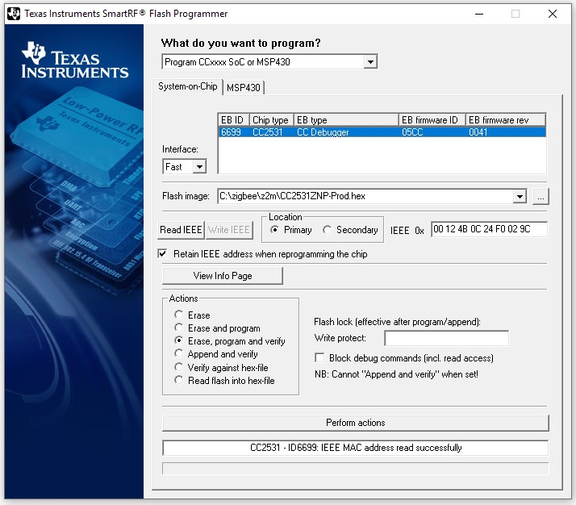

# Creating a CC2531 backup stick
To quickly recover from hardware malfunction of your CC2531 you should have a backup stick in place. 

*NOTE 1: The following instructions assume you have a CC Debugger. In case you don't, see [Alternative firmware flashing methods](../information/alternative_flashing_methods.md).*

## General Overview
For the backup stick to work out of the box you will need to...

 - clone the MAC address of your **production** stick into the memory of your **backup** stick
 - flash your backup stick with the custom zigbee2mqtt firmware (see [Flashing the firmware on the CC2531 USB stick](../getting_started/flashing_the_cc2531.md))
 
## MAC Address
The CC2531 sticks come with 2 separate slots for MAC addresses. The first slot is read-only and defined by the manufacturer. It can not be changed and will always stay at the manufacturer's value. The second slot contains the same address but can be changed to whatever MAC address you wish. Since the first slot can't be overwritten there's no need to write your backup stick's original MAC address down or save it elsewhere. You can always read it out from slot 1.

*NOTE 1: Zigbee2MQTT will always use Slot 2*

*NOTE 2: The MAC address is mostly called **IEEE address** when talking ZigBee slang*

For more information about the how's and why's to this 2-slot concept please check out the [FAQ by Texas Instruments](http://processors.wiki.ti.com/index.php/Z-Stack_FAQ#Device_MAC_Address_in_Z-Stack)

## How-To clone your stick (Windows-only currently)

### Reading the MAC address of your production stick
 - connect your production stick via the **CC Debugger**
 - open up **SmartRF Flash Programmer**
 - choose **Location** = **Primary**
 - notice how the **Write IEEE** button is *disabled*
 - click **Read IEEE**
 - your stick's MAC address will be read and pasted into the textbox to the right (labelled **IEEE 0x**)
 - copy the MAC address or write it down

### Writing the MAC address to your backup stick
 - connect your backup stick via the **CC Debugger**
 - open up **SmartRF Flash Programmer**
 - choose **Location** = **Secondary**
 - notice how the **Write IEEE** button is now *enabled*
 - paste your production stick's MAC address into the textbox to the right (labelled **IEEE 0x**)
 - click **Write IEEE*

### Writing Zigbee2MQTT firmware to your backup stick
If your backup stick already has a Zigbee2MQTT firmware you're done. Otherwise please proceed like explained in detail in [Flashing the firmware on the CC2531 USB stick](../getting_started/flashing_the_cc2531.md)

## What to do when your production stick is broken
Once your production stick is broken there are now only few steps to get your ZigBee network up and running again.

 - stop Zigbee2MQTT
 - replace (broken) production stick with your backup stick
 - check if your system uses the same port for your backup stick and re-configure Zigbee2MQTT in that case ([how to](../getting_started/running_zigbee2mqtt.md))
 - start Zigbee2MQTT again
