# Supported devices

*NOTE: This file has been generated, do not edit this file manually!*

Currently **286** devices are supported from **65** different vendors.

In case you own a Zigbee device which is **NOT** listed here, please see
[How to support new devices](../how_tos/how_to_support_new_devices.md).

### AXIS

| Model | Description | Picture |
| ------------- | ------------- | -------------------------- |
| GR-ZB01-W | AXIS Gear window shade motor (open, close, position, battery) | 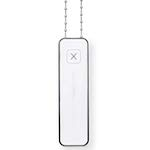 |

### AduroSmart

| Model | Description | Picture |
| ------------- | ------------- | -------------------------- |
| 81809 | AduroSmart ERIA colors and white shades smart light bulb A19 (on/off, brightness, color temperature, color xy) |  |
| 81825 | AduroSmart ERIA smart wireless dimming switch (on, off, up, down) | 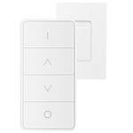 |

### Airam

| Model | Description | Picture |
| ------------- | ------------- | -------------------------- |
| 4713407 | Airam LED OP A60 ZB 9W/827 E27 (on/off, brightness) | 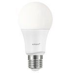 |
| AIRAM-CTR.U | Airam CTR.U remote (can only be used to control the Airam 4713407 bulb) (on/off) |  |

### Anchor

| Model | Description | Picture |
| ------------- | ------------- | -------------------------- |
| 67200BL | Anchor Vetaar smart plug (on/off) | 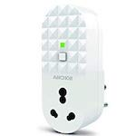 |

### Belkin

| Model | Description | Picture |
| ------------- | ------------- | -------------------------- |
| F7C033 | Belkin WeMo smart LED bulb (on/off, brightness) |  |

### Bitron

| Model | Description | Picture |
| ------------- | ------------- | -------------------------- |
| AV2010/34 | Bitron 4-Touch single click buttons (click) | 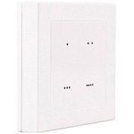 |
| AV2010/22 | Bitron Wireless motion detector (occupancy) |  |
| AV2010/25 | Bitron Video wireless socket (on/off, power measurement) | 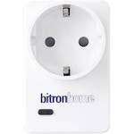 |
| AV2010/32 | Bitron Wireless wall thermostat with relay (temperature, heating/cooling system control) |  |

### Bosch

| Model | Description | Picture |
| ------------- | ------------- | -------------------------- |
| RADON TriTech ZB | Bosch Wireless motion detector (occupancy and temperature) | 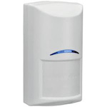 |
| ISW-ZPR1-WP13 | Bosch Motion sensor (occupancy and temperature) | 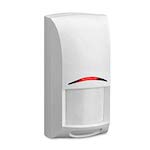 |

### Calex

| Model | Description | Picture |
| ------------- | ------------- | -------------------------- |
| 421786 | Calex LED A60 Zigbee GLS-lamp (on/off, brightness) |  |

### Centralite

| Model | Description | Picture |
| ------------- | ------------- | -------------------------- |
| 4256251-RZHAC | Centralite White Swiss power outlet switch with power meter (switch and power meter) |  |

### Climax

| Model | Description | Picture |
| ------------- | ------------- | -------------------------- |
| PSS-23ZBS | Climax Power plug (on/off) |  |
| SCM-5ZBS | Climax Roller shutter (open/close) |  |

### Commercial Electric

| Model | Description | Picture |
| ------------- | ------------- | -------------------------- |
| 53170161 | Commercial Electric Matte White Recessed Retrofit Smart Led Downlight - 4 Inch (on/off, brightness, color temperature) |  |

### Custom devices (DiY)

| Model | Description | Picture |
| ------------- | ------------- | -------------------------- |
| CC2530.ROUTER | Custom devices (DiY) [CC2530 router](http://ptvo.info/cc2530-based-zigbee-coordinator-and-router-112/) (state, description, type, rssi) |  |
| DNCKATSW001 | Custom devices (DiY) [DNCKAT single key wired wall light switch](https://github.com/dzungpv/dnckatsw00x/) (on/off) | 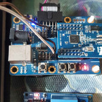 |
| DNCKATSW002 | Custom devices (DiY) [DNCKAT double key wired wall light switch](https://github.com/dzungpv/dnckatsw00x/) (hold/release, on/off) |  |
| DNCKATSW003 | Custom devices (DiY) [DNCKAT triple key wired wall light switch](https://github.com/dzungpv/dnckatsw00x/) (hold/release, on/off) |  |
| DNCKATSW004 | Custom devices (DiY) [DNCKAT quadruple key wired wall light switch](https://github.com/dzungpv/dnckatsw00x/) (hold/release, on/off) |  |

### Danalock

| Model | Description | Picture |
| ------------- | ------------- | -------------------------- |
| V3-BTZB | Danalock BT/ZB smartlock (lock/unlock, battery) |  |

### Dresden Elektronik

| Model | Description | Picture |
| ------------- | ------------- | -------------------------- |
| Mega23M12 | Dresden Elektronik ZigBee Light Link wireless electronic ballast (on/off, brightness, color temperature, color xy) |  |
| XVV-Mega23M12 | Dresden Elektronik ZigBee Light Link wireless electronic ballast color temperature (on/off, brightness, color temperature) |  |

### EDP

| Model | Description | Picture |
| ------------- | ------------- | -------------------------- |
| PLUG EDP RE:DY | EDP re:dy plug (on/off, power measurement) | 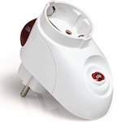 |
| SWITCH EDP RE:DY | EDP re:dy switch (on/off) | 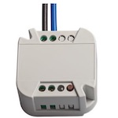 |

### ELKO

| Model | Description | Picture |
| ------------- | ------------- | -------------------------- |
| 316GLEDRF | ELKO ZigBee in-wall smart dimmer (on/off, brightness) | 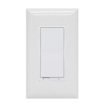 |

### EcoSmart

| Model | Description | Picture |
| ------------- | ------------- | -------------------------- |
| D1821 | EcoSmart A19 RGB bulb (on/off, brightness, color temperature, color xy) | 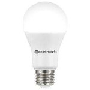 |
| D1531 | EcoSmart A19 bright white bulb (on/off, brightness) |  |
| D1532 | EcoSmart A19 soft white bulb (on/off, brightness) | 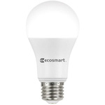 |

### Eurotronic

| Model | Description | Picture |
| ------------- | ------------- | -------------------------- |
| SPZB0001 | Eurotronic Spirit Zigbee wireless heater thermostat (temperature, heating system control) | 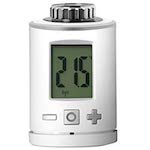 |

### GE

| Model | Description | Picture |
| ------------- | ------------- | -------------------------- |
| 22670 | GE Link smart LED light bulb, A19/BR30 soft white (2700K) (on/off, brightness) | 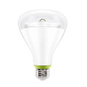 |
| 45852GE | GE ZigBee plug-in smart dimmer (on/off, brightness) | 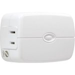 |
| 45853GE | GE Plug-in smart switch (on/off) | 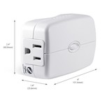 |
| 45856GE | GE In-wall smart switch (on/off) | 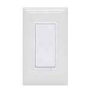 |
| 45857GE | GE ZigBee in-wall smart dimmer (on/off, brightness) | 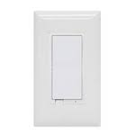 |

### Gira

| Model | Description | Picture |
| ------------- | ------------- | -------------------------- |
| 2430-100 | Gira ZigBee Light Link wall transmitter (action) | 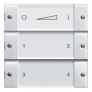 |

### Gledopto

| Model | Description | Picture |
| ------------- | ------------- | -------------------------- |
| GL-C-008 | Gledopto Zigbee LED controller RGB + CCT / RGBW / WWCW / Dimmer (on/off, brightness, color temperature, color xy) |  |
| GL-S-004Z | Gledopto Zigbee Smart WW/CW GU10 (on/off, brightness, color temperature) | 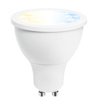 |
| GL-C-006/GL-C-009 | Gledopto Zigbee LED controller WW/CW Dimmer (on/off, brightness, color temperature) |  |
| GL-S-007Z | Gledopto Smart RGBW GU10 (on/off, brightness, color temperature, color xy) | 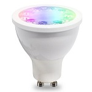 |
| GL-B-001Z | Gledopto Smart 4W E14 RGB / CW LED bulb (on/off, brightness, color temperature, color xy) | 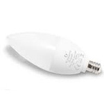 |
| GL-B-007Z | Gledopto Smart 6W E27 RGB / CW LED bulb (on/off, brightness, color temperature, color xy) | 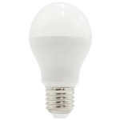 |
| GL-B-008Z | Gledopto Smart 12W E27 RGB / CW LED bulb (on/off, brightness, color temperature, color xy) | 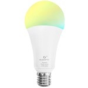 |
| GL-D-003Z | Gledopto LED RGB + CCT downlight  (on/off, brightness, color temperature, color xy) | 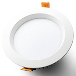 |
| GL-S-003Z | Gledopto Smart RGBW GU10  (on/off, brightness, color temperature, color xy) | 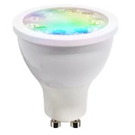 |
| GD-CZ-006 | Gledopto Zigbee LED Driver (on/off, brightness) |  |
| GL-FL-004TZ | Gledopto Zigbee 10W floodlight RGB CCT (on/off, brightness, color temperature, color xy) | 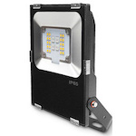 |

### HEIMAN

| Model | Description | Picture |
| ------------- | ------------- | -------------------------- |
| HS2SK | HEIMAN Smart metering plug (on/off, power measurement) | 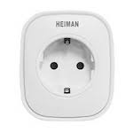 |
| HS1SA | HEIMAN Smoke detector (smoke) |  |
| HS3SA | HEIMAN Smoke detector (smoke) |  |
| HS3CG | HEIMAN Combustible gas sensor (gas) |  |
| HS1DS | HEIMAN Door sensor (contact) | 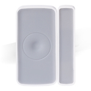 |
| HS1DS-E | HEIMAN Door sensor (contact) |  |
| HS1WL | HEIMAN Water leakage sensor (water leak) |  |
| HS1-WL-E | HEIMAN Water leakage sensor (water leak) |  |
| HS1RC-M | HEIMAN Smart remote controller (action) |  |

### Hampton Bay

| Model | Description | Picture |
| ------------- | ------------- | -------------------------- |
| 99432 | Hampton Bay Universal wink enabled white ceiling fan premier remote control (on/off, brightness, fan_mode and fan_state) | 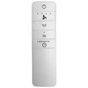 |

### Hive

| Model | Description | Picture |
| ------------- | ------------- | -------------------------- |
| HALIGHTDIMWWE27 | Hive Active smart bulb white LED (E27) (on/off, brightness) | 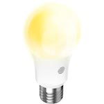 |
| HALIGHTDIMWWB22 | Hive Active smart bulb white LED (B22) (on/off, brightness) |  |
| 1613V | Hive Active plug (on/off, power measurement) |  |

### Honyar

| Model | Description | Picture |
| ------------- | ------------- | -------------------------- |
| U86K31ND6 | Honyar 3 gang switch  (on/off) | 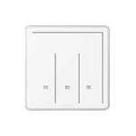 |

### IKEA

| Model | Description | Picture |
| ------------- | ------------- | -------------------------- |
| LED1545G12 | IKEA TRADFRI LED bulb E26/E27 980 lumen, dimmable, white spectrum, opal white (on/off, brightness, color temperature) | 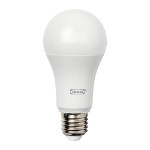 |
| LED1546G12 | IKEA TRADFRI LED bulb E26/E27 950 lumen, dimmable, white spectrum, clear (on/off, brightness, color temperature) | 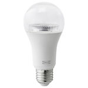 |
| LED1623G12 | IKEA TRADFRI LED bulb E27 1000 lumen, dimmable, opal white (on/off, brightness) |  |
| LED1537R6 | IKEA TRADFRI LED bulb GU10 400 lumen, dimmable, white spectrum (on/off, brightness, color temperature) |  |
| LED1650R5 | IKEA TRADFRI LED bulb GU10 400 lumen, dimmable (on/off, brightness) | 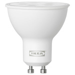 |
| LED1536G5 | IKEA TRADFRI LED bulb E12/E14 400 lumen, dimmable, white spectrum, opal white (on/off, brightness, color temperature) |  |
| LED1622G12 | IKEA TRADFRI LED bulb E26 1000 lumen, dimmable, opal white (on/off, brightness) |  |
| LED1624G9 | IKEA TRADFRI LED bulb E27/E26 600 lumen, dimmable, color, opal white (on/off, brightness, color xy) |  |
| LED1649C5 | IKEA TRADFRI LED bulb E12/E14/E17 400 lumen, dimmable warm white, chandelier opal (on/off, brightness) |  |
| LED1732G11 | IKEA TRADFRI LED bulb E27 1000 lumen, dimmable, white spectrum, opal white (on/off, brightness, color temperature) |  |
| ICTC-G-1 | IKEA TRADFRI wireless dimmer (brightness [0-255] (quick rotate for instant 0/255), action) | 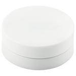 |
| ICPSHC24-10EU-IL-1 | IKEA TRADFRI driver for wireless control (10 watt) (on/off, brightness) | 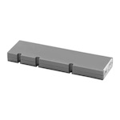 |
| ICPSHC24-30EU-IL-1 | IKEA TRADFRI driver for wireless control (30 watt) (on/off, brightness) | 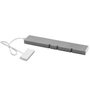 |
| L1527 | IKEA FLOALT LED light panel, dimmable, white spectrum (30x30 cm) (on/off, brightness, color temperature) | 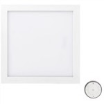 |
| L1529 | IKEA FLOALT LED light panel, dimmable, white spectrum (60x60 cm) (on/off, brightness, color temperature) | 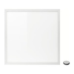 |
| L1528 | IKEA FLOALT LED light panel, dimmable, white spectrum (30x90 cm) (on/off, brightness, color temperature) |  |
| L1531 | IKEA SURTE door light panel, dimmable, white spectrum (38x64 cm) (on/off, brightness, color temperature) | 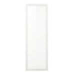 |
| E1603 | IKEA TRADFRI control outlet (on/off) |  |
| E1524 | IKEA TRADFRI remote control (toggle, arrow left/right click/hold/release, brightness up/down click/hold/release) |  |
| E1743 | IKEA TRADFRI ON/OFF switch (on, off) |  |
| E1525 | IKEA TRADFRI motion sensor (occupancy) |  |
| E1746 | IKEA TRADFRI signal repeater () |  |

### Iluminize

| Model | Description | Picture |
| ------------- | ------------- | -------------------------- |
| 511.10 | Iluminize Zigbee LED-Controller  (on/off, brightness) | 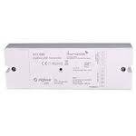 |

### Immax

| Model | Description | Picture |
| ------------- | ------------- | -------------------------- |
| IM-Z3.0-DIM | Immax LED E14/230V C35 5W TB 440LM ZIGBEE DIM (on/off, brightness) |  |

### Innr

| Model | Description | Picture |
| ------------- | ------------- | -------------------------- |
| RB 185 C | Innr E27 Bulb RGBW (on/off, brightness, color temperature, color xy) | 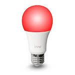 |
| BY 185 C | Innr B22 Bulb RGBW (on/off, brightness, color temperature, color xy) | 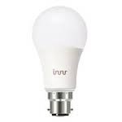 |
| RB 265 | Innr E27 Bulb (on/off, brightness) | 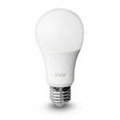 |
| RB 278 T | Innr E27 Bulb (on/off, brightness) |  |
| RB 285 C | Innr E27 Bulb RGBW (on/off, brightness, color temperature, color xy) | 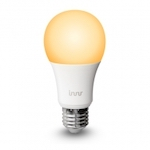 |
| BY 285 C | Innr B22 Bulb RGBW (on/off, brightness, color temperature, color xy) |  |
| RB 165 | Innr E27 Bulb (on/off, brightness) |  |
| RB 175 W | Innr E27 Bulb warm dimming (on/off, brightness) | 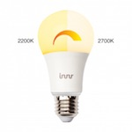 |
| RB 178 T | Innr Smart bulb tunable white E27 (on/off, brightness, color temperature) | 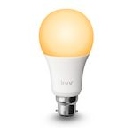 |
| RS 122 | Innr GU10 Spot (on/off, brightness) |  |
| RS 125 | Innr GU10 Spot (on/off, brightness) |  |
| RS 225 | Innr GU10 Spot (on/off, brightness) |  |
| RS 128 T | Innr GU10 Spot 350 lm, dimmable, white spectrum (on/off, brightness, color temperature) |  |
| RS 228 T | Innr GU10 Spot 350 lm, dimmable, white spectrum (on/off, brightness, color temperature) |  |
| RB 145 | Innr E14 Candle (on/off, brightness) |  |
| RB 248 T | Innr E14 Candle with white spectrum (on/off, brightness, color temperature) |  |
| BY 165 | Innr B22 Bulb dimmable (on/off, brightness) |  |
| PL 110 | Innr Puck Light (on/off, brightness) |  |
| ST 110 | Innr Strip Light (on/off, brightness) |  |
| UC 110 | Innr Under Cabinet Light (on/off, brightness) |  |
| DL 110 N | Innr Spot narrow (on/off, brightness) |  |
| DL 110 W | Innr Spot wide (on/off, brightness) |  |
| SL 110 N | Innr Spot Flex narrow (on/off, brightness) |  |
| SL 110 M | Innr Spot Flex medium (on/off, brightness) |  |
| SL 110 W | Innr Spot Flex wide (on/off, brightness) |  |
| SP 120 | Innr Smart plug (on/off, power measurement) |  |

### Iris

| Model | Description | Picture |
| ------------- | ------------- | -------------------------- |
| 3210-L | Iris Smart plug (on/off) |  |
| 3326-L | Iris Motion and temperature sensor (occupancy and temperature) |  |
| 3320-L | Iris Contact sensor (contact) |  |

### JIAWEN

| Model | Description | Picture |
| ------------- | ------------- | -------------------------- |
| K2RGBW01 | JIAWEN Wireless Bulb E27 9W RGBW (on/off, brightness, color temperature, color xy) |  |

### Keen Home

| Model | Description | Picture |
| ------------- | ------------- | -------------------------- |
| SV01 | Keen Home Smart vent (open, close, position, temperature, pressure, battery) |  |

### Ksentry Electronics

| Model | Description | Picture |
| ------------- | ------------- | -------------------------- |
| KS-SM001 | Ksentry Electronics [Zigbee OnOff Controller](http://ksentry.manufacturer.globalsources.com/si/6008837134660/pdtl/ZigBee-module/1162731630/zigbee-on-off-controller-modules.htm) (on/off) |  |

### LivingWise

| Model | Description | Picture |
| ------------- | ------------- | -------------------------- |
| LVS-ZB500D | LivingWise ZigBee smart dimmer switch (on/off, brightness) |  |
| LVS-SM10ZW | LivingWise Door or window contact switch (contact) |  |

### Livolo

| Model | Description | Picture |
| ------------- | ------------- | -------------------------- |
| TI0001 | Livolo Zigbee switch (1 and 2 gang) [work in progress](https://github.com/Koenkk/zigbee2mqtt/issues/592) (on/off) |  |

### Müller Licht

| Model | Description | Picture |
| ------------- | ------------- | -------------------------- |
| 404000/404005/404012 | Müller Licht Tint LED bulb GU10/E14/E27 350/470/806 lumen, dimmable, color, opal white (on/off, brightness, color temperature, color xy) |  |
| 404006/404008/404004 | Müller Licht Tint LED bulb GU10/E14/E27 350/470/806 lumen, dimmable, opal white (on/off, brightness, color temperature) |  |
| MLI-404011 | Müller Licht Tint remote control (toggle, brightness, other buttons are not supported yet!) |  |

### NET2GRID

| Model | Description | Picture |
| ------------- | ------------- | -------------------------- |
| N2G-SP | NET2GRID White Net2Grid power outlet switch with power meter (on/off, power and energy measurement) |  |

### Nanoleaf

| Model | Description | Picture |
| ------------- | ------------- | -------------------------- |
| NL08-0800 | Nanoleaf Smart Ivy Bulb E27 (on/off, brightness) |  |

### Netvox

| Model | Description | Picture |
| ------------- | ------------- | -------------------------- |
| Z809A | Netvox Power socket with power consumption monitoring (on/off, power measurement) |  |

### Ninja Blocks

| Model | Description | Picture |
| ------------- | ------------- | -------------------------- |
| Z809AF | Ninja Blocks Zigbee smart plug with power meter (on/off, power measurement) |  |

### Nue / 3A

| Model | Description | Picture |
| ------------- | ------------- | -------------------------- |
| HGZB-1S | Nue / 3A Smart 1 key scene wall switch (on/off, click) |  |
| HGZB-02S | Nue / 3A Smart 2 key scene wall switch (on/off, click) |  |
| HGZB-045 | Nue / 3A Smart 4 key scene wall switch (on/off, click) |  |
| LXZB-02A | Nue / 3A Smart light controller (on/off, brightness) |  |
| HGZB-43 | Nue / 3A Smart light switch - 3 gang v2.0 (on/off) |  |
| HGZB-043 | Nue / 3A Smart light switch - 3 gang (on/off) |  |
| HGZB-04D | Nue / 3A Smart dimmer wall switch (on/off, brightness) |  |
| HGZB-042 | Nue / 3A Smart light switch - 2 gang (on/off) |  |
| HGZB-01A/02A | Nue / 3A Smart 1 gang wall or in-wall switch (on/off) |  |
| HGZB-41 | Nue / 3A Smart one gang wall switch (on/off) |  |
| MG-AUWS01 | Nue / 3A Smart Double GPO (on/off) |  |
| HGZB-01A | Nue / 3A Smart light controller (on/off, brightness) |  |
| HGZB-02A | Nue / 3A Smart light controller (on/off, brightness) |  |
| HGZB-42-UK / HGZB-41 | Nue / 3A Smart switch 1 or 2 gang (on/off) |  |

### Nyce

| Model | Description | Picture |
| ------------- | ------------- | -------------------------- |
| NCZ-3043-HA | Nyce Motion sensor (motion, humidity and temperature) |  |

### OSRAM

| Model | Description | Picture |
| ------------- | ------------- | -------------------------- |
| 4058075816718 | OSRAM SMART+ outdoor wall lantern RGBW (on/off, brightness, color temperature, color xy) |  |
| AA69697 | OSRAM Classic A60 RGBW (on/off, brightness, color temperature, color xy) |  |
| AC03645 | OSRAM LIGHTIFY LED CLA60 E27 RGBW (on/off, brightness, color temperature, color xy) |  |
| AC03642 | OSRAM SMART+ CLASSIC A 60 TW (on/off, brightness, color temperature) |  |
| AA70155 | OSRAM LIGHTIFY LED A19 tunable white / Classic A60 TW (on/off, brightness, color temperature) |  |
| AA68199 | OSRAM LIGHTIFY LED PAR16 50 GU10 tunable white (on/off, brightness, color temperature) |  |
| AB32840 | OSRAM LIGHTIFY LED Classic B40 tunable white (on/off, brightness, color temperature) |  |
| 4058075816794 | OSRAM Smart+ Ceiling TW (on/off, brightness, color temperature) |  |
| AC03641 | OSRAM LIGHTIFY LED Classic A60 clear (on/off, brightness) |  |
| 4052899926158 | OSRAM LIGHTIFY Surface Light TW (on/off, brightness) |  |
| AB401130055 | OSRAM LIGHTIFY Surface Light LED Tunable White (on/off, brightness, color temperature) |  |
| AB3257001NJ | OSRAM Smart+ plug (on/off) |  |
| 4052899926110 | OSRAM Flex RGBW (on/off, brightness, color temperature, color xy) |  |
| 4058075036185 | OSRAM Outdoor Flex RGBW (on/off, brightness, color temperature, color xy) |  |
| 4058075036147 | OSRAM Smart+ gardenpole RGBW (on/off, brightness, color temperature, color xy) |  |
| AC0363900NJ | OSRAM Smart+ mini gardenpole RGBW (on/off, brightness, color temperature, color xy) |  |
| AB35996 | OSRAM Smart+ Spot GU10 Multicolor (on/off, brightness, color temperature, color xy) |  |
| AC08562 | OSRAM SMART+ Candle E14 Dimmable White (on/off, brightness) |  |
| AC01353010G | OSRAM SMART+ Motion Sensor (occupancy and temperature) |  |
| AC03648 | OSRAM SMART+ spot GU5.3 tunable white (on/off, brightness, color temperature) |  |
| AC0251100NJ | OSRAM Smart+ switch mini (on/off, brightness) |  |

### Oujiabao

| Model | Description | Picture |
| ------------- | ------------- | -------------------------- |
| CR701-YZ | Oujiabao Gas and carbon monoxide alarm (gas and carbon monoxide) |  |

### Paul Neuhaus

| Model | Description | Picture |
| ------------- | ------------- | -------------------------- |
| 100.424.11 | Paul Neuhaus Q-INIGO LED ceiling light (on/off, brightness, color temperature) |  |
| 100.110.39 | Paul Neuhaus Q-FLAG LED Panel, Smart-Home RGBW (on/off, brightness, color temperature, color xy) |  |
| 100.425.90 | Paul Neuhaus Q-PLUG adapter plug with night orientation light (on/off) |  |

### Paulmann

| Model | Description | Picture |
| ------------- | ------------- | -------------------------- |
| 50043 | Paulmann SmartHome Zigbee Cephei Switch Controller (on/off) |  |
| 50045 | Paulmann SmartHome Zigbee LED-stripe (on/off, brightness) |  |
| 50049 | Paulmann SmartHome Yourled RGB Controller (on/off, brightness, color temperature, color xy) |  |
| 50064 | Paulmann SmartHome led spot (on/off, brightness, color temperature) |  |

### Philips

| Model | Description | Picture |
| ------------- | ------------- | -------------------------- |
| 7299760PH | Philips Hue Bloom (on/off, brightness, color xy, power-on behavior) |  |
| 7146060PH | Philips Hue Go (on/off, brightness, color temperature, color xy, power-on behavior) |  |
| 4090531P7 | Philips Hue Flourish white and color ambiance ceiling light (on/off, brightness, color temperature, color xy, power-on behavior) |  |
| 433714 | Philips Hue Lux A19 bulb E27 (on/off, brightness, power-on behavior) |  |
| 9290011370 | Philips Hue white A60 bulb E27 (on/off, brightness, power-on behavior) |  |
| 8718696449691 | Philips Hue White Single bulb B22 (on/off, brightness, power-on behavior) |  |
| 9290018195 | Philips Hue white GU10 (on/off, brightness, power-on behavior) |  |
| 7299355PH | Philips Hue white and color ambiance LightStrip (on/off, brightness, color xy, power-on behavior) |  |
| 915005106701 | Philips Hue white and color ambiance LightStrip plus (on/off, brightness, color temperature, color xy, power-on behavior) |  |
| 9290012573A | Philips Hue white and color ambiance E26/E27/E14 (on/off, brightness, color temperature, color xy, power-on behavior) |  |
| 9290002579A | Philips Hue white and color ambiance BR30 (on/off, brightness, color temperature, color xy, power-on behavior) |  |
| 8718696485880 | Philips Hue white and color ambiance GU10 (on/off, brightness, color temperature, color xy, power-on behavior) |  |
| 915005733701 | Philips Hue White and color ambiance Play Lightbar (on/off, brightness, color temperature, color xy, power-on behavior) |  |
| 464800 | Philips Hue white ambiance BR30 flood light (on/off, brightness, color temperature, power-on behavior) |  |
| 8718696695203 | Philips Hue white ambiance E14 (on/off, brightness, color temperature, power-on behavior) |  |
| 8718696598283 | Philips Hue white ambiance GU10 (on/off, brightness, color temperature, power-on behavior) |  |
| 9290011998B | Philips Hue white ambiance E26 (on/off, brightness, color temperature, power-on behavior) |  |
| 8718696548738 | Philips Hue white ambiance E26/E27 (on/off, brightness, color temperature, power-on behavior) |  |
| 4090130P7 | Philips Hue Sana (on/off, brightness, color temperature, color xy, power-on behavior) |  |
| 3261030P7 | Philips Hue Being (on/off, brightness, color temperature, power-on behavior) |  |
| 3261331P7 | Philips Hue white ambiance Still (on/off, brightness, color temperature, power-on behavior) |  |
| 4096730U7 | Philips Hue Cher ceiling light (on/off, brightness, color temperature, power-on behavior) |  |
| 3216331P5 | Philips Hue white ambiance Aurelle rectangle panel light (on/off, brightness, color temperature, power-on behavior) |  |
| 3216431P5 | Philips Hue white ambiance Aurelle round panel light (on/off, brightness, color temperature, power-on behavior) |  |
| 4033930P7 | Philips Hue white ambiance suspension Fair (on/off, brightness, color temperature, power-on behavior) |  |
| 046677476816 | Philips Hue white PAR38 outdoor (on/off, brightness, power-on behavior) |  |
| 7199960PH | Philips Hue Iris (on/off, brightness, color xy, power-on behavior) |  |
| 324131092621 | Philips Hue dimmer switch (on/off, brightness, up/down/hold/release, click count) |  |
| 9290012607 | Philips Hue motion sensor (occupancy, temperature, illuminance) |  |
| 9290019758 | Philips Hue motion outdoor sensor (occupancy, temperature, illuminance) |  |

### Salus

| Model | Description | Picture |
| ------------- | ------------- | -------------------------- |
| SP600 | Salus Smart plug (on/off, power measurement) |  |

### Securifi

| Model | Description | Picture |
| ------------- | ------------- | -------------------------- |
| PP-WHT-US | Securifi Peanut Smart Plug (on/off, power measurement) |  |

### Sengled

| Model | Description | Picture |
| ------------- | ------------- | -------------------------- |
| E11-G13 | Sengled Element Classic (A19) (on/off, brightness) |  |
| E11-G23/E11-G33 | Sengled Element Classic (A60) (on/off, brightness) |  |
| Z01-CIA19NAE26 | Sengled Element Touch (A19) (on/off, brightness) |  |
| Z01-A19NAE26 | Sengled Element Plus (A19) (on/off, brightness, color temperature) |  |
| E11-N1EA | Sengled Element Plus Color (A19) (on/off, brightness, color temperature, color xy) |  |
| E12-N14 | Sengled Element Classic (BR30) (on/off, brightness) |  |
| E1ACA4ABE38A | Sengled Element downlight smart LED bulb (on/off, brightness) |  |

### Shenzhen Homa

| Model | Description | Picture |
| ------------- | ------------- | -------------------------- |
| HLD812-Z-SC | Shenzhen Homa Smart LED driver (on/off, brightness) |  |
| HLC610-Z | Shenzhen Homa Wireless dimmable controller (on/off, brightness) |  |
| HLC821-Z-SC | Shenzhen Homa ZigBee AC phase-cut dimmer (on/off, brightness) |  |

### Smart Home Pty

| Model | Description | Picture |
| ------------- | ------------- | -------------------------- |
| HGZB-07A | Smart Home Pty RGBW Downlight (on/off, brightness, color temperature, color xy) |  |
| HGZB-20-DE | Smart Home Pty Power plug (on/off) |  |

### SmartThings

| Model | Description | Picture |
| ------------- | ------------- | -------------------------- |
| STSS-MULT-001 | SmartThings Multipurpose sensor (contact) |  |
| STS-PRS-251 | SmartThings Arrival sensor (presence) |  |
| 3325-S | SmartThings Motion sensor (2015 model) (occupancy and temperature) |  |
| 3321-S | SmartThings Multi Sensor (2015 model) (contact and temperature) |  |
| IM6001-OTP05 | SmartThings Outlet (on/off) |  |
| IM6001-MTP01 | SmartThings Motion sensor (2018 model) (occupancy and temperature) |  |
| STS-IRM-250 | SmartThings Motion sensor (2016 model) (occupancy and temperature) |  |
| 3305-S | SmartThings Motion sensor (2014 model) (occupancy and temperature) |  |
| 3300-S | SmartThings Door sensor (contact and temperature) |  |
| F-MLT-US-2 | SmartThings Multipurpose sensor (2016 model) (contact) |  |
| IM6001-MPP01 | SmartThings Multipurpose sensor (2018 model) (contact) |  |
| 3310-S | SmartThings Temperature and humidity sensor (temperature) |  |
| 3315-S | SmartThings Water sensor (water and temperature) |  |
| 3315-G | SmartThings Water sensor (water and temperature) |  |
| IM6001-BTP01 | SmartThings Button (single click, double click, hold and temperature) |  |

### Stelpro

| Model | Description | Picture |
| ------------- | ------------- | -------------------------- |
| ST218 | Stelpro Built-in electronic thermostat (temperature ) |  |

### Sunricher

| Model | Description | Picture |
| ------------- | ------------- | -------------------------- |
| ZG9101SAC-HP | Sunricher ZigBee AC phase-cut dimmer (on/off, brightness) |  |

### Swann

| Model | Description | Picture |
| ------------- | ------------- | -------------------------- |
| SWO-KEF1PA | Swann Key fob remote (panic, home, away, sleep) |  |
| SWO-WDS1PA | Swann Window/door sensor (contact) |  |

### Sylvania

| Model | Description | Picture |
| ------------- | ------------- | -------------------------- |
| 73742 | Sylvania LIGHTIFY LED adjustable white RT 5/6 (on/off, brightness, color temperature) |  |
| 73740 | Sylvania LIGHTIFY LED adjustable white BR30 (on/off, brightness, color temperature) |  |
| 73739 | Sylvania LIGHTIFY LED RGBW BR30 (on/off, brightness, color temperature, color xy) |  |
| 73693 | Sylvania LIGHTIFY LED RGBW A19 (on/off, brightness, color temperature, color xy) |  |
| 74283 | Sylvania LIGHTIFY LED soft white dimmable A19 (on/off, brightness) |  |
| 74696 | Sylvania LIGHTIFY LED soft white dimmable A19 (on/off, brightness) |  |
| 72922-A | Sylvania SMART+ Smart Plug (on/off) |  |
| 71831 | Sylvania Smart Home adjustable white A19 LED bulb (on/off, brightness, color temperature) |  |
| 74282 | Sylvania Smart Home adjustable white MR16 LED bulb (on/off, brightness, color temperature) |  |
| LTFY004 | Sylvania LIGHTIFY LED gardenspot mini RGB (on/off, brightness, color xy) |  |
| 74580 | Sylvania Smart Home soft white PAR38 outdoor bulb (on/off, brightness) |  |

### Third Reality

| Model | Description | Picture |
| ------------- | ------------- | -------------------------- |
| 3RSS008Z | Third Reality RealitySwitch Plus (on/off, battery) |  |

### Trust

| Model | Description | Picture |
| ------------- | ------------- | -------------------------- |
| ZYCT-202 | Trust Remote control (on, off, stop, up-press, down-press) |  |
| ZLED-2709 | Trust Smart Dimmable LED Bulb (on/off, brightness) |  |
| ZPIR-8000 | Trust Motion Sensor (occupancy) |  |
| ZCTS-808 | Trust Wireless contact sensor (contact) |  |

### Visonic

| Model | Description | Picture |
| ------------- | ------------- | -------------------------- |
| MCT-350 SMA | Visonic Magnetic door & window contact sensor (contact) |  |

### Xiaomi

| Model | Description | Picture |
| ------------- | ------------- | -------------------------- |
| ZNLDP12LM | Xiaomi Aqara smart LED bulb (on/off, brightness, color temperature) |  |
| WXKG01LM | Xiaomi MiJia wireless switch (single, double, triple, quadruple, many, long, long_release click) |  |
| WXKG11LM | Xiaomi Aqara wireless switch (single, double click (and triple, quadruple, hold, release depending on model)) |  |
| WXKG12LM | Xiaomi Aqara wireless switch (with gyroscope) (single, double, shake, hold, release) |  |
| WXKG03LM | Xiaomi Aqara single key wireless wall switch (single (and double, hold, release and long click depending on model)) |  |
| WXKG02LM | Xiaomi Aqara double key wireless wall switch (left, right, both click (and double, long click for left, right and both depending on model)) |  |
| QBKG04LM | Xiaomi Aqara single key wired wall switch (on/off) |  |
| QBKG11LM | Xiaomi Aqara single key wired wall switch (on/off, power measurement) |  |
| QBKG03LM | Xiaomi Aqara double key wired wall switch (release/hold, on/off) |  |
| QBKG12LM | Xiaomi Aqara double key wired wall switch (on/off, power measurement) |  |
| WSDCGQ01LM | Xiaomi MiJia temperature & humidity sensor  (temperature and humidity) |  |
| WSDCGQ11LM | Xiaomi Aqara temperature, humidity and pressure sensor (temperature, humidity and pressure) |  |
| RTCGQ01LM | Xiaomi MiJia human body movement sensor (occupancy) |  |
| RTCGQ11LM | Xiaomi Aqara human body movement and illuminance sensor (occupancy and illuminance) |  |
| MCCGQ01LM | Xiaomi MiJia door & window contact sensor (contact) |  |
| MCCGQ11LM | Xiaomi Aqara door & window contact sensor (contact) |  |
| SJCGQ11LM | Xiaomi Aqara water leak sensor (water leak true/false) |  |
| MFKZQ01LM | Xiaomi Mi/Aqara smart home cube (shake, wakeup, fall, tap, slide, flip180, flip90, rotate_left and rotate_right) |  |
| ZNCZ02LM | Xiaomi Mi power plug ZigBee (on/off, power measurement) |  |
| QBCZ11LM | Xiaomi Aqara socket Zigbee (on/off, power measurement) |  |
| JTYJ-GD-01LM/BW | Xiaomi MiJia Honeywell smoke detector (smoke) |  |
| JTQJ-BF-01LM/BW | Xiaomi MiJia gas leak detector  (gas) |  |
| A6121 | Xiaomi Vima Smart Lock (inserted, forgotten, key error) |  |
| DJT11LM | Xiaomi Aqara vibration sensor (drop, tilt and touch) |  |
| ZNCLDJ11LM | Xiaomi Aqara curtain motor (open, close, stop, position) |  |
| LLKZMK11LM | Xiaomi Aqara wireless relay controller (on/off, power measurement) |  |

### Yale

| Model | Description | Picture |
| ------------- | ------------- | -------------------------- |
| YRD426NRSC | Yale Assure lock (lock/unlock, battery) |  |
| YRD226HA2619 | Yale Assure lock (lock/unlock, battery) |  |
| YMF40 | Yale Real living lock (lock/unlock, battery) |  |

### eCozy

| Model | Description | Picture |
| ------------- | ------------- | -------------------------- |
| 1TST-EU | eCozy Smart heating thermostat (temperature, occupancy, un-/occupied heating, schedule) |  |

### iCasa

| Model | Description | Picture |
| ------------- | ------------- | -------------------------- |
| ICZB-IW11D | iCasa Zigbee 3.0 Dimmer (on/off, brightness) |  |

### ilux

| Model | Description | Picture |
| ------------- | ------------- | -------------------------- |
| 900008-WW | ilux Dimmable A60 E27 LED Bulb (on/off, brightness) |  |

